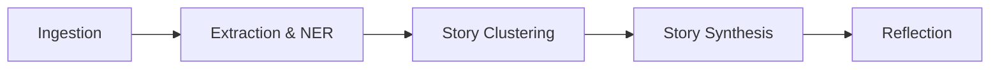

# news_pipeline.md — NewsIQ Processing Pipeline

This document describes the stages of the core NewsIQ processing pipeline.

## 1. Pipeline Flow

---

### Ingestion Stage
- Feeds (RSS, APIs) are scanned and downloaded by background worker tasks.
- Raw payloads are parsed and saved to **MongoDB** as raw article documents.

### Extraction & NER Stage
- Natural Language Processing (NLP) models perform Named Entity Recognition (NER), Event Extraction, and Entity Linking.
- Texts are converted to dense vector embeddings.

### Story Clustering Stage
- Qdrant queries identify similar vector embeddings.
- Articles are grouped into "Story Candidates" based on similarity metrics.

### Story Synthesis Stage
- The LLM merges clusters, generates descriptions, creates timelines, and highlights key details.
- Canonical stories are written to **MongoDB**.

### Reflection Stage
- Reflection routines execute to evaluate story changes, track event deviations, update timelines, and build knowledge graphs.
