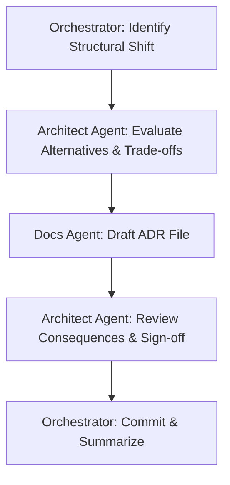

# Workflow: /adr — Architectural Decision Record Creation

This workflow governs structural design changes, documenting the context, chosen path, alternative designs, trade-offs, and consequences.

## Workflow Progression

---

### Step 1: Decision
- **Action**: Orchestrator triggers the workflow when a design decision is reached (e.g. changing database types, introducing new APIs, shifting cache policies).

### Step 2: Alternatives
- **Action**: Delegate to the **Architect Agent** to outline alternative solutions and technical paths.

### Step 3: Trade-offs
- **Action**: List advantages/disadvantages, cost variations, implementation efforts, and scaling risks for each alternative.

### Step 4: Consequences
- **Action**: Document downstream impacts, testing requirements, rollout strategies, and migration needs for the chosen solution.

### Step 5: Documentation (ADR Drafting)
- **Action**: Delegate to the **Docs Agent** to format the decisions as a standard ADR under `docs/adr/XXXX_name.md`.

### Step 6: Implementation & Commit
- **Action**: Orchestrator commits the new ADR and lists the architectural changes for the user.
