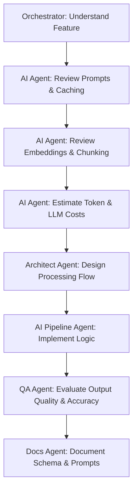

# Workflow: /ai_feature — Implement AI & Pipeline Features

This workflow guides the implementation of AI-first capabilities (such as entity extraction, clustering updates, and synthesis steps), focusing on prompt quality, token efficiency, and cost estimations.

## Workflow Progression

---

### Step 1: Understand Feature
- **Action**: Orchestrator analyzes the required AI feature (e.g. story reflection synthesis).

### Step 2: Review Prompts & Cache
- **Action**: Delegate to the **AI Pipeline Agent** to:
  - Check existing prompt templates.
  - Plan semantic and execution caching strategies.

### Step 3: Review Embeddings
- **Action**: Delegate to the **AI Pipeline Agent** to review text chunking configurations, overlaps, and model matches.

### Step 4: Estimate LLM Cost
- **Action**: Estimate call frequencies, token budgets, and project expected monthly operating costs.

### Step 5: Architecture
- **Action**: Delegate to the **Architect Agent** to layout the processing pipelines, data structures, and worker stages.

### Step 6: Implementation
- **Action**: Delegate to the **AI Pipeline Agent** to write/modify prompts, extraction logic, and similarity queries.

### Step 7: Evaluation
- **Action**: Delegate to the **QA Agent** to test extraction accuracy, mock LLM errors, and run benchmarks.

### Step 8: Documentation
- **Action**: Delegate to the **Docs Agent** to document the prompt schemas, parameters, and version histories.
