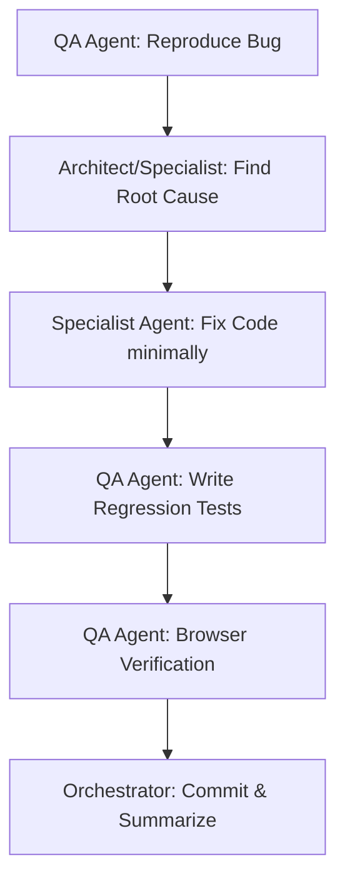

# Workflow: /bugfix — Resolve System Defects

This workflow defines a reliable, test-driven path to reproduce, isolate, fix, and verify software bugs in NewsIQ.

## Workflow Progression

---

### Step 1: Reproduce Bug
- **Action**: Delegate to the **QA Agent** to reproduce the bug.
- **Output**: Write a failing integration or unit test that consistently captures the defect.

### Step 2: Find Root Cause
- **Action**: Delegate to the **Architect** or specific specialist agent (**Backend**, **AI Pipeline**, **Database**, **Frontend**) to:
  - Inspect codebase, logs, and database states.
  - Trace failure variables.
  - Explain why the bug occurs.

### Step 3: Implement Fix
- **Action**: Delegate to the relevant specialist agent to apply a minimal, surgical fix. Do not introduce unrelated modifications or refactors.

### Step 4: Regression Tests
- **Action**: Delegate to the **QA Agent** to run the regression test suite. Verify that:
  - The newly written test now passes.
  - No existing functionality or other tests break.

### Step 5: Browser Verification (If UI-Related)
- **Action**: Delegate to the **QA Agent** to perform visual validation using devtools/browser verification.

### Step 6: Commit Summary
- **Action**: Orchestrator commits the changes using structured commit messages (e.g., `fix: resolve clustering overlap`), documents the fix, and summaries the work.
