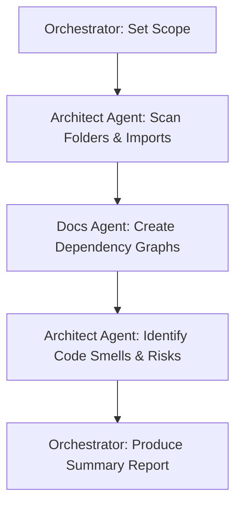

# Workflow: /discover — Initial Codebase Discovery & Analysis

This workflow manages initial exploration, folder architecture scans, dependency mappings, and technical debt analysis.

## Workflow Progression

---

### Step 1: Set Scope
- **Action**: Orchestrator outlines the search parameters, target folders, or specific files to inspect.

### Step 2: Repository Scan
- **Action**: Delegate to the **Architect Agent** to:
  - Run directory listing tools across the designated scopes.
  - Parse code imports to identify dependencies and execution paths.

### Step 3: Map Dependencies
- **Action**: Delegate to the **Docs Agent** to visualize component dependencies and message routing flows using Mermaid graphs.

### Step 4: Identify Technical Debt & Risks
- **Action**: Delegate to the **Architect Agent** to review file sizes, structural patterns, duplicate modules, or missing test coverage.

### Step 5: Summary Report
- **Action**: Orchestrator summarizes findings and presents recommendations to the user.
