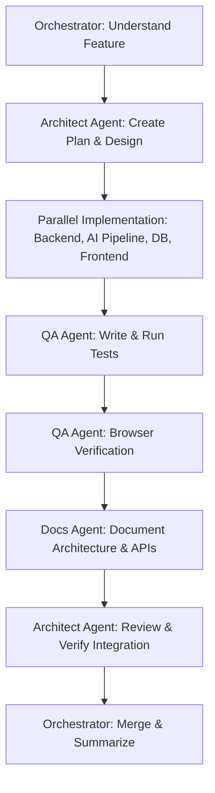

# Workflow: /feature — Implement New Features

This workflow guides the implementation of a new product feature from requirements through code development, testing, verification, documentation, and merging.

## Workflow Progression

---

### Step 1: Understand Feature
- **Action**: Orchestrator analyzes user requests, checks goals, and reviews initial context.

### Step 2: Architecture Plan
- **Action**: Delegate to the **Architect Agent** to:
  - Inspect repository code.
  - Formulate an implementation design.
  - Create the `implementation_plan.md` and define affected components.
  - Create the task checklist in `task.md`.

### Step 3: Parallel Implementation
- **Action**: Delegate task implementations concurrently:
  - **Database Agent**: Prepare schema definitions, vector collections, indexes, and Alembic migrations.
  - **Backend Agent**: Expose endpoints, set up workers, and build business controller logic.
  - **AI Pipeline Agent**: Implement processing, embedding, extraction, reflection, and caching algorithms.
  - **Frontend Agent**: Build responsive dashboard and pages, apply Tailwind styles, and establish state management.

### Step 4: Automated Testing
- **Action**: Delegate to the **QA Agent** to:
  - Write unit, integration, and API tests using `pytest`.
  - Validate component rendering and state updates.
  - Run the test suite and confirm all tests pass.

### Step 5: Browser Verification
- **Action**: Delegate to the **QA Agent** to launch browser tools, execute end-to-end checks, verify visual styles, and confirm responsiveness.

### Step 6: Documentation
- **Action**: Delegate to the **Docs Agent** to update the API spec, write technical guides, and update architectural designs.

### Step 7: Verification & Merge
- **Action**: Delegate to the **Architect Agent** to verify the implementation against acceptance criteria. The **Orchestrator** then commits the code, updates the changelog, and merges the feature.

### Step 8: Summary
- **Action**: Orchestrator presents a concise final walkthrough of changes and outcomes.
