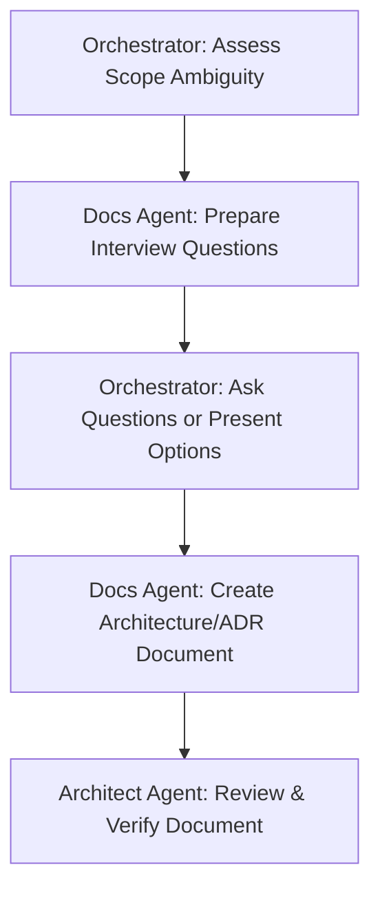

# Workflow: /interview_doc — Discovery & Requirements Alignment

This workflow defines the process of aligning with the user on design tradeoffs, architectural directions, and requirements before documenting the decisions.

## Workflow Progression

---

### Step 1: Assess Ambiguity
- **Action**: Orchestrator scans user requirements and notes areas lacking specification (e.g., choice of databases, AI prompt thresholds, third-party APIs).

### Step 2: Prepare Questions
- **Action**: Delegate to the **Docs Agent** to draft structured, multiple-choice or direct questions. Focus questions on architectural options, design trade-offs, and edge-case behaviors.

### Step 3: Align with User
- **Action**: Orchestrator presents the questions clearly in the chat window, encouraging the user to select paths or provide details.

### Step 4: Create ADR/Architecture Document
- **Action**: Delegate to the **Docs Agent** to draft the final design document or update Architecture Decision Records (ADRs) based on the user's choices. Include:
  - Context & Problem Statement.
  - Selected Alternative & Rejected Alternatives.
  - Pros/Cons and trade-offs.

### Step 5: Final Review
- **Action**: Delegate to the **Architect Agent** to review the newly documented decisions and verify compatibility with existing systems.
