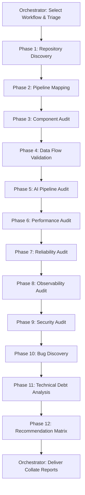

# Pipeline Audit Workflow

**Purpose**: Perform a comprehensive, read-only audit of the NewsIQ processing pipelines.

> [!IMPORTANT]
> **This is a READ-ONLY workflow.** Do not modify code and do not generate patches.

## Workflow Progression



---

## Phase 1 — Repository Discovery
Identify the system architecture layout, pipeline entry points, service boundaries, workers, cron tasks, and external APIs. Generate an initial architecture overview.

## Phase 2 — Pipeline Mapping
Trace the execution path of data flow:
```
RSS/API Input → Normalization → Parsing → Event Extraction → Embedding → Vector Search → Clustering → Reflection → Knowledge Graph → Story Synthesis → Database → API → Frontend
```
For each stage, document:
- Inputs & Outputs
- Service dependencies
- Failure modes & recovery steps
- Logging details & metrics

## Phase 3 — Component Audit
Review all pipeline components for correctness, architectural decoupling, separation of concerns, duplicate logic, configuration dependencies, and maintainability.

## Phase 4 — Data Flow Validation
Verify schema consistency across PostgreSQL, MongoDB, and Qdrant. Check serialization, cache coverage, transactional integrity, and trace potential data loss vectors.

## Phase 5 — AI Pipeline Audit
Inspect prompts, routing configs, caching, chunking models, synthesis loops, and reflection steps. Identify:
- Unnecessary LLM calls
- Duplicate embeddings or prompts
- Cache misses & excessive contexts
Estimate expected operational costs.

## Phase 6 — Performance Audit
Identify N+1 queries, repeated DB queries, redundant vector matches, blocking operations, memory leaks, and large payloads. Rank findings by severity.

## Phase 7 — Reliability Audit
Inspect retry structures, timeout settings, circuit breakers, fallback code, worker recovery steps, and idempotency.

## Phase 8 — Observability Audit
Verify structured JSON logs, tracing coverage, prometheus metrics, dashboards, correlation tracking, and find telemetry blind spots.

## Phase 9 — Security Audit
Audit token validation (JWT), security headers, CORS, secrets storage, rate limiting, and prompt injection mitigation.

## Phase 10 — Bug Discovery
Identify functional bugs, logic flaws, concurrency race conditions, partial failures, and cache invalidation issues. Classify severity: `Critical`, `High`, `Medium`, or `Low`.

## Phase 11 — Technical Debt
Document code smells, complex methods, tight coupling, and missing test/doc coverage.

## Phase 12 — Recommendations
For each finding, provide:
- Problem & Root Cause
- Impact & Risk
- Recommended Solution & Priority
- Estimated Effort

---

## Deliverables
Produce and merge reports containing:
1. **Architecture Overview**
2. **Pipeline Diagram**
3. **Component Inventory**
4. **Bug Report**
5. **Performance Report**
6. **Security Report**
7. **AI Cost Report**
8. **Observability Report**
9. **Technical Debt Report**
10. **Prioritized Action Plan**

> [!CAUTION]
> **Do not implement fixes.**
