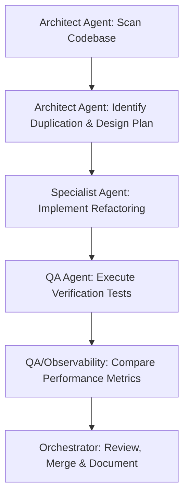

# Workflow: /refactor — Codebase Improvement & Optimization

This workflow manages scanning, planning, and executing code refactoring to eliminate technical debt, code smells, or duplicate logic.

## Workflow Progression

---

### Step 1: Scan Codebase
- **Action**: Delegate to the **Architect Agent** to analyze code folders, class patterns, and imports.

### Step 2: Find Duplication & Technical Debt
- **Action**: Identify modular decoupling opportunities, circular dependencies, dead code, or duplicate helper functions.

### Step 3: Create Plan
- **Action**: Write an `implementation_plan.md` outlining the refactoring targets, expected improvements, and potential risks to backward compatibility.

### Step 4: Refactor
- **Action**: Delegate to the designated specialist agent (**Backend**, **Frontend**, **Database**, **AI Pipeline**) to implement code restructuring without altering core functionality.

### Step 5: Run Tests
- **Action**: Delegate to the **QA Agent** to execute full test suites. Ensure zero functional regressions.

### Step 6: Performance Comparison
- **Action**: Delegate to **QA** and **Observability Agents** to run benchmark checks (latency, CPU, memory, database query count) and verify improvements.
