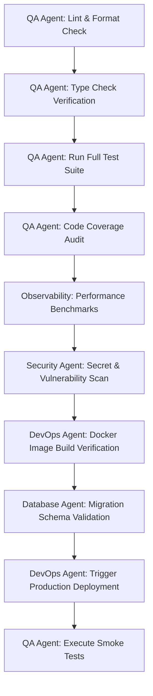

# Workflow: /release — Production Release Validation & Deployment

This workflow guides the release verification process, ensuring that the codebase is completely healthy and meets all performance, security, and migration checks prior to production deployment.

## Workflow Progression

---

### Step 1: Lint & Format
- **Action**: Run lint scans (e.g. `ruff check`, `eslint`). Verify zero style errors.

### Step 2: Type Check
- **Action**: Run type checks (e.g. `mypy`, `tsc`) to guarantee type completeness.

### Step 3: Run Tests
- **Action**: Run all tests (unit, integration, pipeline). Ensure 100% success.

### Step 4: Coverage Audit
- **Action**: Verify code coverage meets project targets.

### Step 5: Performance Checks
- **Action**: Validate API response latency budgets and resource usage.

### Step 6: Security Scan
- **Action**: Run dependency audit tools and secret checkers.

### Step 7: Docker Build
- **Action**: Build Docker images locally or in CI runners to verify dependencies compile correctly.

### Step 8: Migration Validation
- **Action**: Execute and test database upgrade/downgrade migrations against a local environment.

### Step 9: Deployment
- **Action**: Tag the release branch and trigger the deployment pipeline.

### Step 10: Smoke Test
- **Action**: Run remote API checks and verify dashboard rendering on the production domain.
