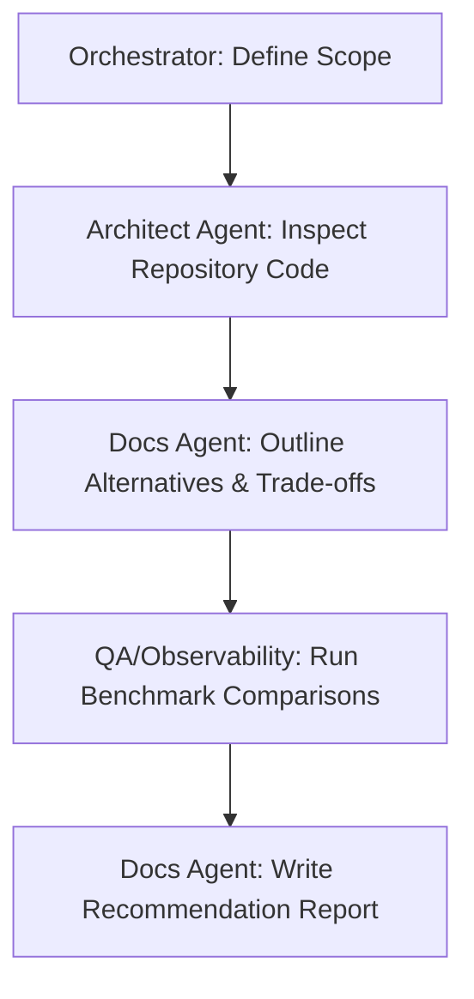

# Workflow: /research — Codebase Investigation & Recommendations

This workflow provides a structured layout for researching technical solutions, performance audits, or architectural improvements without modifying codebase source files.

## Workflow Progression

---

### Step 1: Define Scope
- **Action**: Orchestrator outlines the research objective (e.g. comparing story similarity clustering algorithms).

### Step 2: Repository Inspection
- **Action**: Delegate to the **Architect Agent** to search and view current implementations.

### Step 3: Outline Alternatives
- **Action**: Delegate to the **Docs Agent** to map alternative libraries, APIs, or architectural structures, assessing pros/cons.

### Step 4: Benchmarking
- **Action**: Delegate to the **QA** and **Observability Agents** to run mock performance comparisons (latency, memory, token usage).

### Step 5: Recommendation Report
- **Action**: Delegate to the **Docs Agent** to write the final summary report with actionable next steps.
