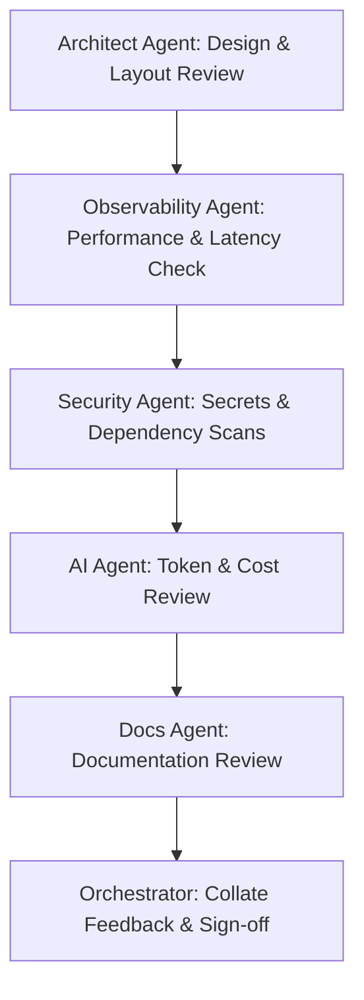

# Workflow: /review — Code Quality & Performance Audits

This workflow guides the verification of code branches, checking compliance against architecture standards, performance budgets, security rules, and documentation.

## Workflow Progression

---

### Step 1: Design & Architecture Review
- **Action**: Delegate to the **Architect Agent** to verify component decoupling, class modularity, and database schema conventions.

### Step 2: Performance & Latency Check
- **Action**: Delegate to the **Observability Agent** to audit database queries, check for N+1 loops, and verify latency budgets.

### Step 3: Security Scan
- **Action**: Delegate to the **Security Agent** to audit JWT routes, HTTP headers, CORS configurations, and verify no secrets are committed.

### Step 4: Token & Cost Review
- **Action**: Delegate to the **AI Pipeline Agent** to review prompt cache compatibility, model routing choices, and token budgets.

### Step 5: Documentation Review
- **Action**: Delegate to the **Docs Agent** to confirm API definitions, ADRs, and diagrams are synchronized.
