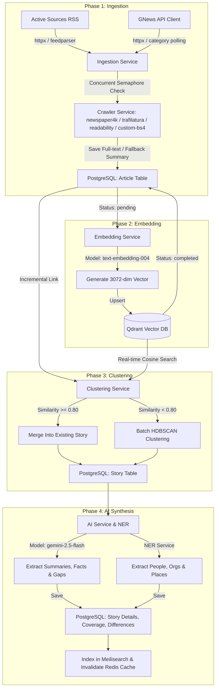
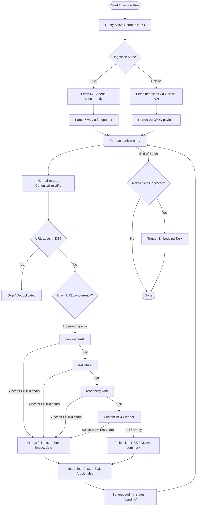
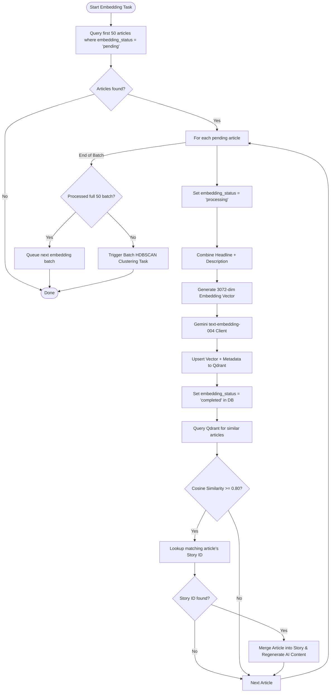
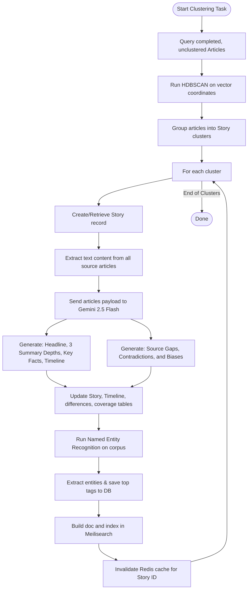

# NewsIQ Data Processing Pipeline & Crawler Architecture

This document maps out how NewsIQ ingests, vectorizes, clusters, and processes articles from raw sources to AI-structured news intelligence.

---

## 1. High-Level System Architecture

The NewsIQ pipeline is split into four distinct phases orchestrated by Celery background workers:
1. **Ingestion & Crawling** (RSS Feeds & GNews API)
2. **Vectorization & Indexing** (Gemini Embeddings + Qdrant)
3. **Clustering** (Real-time incremental matching & Batch HDBSCAN)
4. **AI Synthesis & Enrichment** (Gemini-2.5-Flash + Named Entity Recognition)

---

## 2. Ingestion & Crawler Flow

The Ingestion pipeline runs on schedule or can be triggered via the API gateway. It ensures that duplicate articles are eliminated at the network edge via URL canonicalization before they are stored in the database.

---

## 3. Vectorization & In-Memory Matching

When new articles are ingested, the system generates high-dimensional vector representations. If a new article is semantically similar to an existing story, it is immediately merged in real-time, bypassing the need for a full batch cluster run.

---

## 4. Clustering & AI Synthesis Flow

Unmerged articles are grouped using density-based clustering (HDBSCAN). Once clusters (stories) are formed, Gemini synthesizes the story details, extracts timelines, identifies differences across sources, extracts named entities, and indexes them for search.

