# 🔬 NewsIQ Complete 50-Stage AI Ingestion, Deduplication, Hybrid Micro-Clustering & Synthesis Architecture Guide

> **Authoritative Technical Specification & Execution Walkthrough**  
> *System Version: NewsIQ v5 (50-Stage Hybrid Micro-Clustering Production Architecture)*

---

## 📐 High-Level Architecture Flow

```mermaid
flowchart TD
    subgraph Act_I ["ACT I: Ingestion, Discovery & Granular URL Deduplication (Stages 00 - 13)"]
        S00[00 Profiler Init] --> S01[01 Prompt Registry]
        S01 --> S02[02 RSS Catalog]
        S02 --> S03[03 RSS Ingestion]
        S03 --> S04[04 Seed Selection]
        S04 --> S05[05 Google Discovery]
        S05 --> S06[06 Google URL Decode]
        S06 --> S07[07 Canonical URL Builder]
        S07 --> S08[08 Tracking Param Removal]
        S08 --> S09[09 URL Normalization]
        S09 --> S10[10 SHA256 URL Hash]
        S10 --> S11[11 Redis Bloom Filter]
        S11 --> S12[12 PostgreSQL DB Check]
        S12 --> S13[13 Duplicate Decision Gate]
    end

    subgraph Act_II ["ACT II: Multi-Provider Crawling & Vector Understanding (Stages 14 - 28)"]
        S13 -->|should_crawl == True| S14[14 Multi-Provider Crawl]
        S13 -->|should_crawl == False| SKIP[Skip Crawling]
        S14 --> S15[15 Metadata Extraction]
        S15 --> S16[16 Content Cleaning]
        S16 --> S17[17 Readability Scoring]
        S17 --> S18[18 Content Fingerprint]
        S18 --> S19[19 Embedding Text Prep]
        S19 --> S20[20 Embedding Cache Lookup]
        S20 --> S21[21 Gemini Embeddings 768d]
        S21 --> S22[22 Qdrant Vector Upsert]
        S22 --> S23[23 Vector Search Verify]
        S23 --> S24[24 Entity Extraction NER]
        S24 --> S25[25 Entity Linking]
        S25 --> S26[26 Event Extraction]
        S26 --> S27[27 Stage A Validation]
        S27 --> S28[28 Stage B Validation]
    end

    subgraph Act_III ["ACT III: Hybrid Micro-Clustering & Story Matching (Stages 29 - 37)"]
        S28 --> S29[29 Hybrid Micro-Clustering Engine]
        S29 --> S30[30 Micro-Cluster Story Search]
        S30 --> S31[31 Reflection Agent Audit]
        S31 --> S32[32 Judge Gate Decision]
        S32 --> S33[33 Granular Story Versioning]
        S33 --> S34[34 Timeline Assembly]
        S34 --> S35[35 Knowledge Graph Build]
        S35 --> S36[36 Contradiction Detection]
        S36 --> S37[37 Source Coverage Matrix]
    end

    subgraph Act_IV ["ACT IV: Synthesis, Persistence & REST Publishing (Stages 38 - 50)"]
        S37 --> S38[38 Prompt Gateway Render]
        S38 --> S39[39 LLM Summary Synthesis]
        S39 --> S40[40 Summary Refinement]
        S40 --> S41[41 Fact-Check Reflection]
        S41 --> S42[42 PostgreSQL Graph Commit]
        S42 --> S43[43 Replay Checkpoints]
        S43 --> S44[44 Meilisearch Indexing]
        S44 --> S45[45 Redis Cache Clear]
        S45 --> S46[46 Pydantic DTO Validation]
        S46 --> S47[47 REST JSON Payload]
        S47 --> S48[48 Stage Profiling Audit]
        S48 --> S49[49 Executive Report]
        S49 --> S50[50 Execution Complete]
    end
```

---

# 🎭 ACT I: INGESTION, DISCOVERY & GRANULAR URL DEDUPLICATION (STAGES 00 – 13)

### Stage 00 — Environment & Stage Profiler Initialization
### Stage 01 — Prompt Repository Initialization
### Stage 02 — RSS Source Catalog & Configuration
### Stage 03 — RSS Ingestion & Feed Parsing
### Stage 04 — Story Candidate Seed Selection
### Stage 05 — Google News Discovery Search
### Stage 06 — Google URL Decoding
### Stage 07 — Canonical URL Builder
### Stage 08 — Tracking Parameter Removal
### Stage 09 — URL Normalization
### Stage 10 — SHA256 URL Hash Generation
### Stage 11 — Redis Bloom Filter Check
### Stage 12 — PostgreSQL URL Duplicate Check
### Stage 13 — Duplicate Decision Gate (Pre-Crawler Inspection)

---

# 🧬 ACT II: MULTI-PROVIDER CRAWLING & VECTOR UNDERSTANDING (STAGES 14 – 28)

### Stage 14 — Multi-Provider Article Crawling
### Stage 15 — Metadata Extraction Pipeline
### Stage 16 — Boilerplate Cleaning & Text Sanitization
### Stage 17 — Ingestion Quality & Readability Scoring
### Stage 18 — Content Fingerprinting
### Stage 19 — Embedding Text Preparation
### Stage 20 — Semantic Embedding Cache Lookup
### Stage 21 — Gemini Embedding Generation (768d)
### Stage 22 — Qdrant Vector Collection Upsert
### Stage 23 — Vector Search Verification
### Stage 24 — Named Entity Recognition (NER)
### Stage 25 — Entity Linking & Canonicalization
### Stage 26 — Event Extraction Engine
### Stage 27 — Stage A Event Validation
### Stage 28 — Stage B Event Validation

---

# 🧠 ACT III: HYBRID MICRO-CLUSTERING & STORY MATCHING (STAGES 29 – 37)

### Stage 29 — Hybrid Internal Micro-Clustering Engine
* **Goal**: Compute 5-factor pairwise similarity score (`PairScore`) across candidate articles **AFTER** Event Extraction to prevent story pollution.
* **Formula**:
  $$\text{PairScore} = 0.45 \cdot \text{EmbeddingSim} + 0.25 \cdot \text{EventSim} + 0.15 \cdot \text{EntityOverlap} + 0.10 \cdot \text{TemporalSim} + 0.05 \cdot \text{SourceTypeSim}$$
* **Exposed Metadata**: `centroid_vector`, `representative_article`, `dominant_event`, `dominant_entities`, `confidence`

### Stage 30 — Micro-Cluster Story Search & Ranking
* **Goal**: Search PostgreSQL 48-hour window and Qdrant using cluster `centroid_vector` and `dominant_entities` per micro-cluster.

### Stage 31 — AI Reflection Agent Audit on Cluster Summaries
* **Goal**: Run `ReflectionAgent` using concise **Cluster Summaries** (representative title, dominant event, top entities) vs candidate stories.

### Stage 32 — Judge Agent Gate Decision (Per Micro-Cluster)
* **Goal**: Deterministic decision gate rendering `MERGE` vs `CREATE_NEW` for each micro-cluster.

### Stage 33 — Granular Story Versioning & Assignment
* **Goal**: Bind target `Story` ORM record and update story lifecycle per micro-cluster.

### Stage 34 — Story Timeline Construction
### Stage 35 — Knowledge Graph Construction
### Stage 36 — Claims & Contradiction Detection
### Stage 37 — Source Coverage Matrix

---

# ⚡ ACT IV: SYNTHESIS, PERSISTENCE & REST PUBLISHING (STAGES 38 – 50)

### Stage 38 — Prompt Rendering & Gateway Injection
### Stage 39 — LLM Summary Synthesis & Schema Parsing
### Stage 40 — Summary Refinement & Editorial Polish
### Stage 41 — Fact-Check Reflection Agent Audit
### Stage 42 — Complete Story & Article DB Persistence
### Stage 43 — Replay Checkpoints System
### Stage 44 — Full-Text Search Indexing (Meilisearch)
### Stage 45 — Redis Cache Invalidation & Lock Release
### Stage 46 — API DTO Serialization
### Stage 47 — Final REST API JSON Response Payload
### Stage 48 — Pipeline Execution Profiling Audit Dashboard
### Stage 49 — Executive Ingestion & Micro-Cluster Report
### Stage 50 — Pipeline Execution Confirmation
