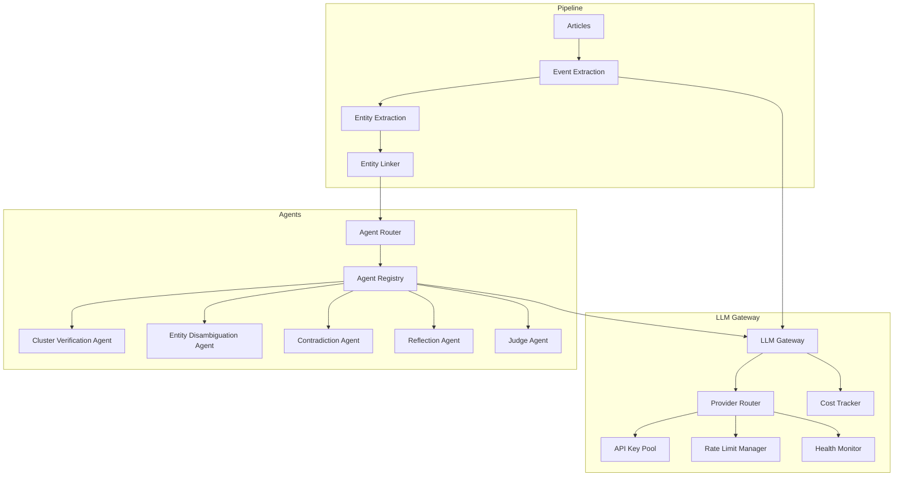

# Agno AI Agent Framework & Unified LLM Gateway

This directory contains the documentation for the Agno AI Agent integrations and the unified **LLM Gateway** inside the NewsIQ platform.

## Architecture Overview

NewsIQ implements a hybrid **95% deterministic / 5% agentic** architecture. Deterministic services are used for ingest, extraction, indexing, and base graph structures, while LLM agents are reserved specifically as **uncertainty handlers** to guarantee precision and manage semantic complexities.

All LLMs (used either in deterministic pipelines or by agents) are routed exclusively through the central **LLM Gateway** to enforce telemetry, rotation, failover, and cost optimization.

## Core Components

1. **[LLM Gateway](llm-gateway.md)**: Standardizes all outgoing requests. Handles retries, token counting, and database logging.
2. **[Provider Pool & Rotation](provider-pool.md)**: Manages comma-separated rotating key pools for Google Gemini, OpenAI, and Groq. Tracks active health, automatic rate limits, and key cooldowns.
3. **[Cost Optimization](cost-optimization.md)**: Details token pricing calculations and the 95%/5% cost structure.
4. **[Agent Registry](agent-router.md)**: Manages five precision-focused Agno agents using the subclassed `GatewayModel`.
5. **[Observability](observability.md)**: Configures Langfuse tracing, Prometheus metrics, and Sentry alerts.
6. **[Roadmap](roadmap.md)**: Outlines future development (Ollama local fallback, self-refinement training).

## Agent Specifications

Detailed trigger conditions, schemas, and prompts are defined for each agent:
* **[Cluster Verification Agent](cluster-verification-agent.md)**: Prevents false positive event merges.
* **[Entity Disambiguation Agent](entity-disambiguation-agent.md)**: Maps actors and locations to Wikidata entities.
* **[Contradiction Agent](contradiction-agent.md)**: Identifies factual disagreements across sources.
* **[Reflection Agent](reflection-agent.md)**: Self-evaluates generated summaries against the source KG.
* **[Judge Agent](judge-agent.md)**: Resolves disputes between competing LLM provider outputs.
