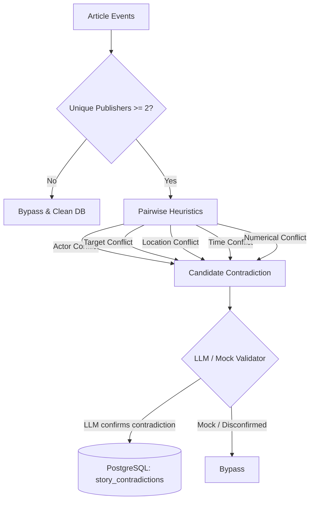

# Contradiction Engine

The **Contradiction Engine** is designed to automatically detect and flag factual contradictions across different news sources reporting on the same event.

## Architecture

Factual contradictions are detected using a **hybrid validation** approach:
1. **Single-Source Exclusion**: Contradiction checking is bypassed entirely for single-source stories (stories with fewer than 2 unique publishers/sources). Any existing contradictions for the story are deleted.
2. **Local Heuristics**: Lightweight, deterministic rules compare extracted events pairwise across different publishers to flag candidate conflicts.
3. **LLM Verification**: A high-precision LLM (Google Gemini or OpenAI) validates candidate contradictions in context to eliminate false positives (e.g. subset relationships, minor wording differences).
4. **Mock Fallback Guard**: In local development or mock environments, contradiction validation safely defaults to `is_contradiction = False`. This prevents the generation of fake or confusing contradiction alerts on the client UI.
5. **Database Persistence**: Confirmed contradictions are written to the database under the `story_contradictions` table.



---

## Pairwise Heuristics

The engine compares pairs of articles from different publishers in the same story event cluster:
- **Actors**: Flagged if both events specify actors and their actor sets are completely disjoint.
- **Targets**: Flagged if both events specify targets and their target sets are completely disjoint.
- **Location**: Flagged if location strings are different and neither is a substring of the other (e.g., "Kyiv" vs "Kyiv Oblast" matches, but "Kyiv" vs "London" conflicts).
- **Time**: Flagged if the parsed event times differ by more than 1 day.
- **Numerical Facts**: Flagged if a key number (e.g. casualties, dollar amounts) differs by more than 10% and the absolute difference is greater than 1.

---

## Database Schema

Contradictions are stored in the `story_contradictions` table:

```sql
CREATE TABLE story_contradictions (
    id UUID PRIMARY KEY,
    story_id UUID NOT NULL REFERENCES stories(id) ON DELETE CASCADE,
    fact_type VARCHAR(50) NOT NULL, -- 'actor', 'target', 'location', 'event_time', 'number'
    description TEXT NOT NULL,      -- Human-readable description
    confidence NUMERIC(5, 4),        -- Confidence score (0.0000 - 1.0000)
    source_attribution JSONB,        -- Maps source UUID to the specific value they reported
    created_at TIMESTAMP WITHOUT TIME ZONE DEFAULT NOW()
);
```
