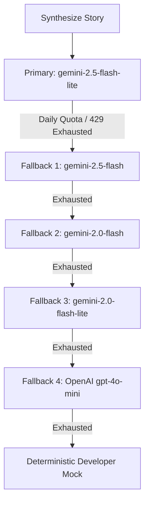

# Synthesis & Difference Engine

This document outlines the design, schema contracts, rate limits, and fallback strategies of the NewsIQ AI Synthesis Engine.

---

## 1. Structured Synthesis contracts

The [AIService](file:///c:/Users/zakau/NewsIQ/apps/api/app/services/ai_service.py) coordinates structured schema extraction from multiple news sources. Both Google Gemini and OpenAI are prompted with strict json schema boundaries.

### Pydantic Output Schema Hierarchy

```python
class TimelineEventSchema(BaseModel):
    date: str          # Date or time of event, e.g. YYYY-MM-DD or time of day
    description: str   # Bullet summary of the sub-event

class SourceDifferenceSchema(BaseModel):
    source_name: str          # Name of the publisher (e.g. Reuters, BBC)
    unique_information: str   # Details mentioned ONLY by this source
    missing_information: str  # Key details covered elsewhere but omitted here
    contradictions: str       # Conflicting claims made by this source

class StoryAIResponse(BaseModel):
    headline: str                       # Highly objective, neutral headline
    one_line_summary: str               # 1-sentence summary
    short_summary: str                  # 1-paragraph summary
    detailed_summary: str               # Multi-paragraph synthesis
    key_facts: list[str]                # 3-6 objective fact bullet points
    category: str                       # Canonical slug matching system categories
    timeline: list[TimelineEventSchema]  # Chronological timelines
    differences: list[SourceDifferenceSchema] # Publisher gap/bias analysis
```

---

## 2. Model Priority & Fallback Chain

To guard against cloud quota limitations, the AI Synthesis module implements an automated model priority chain when synthesizing stories.



- **Daily Quota Handling**: If any Gemini model raises a `RESOURCE_EXHAUSTED` error, the engine logs the error and immediately tries the next model in the chain.
- **Developer Fallback & Mock Provider**: If API keys are missing or all providers fail, a realistic mock generator (`MockProvider`) is used for local development. Instead of hardcoded generic strings or `[Mock]` prefixes, the mock provider parses actual headlines, summaries, and event details directly from the input prompts. For comparative modules, it returns safe, clean defaults (e.g., `is_contradiction = False`, empty arrays for unique/missing information) to prevent showing dummy/placeholder content to the client.
- **Single-Source Bypassing**: Comparative analysis (difference, source comparison, and contradiction engines) is skipped entirely for single-source stories (stories with fewer than 2 unique publishers/sources). Any existing difference or comparison records for single-source stories are deleted from the database.

---

## 3. Throttling, Rate Limits & Retries

Gemini free tier endpoints are subject to strict Rate Limits (e.g., 10 Requests Per Minute). NewsIQ handles this via distributed throttling and tenant-wide retry parameters:

### A. Distributed Redis Rate Limiter
Before making any Gemini synthesis request, workers check the Redis key `newsiq:synthesis:last_call`.
- **Throttling Window**: A minimum gap of **`8.0 seconds`** is enforced across all running Celery processes.
- **Sleep Delay**: If the elapsed time since the last call is less than 8.0s, the worker coroutine yields execution and sleeps for the remainder of the duration.

### B. Tenacity Retry Strategy
Calls are decorated with Tenacity retry policies:
- **Retry Condition**: Retries on any model exception.
- **Back-off Configuration**: Exponential backoff with random jitter.
  - Multiplier: `2`
  - Min Wait: `5.0s`
  - Max Wait: `30.0s`
- **Attempt Cap**: Stops after `3` attempts before failing over to the next model in the priority chain.

---

## 4. Hallucination Mitigation & Cost Optimization

### A. Cost Reduction
- **Article Truncation**: Only the first `3000` characters of each source article's content are sent to the LLM to control token ingress charges.
- **Lightweight Models**: Prefers `flash-lite` variants over heavy models to optimize synthesis costs (which cost approximately 10x less per token).

### B. Hallucination Mitigation
- **Strict Grounding**: The LLM prompt explicitly directs the system to act as a neutral analyst, forbidding editorializing, speculation, or inserting facts not present in the article input payload.
- **Key Facts Isolation**: Objective bullet points are isolated and saved to the `key_facts` JSONB database column rather than compiled dynamically, ensuring consistency.

---

## 5. Named Entity Recognition (NER) & Tagging

After synthesis, the [NERService](file:///c:/Users/zakau/NewsIQ/apps/api/app/services/ner_service.py) extracts metadata tags from the entire article text corpus:
- **spaCy (Primary)**: Loads the lightweight `en_core_web_sm` model. It maps Named Entities (`GPE`/`LOC` ➡️ `LOCATION`, `PERSON`, `ORG`, `EVENT`) to clean categories.
- **Auto-Download**: If the model is missing, the service attempts to download `en_core_web_sm` automatically via Python subprocesses.
- **Regex Fallback (Secondary)**: If spaCy fails to load entirely, a regex proper-noun fallback filters capitalized words against keyword dicts (e.g., common location/organization prefixes) to generate tags.
- **Storage**: The top 15 extracted entities are saved in the `story_entities` database table, and the top 5 are saved as tags in `story_tags` for Meilisearch indexing.
