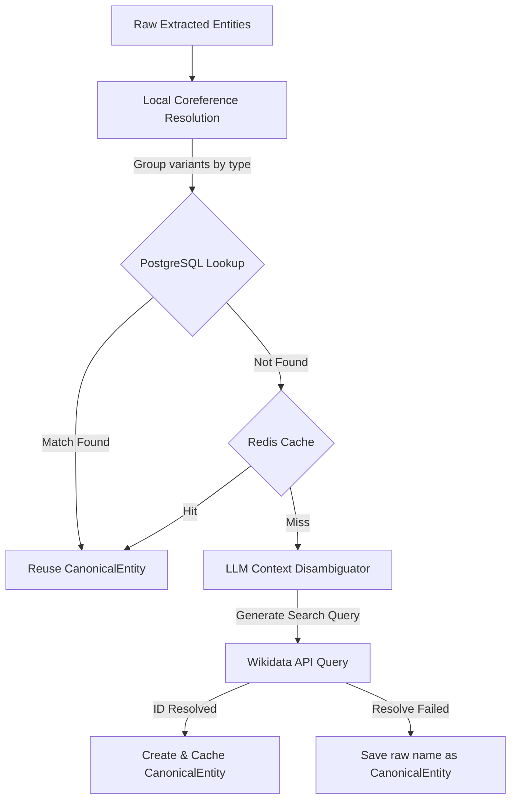

# Entity Linking

> Phase 7 — Canonicalize entity references across articles

## Overview

The Entity Linking system canonicalizes named entities within and across stories to resolve duplicate references (e.g., *"Rahul Gandhi"*, *"Mr Gandhi"*, and *"Congress leader Gandhi"* representing the same real-world entity).

## Linking Pipeline

The system uses a **Hybrid Entity Linking** architecture designed for maximum precision, low latency, and deterministic globally unique matching:

### 1. Local Coreference Heuristics
Mentions are grouped inside a story cluster before external resolution:
- **PERSON**: Matches shorter names to longer names if they are subset tokens (e.g., *"Trump"* ➔ *"Donald Trump"*), ignoring honorifics (*Mr, Dr, President*).
- **ORG/COMPANY**: Matches acronyms (e.g. *"BJP"* ➔ *"Bharatiya Janata Party"*) and substrings without corporate suffixes (*"Microsoft Corp"* ➔ *"Microsoft"*).

### 2. LLM Disambiguation Query Generator
For new entities, the LLM is queried to produce:
1. Standardized canonical name.
2. Targeted Wikidata search query (e.g., *"Rahul Gandhi politician"* to avoid ambiguity).
3. Context-based description.

### 3. Wikidata Matching & Resiliency
We query the Wikidata `wbsearchentities` API to resolve globally unique QIDs (e.g., `Q981309` for Rahul Gandhi). 

To ensure high availability and prevent external API outages from breaking background pipelines:
- **Tenacity Retries**: Queries are wrapped in a 3-attempt exponential backoff retry cycle.
- **HTTP Status Check**: `response.raise_for_status()` is called on every request to ensure transient 5xx Wikidata Gateway errors trigger retries.
- **Fallback Callbacks**: If all retry attempts are exhausted, a `retry_error_callback` returns a safe fallback payload (`[]` for multi-search queries, `None` for single lookups) instead of raising `RetryError`. The linking pipeline then cascades gracefully to local name matching or LLM agentic disambiguation.

If Wikidata yields a high-confidence match, the entity is linked to that QID.

### 4. Cache & Persistence Layer
Resolved matches are saved in the `canonical_entities` table and cached in Redis with a **7-day TTL** (using the key schema `newsiq:entity_link:{canonical_name_slugified}`).
