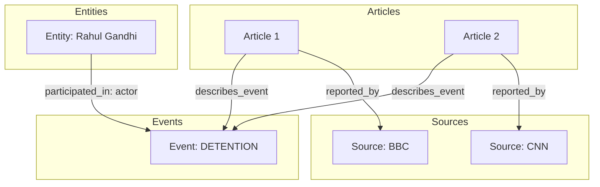

# Story Knowledge Graph

> Phase 5 — Build an in-memory knowledge graph per story cluster

## Overview

Instead of treating story clusters as flat collections of text documents, NewsIQ builds a structured **Story Knowledge Graph** (KG). This graph maps the relationships between entities, events, sources, and articles. The serialized representation is stored in a JSONB `knowledge_graph` column on the `stories` table.

## Graph Schema

The serialized JSON structure consists of `nodes` and `edges`:

### 1. Nodes
- **Source Node**:
  - ID: `source_{id}`
  - Properties: `website_url`, `country_code`
- **Article Node**:
  - ID: `article_{id}`
  - Properties: `url`, `published_at`
- **Event Node**:
  - ID: `event_{id}`
  - Properties: `event_type`, `location_raw`, `event_time` (ISO-8601), `event_time_raw`, `confidence`, `numbers` (casualties, currency, etc.)
- **Entity Node**:
  - ID: `entity_{canonical_entity_id}`
  - Properties: `entity_type`, `wikidata_id`, `description`

### 2. Edges
- **`reported_by`** (Article ➔ Source)
- **`describes_event`** (Article ➔ Event)
- **`participated_in`** (Entity ➔ Event)
  - Properties: `role` (*actor* or *target*)
- **`located_at`** (Event ➔ Entity of type PLACE/CITY/STATE/COUNTRY)

## Usage in Pipeline

1. **Summarization Context**: The Knowledge Graph is used as the primary input for the final summary engine (Phase 12), ensuring summaries are structured around facts rather than raw text documents.
2. **Timeline Generation**: Chronological sorting utilizes event nodes and their parsed `event_time` rather than article publish dates.
3. **Contradiction Detection**: Compares numbers, event times, and roles directly on the KG edges.
