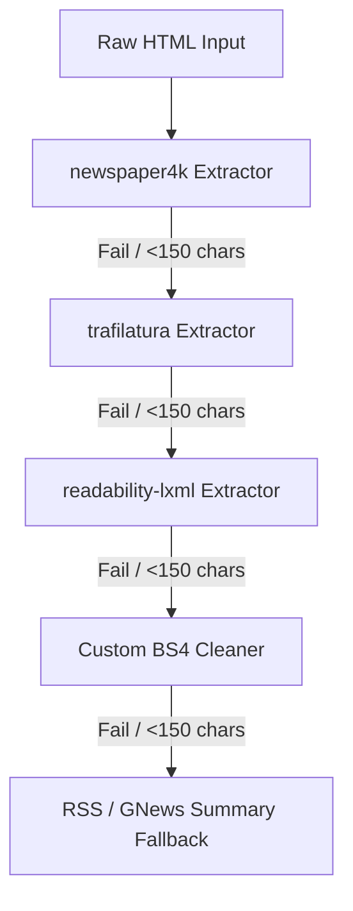
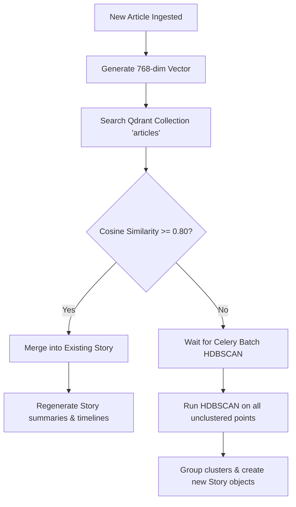

# AI Ingestion & Clustering Pipeline

This document details how NewsIQ crawler systems, embedding engines, and clustering services process incoming news data.

---

## 1. Crawling & Extraction Stack

When news articles are retrieved via RSS feeds or GNews categories, the [IngestionService](file:///c:/Users/zakau/NewsIQ/apps/api/app/services/ingestion_service.py) triggers the [CrawlerService](file:///c:/Users/zakau/NewsIQ/apps/api/app/services/crawler_service.py) to fetch the full HTML and extract text content. To ensure maximum reliability and parsing success, the crawler employs a hierarchical fallback stack executed inside a Python `asyncio.to_thread` pool.

### A. Fallback Extractors
1. **newspaper4k (Primary)**: Extracts structured page text, author names, top images, and publication dates. Highly tuned for modern news domains.
2. **trafilatura (Secondary)**: Higher-precision boilerplate remover. Used when standard layout heuristics fail.
3. **readability-lxml (Tertiary)**: Structural DOM density parser. Extracts core article tags by analyzing DOM structure.
4. **Custom BS4 Cleaner (Quaternary)**: Removes typical advertising, navbars, forms, and scripts using regex class/ID matchers (e.g., `ads`, `advertisement`, `sidebar`, `social-share`).

---

## 2. Text Vectorization & Embeddings

Ingested articles are scheduled for vectorization. The [EmbeddingService](file:///c:/Users/zakau/NewsIQ/apps/api/app/services/embedding_service.py) standardizes all embeddings to a canonical size of **768 dimensions**.

| Priority | Provider | Model | Output Dimensions | Notes |
| :--- | :--- | :--- | :---: | :--- |
| **1** | Google Gemini | `text-embedding-004` | 768 | Primary. Uses `task_type=RETRIEVAL_DOCUMENT` optimization. |
| **2** | OpenAI | `text-embedding-3-small` | 768 | Fallback. Truncated from 1536 dims and unit-normalized. |
| **3** | Local Mock | SHA-256 Hash Seed | 768 | Local Dev Only. Unit-normalized pseudorandom vector. |

### Processing Flow
- **Text Truncation**: Articles are cleaned of carriage returns and truncated to `8000` characters before vectorization to respect Gemini token constraints.
- **Normalization**: Vectors are unit-normalized to ensure compatibility with cosine distance formulas.

---

## 3. Clustering Mechanics

NewsIQ groups articles using a two-tiered clustering model: real-time in-memory updates and scheduled batch clustering.

### A. Real-Time Incremental Matching
When an article is vector-indexed in the [VectorService](file:///c:/Users/zakau/NewsIQ/apps/api/app/services/vector_service.py), it queries Qdrant for neighbors with a **Cosine Similarity threshold of $\ge 0.80$**.
- If a matching neighbor exists under an active story, the new article is merged transactionally into that story.
- Summaries, timelines, and publisher differences are immediately recalculated using the synthesis pipeline.

### B. Batch HDBSCAN Clustering
For articles that fail the incremental match threshold, the [ClusteringService](file:///c:/Users/zakau/NewsIQ/apps/api/app/services/clustering_service.py) runs an offline batch HDBSCAN task on all active, unclustered article vectors in the database.

- **Parameters**:
  - `min_cluster_size`: `2` (minimum articles needed to form a story cluster)
  - `min_samples`: `1` (conservative cluster density setting)
  - `metric`: `euclidean` (calculated on unit-normalized vectors)
  - `cluster_selection_epsilon`: `0.35`
- **Output**: Articles clustered under `label != -1` are grouped into a new [Story](file:///c:/Users/zakau/NewsIQ/docs/database/postgres-schema.md#c-story-clusters--summaries) model with associated database rows.

---

## 4. Trending Score Algorithm

Every time a story's article list changes (or on cron updates), a trending score is computed to rank stories:

$$\text{Trending Score} = (0.40 \times \text{Source Diversity}) + (0.35 \times \text{Recency Decay}) + (0.25 \times \text{Engagement})$$

1. **Source Diversity** ($S$): Counts distinct news publishers contributing to the story. Calculated as:
   $$S = \min\left(\frac{\text{Unique Publisher Count}}{5}, 1.0\right)$$
2. **Recency Decay** ($R$): Exponential decay over time elapsed since the story was first detected:
   $$R = e^{-0.1155 \times \Delta t_{\text{hours}}}$$
   *(Provides a 6-hour half-life for trending freshness).*
3. **Engagement Score** ($E$): Weighted score based on user interaction metrics:
   $$E = \min\left(\frac{(\text{Views} \times 1) + (\text{Bookmarks} \times 3) + (\text{Shares} \times 5)}{500}, 1.0\right)$$
