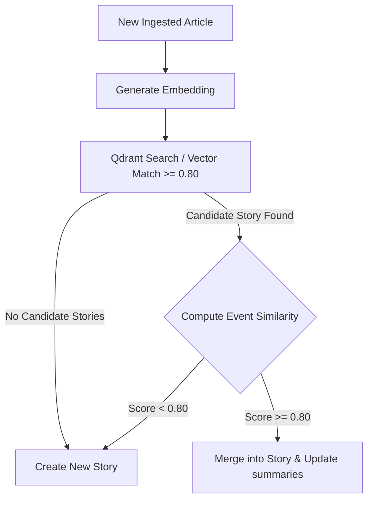

# Multi-Signal Story Clustering

> Phase 8 & 14 — Story Clustering Revolution

## Overview

The story clustering engine has been upgraded from a naive embedding-only similarity threshold to a multi-signal similarity scoring mechanism. This prevents false positive merges (unrelated stories merged together) while allowing precise, semantic-based verification.

## The Hybrid Clustering Pipeline

---

## Multi-Signal Similarity Scoring

The event-level similarity between two articles $E_1$ and $E_2$ is computed as a weighted combination of five distinct signals:

$$Similarity = 0.30 \times ActorSim + 0.25 \times TargetSim + 0.20 \times LocationSim + 0.15 \times TypeSim + 0.10 \times TimeSim$$

### 1. Actor Similarity (30%)
Calculated as the Jaccard similarity of the actor entity sets.
* $\text{ActorSim} = \frac{|Actors(E_1) \cap Actors(E_2)|}{|Actors(E_1) \cup Actors(E_2)|}$
* If both actor sets are empty, defaults to `1.0`.

### 2. Target Similarity (25%)
Calculated as the Jaccard similarity of the target entity sets.
* $\text{TargetSim} = \frac{|Targets(E_1) \cap Targets(E_2)|}{|Targets(E_1) \cup Targets(E_2)|}$
* If both target sets are empty, defaults to `1.0`.

### 3. Location Similarity (20%)
Compares string representations of locations:
* **Exact match** (case-insensitive, stripped): `1.0`
* **Substring match** (one contains the other): `0.8`
* **Mismatch**: `0.0`
* If either location is unspecified: defaults to `0.5`

### 4. Event Type Similarity (15%)
Compares the canonical event types extracted by the taxonomy engine:
* **Exact canonical type match**: `1.0`
* **Taxonomic parent category match** (e.g. `PROTEST` and `STRIKE` share the parent category `CIVIL_UNREST`): `0.5`
* **Mismatch**: `0.0`

### 5. Time Similarity (10%)
Compares the extracted event times (temporal proximity):
* **$\le 1$ day difference**: `1.0`
* **$\le 3$ days difference**: `0.5`
* **$\le 7$ days difference**: `0.2`
* **$> 7$ days difference**: `0.0`
* If either event time is unspecified: defaults to `0.8`

---

## Gating Threshold & Merging

When an article is processed:
1. It is first matched against existing stories in Meilisearch/Qdrant.
2. The average multi-signal similarity score is computed between the new article's event and all events within the candidate story.
3. If the score is $\ge 0.80$, the article is merged. Otherwise, the merge is rejected and a new story is created.

---

## HDBSCAN Batch Clustering & Validation Pass

During batch clustering of historic or backfilled articles:
1. **Initial HDBSCAN**: HDBSCAN (epsilon = `0.35`, min_cluster_size = `2`) groups articles using embedding vectors.
2. **Multi-Signal Validation Pass**: Each generated cluster is analyzed. Articles in the cluster are grouped into sub-clusters where every article within a sub-cluster has an average pairwise similarity $\ge 0.80$ with the others.
3. **Split Clusters**: If any cluster contains articles representing different events (similarity $< 0.80$), it is split into separate stories, preventing incorrect merges at the batch level.
