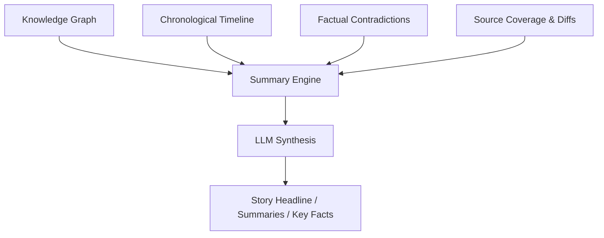

# Summary Engine Redesign

The **Summary Engine** is the final stage of story cluster content generation, responsible for synthesizing a cohesive, neutral narrative from structured knowledge inputs.

## The Problem with Old Summarization

Previously, the pipeline summarized stories directly from raw article text alongside the discovery of timeline dates, source coverage differences, and contradictions in a single LLM call. This had major drawbacks:
1. **Hallucinated Differences**: The LLM invented differences and contradictions to satisfy Pydantic output schemas.
2. **Timing Conflicts**: The LLM guessed timeline event dates, resulting in unparseable format mismatches and inaccurate sequences.
3. **No Fact Verification**: Summarization was not grounded in structured facts (entities, events) first.

## Redesigned Summarization

The redesigned Summary Engine separates **analysis** from **synthesis**:
1. Heuristics and dedicated services extract structured events (`ArticleEvent`), link canonical entities (`CanonicalEntity`), detect contradictions (`StoryContradiction`), compare publisher coverage (`StoryDifference`, `StorySourceCoverage`), and compile timelines.
2. The **Summary Engine** takes this structured knowledge as input—never the raw, unverified article text.
3. It generates the final narrative: the headline, one-line summary, short summary, detailed summary, category, and key facts.



---

## Summarization Schema

The prompt consumes the following structured JSON input models:
- **`kg`**: Event and entity nodes with roles and properties.
- **`timeline`**: Sorted timeline events.
- **`source_comparisons`**: Publisher-by-publisher focus areas, unique information, and missing information.
- **`contradictions`**: Factual contradiction details and source attributions.

The output matches the `StorySummaryResponse` schema:
```json
{
  "headline": "<objective, non-clickbait headline>",
  "one_line_summary": "<1-sentence summary>",
  "short_summary": "<1-paragraph summary>",
  "detailed_summary": "<detailed multi-paragraph summary>",
  "key_facts": ["fact1", "fact2", "fact3"],
  "category": "<politics | world | business | technology | sports | entertainment | lifestyle | travel | education | health | science | weather>"
}
```
