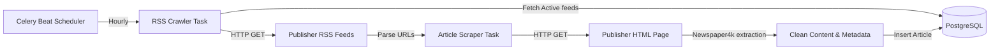
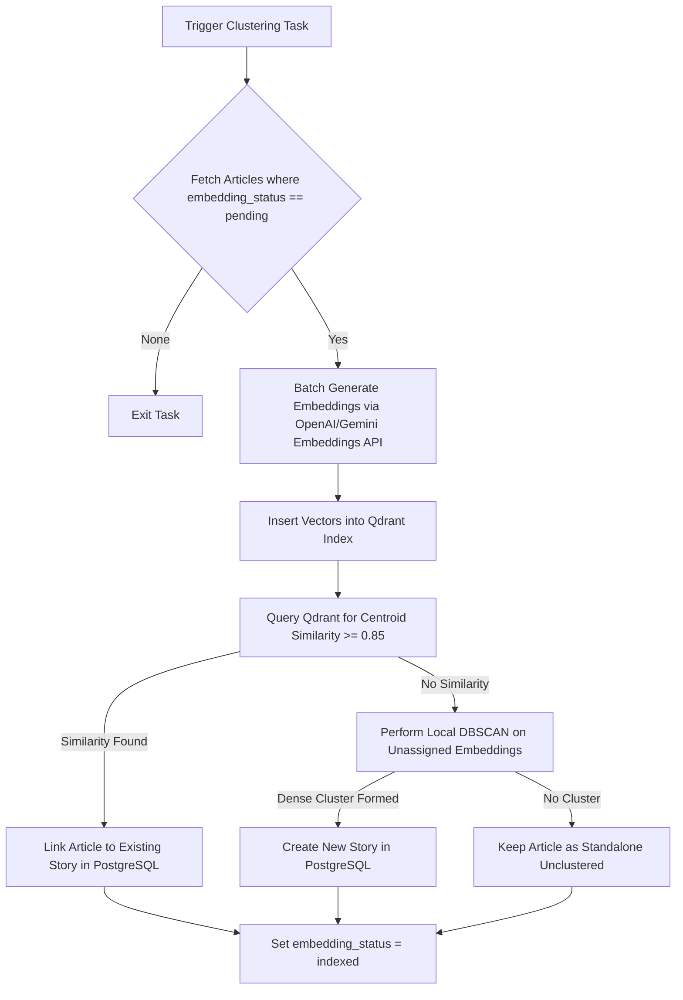
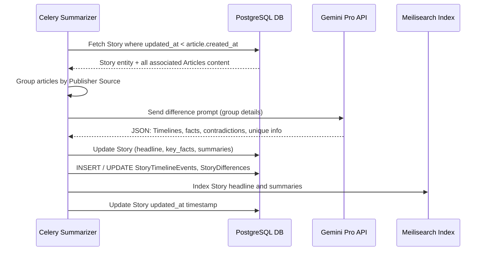

# Ingestion & AI Pipeline Data Flows

This document maps out the lifecycle of article ingestion, vector clustering, story compiling, and AI summarization.

---

## 1. Raw Article Ingestion

Every hour, the Celery Beat scheduler triggers RSS source parsing:
1. **Source Polling**: Fetches target feeds from the `sources` database.
2. **RSS Parsing**: Extracts article URLs, titles, and publication dates.
3. **Scraping**: `Newspaper4k` retrieves raw article bodies and media headers, cleaning HTML clutter.
4. **PostgreSQL Ingestion**: Saves cleaned articles with a status of `pending`.

---

## 2. Clustering & Story Generation

Once articles are ingested, the clustering task runs to compile them into "Stories" (event clusters):
1. **Embedding**: The vector service converts the article title + description into a dense vector embedding.
2. **Qdrant Vector Indexing**: Inserts embeddings into the Qdrant database.
3. **Similarity Search**: Performs a cosine similarity search against active story centroids.
4. **DBSCAN Clustering**: If an article does not match an existing story centroid but clusters with other new articles, a new `Story` is created. If it matches an existing story, it is linked via a `StoryArticle` join table.

---

## 3. Timeline Synthesis & Summarization (Difference Engine)

After articles are linked to a Story, the AI pipeline compiles synthesis files:
1. **Source Grouping**: Group linked articles by publisher source.
2. **Difference Analysis**: Submit text content to Gemini Pro with specific prompts:
   - Identify core timeline events and dates.
   - Detect publisher differences (unique facts reported by source A, missing information from source B).
   - Detect contradictions or opposing quotes.
3. **Timelines Generation**: Write time-ordered timeline events.
4. **Cache & Index**: Save summaries in PostgreSQL and index text in Meilisearch for immediate platform search availability.

