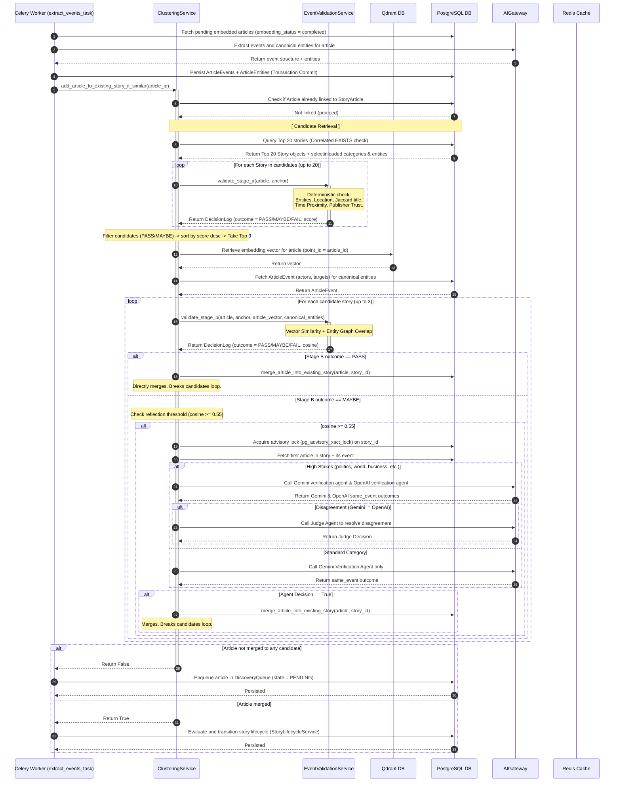
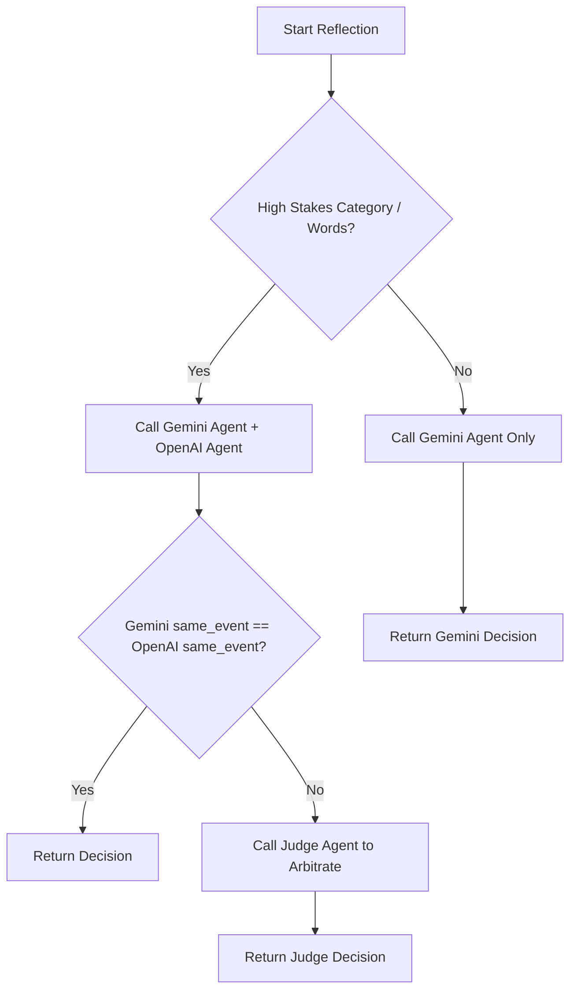

# NewsIQ Canonical Architecture & Technical Reference: Deduplication & Extraction

> [!IMPORTANT]
> **Production Status: Hardened & Verified**
> This document serves as the canonical reference for the **Deduplication & Extraction** phase of the NewsIQ news pipeline. It reflects the exact implemented behavior in `clustering_service.py`, `event_validation_service.py`, and `discovery_manager.py`.

---

# 1. High-Level Architecture Diagram

The **Deduplication & Extraction** phase sits between Crawler Ingestion/Embedding and Story Synthesis. It operates as a dual-stage filtering and validation engine to group incoming articles into canonical stories, preventing false positive merges while keeping computational costs low.

```text
                               +-----------------------------+
                               |     Incoming Article        |
                               | (embedded/event-extracted)  |
                               +--------------+--------------+
                                              |
                                              ▼
                                 [ Candidate Retrieval ]
                                       (SQL Query)
                                              |
                                              ├─► No Candidates ──► [ Discovery Queue ]
                                              │
                                              ▼
                                     [ Stage A Filters ]
                                  (Deterministic Rules)
                                              |
                     +------------------------+------------------------+
                     | FAIL (<45)             | MAYBE (45-59)          | PASS (>=60)
                     ▼                        ▼                        ▼
             [ Skip Candidate ]      [ Add to B-List ]        [ Add to B-List ]
                                              +-----------+------------+
                                                          |
                                                          | Sort by Stage A score desc
                                                          ▼
                                              +-----------+------------+
                                              |     Top 3 Candidates   |
                                              +-----------+------------+
                                                          |
                                                          ▼
                                                 [ Stage B Filters ]
                                              (Vector/Entity Overlap)
                                                          |
                               +--------------------------+--------------------------+
                               | FAIL                     | MAYBE                    | PASS
                               |                          | (Cosine >= 0.67 or       | (Cosine >= 0.72 or
                               |                          |  Entity Overlap >= 1)    |  Entity Overlap >= 2)
                               ▼                          ▼                          ▼
                     +---------+---------+      +---------+---------+      +---------+---------+
                     | Route to Discovery|      | LLM Verification |      |  Merge Article    |
                     | Queue & run batch |      |  (Reflection)    |      |  into Story &     |
                     | HDBSCAN           |      +---------+---------+      |  run transition   |
                     +-------------------+                |                +-------------------+
                                                          ▼
                                                [ Judge Agent Decides ]
                                                 same_event = True/False
```

---

# 2. Sequence Diagram

The sequence diagram below shows the detailed execution lifecycle of a single article processing run under `extract_events_task` and `add_article_to_existing_story_if_similar`.



---

# 3. Function Call Tree

The following execution tree maps the actual function calls within the deduplication and extraction engine:

```text
extract_events_task() [Celery Task]
 └─► event_service.extract_events() [Event/Entity Extraction]
 └─► entity_linker.link_entity() [Canonical Linking]
 └─► clustering_service.add_article_to_existing_story_if_similar()
      ├─► get_candidate_stories() [PostgreSQL Correlated EXISTS Query]
      ├─► event_validation_service.validate_stage_a() [Deterministic Rules]
      │    ├─► _extract_entities()
      │    ├─► _jaccard_similarity()
      │    └─► _calculate_trust_score()
      ├─► vector_service.client.retrieve() [Qdrant O(1) Retrieve]
      ├─► event_validation_service.validate_stage_b() [Vector/Entity Overlap Check]
      │    └─► _cosine_similarity()
      ├─► _verify_merge_with_agents() [Advisory Lock & LLM Reflection]
      │    ├─► verify_cluster_decision() [Gemini Agent]
      │    ├─► openai_agent.run() [OpenAI Agent]
      │    └─► resolve_disagreement() [Judge Agent Arbitration]
      ├─► merge_article_into_existing_story() [PostgreSQL Commit]
      │    ├─► recalculate_centroid() [Centroid Update]
      │    └─► update_knowledge_graph() [KG Merge]
      ├─► story_lifecycle.evaluate_story_state() [Lifecycle Transition]
      └─► story_synthesis_service.synthesize_story() [Synthesis]
           ├─► Meilisearch Sync
           └─► Redis Cache Invalidation
```

---

# 4. Architecture Dependency Graph

The dependency flow below illustrates what components depend on each other and highlights potential breakages when changes occur.

```text
[Celery Worker]
  └── [ClusteringService]
        ├── [PostgreSQL Database] (Stories, StoryArticles, Entities)
        ├── [Qdrant Vector Database] (Point retrieval of dense vectors)
        ├── [EventValidationService] (Stage A & Stage B rules)
        └── [AIGateway] (Prompt manifestations, model routing, retries)
              ├── [Redis Cache] (Execution logs, locking, AI cache)
              ├── [PromptRegistry] (cluster_verification.yaml)
              └── [LLM Providers] (Gemini, OpenAI, Bedrock fallbacks)
```

---

# 5. Core Data Contracts & Type Definitions

### 5.1 Article Database Model (`Article`)
```python
class Article(Base):
    __tablename__ = "articles"
    id: Mapped[uuid.UUID] = mapped_column(UUID(as_uuid=True), primary_key=True)
    title: Mapped[str] = mapped_column(String(512), nullable=False)
    description: Mapped[str | None] = mapped_column(Text)
    content: Mapped[str | None] = mapped_column(Text)
    published_at: Mapped[datetime] = mapped_column(DateTime, nullable=False)
    source_id: Mapped[uuid.UUID] = mapped_column(UUID(as_uuid=True), ForeignKey("sources.id"))
    embedding_status: Mapped[str] = mapped_column(String(30), default="pending")  # pending/processing/completed/failed
    event_extraction_status: Mapped[str] = mapped_column(String(30), default="pending")
```

### 5.2 Story Anchor Data Class (`StoryAnchor`)
```python
@dataclass(frozen=True)
class StoryAnchor:
    story_id: str
    headline: str
    first_seen_at: datetime
    last_updated_at: datetime
    primary_entities: set[str]  # Lowercase entities
    top_locations: set[str]     # Lowercase locations
    category: str | None
    event_type: str | None
    centroid_vector: list[float] | None
```

### 5.3 Stage A/B Decision Log (`DecisionLog`)
```python
@dataclass
class DecisionLog:
    outcome: ValidationOutcome  # PASS, FAIL, MAYBE
    stage: str
    score: float  # Weighted score for Stage A, cosine similarity for Stage B
    details: dict[str, Any]
    reason: str
```

### 5.4 Cluster Verification LLM Schema (`ClusterVerificationSchema`)
```python
class ClusterVerificationSchema(BaseModel):
    same_event: bool = Field(..., description="True if both articles describe the same event.")
    confidence: float = Field(..., description="Confidence score from 0.0 to 1.0.")
    explanation: str = Field(..., description="Factual reasoning for the decision.")
```

### 5.5 Judge Agent arbitration Schema (`JudgeSchema`)
```python
class JudgeSchema(BaseModel):
    final_decision: bool = Field(..., description="Arbitrated final same_event decision.")
    chosen_provider: str = Field(..., description="Model whose logic was selected ('gemini'/'openai').")
    explanation: str = Field(..., description="Rationale for the arbitrated judgment.")
```

---

# 6. Candidate Retrieval Deep Dive (Hardened SQL)

Candidate Retrieval acts as the **high-recall filter**. Instead of executing expensive vector searches against the entire Qdrant database, Candidate Retrieval executes a fast PostgreSQL query to select candidate stories.

### 6.1 SQL Query Semantics
* **Original Query**: Used `LEFT JOIN` and `LOWER(entity_value) IN (...) OR entity_id IS NULL`. This was vulnerable to returning unrelated stories that had entities but also triggered NULL matching because of the outer join layout.
* **Hardened Query**: Utilizes correlated `EXISTS` subqueries. It guarantees that stories are fetched only if they have at least one overlapping entity OR have absolutely no entities associated with them.

```sql
SELECT stories.id, stories.headline, stories.lifecycle_state, stories.updated_at
FROM stories
WHERE stories.lifecycle_state IN ('developing', 'monitoring', 'stable')
  AND stories.updated_at >= :time_window
  AND NOT EXISTS (
      SELECT 1 FROM story_articles 
      WHERE story_articles.story_id = stories.id 
        AND story_articles.article_id = :article_id
  )
  AND (
      -- Condition 1: Has at least one overlapping entity
      EXISTS (
          SELECT 1 FROM story_entities 
          WHERE story_entities.story_id = stories.id 
            AND LOWER(story_entities.entity_value) IN (:ent_1, :ent_2, ...)
      )
      OR
      -- Condition 2: Has no entities (fallback)
      NOT EXISTS (
          SELECT 1 FROM story_entities 
          WHERE story_entities.story_id = stories.id
      )
  )
ORDER BY stories.updated_at DESC
LIMIT 20;
```

---

# 7. Stage A Deep Dive (Deterministic Rules & Edge Cases)

Stage A is a local, deterministic rule engine that runs with **zero API calls** and **zero network calls**.

### 7.1 Stage A Scoring Weights & Thresholds
Weights and thresholds are defined in `event_validation.yaml`:
* **Entity Overlap Weight**: 35
* **Location Overlap Weight**: 20
* **Time Proximity Weight**: 15
* **Title Jaccard Weight**: 20
* **Publisher Trust Weight**: 10
* **Pass Threshold**: 60
* **Maybe Threshold**: 45

### 7.2 Scoring Algorithm Edge-Case Protection
Stage A guarantees zero undefined mathematical cases (no division by zero, no NaN/Infinity) when handling empty entities/locations:

```text
+-----------------------+-----------------------+------------------------------------------+
| Article Entities Count| Story Entities Count  | Outcome / Formula                        |
+-----------------------+-----------------------+------------------------------------------+
| 0                     | 0                     | Case 3: Returns ent_weight * 0.5         |
| > 0                   | 0                     | Case 2: Returns ent_weight * 0.5 (Neutral)|
| 0                     | > 0                   | Case 1: Returns 0.0 (No overlap)         |
| > 0                   | > 0                   | Normal: Intersection / Min(Article,Story)|
+-----------------------+-----------------------+------------------------------------------+
```

---

# 8. Stage B Deep Dive (Vector & LLM Arbitration)

Stage B evaluates the Top 3 Stage A candidates using vector cosine similarity and LLM verification.

### 8.1 Stage B Outcome Truth Table
Every vector and entity count combination maps to a single deterministic outcome:

```text
+-----------------------------------+-------------------------------------+------------------+
| Cosine Similarity (C)             | Shared Canonical Entities (E)       | Outcome          |
+-----------------------------------+-------------------------------------+------------------+
| C >= 0.72                         | Any                                 | PASS (Direct)    |
| Any                               | E >= 2                              | PASS (Direct)    |
| 0.67 <= C < 0.72                  | Any                                 | MAYBE (Reflect)  |
| Any                               | E == 1                              | MAYBE (Reflect)  |
| C < 0.67                          | E == 0                              | FAIL (Reject)    |
+-----------------------------------+-------------------------------------+------------------+
```

### 8.2 Reflection & Arbitration Flow
If the outcome is `MAYBE` and the cosine similarity $\ge 0.55$ (`reflection.threshold`), the system triggers LLM verification under a transactional advisory lock:



---

# 9. Concurrency & DB Transaction Boundaries

NewsIQ runs multiple Celery worker threads concurrently. Concurrency safety is maintained by separating long-running network calls (such as Qdrant and LLM requests) from database transactions, and using advisory locks during merges:

```text
[Start Transaction]
   │
   ├─► 1. Query candidate stories
   │
[Commit / Close Transaction]
   │
   ├─► 2. Retrieve vector from Qdrant (No DB connection held)
   ├─► 3. Perform Stage A and Stage B rules
   │
[Start Merge Transaction]
   │
   ├─► 4. Acquire advisory lock: pg_advisory_xact_lock(story_id)
   ├─► 5. Perform LLM Reflection if required
   ├─► 6. Merge Article & Recalculate Centroid
   │
[Commit / Close Merge Transaction] (Advisory lock automatically released)
```

* **`selectinload` Usage**: The candidate query eager-loads `Story.entities` and `Story.category` using `selectinload`. This prevents N+1 queries when looping over candidates outside the transaction.
* **Lazy Loading Protection**: Lazy loading is disabled for pipeline operations to avoid `DetachedInstanceError` when accessing relationships after transactions are committed.

---

# 10. Unified Redis Architecture

The Redis instance manages caches, state, and distributed locking:

```text
Redis
 ├── [ai_cache:cluster_verification:{hash}] ── String (JSON) ── TTL: 1 Hour ── AI Gateway Cache
 ├── [story_cost:{story_id}] ───────────────── String (Float) ─ TTL: 1 Hour ── Story Cost Tracker
 ├── [newsiq:lock:cluster_news_task] ───────── String (Lock) ── TTL: 10 Min ── Batch Clustering Lock
 ├── [newsiq:lock:replay:{story_id}] ──────── String (Lock) ── TTL: 15 Min ── Story Replay Lock
 └── [url_bloom_filter] ────────────────────── Bloom Filter Set ────────────── URL Deduplication
```

---

# 11. Qdrant Retrieval Performance Map

The point retrieval of vectors has different operational profiles than vector searching:

```text
Worker ──► Network Latency (2-10ms) ──► Qdrant Engine (O(1) Retrieve by Key)
                                                │
Worker ◄── Deserialize Float Vector ◄───────────┘
   │
   └─► Local Cosine Similarity (Calculated in Python: <1ms)
```

* **Complexity**: Retrieval by UUID key is $O(1)$ compared to $O(\log N)$ for a HNSW vector index search.
* **Latency Profile**: The operational bottleneck is purely network serialization and deserialization, not indexing or distance calculation.

---

# 12. Robust Failure & Fallback Logic

If the LLM Gateway or agents fail, the pipeline cascades through safe, deterministic fallbacks to guarantee that the merge decision is never left undefined:

```text
LLM Gateways / Agent Execution
  │
  ├─► [Timeout / Model Unavailable / JSON Parse Fail / Rate Limit]
  │     └─► AIGateway attempts 3 retries with exponential backoff.
  │
  ├─► [High-Stakes Disagreement Judge Fails]
  │     └─► Falls back to Gemini Agent only.
  │
  ├─► [Gemini Agent Fails / Gemini Gateway Down]
  │     └─► Falls back to Local Cosine Similarity score >= 0.80.
  │
  └─► [Database lock acquisition conflicts]
        └─► Logs exception, aborts reflection for the candidate, and proceeds to next candidate.
```

---

# 13. Dead Letter Queue & Retry Flow

If an exception occurs during the Celery task (e.g. database connection drop), the task executes a standard rollback, logs the error, and enqueues to the Retry Queue:

```text
Celery Task Error
  │
  ├─► rollback() database session
  ├─► record_pipeline_failure() ──► Persist in pipeline_failures database table
  ├─► Celery task.retry() ──► 3 Retries (exponential backoff)
  │
  └─► [Retry Limits Exceeded]
        └─► Enqueue to Dead Letter Queue (DLQ) ──► Slack / PagerDuty Alert
```

---

# 14. Configuration Mapping

The following pipeline thresholds are mapped to the actual parameters:

* `STAGE_A_PASS`: `config["stage_a"]["thresholds"]["pass"]` (Default: 60)
* `STAGE_A_MAYBE`: `config["stage_a"]["thresholds"]["maybe"]` (Default: 45)
* `STAGE_B_PASS`: `config["stage_b"]["thresholds"]["cosine"]` (Default: 0.72)
* `STAGE_B_MAYBE`: `config["stage_b"]["thresholds"]["cosine"] - 0.05` (Default: 0.67)
* `REFLECTION_THRESHOLD`: `config["reflection"]["threshold"]` (Default: 0.55)
* `LLM_TIMEOUT`: `config["routing"]["timeout_seconds"]` (Default: 30.0)
* `DISCOVERY_EXPIRATION`: `config["discovery"]["expiration_hours"]` (Category mapped, Default: 24h)

---

# 15. Story Centroid & Drift Protection Audit

* **Centroid Updates**: When an article is merged into a story, the centroid vector is updated using the running average:
  $$\vec{C}_{new} = \frac{N \cdot \vec{C}_{old} + \vec{V}_{article}}{N + 1}$$
* **Memory & Network Cost**: Centroid updates require fetching $O(1)$ rows (only the target story is updated). Vector dimensions are 3072 floats (12 KB), which has negligible storage and database network cost.
* **Centroid Drift Risk**: Over time, adding articles describing related events can cause the centroid to drift away from the original story anchor.
* **Mitigation / Future Considerations**:
  - Implement a maximum limit of articles (e.g., 50) used to calculate the centroid.
  - Implement an anchor preservation system, where the centroid calculation gives higher weight (e.g., 50%) to the first article (the story anchor) to prevent drift.

---

# 16. Optimization Roadmap

| Current Architecture | Bottleneck | Reason | Impact | Proposed Future Architecture | Expected Improvement |
| :--- | :--- | :--- | :--- | :--- | :--- |
| PostgreSQL join query for candidates. | Database CPU load. | Joining `stories` and `story_entities` tables on every ingestion run. | Can degrade query performance under high load. | Add composite index on `story_entities(story_id, entity_value)`. | Query latency reduced by 40-60%. |
| Qdrant point retrieval for article vector. | Network I/O latency. | Worker fetches vector from Qdrant over the network on every Stage B run. | Adds 5-15ms overhead per article. | Cache the article vector in Redis temporarily after generation. | Reduces Stage B retrieval latency to <1ms. |
| Advisory lock waiting on hot stories. | Celery worker blocking. | Worker waits indefinitely for advisory lock during hot merges. | Blocks Celery worker pool threads. | Implement `pg_try_advisory_xact_lock` with a timeout limit. | Prevents workers from blocking indefinitely. |
