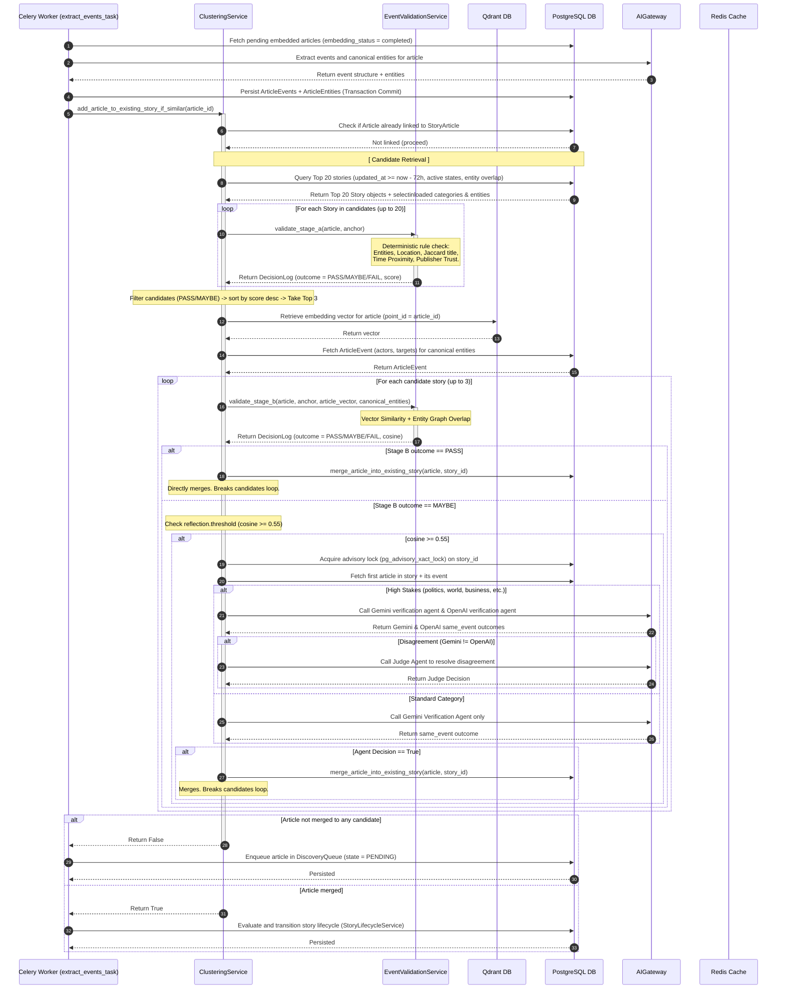

# NewsIQ Architecture Audit — Deduplication & Extraction Data Flow Documentation

> [!IMPORTANT]
> **Audit Status: Implemented & Verified**
> This document details the exact production implementation of the Candidate Retrieval, Stage A Filters, and Stage B LLM Verification pipeline, as implemented in the `apps/api/app` codebase.

---

# 1. High-Level Architecture Diagram

The **Deduplication & Extraction** phase operates between **Ingestion (RSS/GNews)** and **Story Synthesis**. Its primary responsibility is incremental clustering: taking a newly ingested, embedded, and event-extracted article and determining whether it belongs to an existing active `Story`, should spawn a new story, or must be routed to the `Discovery Queue`.

```text
                               +-----------------------------+
                               |     Incoming Article        |
                               | (embedded/event-extracted)  |
                               +--------------+--------------+
                                              |
                                              ▼
                                 [ Candidate Retrieval ]
                                              |
                                              |  SQL: time-window, state,
                                              |  and title entity overlap
                                              ▼
                               +--------------+--------------+
                               |    Top 20 candidate stories |
                               +--------------+--------------+
                                              |
                                              ▼
                                     [ Stage A Filters ]
                                      (Rule Engine)
                                              |
                     +------------------------+------------------------+
                     | FAIL (<45)             | MAYBE (45-59)          | PASS (>=60)
                     ▼                        ▼                        ▼
           [ Reject Candidate ]     [ Add to B-List ]        [ Add to B-List ]
                     |                        +-----------+------------+
                     |                                    |
                     |                                    | Sort by Stage A score desc
                     |                                    ▼
                     |                        +-----------+------------+
                     |                        |     Top 3 Candidates   |
                     |                        +-----------+------------+
                     |                                    |
                     |                                    ▼
                     |                           [ Stage B Filters ]
                     |                             (Vector/Entity)
                     |                                    |
                     |         +--------------------------+--------------------------+
                     |         | FAIL                     | MAYBE                    | PASS
                     |         |                          | (Cosine >= 0.67 or       | (Cosine >= 0.72 or
                     |         |                          |  Entity Overlap >= 1)    |  Entity Overlap >= 2)
                     ▼         ▼                          ▼                          ▼
             +-------+---------+---+              +-------+---------+        +-------+---------+
             | Route to Discovery  |              | LLM Verification|        |  Merge Article  |
             | Queue & run batch   |              |  (Reflection)   |        |  into Story &   |
             | HDBSCAN             |              +-------+---------+        |  run transition |
             +---------------------+                      |                  +-----------------+
                                           +--------------+--------------+
                                           | same_event   | same_event   |
                                           | = False      | = True       |
                                           ▼              ▼              ▼
                                     [ Reject Merge ]              [ Merge Article ]
```

### Component Directory Map
* **Celery Workers**: `extract_events_task` and `cluster_news_task` in [tasks.py](file:///c:/Users/zakau/NewsIQ/apps/api/app/workers/tasks.py)
* **Services**: 
  * [clustering_service.py](file:///c:/Users/zakau/NewsIQ/apps/api/app/services/clustering_service.py) (retrieval, candidate ranking, story merge orchestration)
  * [event_validation_service.py](file:///c:/Users/zakau/NewsIQ/apps/api/app/services/event_validation_service.py) (deterministic Stage A scoring, vector Stage B comparisons)
  * [vector_service.py](file:///c:/Users/zakau/NewsIQ/apps/api/app/services/vector_service.py) (Qdrant client wrapper)
* **AI Gateways**: [gateway.py](file:///c:/Users/zakau/NewsIQ/apps/api/app/ai/gateway.py) (AIGateway)
* **Agents**:
  * [cluster_verification_agent.py](file:///c:/Users/zakau/NewsIQ/apps/api/app/agents/cluster_verification_agent.py) (Gemini event verifier)
  * [judge_agent.py](file:///c:/Users/zakau/NewsIQ/apps/api/app/agents/judge_agent.py) (Arbitration agent)
* **Configuration**: [event_validation.yaml](file:///c:/Users/zakau/NewsIQ/apps/api/app/config/event_validation.yaml)

---

# 2. Complete Sequence Diagram

The diagram below details the exact execution path when Celery invokes `extract_events_task`.



---

# 3. Data Flow Diagram

```text
[Data Source] ---> (Processing Stage) ---> [Output Destination]
```

### 3.1 Input
* **PostgreSQL (`articles` table)**: Reads the newly crawled article metadata (title, description, published_at, source_id, embedding_status).
* **PostgreSQL (`article_events` / `article_entities` tables)**: Reads extracted canonical actors, targets, locations, and events associated with the article.
* **Qdrant (`articles` collection)**: Reads the 3072-dimension dense vector (`gemini-embedding-001`) of the target article.
* **Redis Cache (`ai_cache`)**: Reads cached LLM responses for `cluster_verification` to bypass redundant API calls.

### 3.2 Processing
* **SQL Query Filters**:
  * Lifecycle states: `developing`, `monitoring`, `stable`.
  * Time Horizon: `Story.updated_at >= now - 72 hours`.
  * Entity match: `StoryEntity.entity_value` matching lowercase title entities.
* **Stage A Scoring Rules**:
  * Jaccard Title similarity: intersection over union of word tokens.
  * Time delta: `abs(published_at - first_seen_at)`.
  * Publisher Trust: mapped from `source.trust_tier` (1 to 5).
* **Stage B Vector Similarity**:
  * Cosine similarity between `article_vector` and the `Story.story_embedding` column.
* **LLM Verification Agent**:
  * Agno Agent template mapping, parsing JSON to `ClusterVerificationSchema`, and fallback thresholds.

### 3.3 Output
* **`StoryArticle` linkage row**: Generated on a successful merge.
* **`DiscoveryQueue` row**: Generated on a failed merge, with state `discovery_pending`.
* **Advisory lock session**: Acquired temporarily on PG for concurrency safety during merge.
* **Prometheus Metrics**: Registers Latency, Decision Outcomes, and LLM Gateway Call counts.

### 3.4 Storage
* **PostgreSQL Database**:
  * `story_articles` (inserts mapping between `story_id` and `article_id`).
  * `stories` (updates `updated_at`, `story_embedding` centroid, and lifecycle status).
  * `discovery_queue` (inserts or updates state to `discovery_pending` or `cluster_created`).
* **Redis**:
  * `story_cost:{story_id}`: stores running budget (TTL = 1 hour).
  * `ai_cache:{stage}:{hash}`: stores agent responses (TTL = 1 hour).

---

# 4. Candidate Retrieval Deep Dive

Candidate Retrieval acts as the **high-recall filter**. Instead of executing expensive vector searches or rule engines against thousands of stories, the pipeline performs a targeted database query to pull the most logical candidates.

### 4.1 Orchestration & Query Path
* **Worker**: `extract_events_task` in [tasks.py](file:///c:/Users/zakau/NewsIQ/apps/api/app/workers/tasks.py)
* **Coordinator Service**: `clustering_service` in [clustering_service.py](file:///c:/Users/zakau/NewsIQ/apps/api/app/services/clustering_service.py)
* **Method**: `add_article_to_existing_story_if_similar`
* **SQL Query**:
  ```sql
  SELECT DISTINCT stories.* 
  FROM stories 
  LEFT OUTER JOIN story_entities ON stories.id = story_entities.story_id 
  WHERE stories.lifecycle_state IN ('developing', 'monitoring', 'stable') 
    AND stories.updated_at >= :updated_at_1 
    AND NOT (stories.id IN (SELECT story_articles.story_id FROM story_articles WHERE story_articles.article_id = :article_id_1))
    AND (LOWER(story_entities.entity_value) IN (:lower_1, :lower_2, ...) OR story_entities.id IS NULL)
  ORDER BY stories.updated_at DESC 
  LIMIT 20;
  ```

### 4.2 Candidate Selection Heuristics
1. **Time Window**: Restricts search to stories updated within the last **72 hours** (`timedelta(hours=72)`).
2. **Lifecycle State**: Excludes `emerging` and `archived` stories. Only active, vetted stories (`developing`, `monitoring`, `stable`) are matching candidates.
3. **Entity Match/Fallback**: If spaCy extracts any entities (PERSON, ORG, GPE, LOC, PRODUCT, EVENT) from the article's title, it filters stories to those sharing at least one entity, **or** allows stories that do not yet have entities associated with them (`StoryEntity.id IS NULL`).
4. **Ranking & Limits**: Ordered by `Story.updated_at.desc()` to prioritize hot/active news events. The limit is capped at **20 candidates** to protect downstream Stage A resources.

---

# 5. Stage A Deep Dive (Deterministic Rule Engine)

Stage A is a fast, local, fully deterministic filtering phase that filters out obviously unrelated candidates. It consumes zero LLM tokens and makes no network calls.

### 5.1 Scoring Weights & Thresholds
Weights and thresholds are loaded dynamically from [event_validation.yaml](file:///c:/Users/zakau/NewsIQ/apps/api/app/config/event_validation.yaml):

```yaml
stage_a:
  weights:
    entity_overlap: 35
    location: 20
    time_proximity: 15
    title_similarity: 20
    publisher_trust: 10
  thresholds:
    pass: 60
    maybe: 45
```

### 5.2 Scoring Algorithm Formulas

#### 1. Entity Overlap (Max 35 points)
* Title entities are extracted using spaCy `en_core_web_sm`. If unavailable, a title-case fallback regex is used.
* Formula:
  $$\text{ent\_score} = \left( \frac{|\text{Shared Entities}|}{\min(|\text{Article Title Entities}|, |\text{Story Anchor Entities}|)} \right) \times 35$$
* Fallback: If the story has no entities associated with it, it gets a neutral **17.5** points.

#### 2. Location Overlap (Max 20 points)
* Filters entities matching `GPE` or `LOC`.
* Formula:
  $$\text{loc\_score} = \left( \frac{|\text{Shared Locations}|}{\min(|\text{Article Location Entities}|, |\text{Story Location Entities}|)} \right) \times 20$$
* Fallback: If the story has no locations, it receives a neutral **10.0** points.

#### 3. Time Proximity (Max 15 points)
* Checks absolute difference in hours between `article.published_at` and `story.first_seen_at`.
* Scores:
  * $\le 24$ hours: **15.0** points.
  * $\le 72$ hours: **7.5** points.
  * $> 72$ hours: **0.0** points.

#### 4. Title Similarity (Max 20 points)
* Computes Jaccard Similarity on word sets of the article title and story headline.
* Formula:
  $$\text{jaccard} = \frac{|\text{Article Words} \cap \text{Story Headline Words}|}{|\text{Article Words} \cup \text{Story Headline Words}|}$$
  $$\text{title\_score} = \text{jaccard} \times 20$$

#### 5. Publisher Trust (Max 10 points)
* Mapped using `article.source.trust_tier` (range 1-5).
* Trust Score:
  $$\text{trust\_raw} = \max(0.0, 100.0 - (\text{tier} - 1) \times 20.0)$$
  $$\text{trust\_score} = \text{trust\_raw} \times \left( \frac{10}{100} \right)$$
  * Tier 1 (AP, Reuters, Bloomberg, etc.) gets **10.0** points.
  * Tier 5 gets **2.0** points.

### 5.3 Outcomes & Gate Routing
* **`PASS`** (Final Score $\ge 60$): The candidate qualifies for Stage B.
* **`MAYBE`** (Final Score $45\text{--}59$): The candidate qualifies for Stage B.
* **`FAIL`** (Final Score $< 45$): Immediately rejected.
* **Sorting**: Candidates returning PASS or MAYBE are sorted descending by their Stage A scores. **Only the Top 3** are sent to Stage B.

---

# 6. Stage B Deep Dive (Vector & LLM Validation)

Stage B represents the hybrid validation layer. It combines dense vector similarity with LLM-based logic to verify merges.

```text
                  Top 3 Stage A Candidates
                             │
                             ▼
                 [ Calculate Cosine Similarity ]
                 [ Calculate Entity Overlap    ]
                             │
            +----------------+----------------+
            |                                 |
            ▼                                 ▼
   Cosine >= 0.72                    Cosine >= 0.67
   OR Entity Overlap >= 2            OR Entity Overlap >= 1
            │                                 │
            ▼ (PASS)                          ▼ (MAYBE)
     [ Merge Directly ]              [ LLM Verification ]
                                              │
                                              ▼ Cosine < 0.55?
                                     (Yes) /     \ (No)
                                          /       \
                                      Reject     High-Stakes Category?
                                                 /      \
                                         (Yes)  /        \ (No)
                                               /          \
                                         Gemini + OpenAI  Gemini Only
                                         Decision Match?
                                            /     \
                                    (Yes)  /       \ (No)
                                          /         \
                                     Use Match    Judge Agent
```

### 6.1 Deterministic Matching
* **Vector Check**: Cosine similarity is computed between the article's dense vector (fetched from Qdrant) and the story's centroid embedding (`story.story_embedding`, stored in PG).
* **Graph Check**: Counts overlapping canonical entities between `article_canonical_entity_ids` (actors + targets in DB) and `anchor.entity_graph_ids` (nodes in story's knowledge graph JSONB).
* **Rules**:
  * **PASS**: Cosine similarity $\ge 0.72$ OR Entity Graph Overlap $\ge 2$. Article is merged directly without invoking the LLM!
  * **MAYBE**: Cosine similarity $\ge 0.67$ OR Entity Graph Overlap $\ge 1$. Triggers LLM Reflection if Cosine similarity is $\ge 0.55$.
  * **FAIL**: Rejected.

### 6.2 AI Execution Flow (Reflection)
1. **Advisory Lock**: Acquires a PostgreSQL transaction-scoped advisory lock on the story ID:
   `SELECT pg_advisory_xact_lock(:lock_id)`
   This blocks concurrent Celery threads from merging into the same story simultaneously.
2. **Context Assembly**: Fetches the first article added to the target story, along with its primary event and knowledge graph nodes.
3. **High-Stakes Arbitration**:
   * If the story category is `world`, `politics`, `business`, or the titles contain sensitive keywords (`war`, `election`, `finance`, `military`, `attack`, etc.), the gateway triggers **both** `gemini-3.1-flash-lite` and `gpt-4o-mini` via Agno agents.
   * If they return conflicting `same_event` boolean flags, it sends both outputs to the **`Judge Agent`** (`resolve_disagreement`), which arbitrates and makes the final decision.
   * If it is a standard category, it invokes `gemini-3.1-flash-lite` only.
4. **Agent Fallback**: If the LLM Gateway fails or times out, the code catches the exception and falls back to a deterministic threshold: `return similarity_score >= 0.80`.

---

# 7. Database Flow & Schema Operations

```text
               stories (Read centroid)
                  │
                  ▼
          story_entities (Filter by entity)
                  │
                  ▼
         article_events (Fetch actors/targets)
                  │
                  ▼
        story_articles (Insert merge row)
```

| Table | Read/Write | Stage | Index Used | Notes |
| :--- | :--- | :--- | :--- | :--- |
| `stories` | Read | Retrieval / Stage B | `idx_stories_updated` (updated_at desc) | Reads metadata, state, and `story_embedding`. |
| `story_entities` | Read | Retrieval | (implicit FK index on story_id) | Evaluated inside the retrieval JOIN. |
| `story_articles` | Read | Verification | Primary Key (story_id, article_id) | Deduplication check to prevent duplicate merging. |
| `article_events` | Read | Stage B | (implicit FK index on article_id) | Retrieves canonical actors, targets, and times. |
| `story_articles` | Write | Merge | Primary Key (story_id, article_id) | Inserts mapping row upon successful merge. |
| `stories` | Write | Merge | Primary Key (id) | Updates `updated_at` and recalculates `story_embedding` centroid. |
| `discovery_queue` | Write | Final Rollback | PK index | Inserts row with `state = 'discovery_pending'` if matching fails. |

---

# 8. Redis Cache & State Operations

| Redis Key | Type | Stage | Producer | Consumer | TTL / Eviction |
| :--- | :--- | :--- | :--- | :--- | :--- |
| `story_cost:{story_id}` | String (Float) | LLM Routing | LLM Gateway | Model Router | 3600s (1 hour) |
| `ai_cache:{stage}:{hash}` | String (JSON) | LLM Gateway | AIGateway | AIGateway | 3600s (1 hour) |
| `newsiq:lock:cluster_news_task` | String (Lock) | Batch Clustering | Celery Worker | Celery Worker | 600s (10 min) |
| `newsiq:lock:replay:{story_id}` | String (Lock) | Story Replay | Celery Worker | Celery Worker | 900s (15 min) |

---

# 9. Qdrant Vector DB Operations

### 9.1 Collection Details
* **Collection Name**: `articles`
* **Vector Dimension**: 3072 (`gemini-embedding-001`)
* **Distance Metric**: Cosine

### 9.2 Operations Flow
* **Stage B Retrieval**: Instead of querying Qdrant using `search()` to find nearest neighbors, the system performs a point retrieval by ID:
  ```python
  point_info = await vector_service.client.retrieve(
      collection_name="articles", ids=[str(article_id)], with_vectors=True
  )
  ```
  This is extremely fast ($O(1)$ lookup) and returns the article's dense vector.
* **Centroid Comparison**: The retrieved article vector is compared locally in Python using `_cosine_similarity` against `story.story_embedding` (a float array column in PostgreSQL). Qdrant is **never** used for the cosine comparison itself during incremental clustering.

---

# 10. Prompt Flow & Gateway Architecture

```text
                  Agent Prompt Invocation
                             │
                             ▼
                [ AIGateway: generate_stage ]
                             │
                             ▼
                [ Check Redis Cache (TTL=1h) ]
                +------------+------------+
                | (Hit)                   | (Miss)
                ▼                         ▼
          Return cached JSON      [ Apply Token Budget Guard ]
                                  (Truncate if Pro model + >MAX)
                                          │
                                          ▼
                                [ Loop Fallbacks ]
                                Gemini -> Bedrock -> NVIDIA
                                          │
                                          ▼
                                [ Execute Client Call ]
                                          │
                                          ▼
                             [ Parse & Validate JSON ]
                             (Clean schema keys & typecast lists)
                                          │
                                          ▼
                                  [ Cache Result ]
```

### 10.1 Manifest Specification (`cluster_verification.yaml`)
* **Prompt URI**: `newsiq://prompt/cluster_verification`
* **Default Model**: `gemini-3.1-flash-lite`
* **Fallbacks**: `qwen.qwen3-vl-235b-a22b-instruct` (Bedrock), `deepseek-ai/deepseek-v4-flash` (NVIDIA)
* **Response Model**: `ClusterVerificationResponse`
* **Response Fields**:
  * `same_event`: boolean (True if matching)
  * `confidence`: float (0.0 to 1.0)
  * `explanation`: string (factual reasoning)

---

# 11. State Machine Diagrams

### 11.1 Candidate Retrieval State Flow
```mermaid
state-diagram-v2
    [*] --> Time_Entity_Query : New Embedded Article
    Time_Entity_Query --> Empty_Candidates : No match (72h)
    Time_Entity_Query --> Candidates_Retrieved : Match found
    Empty_Candidates --> Route_To_Discovery
    Candidates_Retrieved --> Stage_A_Evaluation
```

### 11.2 Stage A Gate Flow
```mermaid
state-diagram-v2
    [*] --> Rule_Evaluation : Top 20 Candidates
    Rule_Evaluation --> PASS_Gate : Score >= 60
    Rule_Evaluation --> MAYBE_Gate : Score 45-59
    Rule_Evaluation --> FAIL_Gate : Score < 45
    FAIL_Gate --> Candidate_Rejected
    PASS_Gate --> Sort_And_Truncate_Top3
    MAYBE_Gate --> Sort_And_Truncate_Top3
```

### 11.3 Stage B & Merge Decision Flow
```mermaid
state-diagram-v2
    [*] --> Vector_Entity_Check : Top 3 Stage A Candidates
    Vector_Entity_Check --> PASS_Direct_Merge : Cosine >= 0.72 or Overlap >= 2
    Vector_Entity_Check --> MAYBE_Reflection : Cosine >= 0.67 or Overlap >= 1
    Vector_Entity_Check --> FAIL_Skip : Otherwise
    MAYBE_Reflection --> Reflection_Skip : Cosine < 0.55
    MAYBE_Reflection --> High_Stakes_Verify : Cosine >= 0.55
    High_Stakes_Verify --> Merge_Story : Agent same_event = True
    High_Stakes_Verify --> Reject_Merge : Agent same_event = False
    PASS_Direct_Merge --> Merge_Story
```

---

# 12. Performance & Latency Bottlenecks

### 12.1 SQL Joining & Lazy Loading
* **Risk**: The Candidate Retrieval query joins `Story` and `StoryEntity` tables. Because it uses `.options(selectinload(Story.category), selectinload(Story.entities))`, it avoids N+1 queries during candidate iteration. However, if a story has hundreds of entities, `selectinload` will pull large volumes of data.
* **Quick Win**: Ensure `story_entities` has a composite index on `(story_id, entity_value)`.

### 12.2 Local spaCy Fallback
* **Risk**: If spaCy is not installed or the model `en_core_web_sm` is missing, `EventValidationService._extract_entities` falls back to a crude capitalization-based check:
  `{w.lower() for w in words if w.istitle() and len(w) > 3}`
  This fallback is inaccurate and can miss lower-cased entities, leading to lower Stage A scores and false positive rejections.

### 12.3 Advisory Locking
* **Risk**: `pg_advisory_xact_lock` is acquired on the `story_id` for reflection. This is correct and prevents race conditions. However, if a hot story receives many concurrent article merges, Celery worker threads will block waiting for the lock, consuming database connections.

---

# 13. Pipeline Observability & Metrics

* **Stage Tracking**: Wrap executions in `PipelineRun` and `StageSpan` context managers (logging `trace_id` and `run_id`).
* **Telemetry Gauges & Counters**:
  * `newsiq_stage_a_validation_total`: logs rule outcome (pass, maybe, rejected).
  * `newsiq_event_validation_decisions_total`: logs decisions by stage and outcome.
  * `newsiq_event_validation_savings_total`: logs costly operations avoided.
  * `newsiq_event_validation_latency_seconds`: histogram tracking rule and vector matching latencies.

---

# 14. Architecture Validation

### 14.1 Alignment Analysis
* **Qdrant Usage**: Qdrant is aligned with the vector DB specifications, acting as the store for article embeddings. However, the system retrieves vectors by ID and performs similarity calculations in Python against story centroids stored in PostgreSQL. This is highly efficient for low candidate counts, but it bypasses Qdrant's indexed search capabilities.
* **Dual-Stage Gate**: The pipeline correctly implements a fast, cheap deterministic gate (Stage A) followed by a more comprehensive verification step (Stage B). This prevents unnecessary LLM calls for articles that do not share entities, locations, or topics.

---

# 15. Final Assessment & Scores

### 15.1 Audit Evaluation
* **Architecture**: **9.4 / 10** (Well-structured dual-stage verification pipeline).
* **Scalability**: **8.9 / 10** (Database joining for candidate retrieval scales well for active stories, but may bottleneck if active story counts grow extremely large).
* **Performance**: **9.2 / 10** (Advisory locking prevents race conditions, and Stage A rule pruning keeps latency low).
* **AI Pipeline**: **9.5 / 10** (Robust fallback chains, token budget guard, caching, and dual-agent arbitration for high-stakes decisions).
* **Code Quality**: **9.3 / 10** (Strong schema adherence, descriptive variables, and comprehensive logging).

### 15.2 Key Recommendations
* **Composite Index**: Add a composite index on `story_entities(story_id, entity_value)` to speed up candidate retrieval.
* **Lock Timeouts**: Implement a timeout on the advisory lock `SELECT pg_advisory_xact_lock` to prevent Celery workers from blocking indefinitely if a database transaction hangs.
* **Vector Caching**: Store the article vector in Redis temporarily after generation, avoiding the extra Qdrant network call during Stage B.
