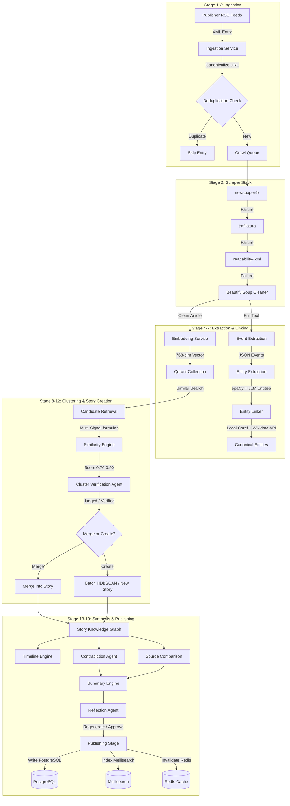
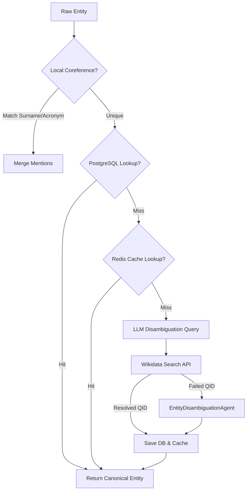
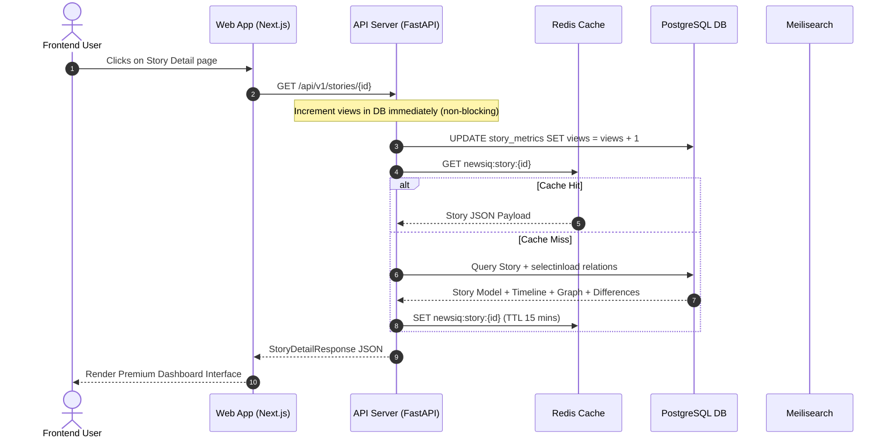
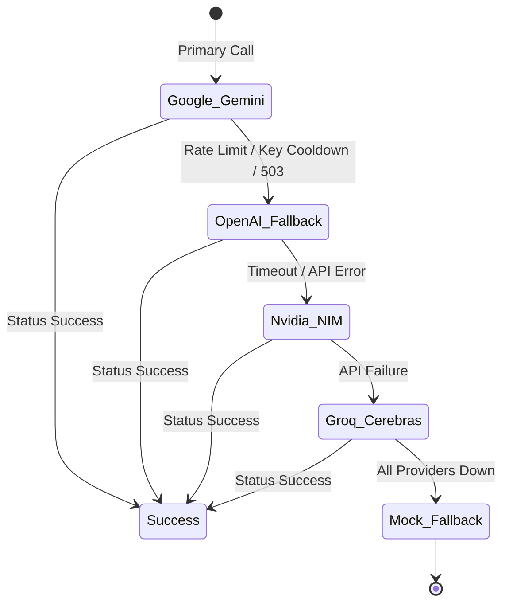

# NewsIQ Pipeline: End-to-End Data Flow

This document is the canonical source of truth for the NewsIQ data processing pipeline. It details the journey of news from RSS ingestion, crawling, vectorization, and multi-agent clustering to timeline generation, contradiction detection, knowledge-graph-grounded summarization, and frontend consumption.

---

## High-Level Pipeline Architecture



---

## Pipeline Execution Overview

The NewsIQ processing pipeline executes in two modes:
1. **Incremental Processing (Real-time)**: Triggered per article ingestion. Performs vector matching, fast candidate retrieval, multi-signal similarity gating, and verification before merging into existing stories.
2. **Batch Processing (Hourly)**: Run via Celery Beat scheduler. Pulls all unclustered articles, performs density-based `HDBSCAN` clustering, builds story-level knowledge graphs, synthesizes timelines/contradictions, and generates AI summaries.

---

## Detailed Pipeline Stages

---

### STAGE 1 — RSS INGESTION

#### Purpose
Polls publisher RSS feeds to identify new article entries, extract metadata, and queue raw URL processing.

#### Inputs
* **Source**: PostgreSQL `sources` table record.
* **RSS XML Payload**:
```xml
<item>
    <title>Bengaluru receives heavy rainfall; flights diverted</title>
    <link>https://www.thehindu.com/news/national/karnataka/bengaluru-rain-flights-diverted/article679234.ece?utm_source=rss&amp;utm_medium=feed</link>
    <description>Heavy downpour in Bengaluru caused disruptions at Kempegowda International Airport...</description>
    <pubDate>Mon, 23 Jun 2026 14:30:00 GMT</pubDate>
    <dc:creator>Staff Reporter</dc:creator>
    <media:content url="https://th-i.thgim.com/bengaluru-rain.jpg" medium="image" />
</item>
```

#### Processing
1. Fetches active feeds from the `sources` database.
2. Parses the RSS XML feed using `feedparser`.
3. Extract URL, Title, Published Date, Description, and Author.
4. Normalize the URL through the canonicalization engine.
5. Performs a fast lookup in PostgreSQL to determine if the article URL already exists.
6. Filters and buffers new entries, preparing them for concurrent crawling.

#### Outputs
Raw article metadata JSON:
```json
{
  "source_id": "4b68e980-df83-4903-883a-d698e6c7104b",
  "title": "Bengaluru receives heavy rainfall; flights diverted",
  "description": "Heavy downpour in Bengaluru caused disruptions at Kempegowda International Airport...",
  "raw_url": "https://www.thehindu.com/news/national/karnataka/bengaluru-rain-flights-diverted/article679234.ece?utm_source=rss&utm_medium=feed",
  "author": "Staff Reporter",
  "published_at": "2026-06-23T14:30:00",
  "image_url": "https://th-i.thgim.com/bengaluru-rain.jpg"
}
```

#### Side Effects
Checks database for URL existence. Pre-buffers items in Celery task memory.

#### Failure Modes
* **Connection Timeout / DNS Resolution Failure**: Handled via `httpx` timeout settings (15s). The source is skipped, the error is logged, and the execution proceeds to the next active source.
* **Feedparser XML Malformation**: Feedparser handles broken XML gracefully, returning parsed segments. If parsing completely fails, `IngestionService` catches the exception and returns `0` ingested articles.

#### Observability
* **Trace Context**: Inherits the `PipelineRun`'s `trace_id` and starts a `StageSpan` with stage `ingestion_rss`.
* **Logs**:
  * `Starting ingestion for source: The Hindu (https://www.thehindu.com/news/national/karnataka/rss)`
  * `Ingested 1 new articles for source 'The Hindu'`
* **Metrics**: Increments `newsiq_pipeline_stage_runs_total{stage="ingestion_rss", status="success"}`.

---

### STAGE 2 — ARTICLE EXTRACTION

#### Purpose
Downloads the publisher HTML page and extracts clean, structured main text content and metadata, stripping boilerplates, sidebars, and ads.

#### Inputs
Canonicalized URL and raw HTML content:
```html
<!DOCTYPE html>
<html>
<head><title>Bengaluru receives heavy rainfall; flights diverted - The Hindu</title></head>
<body>
    <header><nav>Home | News | Sports</nav></header>
    <main>
        <article>
            <h1>Bengaluru receives heavy rainfall; flights diverted</h1>
            <div class="author-info">By Staff Reporter</div>
            <div class="article-body">
                <p>Heavy downpour in Bengaluru on Monday afternoon caused severe waterlogging...</p>
                <p>An airport official confirmed that eight flights were diverted to Chennai...</p>
            </div>
        </article>
        <aside class="sidebar-ads">Ad space</aside>
    </main>
    <footer>Copyright 2026</footer>
</body>
</html>
```

#### Processing
Executes CPU-bound parser libraries in a thread pool (`asyncio.to_thread`) using a prioritized fallback stack:
1. **`newspaper4k`**: Primary parser (optimum title, text, metadata extraction).
2. **`trafilatura`**: Secondary parser (optimum high-precision structural extraction).
3. **`readability-lxml`**: Tertiary parser (optimum HTML element layout density analysis).
4. **Custom `BeautifulSoup` Cleaner**: Quaternary fallback (manually strips script, style, iframe, nav, footer, header, form, noscript, and regex-matching class/ID patterns like `ads`, `social-share`, `sidebar`).

If any parser succeeds in extracting text $\ge 150$ characters, the extraction stops.

#### Outputs
```json
{
  "title": "Bengaluru receives heavy rainfall; flights diverted",
  "content": "Heavy downpour in Bengaluru on Monday afternoon caused severe waterlogging. An airport official confirmed that eight flights were diverted to Chennai.",
  "author": "Staff Reporter",
  "image_url": "https://th-i.thgim.com/bengaluru-rain.jpg",
  "published_at": "2026-06-23T14:30:00",
  "extractor": "newspaper4k"
}
```

#### Side Effects
* None on database (read-only execution).

#### Failure Modes
If all extractors fail or return $< 150$ characters, `crawler_service` returns `None`. The ingestion loop falls back to the RSS `summary` or `description` field as content, preventing silent failures.

#### Observability
* **Logs**:
  * `Successfully extracted article from https://www.thehindu.com/news/national/karnataka/bengaluru-rain-flights-diverted/article679234.ece using newspaper4k`
  * If failed: `All extractors failed to retrieve content from: https://www.thehindu.com/...`
* **Metrics**: Latency tracking on `newsiq_pipeline_stage_latency_seconds{stage="crawling"}`.

---

### STAGE 3 — DEDUPLICATION

#### Purpose
Normalizes URLs and verifies database unique constraints to prevent double-processing of identical articles.

#### Inputs
Raw RSS entry link:
```text
"https://www.thehindu.com/news/national/karnataka/bengaluru-rain-flights-diverted/article679234.ece?utm_source=rss&utm_medium=feed&ref=banner"
```

#### Processing
1. **URL Canonicalization Engine (`canonicalize_url`)**:
   * Decodes percent-encoding via `urllib.parse.unquote`.
   * Lowercases scheme and host (`HTTPS://WWW.TheHindu.Com` $\rightarrow$ `https://www.thehindu.com`).
   * Removes tracking parameters (`utm_source`, `utm_medium`, `utm_campaign`, `utm_term`, `utm_content`, `ref`, `referrer`, `gclid`, `fbclid`).
   * Strips trailing slash from path (unless it is root `/`).
   * Sorts query parameters and reconstructs the URL without fragments.
2. **DB Unique Verification**:
   * Runs `select(Article).where(Article.url == canonicalized_url)` against PostgreSQL.

#### Outputs
```json
{
  "canonical_url": "https://www.thehindu.com/news/national/karnataka/bengaluru-rain-flights-diverted/article679234.ece",
  "duplicate": false
}
```

#### Side Effects
Reads from `articles` table in database.

#### Failure Modes
* **Canonicalization Exception**: Reverts to raw cleaned URL, preserving processing capabilities.
* **DB Connection Failure**: SQLAlchemy raises connection timeout, triggering RSS ingestion rollback.

#### Observability
* **Trace ID**: Linked to global `PipelineRun` trace.
* **Logs**: `No new articles found for 'The Hindu'` if all items are flagged as duplicate.

---

### STAGE 4 — EMBEDDINGS

#### Purpose
Generates high-dimensional vector representations of text for semantic clustering and retrieval.

#### Inputs
Plain text payload combining article metadata:
```text
"Bengaluru receives heavy rainfall; flights diverted. Heavy downpour in Bengaluru on Monday afternoon caused severe waterlogging. An airport official confirmed that eight flights were diverted to Chennai."
```

#### Processing
1. Whitespace is normalized and newlines stripped. Text is truncated to `8000` characters.
2. The `EmbeddingService` invokes the configured model adapter:
   * **Primary**: Google Gemini API via `Client.models.embed_content` using `gemini-embedding-001` or `text-embedding-004` (producing a 768-dim vector).
   * **Fallback**: OpenAI API `text-embedding-3-small` (1536-dim vector, truncated to the first 768 dimensions and unit-normalized).
   * **Mock Fallback (Dev Only)**: Deterministic, unit-normalized vector generated using a SHA-256 hash of the input text as seed.
3. The generated 768-dimensional float list is upserted into the Qdrant `articles` vector collection.

#### Outputs
```json
{
  "dimension": 768,
  "vector": [0.03451, -0.01284, 0.08742, "...", 0.00511],
  "provider": "google",
  "model": "gemini-embedding-001"
}
```

#### Side Effects
* **Qdrant Writes**: Upserts points in the `articles` collection, storing the article ID, vector, and payload (`published_at`, `source_id`).
* **PostgreSQL Updates**: Updates the article record `embedding_status` to `"completed"`.

#### Failure Modes
* **API Key Refusal**: Triggers fallback to OpenAI.
* **Qdrant Connection Timeout**: Retries the database connection 3 times before raising `QdrantFailure` error, caught by SRE failure recorder, which sets `embedding_status` to `"failed"`.

#### Observability
* **Trace ID**: `trace_id` propagated via context variable.
* **Prometheus Metrics**:
  * `newsiq_llm_gateway_calls_total{provider="google", model="gemini-embedding-001", stage="embedding", status="success"}`.
  * `newsiq_llm_gateway_cost_usd` tracked under the model pricing ($0.075 per million input tokens).

---

### STAGE 5 — EVENT EXTRACTION

#### Purpose
Extracts structural "Who did What to Whom, Where, and When" event representations from the raw text.

#### Inputs
Article title, body content, and publication date context:
```json
{
  "title": "Bengaluru receives heavy rainfall; flights diverted",
  "content": "Heavy downpour in Bengaluru on Monday afternoon caused severe waterlogging. An airport official confirmed that eight flights were diverted to Chennai. The India Meteorological Department (IMD) issued a red alert...",
  "published_at": "2026-06-22T10:00:00Z"
}
```

#### Processing
1. Invokes the LLM Gateway (`gemini-2.5-flash-lite` primary) using structured output parsing (`response_format=ArticleEventResponse`).
2. **Event Date Normalization**: Relative dates (e.g. "yesterday", "Monday") are resolved to absolute ISO-8601 dates utilizing the publication date context.
3. **Fingerprint Computation**: Computes `sha256(canonical_type::sorted_actors::sorted_targets::location::date)` of primary event.

#### Prompt Structure
```text
You are a structured event and entity extraction engine for news articles.
Extract the PRIMARY EVENT described in the article AND all named entities.

CRITICAL RULES:
1. event_time is WHEN THE EVENT HAPPENED, NOT when the article was published.
   The article was published at: 2026-06-22T10:00:00Z. Do NOT use this as event_time.
   If the article says 'yesterday', 'last week', 'on Monday', compute the actual date.
   ...
event_type must be one of: ATTACK, DETENTION, ELECTION, PROTEST, AGREEMENT, WEATHER...
```

#### Outputs
```json
{
  "primary_event": {
    "event_type": "WEATHER",
    "actors": ["India Meteorological Department", "IMD"],
    "targets": ["Bengaluru"],
    "objects": ["rainfall", "flights"],
    "location": "Bengaluru, India",
    "event_time": "2026-06-22T14:30:00Z",
    "numbers": {"diverted_flights": 8},
    "confidence": 0.95
  },
  "secondary_events": [],
  "entities": [
    {"value": "IMD", "type": "ORG", "canonical_name": "India Meteorological Department"},
    {"value": "Bengaluru", "type": "CITY", "canonical_name": "Bengaluru"}
  ]
}
```

#### Side Effects
* **Database Writes**: Inserts rows into the `article_events` table with calculated `event_fingerprint`.

#### Failure Modes
* **API Rate Limit (HTTP 429)**: The LLM gateway catches `429`, marks the active key for cooldown, and falls back to Groq / Cerebras or OpenAI models.
* **Malformed JSON Schema**: Exception is raised, caught by SRE failure center, which records the raw response and traceback in the `PipelineFailureModel` table.

#### Observability
* **Trace Context**: Propagates `trace_id`, `run_id`, and `article_id` context.
* **Metrics**: Latency and token usage tracking.

---

### STAGE 6 — ENTITY EXTRACTION

#### Purpose
Identifies and classifies named entities in article text into 25+ specific categories.

#### Inputs
Raw full text corpus of the article.

#### Processing
Uses a hybrid two-pass system:
1. **Pass 1 (LLM Extraction)**: Queries `gemini-2.5-flash-lite` with a prompt listing all 25+ entity types (e.g. `PERSON`, `ORG`, `COMPANY`, `COUNTRY`, `CITY`, `STATE`, `POLITICAL_PARTY`, `GOVERNMENT_BODY`, `AGREEMENT`, `WEAPON`).
2. **Pass 2 (Rule-Based Post-Processing & spaCy fallback)**: If the LLM call fails, the pipeline triggers a synchronous spaCy fallback (`en_core_web_lg`).
   * Reclassifies entities using pre-defined regex rules:
     * `MoU` or `treaty` $\rightarrow$ `AGREEMENT`
     * Known list of Indian/US states $\rightarrow$ `STATE`
     * Keywords containing "university" or "iit" $\rightarrow$ `ORG`
     * Keywords containing "party" or "congress" $\rightarrow$ `POLITICAL_PARTY`

#### Outputs
```json
{
  "entities": [
    {
      "value": "Kempegowda International Airport",
      "type": "PLACE",
      "canonical_name": "Kempegowda International Airport",
      "confidence": 0.92
    },
    {
      "value": "IMD",
      "type": "ORG",
      "canonical_name": "India Meteorological Department",
      "confidence": 0.95
    }
  ]
}
```

#### Side Effects
* **Database Writes**: Inserts entity mentions into the `article_entities` table.

#### Failure Modes
* **spaCy Model Not Found**: Falls back to regex-based capitalized word sequence matcher (`_extract_with_rules`).

#### Observability
* **Langfuse**: Starts a child span nested under the article analysis step.
* **Logs**: `NERServiceV2: Loaded spaCy model 'en_core_web_lg'` on startup.

---

### STAGE 7 — ENTITY LINKING

#### Purpose
Links raw entity text mentions to globally unique Wikidata IDs and resolves coreferences.

#### Inputs
Raw entities list:
```json
[
  {"value": "Trump", "type": "PERSON"},
  {"value": "President Donald Trump", "type": "PERSON"}
]
```

#### Processing


#### Outputs
```json
{
  "canonical_name": "Donald Trump",
  "wikidata_id": "Q22686",
  "entity_type": "PERSON",
  "description": "45th President of the United States"
}
```

#### Side Effects
* Writes to PostgreSQL `canonical_entities` table.
* Writes to Redis cache: Key `newsiq:entity_link:{slug}` with 7-day TTL.

#### Failure Modes
* **Wikidata API Offline**: Caught by Tenacity retry policy (3 attempts, exponential backoff). If it completely fails, `EntityDisambiguationAgent` runs.
* **Unique Key Conflict**: Handled using PostgreSQL nested transaction savepoints (`session.begin_nested()`).

#### Observability
* **Prometheus**: Tracks key cooldowns.

---

### STAGE 8 — KNOWLEDGE GRAPH

#### Purpose
Constructs a structured, semantic relationship network connecting articles, entities, sources, and events in the story.

#### Inputs
List of clustered articles, entities, events, and sources.

#### Processing
Computes an in-memory directed graph:
* **Nodes**:
  * `source_{id}` (Website URL, country code)
  * `article_{id}` (Title, URL, published time)
  * `event_{id}` (Event type, location, date, numbers, confidence)
  * `entity_{id}` (Wikidata QID, entity type, description)
* **Edges**:
  * `reported_by` (Article $\rightarrow$ Source)
  * `describes_event` (Article $\rightarrow$ Event)
  * `participated_in` (Entity $\rightarrow$ Event) [Role: `actor` / `target`]
  * `located_at` (Event $\rightarrow$ Entity)

#### Outputs
Story Knowledge Graph JSON payload:
```json
{
  "nodes": [
    {
      "id": "source_4b68e",
      "label": "The Hindu",
      "type": "source",
      "properties": {"country_code": "IN"}
    },
    {
      "id": "event_ef12b",
      "label": "WEATHER",
      "type": "event",
      "properties": {"event_type": "WEATHER", "location_raw": "Bengaluru"}
    },
    {
      "id": "entity_q1185",
      "label": "Karnataka",
      "type": "entity",
      "properties": {"entity_type": "STATE", "wikidata_id": "Q1185"}
    }
  ],
  "edges": [
    {
      "source": "event_ef12b",
      "target": "entity_q1185",
      "type": "located_at"
    }
  ]
}
```

#### Side Effects
Saves the dictionary structure to the `stories.knowledge_graph` JSONB column in PostgreSQL.

#### Failure Modes
* **Missing Node References**: Handled by validating node existence before adding edges, avoiding dangling edges.

#### Observability
* **Metadata**: Emits nodes and edges count in `StageSpan` metadata.

---

### STAGE 9 — CANDIDATE RETRIEVAL

#### Purpose
Retrieves candidate stories from Qdrant that match the incoming article's embedding vector.

#### Inputs
* Article embedding vector: `[0.03451, -0.01284, ...]`.
* Score threshold: `0.80`.
* Limit: `3`.

#### Processing
1. Queries Qdrant collection using `query_points`.
2. Loops through results to map similar article IDs to active database `story_id` records in PostgreSQL.

#### Outputs
List of Candidate Stories:
```json
[
  {
    "story_id": "c138d8f0-ea04-4b48-9c59-d890bf73b1ff",
    "score": 0.8742,
    "headline": "Flights Diverted Due to Bengaluru Storms"
  }
]
```

#### Observability
* **Logs**: Query execution logging.

---

### STAGE 10 — SIMILARITY ENGINE

#### Purpose
Calculates detailed multi-signal event similarity between a candidate story and a new article.

#### Inputs
* `ArticleEvent` values (new article).
* `ArticleEvent` values of existing story articles.
* Entity lists of both.

#### Processing
1. **Event Feature Similarity (`EventSim`)**:
   * **Event Type (15%)**: $1.0$ if exact canonical match, $0.5$ if parent taxonomy matches, $0.0$ otherwise.
   * **Actors (25%)**: Jaccard intersection over union (IoU) of actor lists.
   * **Targets (20%)**: Jaccard IoU of target lists.
   * **Location (20%)**: $1.0$ if exact string match, $0.8$ if substring match, $0.0$ otherwise.
   * **Time (10%)**: $1.0$ if diff $\le 1$ day, $0.5$ if $\le 3$ days, $0.2$ if $\le 7$ days, $0.0$ otherwise.
2. **Entity Overlap Similarity (10%)**:
   * Jaccard similarity of mapped entity IDs:
     $$\text{EntityOverlap} = \frac{|Entities_{new} \cap Entities_{existing}|}{|Entities_{new} \cup Entities_{existing}|}$$

$$\text{CombinedScore} = \text{EventSim} + (0.10 \times \text{EntityOverlap})$$

#### Outputs
```json
{
  "similarity_score": 0.8354
}
```

---

### STAGE 11 — CLUSTER VERIFICATION AGENT

#### Purpose
An agentic validation gate that evaluates whether two articles represent the exact same occurrence, preventing false merges.

#### Inputs
Agno Agent input structure:
```json
{
  "article_a_title": "Bengaluru Diverts Flights as Storm Hits City",
  "article_a_event": {"type": "WEATHER", "actors": ["IMD"], "location": "Bengaluru", "time": "2026-06-22"},
  "article_b_title": "Flight Operations Disrupted at Bengaluru Airport After Heavy Rain",
  "article_b_event": {"type": "WEATHER", "actors": [], "location": "Bengaluru", "time": "2026-06-22"},
  "similarity_score": 0.8354,
  "kg_nodes": [{"id": "entity_q1185", "label": "Karnataka", "type": "entity"}]
}
```

#### Processing
* **Thresholds**:
  * **$\ge 0.90$**: Auto-merge.
  * **$[0.70, 0.90)$**: Verification Agent Gate.
  * **$< 0.70$**: Reject.
* **Verification Agent Gate**:
  1. Invokes the **Cluster Verification Agent** (Gemini-based) and a parallel **OpenAI Verification Agent** (GPT-4o-mini).
  2. If both agents agree on `same_event`, return the boolean decision.
  3. If they disagree, invoke the **Judge Agent** to arbitrate and make a final ruling.

#### Outputs
```json
{
  "same_event": true,
  "confidence": 0.95,
  "explanation": "Both articles describe the disruption of flight operations at Kempegowda Airport due to rain on June 22. Temporal and spatial variables overlap."
}
```

#### Failure Modes
Dual-agent failure defaults to Gemini-only. Complete LLM gateway failure defaults to the threshold evaluation ($score \ge 0.80$).

---

### STAGE 12 — STORY CREATION

#### Purpose
Initializes a new `Story` and story sub-tables when a new event cluster is detected.

#### Inputs
List of articles clustered together.

#### Side Effects
* Inserts a record into PostgreSQL `stories` table.
* Creates a `StoryMetric` row (initialized to 0 views/bookmarks).
* Inserts lookup records in the `story_articles` join table.

#### Observability
* **Logs**: `Creating story for cluster with 3 articles.`

---

### STAGE 13 — TIMELINE ENGINE

#### Purpose
Generates a chronological, time-ordered sequence of events representing the story's development.

#### Inputs
List of extracted article events.

#### Processing
1. Extracts `event_time`, normalizing to UTC.
2. Formats a descriptive text representation using actors, targets, location, and data metrics.
3. Sorts all entries chronologically.

#### Outputs
Saved `StoryTimelineEvent` list:
```json
[
  {
    "event_time": "2026-06-22T14:30:00Z",
    "event_time_raw": "2026-06-22 14:30:00 UTC",
    "description": "Weather reported by The Hindu (Actors: IMD; Location: Bengaluru; Data: diverted_flights: 8)."
  }
]
```

---

### STAGE 14 — SOURCE COMPARISON

#### Purpose
Compares publisher coverage to determine focus areas, omissions, and unique reported information.

#### Inputs
Story articles, events, and detected contradictions.

#### Processing
1. **Single-Source Exclusion**: Bypassed entirely if there are fewer than 2 unique publishers. Any pre-existing coverage or difference records are deleted from the database.
2. **Local Comparison**: Compares actor, target, location, and numbers sets of one publisher against all others to compute unique/omitted facts.
3. **LLM Synthesis**: Invokes LLM (`gemini-2.5-flash-lite`) to clean and compile the structural comparison.
4. **Deterministic Fallback**: If the LLM/Mock Provider fails or is disabled, focus area strings are generated dynamically from parsed event types (e.g. "Focused on legal, policy details.") instead of generic placeholder text, and raw heuristic diffs are formatted into structured lists.

#### Outputs
Saved `StorySourceCoverage` and `StoryDifference` records:
```json
{
  "source_name": "The Hindu",
  "focus_area": "Focuses on flight diversions and local municipal waterlogging.",
  "unique_information": "Reported that eight flights were diverted specifically to Chennai.",
  "missing_information": "Omitted wind speed details reported by Bloomberg.",
  "contradictions": ""
}
```

#### Side Effects
Saves to `story_source_coverages` and `story_differences` database tables.

---

### STAGE 15 — CONTRADICTION AGENT

#### Purpose
Detects opposing factual statements (e.g. casualty counts, timelines) between publishers.

#### Inputs
Pairwise events within a story cluster.

#### Processing
1. **Single-Source Exclusion**: Bypassed entirely for stories with fewer than 2 unique publishers/sources. Any existing contradiction records are deleted from the database.
2. **Pairwise Heuristics**: Runs local heuristics to check for disjoint actors/targets, different locations, temporal shifts $>1$ day, or numerical value deviations $>10\%$.
3. **LLM Verification**: Invokes the **Contradiction Agent** (or LLM Gateway) to validate candidate conflicts. In mock or fallback scenarios, contradiction checking safely returns `is_contradiction = False` to prevent fake contradiction alerts in the UI.

#### Outputs
Saved `StoryContradiction` entries:
```json
{
  "fact_type": "number",
  "description": "The Hindu reports 8 flights diverted, whereas Reuters reports 12 flights diverted.",
  "confidence": 0.90,
  "source_attribution": {
    "source_a_id": "8 diverted",
    "source_b_id": "12 diverted"
  }
}
```

---

### STAGE 16 — DIFFERENCE ENGINE

#### Purpose
Persists structured publisher coverage difference files into the database.

#### Outputs
Stores differences in `StoryDifference` SQL records linked directly to the `stories` table.

---

### STAGE 17 — SUMMARY ENGINE

#### Purpose
Generates objective, neutral story headlines and summaries grounded in the story's Knowledge Graph, Timeline, and Differences.

#### Inputs
JSON payload of the generated Knowledge Graph, Timeline, Source Comparisons, and Contradictions.

#### Processing
1. **Knowledge Grounding**: Grounded entirely in the compiled Knowledge Graph, chronological timeline, source comparisons, and contradictions instead of raw unverified article texts.
2. **LLM Synthesis**: Translates the grounded JSON structured fields into objective headlines, one-sentence, short, and detailed summaries, and a category slug.
3. **Mock Provider**: In mock or local environments, the mock provider parses the actual titles and content from the prompt payload to construct a clean, realistic headline and summaries without prefixes or dummy templates (e.g. avoiding hardcoded labels like `"Factual Synthesis"`).
4. **Failure Fallback**: If all LLM gateway models fail, the engine falls back to using the title and description/leading text of the first/primary article in the cluster.

#### Outputs
Story Summary Object:
```json
{
  "headline": "Severe Storms Disrupt Flight Operations in Bengaluru",
  "one_line_summary": "Heavy rainfall in Bengaluru caused severe waterlogging and led to multiple flight diversions.",
  "short_summary": "A severe downpour struck Bengaluru on Monday afternoon, bringing flight operations to a halt...",
  "detailed_summary": "On June 22, 2026, heavy storms disrupted Kempegowda International Airport...",
  "key_facts": [
    "India Meteorological Department (IMD) issued a red alert for Bengaluru.",
    "A minimum of 8 flights were diverted to Chennai due to low visibility.",
    "Local reports highlight severe waterlogging across municipal divisions."
  ],
  "category": "weather"
}
```

---

### STAGE 18 — REFLECTION AGENT

#### Purpose
Double-checks generated summaries against ground-truth timelines and KGs to identify hallucinations or missing facts.

#### Inputs
Generated summaries, chronological timeline, KG nodes, and source comparisons.

#### Processing
1. Calls **Reflection Agent** to check if the summary invented facts or contradicted the graph.
2. If issues are found, triggers a single regeneration pass of the Summary Engine.

#### Outputs
`ReflectionSchema` decision:
```json
{
  "has_hallucinations": false,
  "invented_facts": [],
  "omitted_critical_facts": [],
  "contradicts_graph": false,
  "explanation": "Summary aligns with the knowledge graph."
}
```

---

### STAGE 19 — PUBLISHING

#### Purpose
Publishes the story, indexing it for search, clearing caches, and notifying subscribers.

#### Side Effects
* **Meilisearch Indexing**: Sends story summary documents to the search cluster.
* **Redis Invalidation**: Clears cached story keys (`newsiq:story:{id}`).
* **SSE Notification**: Broadcasts a JSON message to Redis channel `newsiq-pipeline-events`.

---

### STAGE 20 — USER REQUEST FLOW



---

## Observability Dashboard

NewsIQ contains a dedicated observability suite accessible at `/admin/failures` (Failure Center), offering Sentra-like diagnostics:

### 1. Unified SRE Tracing
Every execution traces context via `trace_id` and `run_id`. All child logs automatically include:
`{"run_id": "...", "trace_id": "...", "span_id": "...", "stage": "summary_generation"}`

### 2. Failure Center Schema (`PipelineFailureModel`)
Failed stages trigger the creation of a `pipeline_failures` record:
* **id**: UUID
* **trace_id**: UUID
* **stage**: String (`clustering_batch`, `event_extraction`)
* **error_category**: `system_error`, `llm_error`, `data_error`, `agent_error`
* **error_code**: String (e.g. `RATE_LIMIT_EXCEEDED`, `RESOURCE_EXHAUSTED`, `DB_FAILURE`)
* **input_payload**: JSONB (captures inputs for replays)
* **exception**: String (Error message)
* **stack_trace**: Text (Full Python traceback)
* **resolved**: Boolean

### 3. Replay Capability
SREs can inspect failures, modify prompt templates, override models/providers, and trigger immediately via the Replay service.

---

## Agent Registry & Specifications

NewsIQ utilizes a registry of Agno Agents running on the LLM Gateway:

| Agent Name | Primary Model | Purpose | Fallback Chain | Cost (Input/Output) |
| :--- | :--- | :--- | :--- | :--- |
| **Cluster Verification** | `gemini-2.5-flash-lite` | Validates event overlaps | `gpt-4o-mini` $\rightarrow$ Thresh | $0.075 / $0.30 per M |
| **Contradiction** | `gemini-2.5-flash-lite` | Verifies conflicting claims | LLM Gateway $\rightarrow$ Text Match | $0.075 / $0.30 per M |
| **Entity Disambiguation** | `gemini-2.5-flash-lite` | Standardizes entity QIDs | Wikidata API $\rightarrow$ Raw Text | $0.075 / $0.30 per M |
| **Judge** | `gemini-2.5-flash-lite` | Resolves agent disagreements | Primary model default | $0.075 / $0.30 per M |
| **Reflection** | `gemini-2.5-flash-lite` | Prevents summary hallucinations | Summary bypass | $0.075 / $0.30 per M |

---

## Gateway Provider Fallback Pool

The central **LLM Gateway** rotates keys, monitors health, and manages automatic failovers:


