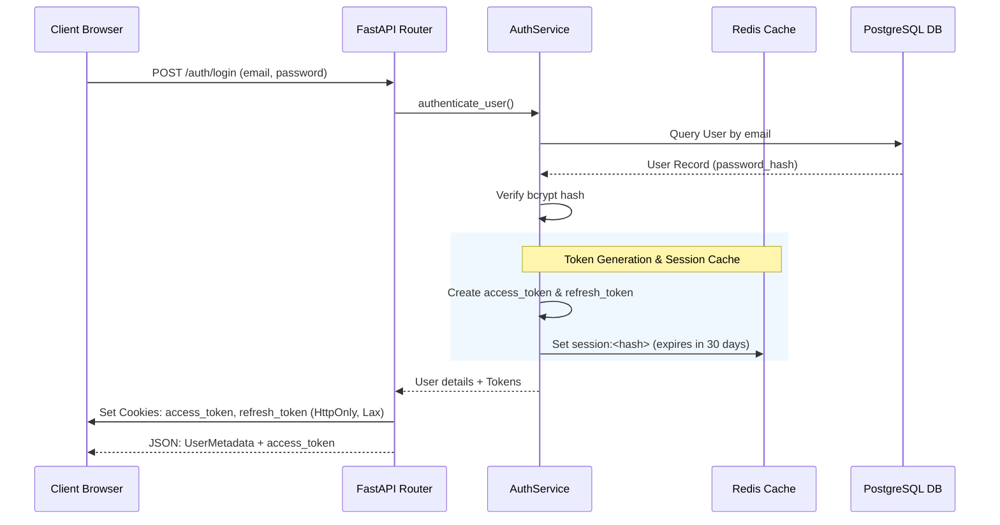
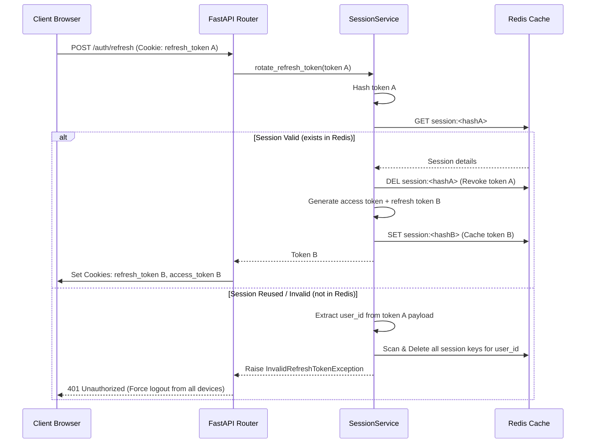
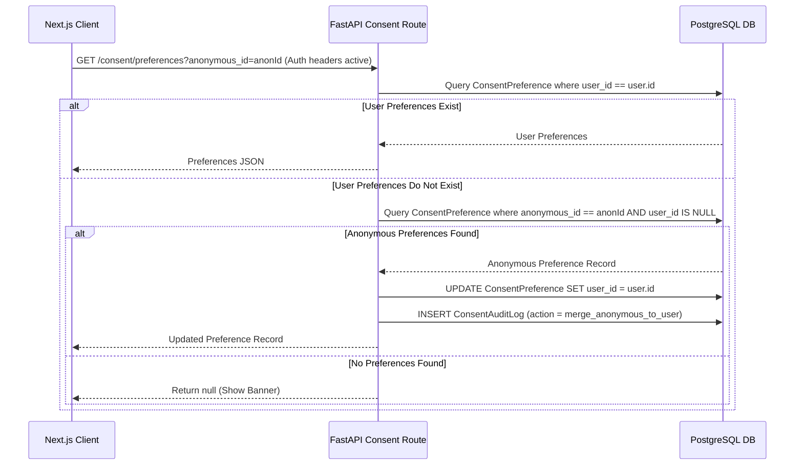

# System Event Flows

This document details the sequence of transactions and event messages exchanged during key operations: authentication, token rotation, and consent synchronization.

---

## 1. Authentication & Token Issuance Flow

When a user submits credentials to `/auth/login`:
1. `AuthService` validates the password against PostgreSQL using `bcrypt`.
2. Upon success, a time-ordered session UUID is generated.
3. An access token and a rotating refresh token are created.
4. The session is cached in Redis (with token hashes) for quick authentication checks.
5. The refresh and access tokens are returned as secure, HTTP-only cookies.

---

## 2. Refresh Token Rotation Flow

To mitigate the risk of token theft, refresh tokens are rotated during each refresh:
1. Client requests a token refresh at `/auth/refresh` (cookie containing `refresh_token` sent automatically).
2. Backend decodes the token, hashes it, and queries the database session cache.
3. If valid, the old session is deleted, a new token pair is generated, cached in Redis, and returned as cookies.
4. **Replay Detection**: If a reused refresh token is presented (not found in Redis but has a valid structure), the backend invalidates all active sessions for that user ID.

---

## 3. Consent Merging Flow

When an anonymous user signs in:
1. The frontend client triggers a request to fetch consent preferences, passing `anonymous_id`.
2. The backend merges the anonymous preference record directly to the new `user_id`.

