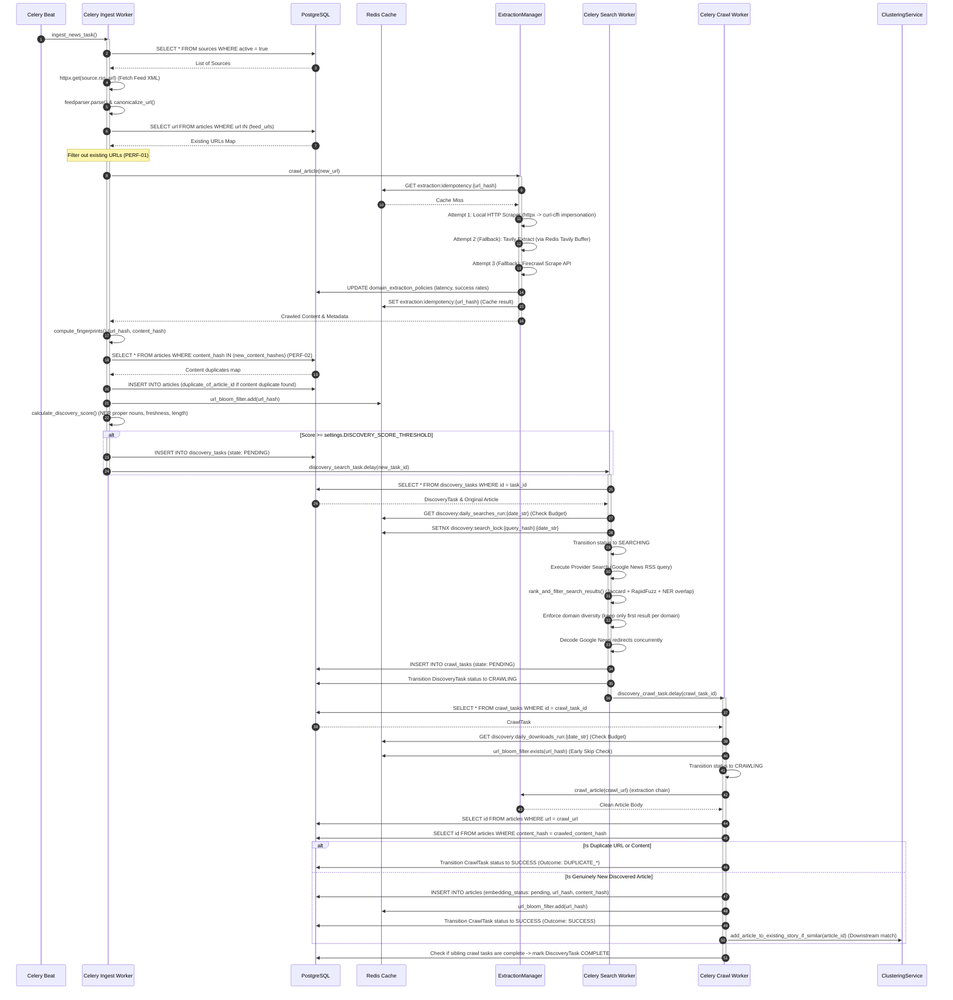
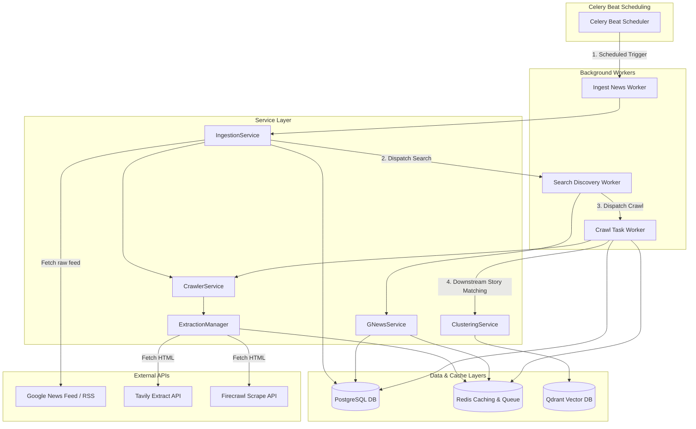

# NewsIQ Architecture Audit — Ingestion & Discovery Data Flow

This document provides a comprehensive technical audit of the **Ingestion & Discovery** pipeline of the NewsIQ platform. It outlines the end-to-end execution paths, database transactions, caching strategies, queue distribution, decision boundaries, and file relationships.

---

## 1. System Architecture & Diagrams

### 1.1 End-to-End Sequence Diagram

The sequence diagram below displays the lifecycle of an article starting from RSS polling, through crawl extraction, priority scoring, DiscoveryTask creation, Google News RSS discovery search, CrawlTask registration, content crawling, and downstream matching.



---

### 1.2 Component & System Context Diagram

The Component Diagram shows dependencies, internal services, caching layers, and external APIs.



---

### 1.3 Storage Architecture Map

NewsIQ distributes state across three main boundaries: relational storage (Postgres), cache & locking (Redis), and vector search (Qdrant).

```
 ┌────────────────────────────────────────────────────────────────────────────┐
 │                                PostgreSQL                                  │
 │                                                                            │
 │  ┌─────────────────┐    ┌─────────────────┐    ┌─────────────────┐         │
 │  │    sources      │    │    articles     │    │ discovery_tasks │         │
 │  └────────┬────────┘    └────────┬────────┘    └────────┬────────┘         │
 │           │ 1                      │ 1                  │ 1                │
 │           │                        │                    │                  │
 │           │ *                      │ *                  │ *                │
 │  ┌────────▼────────┐    ┌────────▼────────┐    ┌────────▼────────┐         │
 │  │    articles     │    │ discovery_tasks │    │   crawl_tasks   │         │
 │  └─────────────────┘    └─────────────────┘    └─────────────────┘         │
 └─────────────────────────────────────┬──────────────────────────────────────┘
                                       │
                        Checks Bloom   │ Dispatches Crawl Tasks
                        Filter & ID    │
                                       ▼
 ┌────────────────────────────────────────────────────────────────────────────┐
 │                                  Redis                                     │
 │                                                                            │
 │  [url_bloom_filter]          [Daily Search/DL Budget]     [Locks]          │
 │  Checks url_hash exists      Limits API expenditures      Prevents double  │
 │  before calling scraper      via redis INCR counters      searches/runs    │
 └─────────────────────────────────────┬──────────────────────────────────────┘
                                       │
                                       │ When CrawlTask is SUCCESS and Genuinely New
                                       ▼
 ┌────────────────────────────────────────────────────────────────────────────┐
 │                                  Qdrant                                    │
 │                                                                            │
 │  [articles Collection]                                                     │
 │  Stores article embeddings (vector) + payload metadata (title, url, source)│
 └────────────────────────────────────────────────────────────────────────────┘
```

---

## 2. Component & Process Breakdown

### 2.1 RSS Ingestion
- **Purpose**: Polling and crawling articles from registered RSS feeds, checking for exact content duplication, and filtering high-priority articles to dispatch Google search topic discovery.
- **Entry Point**: [tasks.py: ingest_news_task()](file:///c:/Users/zakau/NewsIQ/apps/api/app/workers/tasks.py#L161-L217)
- **Primary Service**: [ingestion_service.py: IngestionService](file:///c:/Users/zakau/NewsIQ/apps/api/app/services/ingestion_service.py#L32-L609)
- **Celery Workflow**: Initiated periodically by Celery Beat on `app.workers.tasks.ingest_news_task`. If new articles are persisted (RSS or discovery), dispatches `app.workers.tasks.process_pending_embeddings_task` via `.delay()`.

#### Step-by-Step Execution Flow
1. **Load Active Sources**: Queries PostgreSQL for all sources where `active = true`.
2. **Fetch Feed XML**: Downloads RSS XML payload from `source.rss_url` using `httpx.AsyncClient` (15-second timeout).
3. **Parse XML**: Normalizes feed using `feedparser.parse()`. Canonicalizes URLs using [utils.py: canonicalize_url()](file:///c:/Users/zakau/NewsIQ/apps/api/app/core/utils.py) (lowercases domains, strips tracking query parameters like `utm_*`).
4. **URL Batch Check**: Executes a batch lookup against `articles` table to identify which URLs are already stored, filtering them out to avoid unnecessary crawling (PERF-01).
5. **Concurrent Crawl**: Launches concurrent scrapers for new URLs using an `asyncio.Semaphore` bounded by `settings.CRAWLER_MAX_CONCURRENT_REQUESTS` (default: 5).
6. **Fetch HTML & Parse Content**: Coordinates extraction attempts via [extraction_manager.py](file:///c:/Users/zakau/NewsIQ/apps/api/app/services/extraction_manager.py):
   - Check idempotency in Redis: `extraction:idempotency:{url_hash}` (TTL: 10m).
   - **Attempt 1**: `LocalCrawlerProvider` (raw HTTP scrape via `httpx` falling back to Chrome/Safari impersonation on block/empty html). Parses content using `newspaper4k`, falling back to `trafilatura`, `readability-lxml`, and custom BeautifulSoup filters.
   - **Attempt 2**: `TavilyExtractProvider` (Redis-based batching). Pushes url to Redis queue list `extraction:tavily_buffer`, acquires distributed leader lock `extraction:tavily_leader` (5s), flushes batch (up to 5 URLs) to Tavily Extract API, stores responses in Redis keys `extraction:result:{exec_id}`, status key `extraction:tavily_status:{exec_id}`. Leaders/workers poll status and return data.
   - **Attempt 3**: `FirecrawlProvider` scraper API (final fallback).
   - Updates `DomainExtractionPolicy` table in the DB.
7. **Compute Fingerprints**: Generates `url_hash` and `content_hash` (SHA-256 of lowercase stripped clean text body) via [fingerprint.py](file:///c:/Users/zakau/NewsIQ/apps/api/app/core/fingerprint.py).
8. **Batch Duplicate Check**: Batch queries database for existing records matching the calculated `content_hash`es (PERF-02).
9. **Persist Article**: Inserts records to PostgreSQL `articles` table. If a duplicate is found by content hash, populates `duplicate_of_article_id`.
10. **Update Bloom Filter**: Pushes the new `url_hash` into Redis Bloom filter (`url_bloom_filter`).
11. **Prioritize Discovery**: Computes discovery priority score:
    $$\text{Score} = (0.35 \times \text{Freshness}) + (0.25 \times \text{Publisher Trust}) + (0.20 \times \text{Entity Count}) + (0.20 \times \text{Content Length})$$
    Excludes opinion pieces, horoscopes, obituaries, weather, and sports scores.
12. **Dispatch Discovery**: If Score $\ge 0.60$, normalizes the headline, generates `idempotency_key = google:{query_hash}:{date_bucket}`, inserts `DiscoveryTask` into the database in state `pending`, and dispatches `discovery_search_task.delay(task_id)`.

---

#### Concrete Data Examples (RSS Ingestion)

##### Stage Input: Active Source Row in DB
```json
{
  "id": "0190beec-1a10-75d1-923f-56d101a938c1",
  "name": "Reuters Business",
  "slug": "reuters-business",
  "website_url": "https://www.reuters.com",
  "rss_url": "https://feeds.reuters.com/reuters/businessNews",
  "active": true
}
```

##### Stage Intermediate: Fetched Entry Parsed (XML to dict)
```json
{
  "title": "BREAKING: Intel shares surge 10% after quarterly beat",
  "link": "https://www.reuters.com/technology/intel-shares-surge-after-quarterly-beat-2026-07-15/?utm_source=rss&utm_medium=feed",
  "summary": "<p>Intel Corp reported quarterly earnings beating Wall Street expectations on cloud division expansion...</p>",
  "published_parsed": [2026, 7, 15, 9, 30, 0, 2, 196, 0]
}
```

##### Stage Intermediate: Normalized & Canonicalized Data
```json
{
  "canonical_url": "https://reuters.com/technology/intel-shares-surge-after-quarterly-beat-2026-07-15",
  "url_hash": "b5ac89b25123d45efea68310c801e812d46e279493f0bdecf3a9032fe4213d2f",
  "normalized_headline": "intel shares surge 10 after quarterly beat"
}
```

##### Stage Intermediate: Scraped & Extracted Payload from `crawler_service`
```json
{
  "success": true,
  "title": "Intel shares surge 10% after quarterly beat",
  "content": "Intel Corp reported quarterly earnings beating Wall Street expectations on cloud division expansion. Stock soared 10% in extended trading on Wednesday after CEO announced restructuring plans...",
  "author": "Jane Doe",
  "image_url": "https://reuters.com/assets/intel_hq.jpg",
  "published_at": "2026-07-15T09:30:00",
  "extractor": "newspaper4k",
  "diagnostics": {
    "fetch_method": "httpx",
    "status_code": 200,
    "failure_reason": null,
    "duration_ms": 482.0,
    "attempts": 1,
    "bot_detected": false
  }
}
```

##### Stage Output: Persisted Database Row (`articles` table)
```json
{
  "id": "0190beec-1b04-7a32-bc10-da9184518aa0",
  "source_id": "0190beec-1a10-75d1-923f-56d101a938c1",
  "title": "Intel shares surge 10% after quarterly beat",
  "description": "Intel Corp reported quarterly earnings beating Wall Street expectations on cloud division expansion...",
  "content": "Intel Corp reported quarterly earnings beating Wall Street expectations on cloud division expansion. Stock soared 10% in extended trading on Wednesday after CEO announced restructuring plans...",
  "url": "https://reuters.com/technology/intel-shares-surge-after-quarterly-beat-2026-07-15",
  "author": "Jane Doe",
  "language": "en",
  "published_at": "2026-07-15T09:30:00",
  "crawled_at": "2026-07-15T09:44:20",
  "embedding_status": "pending",
  "url_hash": "b5ac89b25123d45efea68310c801e812d46e279493f0bdecf3a9032fe4213d2f",
  "content_hash": "3f82cd9b9c65b12a83ef8bcda9132145bdecf83d291e0a2938fd83ef83bda912",
  "duplicate_of_article_id": null,
  "version": 1
}
```

##### Stage Output: Dispatched `DiscoveryTask` Row in DB
```json
{
  "id": "0190beec-1c88-75b2-bc1e-da9124a91bb3",
  "article_id": "0190beec-1b04-7a32-bc10-da9184518aa0",
  "query": "intel shares surge 10 after quarterly beat",
  "provider": "google",
  "priority": 90,
  "priority_reason": "Trusted Source",
  "status": "pending",
  "idempotency_key": "google:1ea34b...:2026-07-15",
  "created_at": "2026-07-15T09:44:21"
}
```

---

### 2.2 Discovery Search
- **Purpose**: Querying search providers (like Google News RSS) based on prioritized article headlines, scoring and ranking results to ensure similarity, and creating CrawlTasks for matching URLs while maintaining domain diversity.
- **Entry Point**: [tasks.py: discovery_search_task()](file:///c:/Users/zakau/NewsIQ/apps/api/app/workers/tasks.py#L934-L1168)
- **Primary Service**: [gnews_service.py: GNewsService](file:///c:/Users/zakau/NewsIQ/apps/api/app/services/gnews_service.py#L36-L906)
- **Celery Workflow**: Dispatched by `IngestionService._dispatch_discovery` to search queue. Runs on `app.workers.tasks.discovery_search_task` worker. Spawns downstream `app.workers.tasks.discovery_crawl_task` for each discovered candidate.

#### Step-by-Step Execution Flow
1. **Budget Check**: Validates that today's search counter in Redis (`discovery:daily_searches_run:{date_str}`) does not exceed `settings.DISCOVERY_DAILY_SEARCH_BUDGET`. If it does, expires the task.
2. **Advisory Lock Check**: Sets a Redis date-scoped search lock (`discovery:search_lock:{provider}:{query_hash}:{date_str}`) with NX. If lock is already held, expires task (prevents duplicate search queries).
3. **Execute Search**: Queries Google News via provider API wrapper.
4. **Rank Results**:
   - Computes Jaccard word similarity on titles (40% weight).
   - Computes `rapidfuzz.fuzz.token_set_ratio` similarity (40% weight).
   - Computes entity overlap from title + description (20% weight).
   - Adds Publisher Trust Weight multiplier (up to +1.0) and published date proximity boost (+10 score if within 12 hours).
5. **Domain Diversity Filtering**: Sorts candidates by score descending and keeps only the highest-scoring candidate per base domain (e.g. only one article from `bloomberg.com`, one from `nytimes.com`).
6. **Concurrent URL Resolution**: Concurrently resolves Google News redirect links (e.g., `news.google.com/rss/articles/...`) to direct publisher canonical URLs.
7. **Persist CrawlTasks**: Inserts `CrawlTask` records in the database with status `pending`, then updates the `DiscoveryTask` status to `crawling`.

---

#### Concrete Data Examples (Discovery Search)

##### Stage Input: Search Task Parameters
```json
{
  "discovery_task_id": "0190beec-1c88-75b2-bc1e-da9124a91bb3",
  "query": "intel shares surge 10 after quarterly beat"
}
```

##### Stage Intermediate: Raw Provider Search Results
```json
[
  {
    "title": "Intel stock jumps 10% after business turnaround beat",
    "url": "https://news.google.com/rss/articles/CBMiM2h0dHBzOi8vd3d3LmJsb29tYmVyZy5jb20vbmV3cy9pbnRlbC1zdG9ja2p1bXBz0gEA?oc=5",
    "published_at": "2026-07-15T09:40:00",
    "gnews_source_name": "Bloomberg"
  },
  {
    "title": "Intel Corp beats Wall Street expectations, stock soars",
    "url": "https://news.google.com/rss/articles/CBMiM2h0dHBzOi8vd3d3LmJsb29tYmVyZy5jb20vbmV3cy9pbnRlbC1iZWF0cy1zb2Fycz0gEA?oc=5",
    "published_at": "2026-07-15T09:42:00",
    "gnews_source_name": "Bloomberg"
  },
  {
    "title": "Tech stocks rally led by Intel earnings beat",
    "url": "https://news.google.com/rss/articles/CBMiM2h0dHBzOi8vd3d3LmNuYmMuY29tL21hcmtldHMvdGVjaC1yYWxseS1pbnRlbC1iZWF00gEA?oc=5",
    "published_at": "2026-07-15T10:00:00",
    "gnews_source_name": "CNBC"
  }
]
```

##### Stage Intermediate: Scored and Domain Filtered Results
- **Result 1 (Bloomberg)**: Score = 92.5 (Retained)
- **Result 2 (Bloomberg)**: Score = 89.0 (Discarded due to Bloomberg domain already seen)
- **Result 3 (CNBC)**: Score = 74.2 (Retained)

##### Stage Intermediate: Decoded Canonical URLs
- **Resolved URL 1**: `https://bloomberg.com/news/intel-stock-jumps`
- **Resolved URL 2**: `https://cnbc.com/markets/tech-rally-intel-beat`

##### Stage Output: Dispatched `CrawlTask` Row in DB
```json
{
  "id": "0190beec-1d90-7d12-92a1-da9024b11ac2",
  "discovery_task_id": "0190beec-1c88-75b2-bc1e-da9124a91bb3",
  "url": "https://bloomberg.com/news/intel-stock-jumps",
  "url_hash": "2f4b5c7772da34ac56a81e3a9d9b4bda89b25123d45efea68310c801e812d46e",
  "status": "pending",
  "task_version": 2,
  "created_at": "2026-07-15T09:44:25"
}
```

---

### 2.3 Crawl Queue
- **Purpose**: Execution of HTTP scrapes on individual discovered URLs, deduplicating them at the URL and content levels, saving new articles to PostgreSQL, and executing downstream similarity matches to stories.
- **Entry Point**: [tasks.py: discovery_crawl_task()](file:///c:/Users/zakau/NewsIQ/apps/api/app/workers/tasks.py#L1171-L1426)
- **Primary Service**: [crawler_service.py: CrawlerService](file:///c:/Users/zakau/NewsIQ/apps/api/app/services/crawler_service.py#L20-L222)
- **Celery Workflow**: Dispatched by `discovery_search_task`. Executes on `discovery_crawl_task` queue. Once finished, calls `_check_discovery_task_completion(...)` to evaluate if the parent `DiscoveryTask` should be marked `COMPLETE`.

#### Step-by-Step Execution Flow
1. **Download Budget Check**: Verifies that daily downloads do not exceed limits via `discovery:daily_downloads_run:{date_str}`.
2. **Bloom Filter Skip**: Checks if `url_hash` already exists in `url_bloom_filter` (Redis). If so, updates status to `SUCCESS` and outcome to `BLOOM_SKIP` (prevents double scraping).
3. **Execute Crawl & Extract**: Crawls url using `crawler_service.crawl_article(url)` (which routes through `extraction_manager`).
     - On failure: increments retry count, updates status to `retrying` and sets `next_retry_at` using exponential backoff (e.g. retry after $2^{\text{retry\_count}}$ minutes), or marks `FAILED`.
     - On success:
       - Check exact URL duplicate in DB. If exists, updates status to `SUCCESS` and outcome to `DUPLICATE_URL`.
       - Clean text, compute `content_hash`.
       - Check exact content duplicate in DB. If exists, updates status to `SUCCESS` and outcome to `DUPLICATE_CONTENT`.
4. **Resolve Source**: Matches domain against `sources` table, or auto-creates a new Source record with a nested transaction SAVEPOINT to avoid conflicts (race-condition protection).
5. **Persist Article**: Inserts new `Article` record with `embedding_status = "pending"` and updates `url_bloom_filter`.
6. **Downstream Matching**: Calls `clustering_service.add_article_to_existing_story_if_similar(...)` to immediately attempt matching the new article with emerging stories in PostgreSQL.
7. **Mark Parent Task Complete**: If all sibling `CrawlTask` records for the parent `DiscoveryTask` are marked `SUCCESS` or `FAILED`, transitions the parent `DiscoveryTask` status to `COMPLETE`.

---

#### Concrete Data Examples (Crawl Queue)

##### Stage Input: Crawl Task Execution
```json
{
  "crawl_task_id": "0190beec-1d90-7d12-92a1-da9024b11ac2",
  "url": "https://bloomberg.com/news/intel-stock-jumps",
  "url_hash": "2f4b5c7772da34ac56a81e3a9d9b4bda89b25123d45efea68310c801e812d46e"
}
```

##### Stage Intermediate: Extraction Result
```json
{
  "success": true,
  "title": "Intel stock jumps 10% after earnings turnaround beat expectations",
  "content": "Intel Corp shares spiked in late trading on Wednesday after posting better-than-expected cloud results. Turnover expanded by 12% in the second quarter...",
  "author": "John Smith",
  "image_url": "https://bloomberg.com/images/intel_graph.png",
  "published_at": "2026-07-15T09:40:00",
  "extractor": "newspaper4k"
}
```

##### Stage Intermediate: Calculated Fingerprints
```json
{
  "url_hash": "2f4b5c7772da34ac56a81e3a9d9b4bda89b25123d45efea68310c801e812d46e",
  "content_hash": "9c12df8ba3de1cda8b21efdc9a8ef312dcfab21de0eaef231da90e213da90e1f"
}
```

##### Stage Output: Relational DB Inserts (`articles` & `crawl_tasks` tables)
```sql
-- Insert Discovered Article
INSERT INTO articles (id, source_id, title, content, url, crawled_at, url_hash, content_hash, embedding_status) 
VALUES ('0190beec-1e20-7a09-913a-da9024a1b0cc', '0190beec-1a10-75d1-923f-56d101a938c1', 
        'Intel stock jumps 10% after earnings turnaround beat expectations', 
        'Intel Corp shares spiked...', 'https://bloomberg.com/news/intel-stock-jumps', 
        '2026-07-15T09:45:10', '2f4b5c777...', '9c12df8ba...', 'pending');

-- Update CrawlTask Status
UPDATE crawl_tasks 
SET status = 'success', outcome = 'SUCCESS', article_id = '0190beec-1e20-7a09-913a-da9024a1b0cc', completed_at = '2026-07-15T09:45:10' 
WHERE id = '0190beec-1d90-7d12-92a1-da9024b11ac2';
```

---

## 3. Database Operations

| Table | Operation | Trigger Point | Rationale |
| :--- | :--- | :--- | :--- |
| `sources` | `SELECT` | `ingest_news_task` | Retrieve active sources for RSS polling. |
| `sources` | `INSERT` | `GNewsService._resolve_source` | Create a new source dynamically during auto-discovery. Wrapped inside a nested transaction savepoint to isolate unique violations. |
| `articles` | `SELECT` | `IngestionService._batch_existing_articles` | Bulk check existing URLs to avoid crawling duplicate articles. |
| `articles` | `SELECT` | `IngestionService._persist_articles` | Bulk content hash query (`SELECT ... WHERE content_hash IN (...)`) to detect duplicate bodies. |
| `articles` | `INSERT` | `IngestionService._persist_articles` | Save crawled article. Fields like `url_hash`, `content_hash`, and `duplicate_of_article_id` are persisted. |
| `discovery_tasks` | `INSERT` | `IngestionService._dispatch_discovery` | Register search query task. Inserts `idempotency_key` with unique constraint to block duplicate queries. |
| `discovery_tasks` | `UPDATE` | `discovery_search_task` | Update task state (`searching`, `crawling`, `complete`, `search_failed`). |
| `crawl_tasks` | `INSERT` | `discovery_search_task` | Register crawled URLs found from search provider. |
| `crawl_tasks` | `UPDATE` | `discovery_crawl_task` | Update state (`crawling`, `success`, `failed`), set retry counts, log `last_error`. |
| `domain_extraction_policies` | `SELECT` / `INSERT` / `UPDATE` | `ExtractionManager._update_domain_policy` | Record metrics (success rates, latencies) per domain to evaluate future scraper efficiency. |

---

## 4. Cache & Redis Operations

Redis handles three critical functions in this pipeline: distributed locking, Bloom filters, and batch queues.

| Key Name | Type | Purpose | TTL | Lifecycle |
| :--- | :--- | :--- | :--- | :--- |
| `url_bloom_filter` | Redis Bloom | Tracks crawled and duplicate URLs to allow fast early-skip checks. | Permanent | Checked at start of `discovery_crawl_task`; updated on successful article persistence. |
| `gnews:lock:{category}:{country}` | String | Rate-limit guard to avoid hitting GNews endpoints too frequently. | 25 mins | Created when querying headlines; blocks subsequent fetches within TTL. |
| `discovery:daily_searches_run:{date_str}` | String | Daily budget counter for search queries. | 36 hours | Atomically incremented using Redis `incr` at the start of a discovery search. |
| `discovery:daily_downloads_run:{date_str}` | String | Daily budget counter for article crawled/downloaded. | 36 hours | Atomically incremented using Redis `incr` at the start of a crawl task. |
| `discovery:search_lock:{provider}:{query_hash}:{date_str}` | String | Distributed search lock to avoid querying the same headline search twice on a given day. | 10 mins | Set with `NX=True`. If set succeeds, worker proceeds; if fails, task is expired. |
| `extraction:idempotency:{url_hash}` | String | Caches raw scraped HTML / text outputs. | 10 mins | Set on successful crawl; queried at the start of crawler execution to return cached body. |
| `extraction:tavily_buffer` | List | Queue list holding pending URLs awaiting Tavily batch extraction. | Transient | URL pushed by worker; popped by the batch leader. |
| `extraction:tavily_leader` | String | Lock for Tavily batch coordinator leader election. | 5 secs | Set with `NX=True`. Winner handles batch flushing, losers wait. |
| `extraction:tavily_status:{exec_id}` | String | Status indicator (`pending`, `success`, `failed`) for batch jobs. | 10 mins | Created on enqueuing URL; deleted on result delivery. |
| `extraction:result:{exec_id}` | String | Holds batch extraction results for worker consumption. | 10 mins | Created by batch leader on API response; deleted by worker after consumption. |
| `pipeline_paused` | String | Global pause flag set on LLM Quota Exhaustion. | 1 hour | Automatically read at task start. Expiring clears the pause state. |

---

## 5. State Machine Lifecycles

### 5.1 DiscoveryTask State Machine
```
   ┌─────────┐
   │ PENDING │
   └────┬────┘
        │ Start Execution
        ▼
  ┌───────────┐         Search Fails & Retries < Max
  │ SEARCHING ├─────────────────────────────────────────┐
  └────┬──────┘                                         │
       │ Search Succeeds                                ▼
       │                                          ┌───────────┐
       ├─────────────────────────────────────────►│  PENDING  │ (next_retry_at set)
       │                                          └─────┬─────┘
       │ Search Fails & Max Retries Exceeded            │ Max Retries Reach
       ▼                                                ▼
┌───────────────┐                              ┌─────────────────┐
│ SEARCH_FAILED │                              │  SEARCH_FAILED  │
└───────────────┘                              └─────────────────┘
       │
       │ Result Found (URLs)
       ▼
  ┌───────────┐
  │ CRAWLING  ├──────────► [Triggers CrawlTasks]
  └────┬──────┘
       │ All Sibling CrawlTasks Complete (SUCCESS or FAILED)
       ▼
  ┌───────────┐
  │ COMPLETE  │
  └───────────┘
```

### 5.2 CrawlTask State Machine
```
      ┌─────────┐
      │ PENDING │
      └────┬────┘
           │ Early Bloom Filter Check Hit (BLOOM_SKIP)
           ├────────────────────────────────────────────┐
           │                                            │
           │ Cache Miss & Crawl Starts                  ▼
           ▼                                     ┌─────────────┐
     ┌──────────┐                                │   SUCCESS   │ (Outcome: BLOOM_SKIP)
     │ CRAWLING │                                └─────────────┘
     └────┬─────┘
          │
          │ Crawl Succeeds (HTTP 200)
          ├────────────────────────────────────────────┐
          │                                            │
          │                                            ▼
          │                                      ┌─────────────┐
          │                                      │   SUCCESS   │ (Outcome: SUCCESS)
          │                                      └─────────────┘
          │ Crawl Fails (HTTP error/timeout)
          ▼
     ┌──────────┐
     │ RETRYING ├───────► Schedule next_retry_at
     └────┬─────┘
          │ Max Retries Exceeded
          ▼
     ┌──────────┐
     │  FAILED  │
     └──────────┘
```

---

## 6. Sequence Timing & Boundaries

The following table summarizes the concurrency, synchronization method, execution timing, and transaction boundaries of each step in the pipeline.

| Step | Timing / Synchronicity | Concurrency Control | DB Transaction Boundary | Resilience & Failure Recovery |
| :--- | :--- | :--- | :--- | :--- |
| **RSS Polling** | Synchronous per source; feeds fetched sequentially. | Executed by single Celery Beat scheduled task. | Relational queries execute in individual source loops. | Exceptions caught per source; fails back to next source. |
| **Article Fetch & Scrape** | Asynchronous / Concurrent. | Bounded by `settings.CRAWLER_MAX_CONCURRENT_REQUESTS` semaphore. | None (HTTP fetch phase). | Retry fallback: Local -> Tavily -> Firecrawl. |
| **Fingerprint & Deduplication** | CPU bound / synchronous inside worker. | None. | Batch database check + single `session.commit()` at the end. | In case of integrity violation, transactions rollback. |
| **Discovery Score Evaluation** | Synchronous. | None. | None (Memory calculations). | Score defaults to low prioritization on errors. |
| **Discovery Search** | Asynchronous Celery Task. | Rate-limited by Redis budget + NX search lock query filters. | Status updates committed immediately. | Search failure schedules retry task with exponential backoff. |
| **Crawl Queue Processing** | Asynchronous Celery Task. | Checked against daily download limits via Redis. | Status updates committed on completion. | Failure schedules retry; records diagnostics to `DomainExtractionPolicy`. |

---

## 7. Storage Map: Data Lifecycle Tracking

Relational, cache, vector, and memory scopes are mapped below for a single article's lifecycle:

```
┌────────────────────────────────────────────────────────────────────────────────────────┐
│ 1. RSS XML Entry                                                                       │
│    Memory / Temporary parsed dict                                                      │
├────────────────────────────────────────────────────────────────────────────────────────┤
│ 2. Canonicalization                                                                    │
│    Transforms raw URL parameters into standard formats (Memory object)                 │
├────────────────────────────────────────────────────────────────────────────────────────┤
│ 3. Bloom Filter Query                                                                  │
│    Checks url_hash exists in Redis Bloom Filter. If hit, skips; if miss, proceeds      │
├────────────────────────────────────────────────────────────────────────────────────────┤
│ 4. Crawler Extraction                                                                  │
│    Tries local fetch, Tavily (using Redis Tavily Buffer), and Firecrawl.               │
├────────────────────────────────────────────────────────────────────────────────────────┤
│ 5. Fingerprinting                                                                      │
│    Calculates URL and Content hashes (Memory object)                                   │
├────────────────────────────────────────────────────────────────────────────────────────┤
│ 6. PostgreSQL Persistence                                                              │
│    Saves record to articles table. Sets duplicate_of_article_id if duplicate.          │
├────────────────────────────────────────────────────────────────────────────────────────┤
│ 7. Redis Bloom Filter Add                                                              │
│    Inserts url_hash to url_bloom_filter to prevent future scrapes                      │
├────────────────────────────────────────────────────────────────────────────────────────┤
│ 8. Discovery Score Check                                                               │
│    If prioritized, inserts DiscoveryTask in PostgreSQL and schedules search task       │
├────────────────────────────────────────────────────────────────────────────────────────┤
│ 9. Google News Search & Crawl Queue                                                    │
│    Dispatches CrawlTask to Celery. Crawled content is validated, parsed, and           │
│    saved to articles table. url_hash pushed to Redis url_bloom_filter                  │
├────────────────────────────────────────────────────────────────────────────────────────┤
│ 10. Vector Embedding Queue                                                             │
│     Triggers process_pending_embeddings_task, generates vector, and saves in Qdrant    │
└────────────────────────────────────────────────────────────────────────────────────────┘
```

---

## 8. Technical File Cross-Reference

- [tasks.py](file:///c:/Users/zakau/NewsIQ/apps/api/app/workers/tasks.py)
  - `ingest_news_task`: Scheduled worker job that triggers RSS source ingestion.
  - `discovery_search_task`: Task that runs Google News search based on query and creates CrawlTasks.
  - `discovery_crawl_task`: Crawls, deduplicates, and saves discovered articles.
  - `poll_discovery_retries_task`: Re-dispatches expired PENDING/RETRYING tasks.
  - `cleanup_discovery_tasks_task`: GC task to remove complete/failed/expired tasks.
  - `discovery_grouping_task`: Periodically groups READY discovery queue items into stories.
- [ingestion_service.py](file:///c:/Users/zakau/NewsIQ/apps/api/app/services/ingestion_service.py)
  - `IngestionService.ingest_rss_source`: Fetches and processes a single RSS feed.
  - `IngestionService.calculate_discovery_score`: Performs weighted quality heuristics.
  - `IngestionService._dispatch_discovery`: Creates `DiscoveryTask` and schedules search tasks.
  - `IngestionService.normalize_headline`: Normalizes titles for query standardization.
- [gnews_service.py](file:///c:/Users/zakau/NewsIQ/apps/api/app/services/gnews_service.py)
  - `GNewsService._resolve_source`: Finds or auto-creates source matching name/slug/domain.
  - `GNewsService.rank_and_filter_search_results`: Computes Jaccard/Fuzz score to rank candidates.
- [crawler_service.py](file:///c:/Users/zakau/NewsIQ/apps/api/app/services/crawler_service.py)
  - `CrawlerService.fetch_html`: Implements progressive local fetch strategy.
- [extraction_manager.py](file:///c:/Users/zakau/NewsIQ/apps/api/app/services/extraction_manager.py)
  - `ExtractionManager.crawl_article`: Orchestrates local crawler, Tavily Extract, and Firecrawl.
  - `ExtractionManager.extract_via_tavily_batch`: Coordinates Redis-based Tavily batch queues.
- [discovery_manager.py](file:///c:/Users/zakau/NewsIQ/apps/api/app/services/discovery_manager.py)
  - `DiscoveryManager.enqueue_article`: Pushes unclustered articles to the `DiscoveryQueue` table.
  - `DiscoveryManager.check_triggers_and_group`: Groups pending items to `READY` state.
  - `DiscoveryManager.promote_clusters`: Creates new Stories from READY clusters.
- [models.py](file:///c:/Users/zakau/NewsIQ/apps/api/app/models/models.py)
  - `Article`: Represents ingested/discovered articles.
  - `DiscoveryQueue`: Groups unclustered articles for clustering.
  - `DiscoveryTask`: Relational state of search discovery.
  - `CrawlTask`: Relational state of crawled URLs.
  - `DomainExtractionPolicy`: Performance metrics tracking per domain.

---

## 9. Architectural Review & Recommendations

### 9.1 Evaluation of Alignment
The codebase exhibits a robust implementation of the progressive crawl hierarchy and distributed batch coordination. However, a major architectural coupling exists between the **Search Discovery** phase and the **GNews Ingestion** service. 

Several utility methods and metrics updates are placed in [gnews_service.py](file:///c:/Users/zakau/NewsIQ/apps/api/app/services/gnews_service.py) (e.g. `_resolve_source`, `_incr_metric`, `rank_and_filter_search_results`) but are called directly during the general RSS ingestion and general CrawlTask lifecycle. This mixes responsibilities: the GNews ingestion module should only be one client of the discovery pipeline, rather than containing the utility methods used by the generic crawler tasks.

### 9.2 Technical Debt & Vulnerabilities
1. **Coupled Source Resolution**: The method `gnews_service._resolve_source` is imported and used by [tasks.py](file:///c:/Users/zakau/NewsIQ/apps/api/app/workers/tasks.py) inside `discovery_crawl_task` even if the crawled URL was discovered via standard RSS (not GNews API). This violates separation of concerns.
2. **Synchronous NER Proper-Noun Loop**: Inside `IngestionService.calculate_discovery_score`, calls to `ner_service_v2.extract_entities_sync` are made synchronously. If feed volumes surge, this synchronous CPU-heavy loop will block Celery event loops on workers.
3. **Transaction Rollbacks on Savepoints**: During `_resolve_source` execution, a nested transaction (`session.begin_nested()`) is created to handle concurrent source creation. Although robust, high concurrency might lead to frequent savepoint rollbacks, slowing PostgreSQL processing.

### 9.3 Recommended Optimizations
- **Decouple Source Resolution**: Relocate source resolution helpers from `GNewsService` to a separate standalone `SourceService`.
- **Asynchronous NER Calls**: Transition `extract_entities_sync` to an async version or run it within a thread pool (`asyncio.to_thread`) to prevent blocking the Celery worker process.
- **Cache Scraper Decisions**: Use Redis to cache domain failures (e.g., if a domain regularly blocks the local crawler, immediately skip attempt 1 and route to attempt 2/3 for 24 hours to reduce latency).

---

## 10. Proposed "Story-First" (Metadata-Only) Ingestion Architecture

### 10.1 Conceptual Overview
The proposed "Story-First" model refines ingestion by treating the incoming RSS feed strictly as **metadata**. Instead of immediately crawling the RSS article URL (which hits the same domain repeatedly and downloads content that might not qualify as a multi-source story), the pipeline delays all crawling until a story context is established.

### 10.2 Workflow Comparison

```
Current Pipeline:
[RSS Feed] ──► [Crawl Original Article] ──► [Persist] ──► [Discovery Check] ──► [Discovery Search] ──► [Crawl Rest of URLs]

Proposed "Story-First" Pipeline:
[RSS Feed] ──► [Evaluate Metadata Score] ──► [Discovery Search] ──► [Remove Duplicate Domains] ──► [Create StoryCandidate] ──► [Distributed Crawl (All URLs)] ──► [Persist & Cluster]
```

### 10.3 Execution Flow Sequence

1. **RSS Feed Fetch**: Downloads feed XML and parses entry metadata (Title, Link, Source, Published Date, Description).
2. **Metadata-Only Discovery Score**: Evaluates the article quality prior to any crawl operations, filtering out editorials or sports news based on the description and title.
3. **Google News Discovery Search**: Uses the normalized title to query Google News for coverage.
4. **Domain De-duplication**: Filters the search results to keep only the top scoring, unique domains. If the search results include the original domain (e.g. Reuters), duplicates of that domain are removed to distribute the requests.
5. **Create StoryCandidate**: Instantiates a temporary tracking object `StoryCandidate` containing the query, first-seen timestamp, and list of unique candidate URLs (including the original RSS URL).
6. **Distributed Crawl**: Crawls the collection of URLs concurrently. Because they belong to different domains, requests are naturally distributed, avoiding rate-limiting on any single domain.
7. **Batch Persistence**: Persists all successfully scraped articles in a single transactional batch.
8. **Story Clustering**: Immediately groups the set into a multi-source Story.

---

### 10.4 Concrete Data Examples (Story-First Ingestion)

#### Stage 1: Incoming RSS Entry (Metadata-Only)
```json
{
  "title": "US announces new semiconductor trade rules",
  "link": "https://www.reuters.com/business/us-announces-semiconductor-trade-rules-2026-07-15",
  "source": "Reuters",
  "published_at": "2026-07-15T10:00:00",
  "description": "The Biden administration unveiled updated guidelines restricting certain microchip exports to foreign markets."
}
```

#### Stage 2: Discovery Search Output
Google News RSS yields:
1. `https://news.google.com/articles/reuters-us-chip-rules-news` (Reuters)
2. `https://news.google.com/articles/bloomberg-export-restrictions` (Bloomberg)
3. `https://news.google.com/articles/reuters-semiconductors-us` (Reuters - Duplicate Domain)
4. `https://news.google.com/articles/bbc-chip-export-curbs` (BBC)
5. `https://news.google.com/articles/dw-us-restricts-china-chips` (DW)

#### Stage 3: Duplicate Domain Filter
- Bloomberg -> `bloomberg.com` (Retained)
- Reuters -> `reuters.com` (Retained)
- Reuters Duplicate -> `reuters.com` (Discarded)
- BBC -> `bbc.co.uk` (Retained)
- DW -> `dw.com` (Retained)

#### Stage 4: StoryCandidate Object Creation
```json
{
  "candidate_id": "0190beec-23d2-7fb2-bc32-da9184a22c1e",
  "headline_query": "us announces new semiconductor trade rules",
  "urls": [
    "https://www.reuters.com/business/us-announces-semiconductor-trade-rules-2026-07-15",
    "https://www.bloomberg.com/news/export-restrictions",
    "https://www.bbc.co.uk/news/chip-export-curbs",
    "https://www.dw.com/en/us-restricts-chips"
  ],
  "state": "DISCOVERED"
}
```

#### Stage 5: Crawl, Persist & Cluster
All four URLs are crawled concurrently. They are verified and persisted, then clustered directly into `Story` #`0190beec-24b8-7c01-ac19-bda914aa1c8f` containing the four articles.

