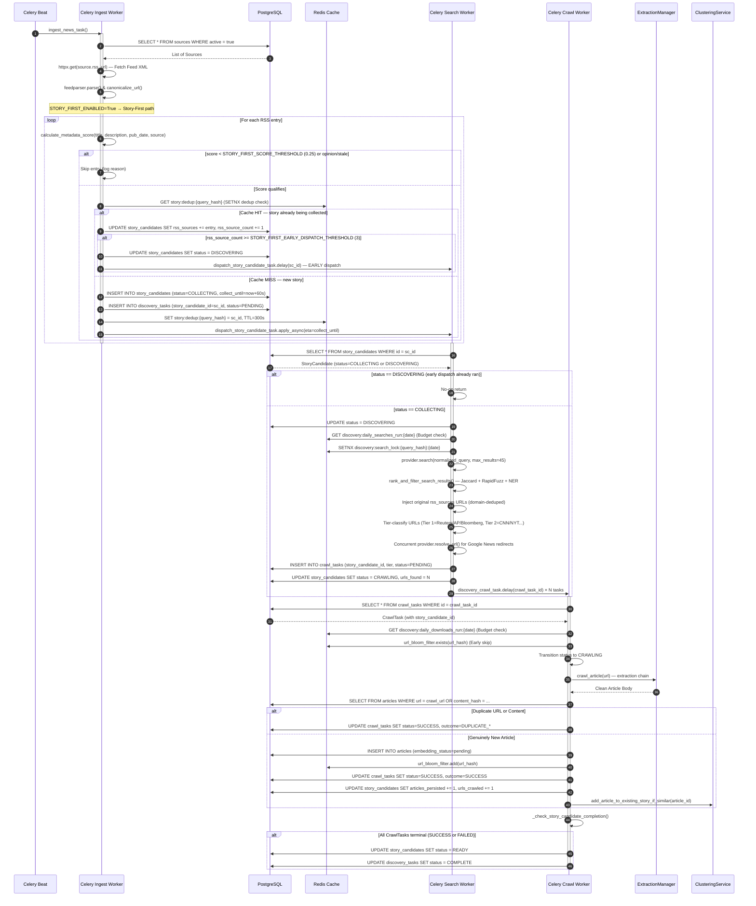
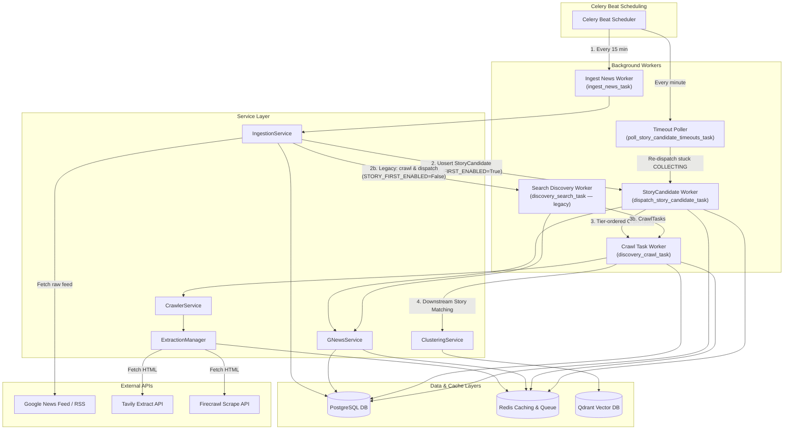

# NewsIQ Architecture Audit — Ingestion & Discovery Data Flow

This document provides a comprehensive technical audit of the **Ingestion & Discovery** pipeline of the NewsIQ platform. It outlines the end-to-end execution paths, database transactions, caching strategies, queue distribution, decision boundaries, and file relationships.

> [!IMPORTANT]
> **Status as of 2026-07-15**: The Story-First pipeline described in Section 10 has been **fully implemented** on branch `feature/story-first-ingestion` (commit `e26e878`). Sections 1–9 have been updated to reflect the current dual-path architecture. The legacy Article-First path remains active when `STORY_FIRST_ENABLED=False`.

---

## 1. System Architecture & Diagrams

### 1.1 End-to-End Sequence Diagram

The sequence diagram shows the **Story-First path** (active by default: `STORY_FIRST_ENABLED=True`). The legacy Article-First path is noted where it diverges.



---

### 1.2 Component & System Context Diagram

The Component Diagram shows dependencies, internal services, caching layers, and external APIs.



---

### 1.3 Storage Architecture Map

NewsIQ distributes state across three main boundaries: relational storage (Postgres), cache & locking (Redis), and vector search (Qdrant).

```
 ┌────────────────────────────────────────────────────────────────────────────┐
 │                                PostgreSQL                                  │
 │                                                                            │
 │  ┌─────────────────┐    ┌─────────────────┐    ┌──────────────────────┐   │
 │  │    sources      │    │    articles     │    │   story_candidates   │   │
 │  └────────┬────────┘    └────────┬────────┘    └──────────┬───────────┘   │
 │           │                      │                        │               │
 │           │                      │              ┌─────────▼────────┐      │
 │  ┌────────▼────────┐    ┌────────▼────────┐    │  discovery_tasks  │      │
 │  │    articles     │    │ discovery_tasks │    └─────────┬────────┘      │
 │  └─────────────────┘    └────────┬────────┘             │               │
 │                                  │              ┌────────▼────────┐      │
 │                                  └─────────────►│   crawl_tasks   │◄─────┘
 │                                                 └─────────────────┘      │
 └────────────────────────────────────────────────────────────────────────────┘
                                        │
                         Checks Bloom   │ Dispatches Crawl Tasks
                         Filter & ID    │
                                        ▼
 ┌────────────────────────────────────────────────────────────────────────────┐
 │                                  Redis                                     │
 │                                                                            │
 │  [url_bloom_filter]          [Daily Search/DL Budget]     [Locks]          │
 │  Checks url_hash exists      Limits API expenditures      Prevents double  │
 │  before calling scraper      via redis INCR counters      searches/runs    │
 └─────────────────────────────────────┬──────────────────────────────────────┘
                                       │
                                       │ When CrawlTask is SUCCESS and Genuinely New
                                       ▼
 ┌────────────────────────────────────────────────────────────────────────────┐
 │                                  Qdrant                                    │
 │                                                                            │
 │  [articles Collection]                                                     │
 │  Stores article embeddings (vector) + payload metadata (title, url, source)│
 └────────────────────────────────────────────────────────────────────────────┘
```

---

## 2. Component & Process Breakdown

### 2.1 RSS Ingestion
- **Purpose**: Polling registered RSS feeds and routing entries through the **Story-First** or legacy Article-First path based on `STORY_FIRST_ENABLED`.
- **Entry Point**: [tasks.py: ingest_news_task()](file:///c:/Users/zakau/NewsIQ/apps/api/app/workers/tasks.py#L161-L217)
- **Primary Service**: [ingestion_service.py: IngestionService](file:///c:/Users/zakau/NewsIQ/apps/api/app/services/ingestion_service.py#L32-L609)
- **Celery Workflow**: Initiated periodically by Celery Beat on `app.workers.tasks.ingest_news_task` every 15 minutes.

#### Story-First Path (`STORY_FIRST_ENABLED=True`) — Default

1. **Load Active Sources**: Queries PostgreSQL for all sources where `active = true`.
2. **Fetch Feed XML**: Downloads RSS XML payload using `httpx.AsyncClient` (15-second timeout).
3. **Parse XML**: Normalizes feed using `feedparser.parse()`. Canonicalizes URLs via `canonicalize_url()` (lowercases domains, strips `utm_*` params).
4. **Metadata-Only Score**: Calls `calculate_metadata_score(title, description, pub_date, source_name)` for each entry.
   - Gate: **Opinion / Editorial / Weather / Sports Scores filter** → score = -1 (skip)
   - Gate: **Freshness** → score = -1 if `pub_date > 24h ago` (skip)
   - Score formula (metadata-only, content weight redistributed): $\text{Score} = (0.45 \times \text{Freshness}) + (0.30 \times \text{Publisher Trust}) + (0.25 \times \text{Entity Count})$
   - Threshold: `STORY_FIRST_SCORE_THRESHOLD = 0.25` (tuned independently of `DISCOVERY_SCORE_THRESHOLD = 0.50`)
5. **Dedup + Upsert StoryCandidate** (`_upsert_story_candidate`):
   - Computes `query_hash = SHA256(normalize_headline(title) + date_bucket)` 
   - Redis `SETNX story:dedup:{query_hash}` → **miss** = new story, **hit** = attach to existing
   - **New story**: INSERT `StoryCandidate` (status=`COLLECTING`, `collect_until=now+60s`) + INSERT `DiscoveryTask` → schedules `dispatch_story_candidate_task.apply_async(eta=collect_until)`
   - **Existing story**: `_attach_rss_source()` appends publisher to `rss_sources` JSONB and increments `rss_source_count`. If count ≥ `STORY_FIRST_EARLY_DISPATCH_THRESHOLD (3)` → early dispatch fires immediately

#### Legacy Article-First Path (`STORY_FIRST_ENABLED=False`)

1. **URL Batch Check**: Batch lookup against `articles` table to identify existing URLs (PERF-01).
2. **Concurrent Crawl**: Launches concurrent scrapers for new URLs (bounded by `CRAWLER_MAX_CONCURRENT_REQUESTS=5` semaphore).
3. **Extraction Chain**: Routes through [extraction_manager.py](file:///c:/Users/zakau/NewsIQ/apps/api/app/services/extraction_manager.py) — Local → Tavily → Firecrawl.
4. **Compute Fingerprints**: Generates `url_hash` + `content_hash` (SHA-256 clean body).
5. **Batch Dedup**: Queries `articles` by `content_hash IN (...)` (PERF-02).
6. **Persist Article**: Inserts to `articles` table, sets `duplicate_of_article_id` if duplicate.
7. **Update Bloom Filter**: Adds `url_hash` to Redis Bloom filter.
8. **Score & Dispatch**: If `calculate_discovery_score() >= 0.60`, inserts `DiscoveryTask` and dispatches `discovery_search_task`.

---

#### Concrete Data Examples (RSS Ingestion)

##### Stage Input: Active Source Row in DB
```json
{
  "id": "0190beec-1a10-75d1-923f-56d101a938c1",
  "name": "Reuters Business",
  "slug": "reuters-business",
  "website_url": "https://www.reuters.com",
  "rss_url": "https://feeds.reuters.com/reuters/businessNews",
  "active": true
}
```

##### Stage Intermediate: Fetched Entry Parsed (XML to dict)
```json
{
  "title": "BREAKING: Intel shares surge 10% after quarterly beat",
  "link": "https://www.reuters.com/technology/intel-shares-surge-after-quarterly-beat-2026-07-15/?utm_source=rss&utm_medium=feed",
  "summary": "<p>Intel Corp reported quarterly earnings beating Wall Street expectations on cloud division expansion...</p>",
  "published_parsed": [2026, 7, 15, 9, 30, 0, 2, 196, 0]
}
```

##### Stage Intermediate: Normalized & Canonicalized Data
```json
{
  "canonical_url": "https://reuters.com/technology/intel-shares-surge-after-quarterly-beat-2026-07-15",
  "url_hash": "b5ac89b25123d45efea68310c801e812d46e279493f0bdecf3a9032fe4213d2f",
  "normalized_headline": "intel shares surge 10 after quarterly beat"
}
```

##### Stage Intermediate: Scraped & Extracted Payload from `crawler_service`
```json
{
  "success": true,
  "title": "Intel shares surge 10% after quarterly beat",
  "content": "Intel Corp reported quarterly earnings beating Wall Street expectations on cloud division expansion. Stock soared 10% in extended trading on Wednesday after CEO announced restructuring plans...",
  "author": "Jane Doe",
  "image_url": "https://reuters.com/assets/intel_hq.jpg",
  "published_at": "2026-07-15T09:30:00",
  "extractor": "newspaper4k",
  "diagnostics": {
    "fetch_method": "httpx",
    "status_code": 200,
    "failure_reason": null,
    "duration_ms": 482.0,
    "attempts": 1,
    "bot_detected": false
  }
}
```

##### Stage Output: Persisted Database Row (`articles` table)
```json
{
  "id": "0190beec-1b04-7a32-bc10-da9184518aa0",
  "source_id": "0190beec-1a10-75d1-923f-56d101a938c1",
  "title": "Intel shares surge 10% after quarterly beat",
  "description": "Intel Corp reported quarterly earnings beating Wall Street expectations on cloud division expansion...",
  "content": "Intel Corp reported quarterly earnings beating Wall Street expectations on cloud division expansion. Stock soared 10% in extended trading on Wednesday after CEO announced restructuring plans...",
  "url": "https://reuters.com/technology/intel-shares-surge-after-quarterly-beat-2026-07-15",
  "author": "Jane Doe",
  "language": "en",
  "published_at": "2026-07-15T09:30:00",
  "crawled_at": "2026-07-15T09:44:20",
  "embedding_status": "pending",
  "url_hash": "b5ac89b25123d45efea68310c801e812d46e279493f0bdecf3a9032fe4213d2f",
  "content_hash": "3f82cd9b9c65b12a83ef8bcda9132145bdecf83d291e0a2938fd83ef83bda912",
  "duplicate_of_article_id": null,
  "version": 1
}
```

##### Stage Output: Dispatched `DiscoveryTask` Row in DB
```json
{
  "id": "0190beec-1c88-75b2-bc1e-da9124a91bb3",
  "article_id": "0190beec-1b04-7a32-bc10-da9184518aa0",
  "query": "intel shares surge 10 after quarterly beat",
  "provider": "google",
  "priority": 90,
  "priority_reason": "Trusted Source",
  "status": "pending",
  "idempotency_key": "google:1ea34b...:2026-07-15",
  "created_at": "2026-07-15T09:44:21"
}
```

---

### 2.2 Discovery Search
- **Purpose**: Querying search providers (like Google News RSS) based on prioritized article headlines, scoring and ranking results to ensure similarity, and creating CrawlTasks for matching URLs while maintaining domain diversity.
- **Entry Point**: [tasks.py: discovery_search_task()](file:///c:/Users/zakau/NewsIQ/apps/api/app/workers/tasks.py#L934-L1168)
- **Primary Service**: [gnews_service.py: GNewsService](file:///c:/Users/zakau/NewsIQ/apps/api/app/services/gnews_service.py#L36-L906)
- **Celery Workflow**: Dispatched by `IngestionService._dispatch_discovery` to search queue. Runs on `app.workers.tasks.discovery_search_task` worker. Spawns downstream `app.workers.tasks.discovery_crawl_task` for each discovered candidate.

#### Step-by-Step Execution Flow
1. **Budget Check**: Validates that today's search counter in Redis (`discovery:daily_searches_run:{date_str}`) does not exceed `settings.DISCOVERY_DAILY_SEARCH_BUDGET`. If it does, expires the task.
2. **Advisory Lock Check**: Sets a Redis date-scoped search lock (`discovery:search_lock:{provider}:{query_hash}:{date_str}`) with NX. If lock is already held, expires task (prevents duplicate search queries).
3. **Execute Search**: Queries Google News via provider API wrapper.
4. **Rank Results**:
   - Computes Jaccard word similarity on titles (40% weight).
   - Computes `rapidfuzz.fuzz.token_set_ratio` similarity (40% weight).
   - Computes entity overlap from title + description (20% weight).
   - Adds Publisher Trust Weight multiplier (up to +1.0) and published date proximity boost (+10 score if within 12 hours).
5. **Domain Diversity Filtering**: Sorts candidates by score descending and keeps only the highest-scoring candidate per base domain (e.g. only one article from `bloomberg.com`, one from `nytimes.com`).
6. **Concurrent URL Resolution**: Concurrently resolves Google News redirect links (e.g., `news.google.com/rss/articles/...`) to direct publisher canonical URLs.
7. **Persist CrawlTasks**: Inserts `CrawlTask` records in the database with status `pending`, then updates the `DiscoveryTask` status to `crawling`.

---

#### Concrete Data Examples (Discovery Search)

##### Stage Input: Search Task Parameters
```json
{
  "discovery_task_id": "0190beec-1c88-75b2-bc1e-da9124a91bb3",
  "query": "intel shares surge 10 after quarterly beat"
}
```

##### Stage Intermediate: Raw Provider Search Results
```json
[
  {
    "title": "Intel stock jumps 10% after business turnaround beat",
    "url": "https://news.google.com/rss/articles/CBMiM2h0dHBzOi8vd3d3LmJsb29tYmVyZy5jb20vbmV3cy9pbnRlbC1zdG9ja2p1bXBz0gEA?oc=5",
    "published_at": "2026-07-15T09:40:00",
    "gnews_source_name": "Bloomberg"
  },
  {
    "title": "Intel Corp beats Wall Street expectations, stock soars",
    "url": "https://news.google.com/rss/articles/CBMiM2h0dHBzOi8vd3d3LmJsb29tYmVyZy5jb20vbmV3cy9pbnRlbC1iZWF0cy1zb2Fycz0gEA?oc=5",
    "published_at": "2026-07-15T09:42:00",
    "gnews_source_name": "Bloomberg"
  },
  {
    "title": "Tech stocks rally led by Intel earnings beat",
    "url": "https://news.google.com/rss/articles/CBMiM2h0dHBzOi8vd3d3LmNuYmMuY29tL21hcmtldHMvdGVjaC1yYWxseS1pbnRlbC1iZWF00gEA?oc=5",
    "published_at": "2026-07-15T10:00:00",
    "gnews_source_name": "CNBC"
  }
]
```

##### Stage Intermediate: Scored and Domain Filtered Results
- **Result 1 (Bloomberg)**: Score = 92.5 (Retained)
- **Result 2 (Bloomberg)**: Score = 89.0 (Discarded due to Bloomberg domain already seen)
- **Result 3 (CNBC)**: Score = 74.2 (Retained)

##### Stage Intermediate: Decoded Canonical URLs
- **Resolved URL 1**: `https://bloomberg.com/news/intel-stock-jumps`
- **Resolved URL 2**: `https://cnbc.com/markets/tech-rally-intel-beat`

##### Stage Output: Dispatched `CrawlTask` Row in DB
```json
{
  "id": "0190beec-1d90-7d12-92a1-da9024b11ac2",
  "discovery_task_id": "0190beec-1c88-75b2-bc1e-da9124a91bb3",
  "url": "https://bloomberg.com/news/intel-stock-jumps",
  "url_hash": "2f4b5c7772da34ac56a81e3a9d9b4bda89b25123d45efea68310c801e812d46e",
  "status": "pending",
  "task_version": 2,
  "created_at": "2026-07-15T09:44:25"
}
```

---

### 2.3 Crawl Queue
- **Purpose**: Execution of HTTP scrapes on individual discovered URLs, deduplicating them at the URL and content levels, saving new articles to PostgreSQL, and executing downstream similarity matches to stories.
- **Entry Point**: [tasks.py: discovery_crawl_task()](file:///c:/Users/zakau/NewsIQ/apps/api/app/workers/tasks.py#L1171-L1426)
- **Primary Service**: [crawler_service.py: CrawlerService](file:///c:/Users/zakau/NewsIQ/apps/api/app/services/crawler_service.py#L20-L222)
- **Celery Workflow**: Dispatched by `discovery_search_task`. Executes on `discovery_crawl_task` queue. Once finished, calls `_check_discovery_task_completion(...)` to evaluate if the parent `DiscoveryTask` should be marked `COMPLETE`.

#### Step-by-Step Execution Flow
1. **Download Budget Check**: Verifies that daily downloads do not exceed limits via `discovery:daily_downloads_run:{date_str}`.
2. **Bloom Filter Skip**: Checks if `url_hash` already exists in `url_bloom_filter` (Redis). If so, updates status to `SUCCESS` and outcome to `BLOOM_SKIP` (prevents double scraping).
3. **Execute Crawl & Extract**: Crawls url using `crawler_service.crawl_article(url)` (which routes through `extraction_manager`).
     - On failure: increments retry count, updates status to `retrying` and sets `next_retry_at` using exponential backoff (e.g. retry after $2^{\text{retry\_count}}$ minutes), or marks `FAILED`.
     - On success:
       - Check exact URL duplicate in DB. If exists, updates status to `SUCCESS` and outcome to `DUPLICATE_URL`.
       - Clean text, compute `content_hash`.
       - Check exact content duplicate in DB. If exists, updates status to `SUCCESS` and outcome to `DUPLICATE_CONTENT`.
4. **Resolve Source**: Matches domain against `sources` table, or auto-creates a new Source record with a nested transaction SAVEPOINT to avoid conflicts (race-condition protection).
5. **Persist Article**: Inserts new `Article` record with `embedding_status = "pending"` and updates `url_bloom_filter`.
6. **Downstream Matching**: Calls `clustering_service.add_article_to_existing_story_if_similar(...)` to immediately attempt matching the new article with emerging stories in PostgreSQL.
7. **Mark Parent Task Complete**: If all sibling `CrawlTask` records for the parent `DiscoveryTask` are marked `SUCCESS` or `FAILED`, transitions the parent `DiscoveryTask` status to `COMPLETE`.

---

#### Concrete Data Examples (Crawl Queue)

##### Stage Input: Crawl Task Execution
```json
{
  "crawl_task_id": "0190beec-1d90-7d12-92a1-da9024b11ac2",
  "url": "https://bloomberg.com/news/intel-stock-jumps",
  "url_hash": "2f4b5c7772da34ac56a81e3a9d9b4bda89b25123d45efea68310c801e812d46e"
}
```

##### Stage Intermediate: Extraction Result
```json
{
  "success": true,
  "title": "Intel stock jumps 10% after earnings turnaround beat expectations",
  "content": "Intel Corp shares spiked in late trading on Wednesday after posting better-than-expected cloud results. Turnover expanded by 12% in the second quarter...",
  "author": "John Smith",
  "image_url": "https://bloomberg.com/images/intel_graph.png",
  "published_at": "2026-07-15T09:40:00",
  "extractor": "newspaper4k"
}
```

##### Stage Intermediate: Calculated Fingerprints
```json
{
  "url_hash": "2f4b5c7772da34ac56a81e3a9d9b4bda89b25123d45efea68310c801e812d46e",
  "content_hash": "9c12df8ba3de1cda8b21efdc9a8ef312dcfab21de0eaef231da90e213da90e1f"
}
```

##### Stage Output: Relational DB Inserts (`articles` & `crawl_tasks` tables)
```sql
-- Insert Discovered Article
INSERT INTO articles (id, source_id, title, content, url, crawled_at, url_hash, content_hash, embedding_status) 
VALUES ('0190beec-1e20-7a09-913a-da9024a1b0cc', '0190beec-1a10-75d1-923f-56d101a938c1', 
        'Intel stock jumps 10% after earnings turnaround beat expectations', 
        'Intel Corp shares spiked...', 'https://bloomberg.com/news/intel-stock-jumps', 
        '2026-07-15T09:45:10', '2f4b5c777...', '9c12df8ba...', 'pending');

-- Update CrawlTask Status
UPDATE crawl_tasks 
SET status = 'success', outcome = 'SUCCESS', article_id = '0190beec-1e20-7a09-913a-da9024a1b0cc', completed_at = '2026-07-15T09:45:10' 
WHERE id = '0190beec-1d90-7d12-92a1-da9024b11ac2';
```

---

## 3. Database Operations

| Table | Operation | Trigger Point | Rationale |
| :--- | :--- | :--- | :--- |
| `sources` | `SELECT` | `ingest_news_task` | Retrieve active sources for RSS polling. |
| `sources` | `INSERT` | `GNewsService._resolve_source` | Create a new source dynamically during auto-discovery. Wrapped inside a nested transaction savepoint to isolate unique violations. |
| `articles` | `SELECT` | `IngestionService._batch_existing_articles` | Bulk check existing URLs to avoid crawling duplicate articles. |
| `articles` | `SELECT` | `IngestionService._persist_articles` | Bulk content hash query (`SELECT ... WHERE content_hash IN (...)`) to detect duplicate bodies. |
| `articles` | `INSERT` | `IngestionService._persist_articles` | Save crawled article. Fields like `url_hash`, `content_hash`, and `duplicate_of_article_id` are persisted. |
| `story_candidates` | `INSERT` | `IngestionService._upsert_story_candidate` | Creates new StoryCandidate when a qualifying RSS headline is first seen. Status starts as `COLLECTING`. |
| `story_candidates` | `UPDATE` | `IngestionService._attach_rss_source` | Appends publisher to `rss_sources` JSONB, increments `rss_source_count`. Triggers status → `DISCOVERING` on early dispatch. |
| `story_candidates` | `UPDATE` | `dispatch_story_candidate_task` | Status → `CRAWLING`, sets `urls_found` count. |
| `story_candidates` | `UPDATE` | `_check_story_candidate_completion` | Status → `READY` when all `CrawlTask`s complete. |
| `story_candidates` | `UPDATE` | `discovery_crawl_task` | Increments `articles_persisted` and `urls_crawled` on each successful article insert. |
| `discovery_tasks` | `INSERT` | `IngestionService._upsert_story_candidate` | Registers search query task linked to StoryCandidate via `story_candidate_id`. |
| `discovery_tasks` | `INSERT` | `IngestionService._dispatch_discovery` | Legacy path: Register search query task. Inserts `idempotency_key` with unique constraint to block duplicate queries. |
| `discovery_tasks` | `UPDATE` | `discovery_search_task` | Update task state (`searching`, `crawling`, `complete`, `search_failed`). |
| `crawl_tasks` | `INSERT` | `dispatch_story_candidate_task` | Registers crawled URLs with `story_candidate_id`, `tier` (1–3), in tier order. |
| `crawl_tasks` | `INSERT` | `discovery_search_task` | Legacy path: Register crawled URLs found from search provider. |
| `crawl_tasks` | `UPDATE` | `discovery_crawl_task` | Update state (`crawling`, `success`, `failed`), set retry counts, log `last_error`. |
| `domain_extraction_policies` | `SELECT` / `INSERT` / `UPDATE` | `ExtractionManager._update_domain_policy` | Record metrics (success rates, latencies) per domain to evaluate future scraper efficiency. |

---

## 4. Cache & Redis Operations

Redis handles three critical functions in this pipeline: distributed locking, Bloom filters, and batch queues.

| Key Name | Type | Purpose | TTL | Lifecycle |
| :--- | :--- | :--- | :--- | :--- |
| `url_bloom_filter` | Redis Bloom | Tracks crawled and duplicate URLs to allow fast early-skip checks. | Permanent | Checked at start of `discovery_crawl_task`; updated on successful article persistence. |
| `story:dedup:{query_hash}` | String | **[Story-First]** Dedup sentinel for `StoryCandidate`. SHA256 of `normalize_headline(title) + date_bucket`. Value = `story_candidate_id`. | 300s (configurable `STORY_CANDIDATE_DEDUP_TTL`) | Set via `SETNX` in `_upsert_story_candidate`. Hit = attach to existing; miss = create new. |
| `gnews:lock:{category}:{country}` | String | Rate-limit guard to avoid hitting GNews endpoints too frequently. | 25 mins | Created when querying headlines; blocks subsequent fetches within TTL. |
| `discovery:daily_searches_run:{date_str}` | String | Daily budget counter for search queries. | 36 hours | Atomically incremented using Redis `incr` at the start of a discovery search. |
| `discovery:daily_downloads_run:{date_str}` | String | Daily budget counter for article crawled/downloaded. | 36 hours | Atomically incremented using Redis `incr` at the start of a crawl task. |
| `discovery:search_lock:{provider}:{query_hash}:{date_str}` | String | Distributed search lock to avoid querying the same headline search twice on a given day. | 10 mins | Set with `NX=True`. If set succeeds, worker proceeds; if fails, task is expired. |
| `extraction:idempotency:{url_hash}` | String | Caches raw scraped HTML / text outputs. | 10 mins | Set on successful crawl; queried at the start of crawler execution to return cached body. |
| `extraction:tavily_buffer` | List | Queue list holding pending URLs awaiting Tavily batch extraction. | Transient | URL pushed by worker; popped by the batch leader. |
| `extraction:tavily_leader` | String | Lock for Tavily batch coordinator leader election. | 5 secs | Set with `NX=True`. Winner handles batch flushing, losers wait. |
| `extraction:tavily_status:{exec_id}` | String | Status indicator (`pending`, `success`, `failed`) for batch jobs. | 10 mins | Created on enqueuing URL; deleted on result delivery. |
| `extraction:result:{exec_id}` | String | Holds batch extraction results for worker consumption. | 10 mins | Created by batch leader on API response; deleted by worker after consumption. |
| `pipeline_paused` | String | Global pause flag set on LLM Quota Exhaustion. | 1 hour | Automatically read at task start. Expiring clears the pause state. |

---

## 5. State Machine Lifecycles

### 5.1 StoryCandidateState Machine *(Story-First — New)*
```
   ┌────────────┐
   │ COLLECTING │  ← Created by _upsert_story_candidate, ETA task queued
   └─────┬──────┘
         │ collect_until reached OR rss_source_count >= 3 (early dispatch)
         ▼
   ┌─────────────┐
   │ DISCOVERING │  ← dispatch_story_candidate_task starts search
   └─────┬───────┘
         │ Search completes, CrawlTasks created
         ▼
   ┌──────────┐
   │ CRAWLING │  ← CrawlTasks dispatched
   └────┬─────┘
        │ _check_story_candidate_completion() triggered after each CrawlTask
        │ All CrawlTasks are terminal (SUCCESS or FAILED)
        ▼
   ┌─────────┐
   │  READY  │  ← Available for clustering
   └─────────┘

Alternate paths:
   COLLECTING → (collect_until exceeded, worker was down) → poll_story_candidate_timeouts_task → re-dispatches
   DISCOVERING → (search budget exhausted) → EXPIRED
```

### 5.2 DiscoveryTask State Machine
```
   ┌─────────┐
   │ PENDING │
   └────┬────┘
        │ Start Execution
        ▼
  ┌───────────┐         Search Fails & Retries < Max
  │ SEARCHING ├─────────────────────────────────────────┐
  └────┬──────┘                                         │
       │ Search Succeeds                                ▼
       │                                          ┌───────────┐
       ├─────────────────────────────────────────►│  PENDING  │ (next_retry_at set)
       │                                          └─────┬─────┘
       │ Search Fails & Max Retries Exceeded            │ Max Retries Reach
       ▼                                                ▼
┌───────────────┐                              ┌─────────────────┐
│ SEARCH_FAILED │                              │  SEARCH_FAILED  │
└───────────────┘                              └─────────────────┘
       │
       │ Result Found (URLs)
       ▼
  ┌───────────┐
  │ CRAWLING  ├──────────► [Triggers CrawlTasks]
  └────┬──────┘
       │ All Sibling CrawlTasks Complete (SUCCESS or FAILED)
       ▼
  ┌───────────┐
  │ COMPLETE  │
  └───────────┘
```

### 5.3 CrawlTask State Machine
```
      ┌─────────┐
      │ PENDING │
      └────┬────┘
           │ Early Bloom Filter Check Hit (BLOOM_SKIP)
           ├────────────────────────────────────────────┐
           │                                            │
           │ Cache Miss & Crawl Starts                  ▼
           ▼                                     ┌─────────────┐
     ┌──────────┐                                │   SUCCESS   │ (Outcome: BLOOM_SKIP)
     │ CRAWLING │                                └─────────────┘
     └────┬─────┘
          │
          │ Crawl Succeeds (HTTP 200)
          ├────────────────────────────────────────────┐
          │                                            │
          │                                            ▼
          │                                      ┌─────────────┐
          │                                      │   SUCCESS   │ (Outcome: SUCCESS)
          │                                      └─────────────┘
          │ Crawl Fails (HTTP error/timeout)
          ▼
     ┌──────────┐
     │ RETRYING ├───────► Schedule next_retry_at
     └────┬─────┘
          │ Max Retries Exceeded
          ▼
     ┌──────────┐
     │  FAILED  │
     └──────────┘
```

---

## 6. Sequence Timing & Boundaries

The following table summarizes the concurrency, synchronization method, execution timing, and transaction boundaries of each step in the pipeline.

| Step | Timing / Synchronicity | Concurrency Control | DB Transaction Boundary | Resilience & Failure Recovery |
| :--- | :--- | :--- | :--- | :--- |
| **RSS Polling** | Synchronous per source; feeds fetched sequentially. | Executed by single Celery Beat scheduled task. | Relational queries execute in individual source loops. | Exceptions caught per source; fails back to next source. |
| **Article Fetch & Scrape** | Asynchronous / Concurrent. | Bounded by `settings.CRAWLER_MAX_CONCURRENT_REQUESTS` semaphore. | None (HTTP fetch phase). | Retry fallback: Local -> Tavily -> Firecrawl. |
| **Fingerprint & Deduplication** | CPU bound / synchronous inside worker. | None. | Batch database check + single `session.commit()` at the end. | In case of integrity violation, transactions rollback. |
| **Discovery Score Evaluation** | Synchronous. | None. | None (Memory calculations). | Score defaults to low prioritization on errors. |
| **Discovery Search** | Asynchronous Celery Task. | Rate-limited by Redis budget + NX search lock query filters. | Status updates committed immediately. | Search failure schedules retry task with exponential backoff. |
| **Crawl Queue Processing** | Asynchronous Celery Task. | Checked against daily download limits via Redis. | Status updates committed on completion. | Failure schedules retry; records diagnostics to `DomainExtractionPolicy`. |

---

## 7. Storage Map: Data Lifecycle Tracking

Relational, cache, vector, and memory scopes are mapped below for a single article's lifecycle through the **Story-First** pipeline:

```
┌────────────────────────────────────────────────────────────────────────────────────────┐
│ 1. RSS XML Entry                                                                       │
│    Memory / Temporary parsed dict (title, link, description, pubDate, source)          │
├────────────────────────────────────────────────────────────────────────────────────────┤
│ 2. Metadata-Only Score                                                                 │
│    calculate_metadata_score() → opinion/stale gate → freshness + trust + entity score  │
│    score < STORY_FIRST_SCORE_THRESHOLD (0.25) → skip; score ≥ 0.25 → proceed           │
├────────────────────────────────────────────────────────────────────────────────────────┤
│ 3. StoryCandidate Dedup Check                                                          │
│    Redis SETNX story:dedup:{SHA256(normalized_headline + date_bucket)}                  │
│    HIT → _attach_rss_source() (append publisher, maybe early dispatch)                 │
│    MISS → INSERT story_candidates (COLLECTING) + INSERT discovery_tasks (PENDING)      │
├────────────────────────────────────────────────────────────────────────────────────────┤
│ 4. 60-Second Collection Window                                                         │
│    ETA task queued: dispatch_story_candidate_task.apply_async(eta=collect_until)        │
│    Other RSS sources attach during window (rss_source_count++)                          │
│    If count ≥ 3: early dispatch fires, StoryCandidate → DISCOVERING                    │
├────────────────────────────────────────────────────────────────────────────────────────┤
│ 5. Discovery Search                                                                    │
│    dispatch_story_candidate_task: provider.search() → rank_and_filter_search_results() │
│    Injects original rss_sources URLs (domain-deduped)                                  │
│    Tier-classifies URLs: Tier 1 (Reuters/AP/Bloomberg) → Tier 3 (unknown)              │
│    Concurrent URL resolution (Google News redirect decode)                              │
│    INSERT crawl_tasks (story_candidate_id, tier, status=PENDING) in tier order         │
│    story_candidates → CRAWLING                                                         │
├────────────────────────────────────────────────────────────────────────────────────────┤
│ 6. Concurrent Distributed Crawl                                                        │
│    discovery_crawl_task × N (one per CrawlTask, dispatched in tier order)              │
│    Bloom filter check → extract via ExtractionManager (Local → Tavily → Firecrawl)     │
│    Fingerprint (url_hash, content_hash) → dedup check → INSERT articles                │
│    story_candidates.articles_persisted += 1, urls_crawled += 1                         │
├────────────────────────────────────────────────────────────────────────────────────────┤
│ 7. Redis Bloom Filter Add                                                              │
│    Inserts url_hash to url_bloom_filter to prevent future scrapes                      │
├────────────────────────────────────────────────────────────────────────────────────────┤
│ 8. StoryCandidate Completion Check                                                     │
│    _check_story_candidate_completion() after each CrawlTask terminal state              │
│    All CrawlTasks done → story_candidates → READY                                      │
├────────────────────────────────────────────────────────────────────────────────────────┤
│ 9. Downstream Story Matching                                                           │
│    clustering_service.add_article_to_existing_story_if_similar(article_id)             │
├────────────────────────────────────────────────────────────────────────────────────────┤
│ 10. Vector Embedding Queue                                                             │
│     Triggers process_pending_embeddings_task, generates vector, and saves in Qdrant    │
└────────────────────────────────────────────────────────────────────────────────────────┘
```

---

## 8. Technical File Cross-Reference

- [tasks.py](file:///c:/Users/zakau/NewsIQ/apps/api/app/workers/tasks.py)
  - `ingest_news_task`: Scheduled worker job that triggers RSS source ingestion.
  - `dispatch_story_candidate_task`: **[Story-First]** Core search + CrawlTask orchestration for a StoryCandidate. Runs in `discovery_search` queue.
  - `poll_story_candidate_timeouts_task`: **[Story-First]** Safety net — runs every minute, re-dispatches COLLECTING StoryCandidates past `collect_until`.
  - `_check_story_candidate_completion`: **[Story-First]** Helper — advances StoryCandidate → READY when all CrawlTasks complete.
  - `discovery_search_task`: Legacy path — runs Google News search based on query, creates CrawlTasks.
  - `discovery_crawl_task`: Crawls, deduplicates, and saves discovered articles. Now updates StoryCandidate funnel metrics.
  - `poll_discovery_retries_task`: Re-dispatches expired PENDING/RETRYING tasks.
  - `cleanup_discovery_tasks_task`: GC task to remove complete/failed/expired tasks.
  - `discovery_grouping_task`: Periodically groups READY discovery queue items into stories.
- [ingestion_service.py](file:///c:/Users/zakau/NewsIQ/apps/api/app/services/ingestion_service.py)
  - `IngestionService.ingest_rss_source`: Feature-flag router — Story-First or Article-First path.
  - `IngestionService.calculate_metadata_score`: **[Story-First]** Metadata-only scorer (no content required). Threshold: `STORY_FIRST_SCORE_THRESHOLD=0.25`.
  - `IngestionService._ingest_rss_story_first`: **[Story-First]** Main Story-First loop.
  - `IngestionService._upsert_story_candidate`: **[Story-First]** SHA256 dedup + StoryCandidate create/attach logic.
  - `IngestionService._attach_rss_source`: **[Story-First]** Publisher attachment + early dispatch trigger.
  - `IngestionService.calculate_discovery_score`: Legacy Article-First scorer. Threshold: `DISCOVERY_SCORE_THRESHOLD=0.50`.
  - `IngestionService._dispatch_discovery`: Legacy path — creates DiscoveryTask and schedules search tasks. Annotated as deprecated.
  - `IngestionService.normalize_headline`: Normalizes titles for query standardization (shared by both paths).
- [gnews_service.py](file:///c:/Users/zakau/NewsIQ/apps/api/app/services/gnews_service.py)
  - `GNewsService._resolve_source`: Finds or auto-creates source matching name/slug/domain.
  - `GNewsService.rank_and_filter_search_results`: Computes Jaccard/Fuzz score to rank candidates (used by both `dispatch_story_candidate_task` and `discovery_search_task`).
- [crawler_service.py](file:///c:/Users/zakau/NewsIQ/apps/api/app/services/crawler_service.py)
  - `CrawlerService.fetch_html`: Implements progressive local fetch strategy.
- [extraction_manager.py](file:///c:/Users/zakau/NewsIQ/apps/api/app/services/extraction_manager.py)
  - `ExtractionManager.crawl_article`: Orchestrates local crawler, Tavily Extract, and Firecrawl.
  - `ExtractionManager.extract_via_tavily_batch`: Coordinates Redis-based Tavily batch queues.
- [models.py](file:///c:/Users/zakau/NewsIQ/apps/api/app/models/models.py)
  - `StoryCandidate`: **[Story-First]** Central orchestration record. `rss_sources` (JSONB), `collect_until`, `rss_source_count`, funnel metrics.
  - `StoryCandidateState`: **[Story-First]** Enum: `COLLECTING → DISCOVERING → CRAWLING → READY → CLUSTERED → EXPIRED`.
  - `Article`: Represents ingested/discovered articles.
  - `DiscoveryTask`: Relational state of search discovery. Now has `story_candidate_id` FK (nullable).
  - `CrawlTask`: Relational state of crawled URLs. Now has `story_candidate_id` FK and `tier` column.
  - `DomainExtractionPolicy`: Performance metrics tracking per domain.
- [celery_app.py](file:///c:/Users/zakau/NewsIQ/apps/api/app/workers/celery_app.py)
  - `dispatch_story_candidate_task` routed to `discovery_search` queue.
  - `poll_story_candidate_timeouts_task` in Beat schedule (every minute).
- [config.py](file:///c:/Users/zakau/NewsIQ/apps/api/app/core/config.py)
  - `STORY_FIRST_ENABLED` (bool, default=True)
  - `STORY_FIRST_SCORE_THRESHOLD` (float, default=0.25)
  - `STORY_CANDIDATE_COLLECTION_WINDOW_SECONDS` (int, default=60)
  - `STORY_FIRST_EARLY_DISPATCH_THRESHOLD` (int, default=3)
  - `CRAWL_TIER_1_PUBLISHERS`, `CRAWL_TIER_2_PUBLISHERS` (lists)

---

## 9. Architectural Review & Recommendations

### 9.1 Evaluation of Alignment
The codebase now implements the Story-First architecture described in Section 10. The legacy Article-First path is preserved but annotated as deprecated. The key architectural change is that `StoryCandidate` is the primary orchestration record for RSS-derived ingestion, eliminating the original coupling between article crawling and story discovery.

### 9.2 Technical Debt & Vulnerabilities
1. **Coupled Source Resolution** *(still outstanding)*: The method `gnews_service._resolve_source` is imported and used by [tasks.py](file:///c:/Users/zakau/NewsIQ/apps/api/app/workers/tasks.py) inside `discovery_crawl_task` even if the crawled URL was discovered via the Story-First path. Tracked for future refactor into a standalone `SourceService`.
2. **Synchronous NER Proper-Noun Loop** *(still outstanding)*: Inside `IngestionService.calculate_discovery_score` and `calculate_metadata_score`, calls to `ner_service_v2.extract_entities_sync` are made synchronously. High feed volume will block Celery event loops. Future: transition to `asyncio.to_thread`.
3. **Transaction Rollbacks on Savepoints** *(still outstanding)*: During `_resolve_source` execution, a nested transaction (`session.begin_nested()`) is created to handle concurrent source creation. High concurrency may lead to frequent savepoint rollbacks.

### 9.3 Recommendations Status

| Recommendation | Status |
|---|---|
| Decouple Source Resolution into `SourceService` | ⏳ Not yet — planned for follow-up PR |
| Async NER calls (`asyncio.to_thread`) | ⏳ Not yet — open issue |
| Cache scraper domain failures (skip local → Tavily in Redis) | ⏳ Not yet |
| **Story-First ingestion (metadata-only + StoryCandidate)** | ✅ **Implemented** (`feature/story-first-ingestion`) |
| **Independent metadata score threshold (`STORY_FIRST_SCORE_THRESHOLD`)** | ✅ **Implemented** |
| **60s collection window + early dispatch** | ✅ **Implemented** |
| **Tier-ordered CrawlTask dispatch** | ✅ **Implemented** |
| **Safety net: `poll_story_candidate_timeouts_task`** | ✅ **Implemented** |

---

## 10. Story-First Ingestion Architecture *(Implemented)*

> [!IMPORTANT]
> **Status**: This architecture was proposed in the original audit and has been **fully implemented** on branch `feature/story-first-ingestion` (commit `e26e878`, 2026-07-15). The descriptions below reflect the **current production code**, not a proposal.

### 10.1 Overview
The Story-First model treats the incoming RSS feed strictly as **metadata**. Instead of immediately crawling the RSS article URL (which hits the same domain repeatedly and downloads content that might not qualify as a multi-source story), the pipeline delays all crawling until a story context is established via a 60-second collection window.

### 10.2 Pipeline Comparison

```
Legacy Article-First (STORY_FIRST_ENABLED=False):
[RSS Feed] ──► [Crawl Original Article] ──► [Persist] ──► [Score] ──► [discovery_search_task] ──► [Crawl URLs]

Story-First (STORY_FIRST_ENABLED=True — Default):
[RSS Feed] ──► [calculate_metadata_score()] ──► [Redis SETNX dedup] ──► [StoryCandidate COLLECTING]
    ──► [60s window] ──► [dispatch_story_candidate_task]
    ──► [search + rank + tier] ──► [CrawlTasks (Tier 1→3)] ──► [Persist + Cluster]
```

### 10.3 Key Design Decisions

| Decision | Value | Rationale |
|---|---|---|
| Collection window | 60 seconds | Gives Google News time to index the same event across multiple publishers |
| Score threshold | 0.25 (vs 0.50 Article-First) | Metadata-only scoring lacks content length signal; tuned independently |
| Early dispatch trigger | 3 publishers | No need to wait 60s if 3 sources are already covering the story |
| Max search results | 15 × 3 = 45 fetched, 7 crawled | Balance coverage vs cost |
| Tier 1 publishers | Reuters, AP, Bloomberg, BBC, Guardian | Crawled first; highest trust/quality |
| URL resolution | Concurrent (asyncio.gather) | Resolve Google News redirects without blocking |
| Safety net | `poll_story_candidate_timeouts_task` every minute | Recovers COLLECTING entries if worker was down |

### 10.4 Concrete Data Example

#### Stage 1: RSS Entry (Metadata-Only)
```json
{
  "title": "US announces new semiconductor trade rules",
  "link": "https://www.reuters.com/business/us-announces-semiconductor-trade-rules-2026-07-15",
  "source": "Reuters",
  "published_at": "2026-07-15T10:00:00Z",
  "description": "The Biden administration unveiled updated guidelines restricting certain microchip exports."
}
```

`calculate_metadata_score()` → score = 0.71 (fresh, Reuters tier-1 trust, 4 entities) → qualifies

#### Stage 2: StoryCandidate Created
```json
{
  "id": "0190beec-23d2-7fb2-bc32-da9184a22c1e",
  "normalized_query": "us announces new semiconductor trade rules",
  "status": "collecting",
  "rss_sources": [{"publisher": "Reuters", "url": "https://reuters.com/...", "score": 0.71}],
  "rss_source_count": 1,
  "collect_until": "2026-07-15T10:01:00Z",
  "urls_found": 0, "urls_crawled": 0, "articles_persisted": 0
}
```

Redis: `SETNX story:dedup:{sha256} = 0190beec-...` (TTL=300s)

ETA task: `dispatch_story_candidate_task.apply_async(eta=2026-07-15T10:01:00Z)`

#### Stage 3: Discovery Search (after 60s)
`dispatch_story_candidate_task` fires:
- `provider.search("us announces new semiconductor trade rules")` → 45 raw results
- `rank_and_filter_search_results()` → 6 after domain diversity filter
- Inject Reuters source URL (already in `rss_sources`)
- Tier-classify: Reuters=T1, Bloomberg=T1, BBC=T1, CNN=T2, DW=T3
- Resolve Google News redirects concurrently
- INSERT 6 `CrawlTask` rows in tier order, `story_candidate_id` set on all
- `story_candidates` → `CRAWLING`, `urls_found=6`

#### Stage 4: Tier-Ordered CrawlTask Output
```json
[
  {"url": "https://reuters.com/...", "tier": 1, "status": "pending"},
  {"url": "https://bloomberg.com/...", "tier": 1, "status": "pending"},
  {"url": "https://bbc.co.uk/...", "tier": 1, "status": "pending"},
  {"url": "https://cnn.com/...", "tier": 2, "status": "pending"},
  {"url": "https://dw.com/...", "tier": 3, "status": "pending"}
]
```

#### Stage 5: Completion
All 5 URLs crawled concurrently. Each success increments `StoryCandidate.articles_persisted`. When all CrawlTasks are terminal:
- `_check_story_candidate_completion()` → `story_candidates` → `READY`
- `DiscoveryTask` → `COMPLETE`
- Articles flow to `clustering_service` → matched into multi-source Story

### 10.5 Rollback

Set `STORY_FIRST_ENABLED=False` in env to revert to legacy Article-First path. No migration needed for existing rows (all new columns are nullable).

Full schema rollback:
```bash
alembic downgrade 1af5d702f838
```
