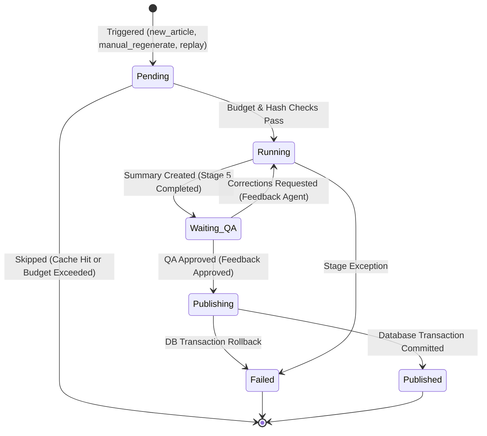

# NewsIQ Pipeline C: Story Synthesis Architecture Specification

* **Version**: 1.0 (Production Baseline)
* **Status**: Approved & Frozen
* **Last Updated**: 2026-07-10
* **Supersedes**: Draft v0.x

This document defines the authoritative, frozen production specification for the **Story Synthesis Pipeline (Pipeline C)**.

---

## 1. Pipeline C System Architecture

Pipeline C takes clustered articles and event entities from Pipeline A & B and synthesizes them into user-facing, high-fidelity news stories.

```mermaid
graph TD
    subgraph Pipeline A: Ingestion & Discovery
        A[RSS/Web Sources] --> B[Deduplication & Validation]
        B --> C[HDBSCAN Clustering]
    end

    subgraph Pipeline B: Event Intelligence
        C --> D[Event Identity & Lifecycle]
        D --> E[Entity Linking]
    end

    subgraph Pipeline C: Story Synthesis (Orchestration)
        E --> F[StorySynthesisOrchestrator]
        F --> S1[Stage 1: Knowledge Graph]
        F --> S2[Stage 2: Contradiction Detection]
        F --> S3[Stage 3: Source Comparison]
        F --> S4[Stage 4: Timeline Compiler]
        F --> S5[Stage 5: Summary Generator]
        F --> S6[Stage 6: Feedback QA]
        F --> S7[Stage 7: Publisher]
        
        S6 -- corrections --> S5
    end

    S7 --> DB[(PostgreSQL Database)]
    S7 --> Redis[(Redis Cache & Metrics)]
```

---

## 2. Synthesis Run Execution States

Each synthesis run shifts between well-defined states. These states are exposed in telemetry and admin UIs for diagnostics and control:



* **Pending**: Initializing and verifying budget keys and input hashes.
* **Running**: Executing stages 1 to 5 (Knowledge Graph, Contradiction, Source Comparison, Timeline, Summary).
* **Waiting QA**: Feedback Agent evaluates quality and determines if corrections are needed.
* **Publishing**: Preparing and committing database updates inside an atomic transaction.
* **Published**: Completed successfully; story versions and summaries are public.
* **Failed**: Execution failed; database transactions rolled back, error logged.

---

## 3. Stage Specifications & Contracts

### Stage 1: Knowledge Graph Construction
* **Type**: Deterministic
* **Inputs**:
  ```typescript
  interface KGInputs {
    articles: Article[];
    article_events: ArticleEvent[];
    story_entities: StoryEntity[];
    sources: Source[];
  }
  ```
* **Outputs**:
  ```typescript
  interface KGOutputs {
    nodes: Array<{ id: string; type: string; label: string; metadata: any }>;
    edges: Array<{ id: string; source: string; target: string; relationship: string }>;
  }
  ```
* **Cache Key**: `kg_stage:{composite_input_hash}`
* **Retry Policy**: No retry (Deterministic CPU-bound mapping).

### Stage 2: Contradiction Detection
* **Type**: LLM-Backed
* **Model Capability**: Structured reasoning and zero-shot fact-checking
* **Default Routing**: Gemini 2.5 Pro (via LLM Gateway)
* **Inputs**:
  ```typescript
  interface ContradictionInputs {
    articles: Article[];
    article_events: ArticleEvent[];
    article_source_map: Record<string, string>;
  }
  ```
* **Outputs**:
  ```typescript
  type ContradictionOutputs = Array<{
    fact_type: "numeric" | "actor" | "location" | "timeline";
    description: string;
    confidence: number;
    source_attribution: string;
  }>;
  ```
* **Cache Key**: `contradiction_stage:{composite_input_hash}`
* **Retry Policy**: Exponential backoff retry (3 attempts) managed by the LLM Gateway.

### Stage 3: Source Comparison
* **Type**: LLM-Backed
* **Model Capability**: Cross-source comparison and textual coverage mapping
* **Default Routing**: Gemini 2.5 Pro (via LLM Gateway)
* **Inputs**:
  ```typescript
  interface SourceCompInputs {
    articles: Article[];
    article_events: ArticleEvent[];
    article_source_map: Record<string, string>;
    sources: Source[];
    contradictions: ContradictionOutputs;
  }
  ```
* **Outputs**:
  ```typescript
  interface SourceCompOutputs {
    coverage: Array<{ source_id: string; focus_area: string; unique_information: string; missing_information: string }>;
    differences: Array<{ aspect: string; details: string }>;
  }
  ```
* **Cache Key**: `source_comp_stage:{composite_input_hash}`
* **Retry Policy**: Exponential backoff retry (3 attempts) managed by the LLM Gateway.

### Stage 4: Timeline Compiler
* **Type**: Deterministic (via `TimelineCompiler`)
* **Inputs**:
  ```typescript
  interface TimelineInputs {
    article_events: ArticleEvent[];
    article_source_map: Record<string, string>;
  }
  ```
* **Outputs**:
  ```typescript
  type TimelineOutputs = Array<{
    event_time: Date;
    event_time_raw: string;
    description: string;
  }>;
  ```
* **Cache Key**: Direct precomputation (always execution-local).
* **Retry Policy**: No retry.

### Stage 5: Summary Generation
* **Type**: LLM-Backed
* **Model Capability**: High-quality, long-context narrative summarization
* **Default Routing**: Gemini 2.5 Pro (via LLM Gateway)
* **Inputs**:
  ```typescript
  interface SummaryInputs {
    kg: KGOutputs;
    contradictions: ContradictionOutputs;
    timeline: TimelineOutputs;
    source_differences: Array<{ aspect: string; details: string }>;
    corrections?: string[];
    existing_summary_payload?: SummaryOutputs;
  }
  ```
* **Outputs**:
  ```typescript
  interface SummaryOutputs {
    headline: string;
    one_line_summary: string;
    short_summary: string;
    detailed_summary: string;
    key_facts: string[];
    category: string;
  }
  ```
* **Cache Key**: `summary_stage:{composite_input_hash}:corrections_hash`
* **Retry Policy**: Exponential backoff retry (3 attempts) managed by the LLM Gateway.

### Stage 6: Quality Gate / Feedback QA
* **Type**: Agentic / LLM
* **Model Capability**: Strict rule adherence, instruction matching, and fact validation
* **Default Routing**: Gemini 2.5 Pro (via LLM Gateway)
* **Inputs**:
  ```typescript
  interface QAInputs {
    story: Story;
    articles: Article[];
    kg: KGOutputs;
    contradictions: ContradictionOutputs;
    timeline: TimelineOutputs;
    summary_text: string;
    category_slug: string;
    regeneration_count: number;
  }
  ```
* **Outputs**:
  ```typescript
  interface QAOutputs {
    action: "approve" | "regenerate_summary" | "flag_manual_review";
    confidence_score: number;
    targeted_corrections: string[];
    hallucination_detected: boolean;
  }
  ```
* **Cache Key**: None (Must execute dynamically on every run to avoid stale QA passes).
* **Retry Policy**: Programmatic fallback to `"approve"` verdict on repeated parser failures.

### Stage 7: Publisher
* **Type**: Deterministic Database Transaction
* **Inputs**: All payloads generated from Stages 1 to 6 and their validated artifact IDs.
* **Outputs**: Updated Story rows, populated sub-tables, and active `StoryVersion`.
* **Cache Key**: None.
* **Retry Policy**: Database transaction deadlock retry (up to 3 database attempts).

---

## 4. Immutable Artifact Storage & Management

Outputs from synthesis stages are stored as immutable records in the `synthesis_artifacts` table and referenced by foreign key pointers in the `story_versions` table.

```
StoryVersion (Table)
 ├── id: UUID
 ├── story_id: UUID
 ├── version_number: INT
 ├── summary_artifact_id ----------> SynthesisArtifact (id, artifact_type, payload)
 ├── timeline_artifact_id ---------> SynthesisArtifact (id, artifact_type, payload)
 ├── kg_artifact_id ---------------> SynthesisArtifact (id, artifact_type, payload)
 ├── contradiction_artifact_id ----> SynthesisArtifact (id, artifact_type, payload)
 └── source_comparison_artifact_id -> SynthesisArtifact (id, artifact_type, payload)
```

### 4.1 Artifact Deduplication
To optimize storage, payloads are hashed (`payload_hash = SHA256(JSON.stringify(payload))`) before creation:
* If an artifact with matching `artifact_type` and `payload_hash` already exists in the database, the system reuse its `artifact_id` instead of inserting a duplicate record.
* This is especially powerful for recurring timeline and knowledge graph payloads which often remain identical during incremental updates.

### 4.2 Artifact Retention Policy
To prevent storage bloat, NewsIQ runs a background cleaning worker (garbage collection task) that enforces retention rules:
* **Published versions**: Retain indefinitely (referenced by active stories or historic story versions).
* **Replay candidates**: Retain for 30 days (allows time for comparison and review).
* **Failed synthesis artifacts**: Retain for 7 days (kept temporarily for debugging).
* **Orphaned artifacts**: Garbage collected immediately after validation checks confirm they have no parent version or active references.

---

## 5. Section-Aware Feedback & Refinement

During Stage 6 (QA), the Feedback Agent evaluates the generated story sections independently:
* **Headline**
* **One-line summary**
* **Short summary**
* **Detailed summary**
* **Key facts**
* **Timeline**

If one or more sections contain errors, the Feedback Agent sets the action to `"regenerate_summary"` and returns target corrections. The orchestrator calls Stage 5 again, passing the current content and corrections, instructing the LLM to only regenerate the modified parts.

### Max Regeneration Gating
To prevent infinite correction loops and excessive token spend:
* The orchestrator enforces a hard limit of `max_regeneration_attempts = 2`.
* If a summary fails Stage 6 validation more than twice, the run states moves to `Failed` and the story is flagged for **Manual Review**, bypassing further automated attempts.

---

## 6. Transactional Publisher Pattern

The publishing stage (Stage 7) is wrapped in a PostgreSQL transaction boundary. Partial updates are impossible:

```sql
BEGIN TRANSACTION;

-- 1. Insert new immutable artifacts generated during the synthesis run
INSERT INTO synthesis_artifacts (id, artifact_type, payload, payload_hash) ...;

-- 2. Create the StoryVersion record linking all active artifact IDs
INSERT INTO story_versions (id, story_id, version_number, summary_artifact_id, timeline_artifact_id, kg_artifact_id, contradiction_artifact_id, source_comparison_artifact_id) ...;

-- 3. Clear existing active records for the story in secondary tables
DELETE FROM story_timeline_events WHERE story_id = :story_id;
DELETE FROM story_contradictions WHERE story_id = :story_id;
DELETE FROM story_source_coverage WHERE story_id = :story_id;
DELETE FROM story_differences WHERE story_id = :story_id;

-- 4. Repopulate active secondary tables from the artifact payloads
INSERT INTO story_timeline_events (...) VALUES ...;
INSERT INTO story_contradictions (...) VALUES ...;
INSERT INTO story_source_coverage (...) VALUES ...;

-- 5. Update parent Story fields to make the new summary public
UPDATE stories 
SET headline = :headline, 
    one_line_summary = :one_line, 
    short_summary = :short, 
    detailed_summary = :detailed, 
    key_facts = :facts, 
    current_version_id = :version_id 
WHERE id = :story_id;

COMMIT;
```

If any step fails, `ROLLBACK` is issued instantly.

---

## 7. Budgeting & Cache Hierarchy

### Cost & Rate Budgets
To prevent infinite synthesis loops or excessive spend:
1. **Story Budget**: Enforced via Redis (`story_synthesis_budget:{story_id}`). Restricts synthesis executions to a maximum of 5 runs per hour.
2. **Stage-Level Token Cap**: Summarization prompts are limited using `max_tokens` (e.g. 2000 tokens for summaries, 1000 for contradiction detection).
3. **Provider-Level Spend Cap**: The LLM Gateway monitors cumulative daily spend. Alerts trigger if the pipeline spend exceeds the configured threshold.

### Cache Precedence
Before requesting generation from the LLM, the system checks the cache in order of precedence:

```
[Composite Input Hash Check]
            │
            ├── (Hit) ──> Bypasses entire synthesis run
            └── (Miss)
                 │
         [Stage Cache Check]
                 │
                 ├── (Hit) ──> Reuses stored artifact
                 └── (Miss)
                      │
              [Prompt Cache Check] (LLM Provider-Level)
                      │
                      ├── (Hit) ──> Reuses Prompt Tokens (reduced cost)
                      └── (Miss) ──> Standard LLM Generation
```

---

## 8. Persisting Prompt & Compatibility Versions

To ensure reproducibility and ease future schema migrations, each `StoryVersion` persists:
1. **Pipeline Version**: The software codebase tag (e.g. `v1.7.0`).
2. **Schema Version**: The database migration status (e.g. `c3d4e5f6g7h8`).
3. **Prompt Version**: Referenced via LLM traces linked to `prompt_versions(id, prompt_hash, stage, version)`.

This makes it easy to trace exactly which prompts, software build, and database schemas produced any historical news story.

---

## 9. Synthesis Replay Mode & Admin Approval

For quality assurance and prompt tuning, the orchestrator supports a dry-run **Replay Mode**:

```
[Target Story] 
      │
      ├── Load Active StoryVersion (e.g. V1)
      │
      ├── Execute Dry-Run Synthesis (Generates V2 Candidate Version)
      │
      ├── Save V2 Candidate Artifacts with "candidate" lifecycle status
      │
      ├── Generate JSON Diff (V1 Summary vs V2 Candidate Summary)
      │
      └── Admin Review Console Dashboard (Compare Diff)
            │
            ├── [Approve] ──> Execute Stage 7 (Promote Candidate to V2 and Publish)
            └── [Reject]  ──> Discard Candidate (Cleaned up by GC after 30 days)
```

In Replay Mode, candidate versions do **not** publish directly to the public-facing tables. They are held in a pending status for manual admin approval.
