# NewsIQ Canonical Architecture & Technical Reference: Section 3 — Story Clustering & Story Synthesis

> [!IMPORTANT]
> **Production Status: Audited & Verified**
> This document serves as the canonical reference for the **Story Clustering & Story Synthesis** phase of the NewsIQ pipeline. It reflects the exact implemented behavior in the codebase.

---

# 1. High-Level Architecture

The Story Clustering and Synthesis pipeline groups incoming embedded articles into canonical stories, detects contradictions, compares source focus, chronologically compiles timelines, generates summaries, checks for quality via edit feedback, and publishes the stories to Meilisearch and the web API.

The pipeline operates on a **Story-First** model where incoming articles are routed in real-time to active stories (Primary Path), while unclustered articles are placed in a Discovery Queue for periodic batch clustering (Secondary Path).

```text
                               +-----------------------------+
                               |     Incoming Article        |
                               | (embedded/event-extracted)  |
                               +--------------+--------------+
                                              |
                                              ▼
                                 [ Candidate Retrieval ] ──────────────────┐
                                  (SQL Query - Section 4)                  │
                                              |                            │
                     +------------------------+------------------------+   │
                     | Candidates Found                                |   │ No Candidates
                     ▼                                                 ▼   ▼
             [ Stage A Filters ]                             [ Discovery Queue ]
           (Deterministic Rules - Sec 5)                          (Section 3.3)
                     |                                                 |
         +-----------+-----------+                                     ▼
         | PASS or MAYBE         | FAIL (<45)                 [ Batch Clustering ]
         ▼                       ▼                             (HDBSCAN - Sec 9)
  [ Stage B Filters ]    [ Discovery Queue ]                           |
(Vector + Entity graph - Sec 6)                                        ▼
         |                                                    [ Create New Story ]
         +-----------------------+                                     |
         | PASS or (MAYBE + LLM) | FAIL                                |
         ▼                       ▼                                     |
  [ Story Merge & Lock ]   [ Discovery Queue ]                         |
 (pg_advisory_xact_lock - Sec 8)                                       |
         |                                                             |
         ▼                                                             |
   [ Merge Story ] <───────────────────────────────────────────────────+
         |
         ▼
 +───────────────────────────────────────────────────────────────────────────+
 |                 [ Story Synthesis Pipeline (Section 10) ]                  |
 |                                                                           |
 |  1. Knowledge Graph   ──► Builds node-edge network (deterministic)        |
 |  2. Contradiction     ──► Local heuristics mismatch + LLM Verification    |
 |  3. Source Comparison ──► Local coverage overlap + LLM Focus/Angle        |
 |  4. Timeline          ──► Chronological compilation (TimelineCompiler)    |
 |  5. Summary           ──► Gemini 2.5 Pro summarization & section revision |
 |  6. Quality Check     ──► Feedback Agent checks HHI, entities, leakage    |
 |  7. Publisher         ──► Atomic database upserts + Meilisearch + Cache   |
 +───────────────────────────────────────────────────────────────────────────+
                                              |
                                              ▼
                                      [ Story Active ]
```

---

# 2. Detailed Sequence Diagram & Pipeline Latency

Below is the execution sequence for an article running through the clustering and synthesis stages, annotated with approximate latency ranges based on typical model response times and database query executions.

```mermaid
sequenceDiagram
    autonumber
    participant Worker as Celery Worker (tasks.py)
    participant CS as ClusteringService
    participant EVS as EventValidationService
    participant Qdrant as Qdrant DB
    participant DB as PostgreSQL DB
    participant Gateway as AIGateway
    participant FA as Feedback Agent
    participant cache as CacheService (Redis)
    participant Search as Meilisearch

    Note over Worker, CS: [ Real-Time Incremental Clustering ] (Total: 400 - 1500 ms)
    Worker->>CS: add_article_to_existing_story_if_similar(article_id)
    activate CS
    Note over CS, DB: 20-40 ms query latency
    CS->>DB: Query Top 20 Candidates (EXISTS matching entities/no entities)
    DB-->>CS: Return Candidate Stories
    
    loop For each Story candidate (up to 20)
        Note over CS, EVS: <1 ms local execution
        CS->>EVS: validate_stage_a(article, anchor)
        EVS-->>CS: Return DecisionLog (outcome = PASS/MAYBE/FAIL)
    end
    
    Note over CS: Sort PASS/MAYBE candidates by score desc -> Take Top 3
    Note over CS, Qdrant: O(1) Vector lookup (2-10 ms)
    CS->>Qdrant: Retrieve Article Vector (O(1) point retrieval)
    Qdrant-->>CS: Return Vector
    
    loop For each Top 3 candidate (Stage B: 30-60 ms)
        CS->>EVS: validate_stage_b(article, anchor, vector, entities)
        EVS-->>CS: Return DecisionLog (outcome)
        
        alt outcome == PASS
            Note over CS: Merge directly
        else outcome == MAYBE and score >= REFLECTION_THRESHOLD (0.55)
            Note over CS, Gateway: Reflection Agent Execution (400-1200 ms)
            CS->>DB: Acquire advisory lock (pg_advisory_xact_lock) on story_id
            CS->>DB: Query first article + event in Story
            DB-->>CS: Return Article & Event
            alt High Stakes (politics, world, business)
                CS->>Gateway: Gemini Agent + OpenAI Agent Verification
                Gateway-->>CS: Return Decisions
                alt Disagreement (Gemini != OpenAI)
                    CS->>Gateway: Judge Agent Arbitration
                    Gateway-->>CS: Return Judge Decision
                end
            else Standard Category
                CS->>Gateway: Gemini Agent Verification
                Gateway-->>CS: Return Gemini Decision
            end
        end
    end

    alt Article Merged
        CS->>DB: INSERT StoryArticle link & update Story
        Note over CS: Trigger Synthesis (3 - 8 seconds)
    else Article Not Merged
        CS->>DB: INSERT DiscoveryQueue (state = READY)
        Note over CS: Batch Clustering will handle it
    end
    deactivate CS

    Note over Worker, CS: [ Batch Clustering Task ] (Triggered periodically)
    Worker->>CS: run_batch_clustering()
    activate CS
    CS->>DB: Acquire global advisory lock (GLOBAL_CLUSTERING_LOCK_ID = 888888888)
    CS->>DB: Fetch READY articles from DiscoveryQueue (limit 200)
    DB-->>CS: Return unclustered articles
    CS->>Qdrant: Retrieve vectors for all batch articles
    Qdrant-->>CS: Return vectors
    Note over CS: Run numpy-based HDBSCAN (min_cluster_size=2, eps=0.35)
    Note over CS: Pairwise Event Similarity & Splitting on resulting clusters
    Note over CS: Pre-grouping by event_fingerprint (identical matches merge)
    
    loop For each verified cluster
        CS->>DB: INSERT Story + StoryMetric + StoryArticles
        alt cluster_size >= 2
            Note over CS: Trigger Synthesis
        else cluster_size < 2
            Note over CS: Defer synthesis (no LLM run for single-article cluster)
        end
    end
    CS->>DB: Commit & Release Lock
    deactivate CS

    Note over CS, FA: [ Story Synthesis Pipeline ] (Total: 3 - 8 seconds)
    rect rgb(20, 20, 30)
        CS->>cache: Check daily synthesis budget limit ($0.10) for Story
        cache-->>CS: Budget OK
        Note over CS: Step 1: Knowledge Graph (deterministic: <50 ms)
        Note over CS: Step 2: Contradiction Detection (cache check -> Agno Agent -> LLM: 1-2 s)
        CS->>Gateway: Run contradiction_detection.yaml
        Gateway-->>CS: Return Contradictions
        Note over CS: Step 3: Source Comparison (cache check -> LLM: 1-2 s)
        CS->>Gateway: Run source_comparison.yaml
        Gateway-->>CS: Return Coverage and Differences
        Note over CS: Step 4: Timeline Compilation (deterministic: <10 ms)
        Note over CS: Step 5: Summary Generation (Gemini 2.5 Pro: 2-4 s)
        CS->>Gateway: Run summary_generation.yaml
        Gateway-->>CS: Return Headline & Summaries
        Note over CS: Step 6: Quality Evaluation (Feedback Agent: 1-2 s)
        CS->>FA: evaluate_story_quality()
        activate FA
        Note over FA: Check HHI diversity, min cosine similarity, missing entities, leakage
        alt Quality fails and regeneration_count == 0
            FA-->>CS: Return action = regenerate_summary, instructions
            CS->>Gateway: Rerun summary refinement (summary_refinement.yaml)
            Gateway-->>CS: Return Refined Summary
            CS->>FA: re-evaluate_story_quality()
            FA-->>CS: Return action = publish
        else Quality fails and regeneration_count >= 1
            FA-->>CS: Return action = request_human_review (locks story_status = pending)
        end
        deactivate FA
        Note over CS: Step 7: Publisher (atomic transactions: 150-300 ms)
        CS->>DB: Clear sub-tables & INSERT StoryTimelineEvent, StoryContradiction, StorySourceCoverage, StoryDifference
        CS->>DB: INSERT StoryVersion snapshot
        CS->>Search: Index Story Document in Meilisearch
        CS->>cache: Invalidate Redis cache for Story ID & update updates guard key
    end
```



---

# 3. Story Clustering Deep Dive

### 3.1 Overview: Incremental vs. Batch Clustering
NewsIQ employs a hybrid, story-centric clustering model split into two pathways:
* **Incremental Clustering (Primary Path)**: Incoming crawl-completed, embedded articles are immediately matched against active stories. If a match is found, they are merged and the story is instantly updated and synthesized. This ensures real-time updates for active stories (developing events).
* **Batch Clustering (Secondary Path / Fallback)**: If an article fails to match any active candidate story, it is placed in the [Discovery Queue](#33-discovery-queue-lifecycle) in a `READY` state. A periodic Celery worker (`cluster_news_task`) processes the queue using `HDBSCAN` to identify new emergent events (clusters of size $\ge 2$) that occurred outside existing stories.

### 3.2 Story Embedding Strategy
A story's embedding is represented as a **Story Centroid**, which is calculated as the mathematical average of the individual embeddings of all articles currently linked to that story.

$$\vec{C}_{story} = \frac{1}{N} \sum_{i=1}^{N} \vec{V}_{article\_i}$$

#### Advantages
* **O(1) Similarity Checks**: Comparing an incoming article's vector against a single story centroid is highly efficient, avoiding $O(N)$ comparisons against every article in the story.
* **Semantic Consolidation**: The centroid represents the shared core of all reports, naturally balancing out minor wording variances between individual articles.

#### Limitations & Centroid Drift
* **Centroid Drift**: As a story evolves and new articles with slightly different angles are merged, the centroid mathematical average shifts. Over a long series of merges, the centroid may drift far enough from the original anchor event vector to begin matching adjacent topics (e.g., merging a follow-up trial into an initial arrest story, and eventually merging unrelated legal changes).
* **Giant Stories**: If unchecked, centroid drift causes stories to grow indefinitely, consuming surrounding news events.
* **Architectural Status**: The current implementation accepts this drift trade-off. Future updates may introduce a hybrid scoring mechanism that compares the candidate article against both the **Story Centroid** (representing current scope) and the **Story Anchor** (the embedding of the first article, representing the root event) in a weighted configuration:

$$\text{Composite Score} = \alpha \cdot \text{Cosine}(\vec{V}, \vec{C}_{story}) + (1 - \alpha) \cdot \text{Cosine}(\vec{V}, \vec{V}_{anchor})$$

### 3.3 Discovery Queue Lifecycle
The **Discovery Queue** manages the queueing, execution, and state transitions of unclustered articles that fail incremental real-time matching.

```text
       [Article Ingested]
               │
      (Incremental Match?)
        ├── Yes ──► [Merged into Story] ──► [Synthesize] ──► [Completed]
        └── No
             │
             ▼
      [DiscoveryQueue] ──► State: PENDING (deduplication check)
             │
             ▼
      [DiscoveryQueue] ──► State: READY (after embedding & event extraction)
             │
             ▼
     (Periodic Celery Task) ──► State: GROUPING (under global lock)
             │
      [HDBSCAN Clustering]
             ├─► Cluster Found (Size >= 2) ──► State: CLUSTER_CREATED ──► [Create Story & Synthesize]
             └─► Outlier / Single Article  ──► [Create Single Story]  ──► [Defer Synthesis]
```

* **Processing States**:
  - `PENDING`: The article has been ingested but is undergoing initial processing.
  - `READY`: The article has its embedding and events extracted, is not linked to any story, and is ready for batch clustering.
  - `GROUPING`: The article is currently being processed by the HDBSCAN batch clustering task under `GLOBAL_CLUSTERING_LOCK_ID`.
  - `CLUSTER_CREATED`: The article has been successfully clustered and assigned to a story.
* **Idempotency & Replay Protection**: To prevent duplicate processing during worker retries, `discovery_manager.py` verifies if an `article_id` is already linked to a story or has an active `DiscoveryQueue` row before enqueuing.
* **Queue Expiration**: Articles in the `DiscoveryQueue` that fail to form a cluster or join a story after a configurable TTL (default: 72 hours) are marked as expired. They remain archived for historical analysis but are excluded from future active batch clustering iterations.

### 3.4 Qdrant Vector Usage
* **Collection**: `"articles"`
* **Point IDs**: The exact `article_id` UUID strings.
* **Retrieval**: Uses `vector_service.client.retrieve` to fetch vectors. This runs as an $O(1)$ key lookup rather than an ANN search, keeping latency to 2-10ms.
* **Embedding Dimensions**: 3072 floats.

---

# 4. Candidate Retrieval

Candidate Retrieval selects the top active stories to evaluate against an incoming article. To reduce DB load, it uses an index-friendly SQL query that filters by time, lifecycle, and entity overlap.

### Candidate Filtering Signals
Rather than checking all stories, the system uses multiple retrieval filters:
1. **Time Window**: Evaluates only stories updated within the last 72 hours (`Story.updated_at >= time_window`).
2. **Lifecycle State**: Restricts candidates to stories in `developing`, `monitoring`, or `stable` states. (See [Section 7: Story Lifecycle](#7-story-lifecycle)).
3. **Exclusion**: Excludes stories that already contain the incoming article.
4. **Entity Overlap Boost**: If spaCy extracts entities from the article title, candidates are filtered to stories that share at least one canonical entity or have no entities linked yet.
5. **Ordering**: Results are sorted by `Story.updated_at DESC`.
6. **Limit**: Capped at 20 candidate stories.

```sql
SELECT stories.id, stories.headline, stories.lifecycle_state, stories.updated_at
FROM stories
WHERE stories.lifecycle_state IN ('developing', 'monitoring', 'stable')
  AND stories.updated_at >= :time_window
  AND NOT EXISTS (
      SELECT 1 FROM story_articles 
      WHERE story_articles.story_id = stories.id 
        AND story_articles.article_id = :article_id
  )
  AND (
      EXISTS (
          SELECT 1 FROM story_entities 
          WHERE story_entities.story_id = stories.id 
            AND LOWER(story_entities.entity_value) IN (:ent_1, :ent_2, ...)
      )
      OR
      NOT EXISTS (
          SELECT 1 FROM story_entities 
          WHERE story_entities.story_id = stories.id
      )
  )
ORDER BY stories.updated_at DESC
LIMIT 20;
```

---

# 5. Stage A Validation

Stage A runs locally on the application server with zero network or database dependencies. It evaluates the candidate stories returned by [Candidate Retrieval (Section 4)](#4-candidate-retrieval) using a weighted, rule-based scoring system.

$$\text{Score} = \text{Entity Overlap (35)} + \text{Location (20)} + \text{Time Proximity (15)} + \text{Title Similarity (20)} + \text{Publisher Trust (10)}$$

### Scoring Logic & Edge Cases
* **Entity Overlap (Weight 35)**:
  - *Case 1 (Article has 0 entities, Story has entities)*: Score = `0.0`.
  - *Case 2 (Story has 0 entities, Article has entities)*: Score = `17.5` (Neutral).
  - *Case 3 (Both have 0 entities)*: Score = `17.5` (Neutral).
  - *Normal Case*: $\frac{|\text{Shared Entities}|}{\min(|\text{Article Entities}|, |\text{Story Entities}|)} \times 35$.
* **Location Overlap (Weight 20)**:
  - Follows the same Case 1/2/3 logic as entities to prevent division-by-zero errors when location metadata is missing.
* **Time Proximity (Weight 15)**:
  - $\le 24$ hours: 15 points.
  - $\le 72$ hours: 7.5 points.
  - $> 72$ hours: 0 points.
* **Title Similarity (Weight 20)**:
  - Jaccard similarity of words in titles $\times 20$.
* **Publisher Trust (Weight 10)**:
  - $10.0$ for Tiers 1-3, $5.0$ for Tier 4, and $0.0$ for Tier 5.

### Outcomes
* **PASS**: $\ge 60$ (Proceeds directly to [Stage B Validation](#6-stage-b-validation)).
* **MAYBE**: $\ge 45$ and $< 60$ (Proceeds to Stage B).
* **FAIL**: $< 45$ (Article is sent to the [Discovery Queue](#33-discovery-queue-lifecycle)).

---

# 6. Stage B Validation

Stage B is executed for the Top 3 candidate stories that passed Stage A. It retrieves the article's vector from Qdrant and evaluates multiple signals rather than relying solely on cosine similarity.

### Evaluation Signals
1. **Embedding Similarity**: Cosine similarity between the article vector and the story centroid vector.
2. **Canonical Entity Overlap**: The count of matching entities between the article and the story's knowledge graph nodes.
3. **Event Overlap**: Comparison of parsed events (actors, targets, location, time) extracted during ingestion.

### Thresholds & Routing
* **PASS**: Cosine Similarity $\ge 0.72$ OR Canonical Entity Overlap $\ge 2$. (Direct merge).
* **MAYBE**: Cosine Similarity $\ge 0.67$ OR Canonical Entity Overlap $\ge 1$. (Triggers the [Reflection Agent](#7-reflection-agent) if cosine $\ge 0.55$).
* **FAIL**: Cosine Similarity $< 0.67$ AND Canonical Entity Overlap $< 1$. (Rejection; routes to the [Discovery Queue](#33-discovery-queue-lifecycle)).

---

# 7. Reflection Agent

If Stage B returns a `MAYBE` decision, the pipeline triggers LLM reflection to verify the merge decision using contextual information.

```text
                             [Stage B: MAYBE]
                                     │
                             (High Stakes Category?)
                               ├── Yes ──► Run Gemini + OpenAI Verification Agents
                               │                │
                               │         (Do they agree?)
                               │           ├── Yes ──► Return Decision
                               │           └── No  ──► [Judge Agent Arbitration]
                               │
                               └── No  ──► Run Gemini Verification Agent Only
```

### Reflection Failure Handling & Fallback Paths
LLM Gateway calls are wrapped with robust fallbacks to handle timeouts, rate limits, or API outages:
1. **Agent Failure/Timeout**: If either the Gemini or OpenAI verification agents fail or time out, the system falls back to a Gemini-only decision.
2. **Judge Agent Failure**: If the Judge Agent fails or times out during arbitration, the system falls back to the Gemini Agent's decision.
3. **Gateway Outage**: If the AI Gateway is completely unavailable, the pipeline falls back to a deterministic threshold:
   - The article is merged if its cosine similarity to the story centroid is $\ge 0.80$.
   - Otherwise, the merge is rejected, and the article is routed to the [Discovery Queue](#33-discovery-queue-lifecycle).
4. **Malformed Responses**: Responses that fail Pydantic validation are retried using exponential backoff. If retries are exhausted, they are treated as gateway failures and fall back to the deterministic thresholds.

---

# 8. Story Merge & Lock

To prevent race conditions when multiple articles are processed concurrently, merges are handled under a database transaction using PostgreSQL advisory locks:

```text
[Start Transaction]
   │
   ├─► 1. Fold story_id (UUID) to 64-bit signed integer
   ├─► 2. Acquire lock: SELECT pg_advisory_xact_lock(lock_id)
   ├─► 3. Verify StoryArticle link does not already exist (idempotency check)
   ├─► 4. Insert StoryArticle relationship row
   ├─► 5. Trigger StorySynthesisOrchestrator synthesis
   ├─► 6. Recompute trending score
   │
[Commit Transaction] (Advisory lock automatically released)
```

If a lock cannot be acquired or a transaction fails, the worker logs a warning and the article is deferred to the next periodic queue processing run.

---

# 9. Batch Clustering

Batch Clustering runs periodically via the Celery task `cluster_news_task` to process articles in the `DiscoveryQueue` that are in a `READY` state.

```text
[DiscoveryQueue READY] (Limit 200)
        │
        ▼
[Fetch Vectors from Qdrant]
        │
        ▼
[Run HDBSCAN] (min_cluster_size=2, eps=0.35)
        │
        ├─► Outliers (Label -1) ──► Keep as single-article cluster (Story status = pending, Synthesis Deferred)
        │
        ▼
[Pairwise Similarity Verification]
        │
        ├─► Combined Sim (90% Event + 10% Entity) >= 0.90 ──► Merge
        ├─► Combined Sim >= 0.70 ────────────────────────────► Trigger Reflection (Sec 7)
        │
        ▼
[Pre-Grouping Identical event_fingerprints] ──► Merges duplicate reporting
        │
        ▼
[INSERT Stories, StoryMetrics, StoryArticles]
        │
        ├─► Cluster Size < 2  ──► Story status = pending, Synthesis Deferred
        ▼
[Story Synthesis Orchestrator] (Cluster Size >= 2)
```

---

# 10. Story Synthesis

Once a merge is completed or a new cluster is created, the pipeline executes the **Story Synthesis Orchestrator**, which coordinates a multi-stage synthesis process.

```text
1. Knowledge Graph ──► 2. Contradictions ──► 3. Source Comparison ──► 4. Timeline
                                                                           │
   ┌───────────────────────────────────────────────────────────────────────┘
   ▼
5. Summary ──► 6. Quality Evaluation ──► 7. Publisher
```

### 10.1 Knowledge Graph Stage
* **Input**: Article records, article events, story entities, and sources.
* **Processing**: Deterministically builds a graph where nodes represent entities, events, or sources, and edges represent relationships (e.g. `INVOLVED_IN`, `REPORTED`).
* **Database Writes**: Writes JSON payload to `SynthesisArtifact` (type `knowledge_graph`).

### 10.2 Contradiction Stage
* **Input**: Articles, events, and source names.
* **Processing**: Runs local pairwise heuristic checks on actors, targets, locations, times, and numbers. If potential mismatches are found, they are validated by the contradiction agent (using `contradiction_detection.yaml`).
* **Database Writes**: Writes JSON payload to `SynthesisArtifact` (type `contradictions`).

### 10.3 Source Comparison Stage
* **Input**: Articles, events, source names, and precomputed contradictions.
* **Processing**: Runs local heuristic checks to identify unique details or omissions per publisher. Uses the source comparison agent (using `source_comparison.yaml`) to summarize focus areas and differences.
* **Database Writes**: Writes JSON payload to `SynthesisArtifact` (type `source_comparison`).

### 10.4 Timeline Stage
* **Input**: Event contexts and source map.
* **Processing**: Chronologically sorts and formats events using `TimelineCompiler`.
* **Database Writes**: Writes JSON payload to `SynthesisArtifact` (type `timeline`).

### 10.5 Summary Stage
* **Input**: Knowledge graph, contradictions, timeline, source comparisons, and optional targeted corrections.
* **Processing**: Generates headline, one-line summary, short summary, detailed summary, and key facts using Gemini 2.5 Pro (using `summary_generation.yaml`). If targeted corrections are provided, it runs `summary_refinement.yaml` to revise specific sections.
* **Database Writes**: Writes JSON payload to `SynthesisArtifact` (type `summary`).

### 10.6 Quality Evaluation Stage (Feedback Agent)
* **Input**: Story, articles, knowledge graph, contradictions, timeline, summary text, and category.
* **Processing**: Computes programmatic checks (HHI source diversity, min cosine similarity, missing entities, event leakage). If the category is high stakes or programmatic checks score $<0.85$, it calls the LLM Feedback Agent to check for hallucinations.
* **Feedback Decisions**:
  - `publish`: Green-lights publication.
  - `regenerate_summary`: Reruns the summary stage with corrections instructions (max 1 run).
  - `request_human_review`: Flags the story for review and halts auto-publishing (sets status to `pending`).

### 10.7 Publisher Stage
* **Input**: Payloads of all generated artifacts and the `Story` model.
* **Processing**: Clears old story sub-table rows and atomically inserts timeline events, contradictions, source coverages, differences, and a new `StoryVersion` row within a single database transaction. Pushes the story to Meilisearch and invalidates Redis cache keys.

---

# 11. Story Lifecycle

Stories transition through four lifecycle states which govern their eligibility for candidate retrieval and synthesis frequency:

```text
[Discovery / Batch] ──► [Developing] ──► [Stable] ──► [Monitoring] ──► [Archived]
```

* **`developing`**:
  - *Definition*: Active story with frequent new article merges.
  - *Retrieval*: Fully eligible for candidate retrieval.
  - *Synthesis*: Synthesized immediately on every merge.
* **`stable`**:
  - *Definition*: Story has a mature narrative and the rate of new merges has slowed.
  - *Retrieval*: Eligible for candidate retrieval.
  - *Synthesis*: Synthesis is throttled (executed only for highly matching updates or new publisher perspectives).
* **`monitoring`**:
  - *Definition*: Old story monitored for late-arriving follow-ups.
  - *Retrieval*: Eligible for candidate retrieval (lower priority).
  - *Synthesis*: Synthesis runs on a delayed batch schedule.
* **`archived`**:
  - *Definition*: Inactive story.
  - *Retrieval*: Excluded from candidate retrieval queries.
  - *Synthesis*: Lock-state; no updates or synthesis allowed.

---

# 12. AI Gateway & Runtime Execution

The **AI Gateway** acts as the runtime layer for all LLM calls, managing prompts, routing, retries, and schema validation.

```text
 [Prompt Registry] ──► Resolves YAML prompt version & model configuration
        │
        ▼
 [AI Gateway] ──► Determines active provider & initializes client (Gemini/OpenAI)
        │
        ▼
 [Execution] ──► Generates message array (system + user variables)
        │
        ▼
 [Structured Output Validation] ──► Validates response against Pydantic schema
        │
        ├── Success ──► Return parsed response
        └── Failure / Exception
                │
                ▼
         [Tenacity Retry] ──► Retry with exponential backoff (Max 3 attempts)
                │
                ├── Success ──► Return parsed response
                └── Retries Exhausted ──► Fallback model or deterministic logic
```

### AI Pipeline & Call Specifications
Below are the configuration profiles managed by the Gateway for each stage:

| Stage | Prompt YAML | Primary Model | Temp | Structured Output Schema | Fallback Behavior |
| :--- | :--- | :--- | :--- | :--- | :--- |
| Cluster Reflection (Gemini) | `cluster_verification` | `gemini-2.5-flash` | 0.0 | `ClusterVerificationSchema` | Falls back to local cosine score check. |
| Cluster Reflection (OpenAI) | `cluster_verification` | `gpt-4o-mini` | 0.0 | `ClusterVerificationSchema` | Falls back to Gemini-only decision. |
| Judge Arbitration | `judge_decision` | `gpt-4o` | 0.0 | `JudgeSchema` | Falls back to Gemini-only decision. |
| Contradiction Check | `contradiction_detection`| `gemini-2.5-flash-lite`| 0.1 | `ContradictionResolution` | Falls back to deterministic heuristic text. |
| Source Comparison | `source_comparison` | `gemini-2.5-flash-lite`| 0.1 | `SourceComparisonResolution` | Falls back to deterministic heuristic text. |
| Summary Generation | `summary_generation` | `gemini-2.5-pro` | 0.1 | `StorySummaryResponse` | Raises exception to abort synthesis stage. |
| Summary Refinement | `summary_refinement` | `gemini-2.5-pro` | 0.1 | `StorySummaryResponse` | Aborts refinement, uses original summary. |
| Quality QA Check | `summary_reflection` | `gemini-2.5-pro` | 0.1 | `FeedbackReport` | Falls back to programmatic metrics check. |

---

# 13. Cache Architecture

NewsIQ uses Redis as a high-performance caching layer to prevent duplicate synthesis, gate LLM costs, and manage distributed locks.

| Key Pattern | Data Type | TTL | Purpose / Description | Invalidation Event |
| :--- | :--- | :--- | :--- | :--- |
| `story_synthesis_hash:{story_id}` | String | 7 days | Caches composite hash of story articles to prevent duplicate synthesis. | Recalculated on new article merge. |
| `newsiq:budget:story:{story_id}:{date}`| String | 24 hours| Tracks accumulated dollar cost of LLM calls for a story. | Expires daily. |
| `newsiq:lock:cluster_news_task` | String | 10 min | Distributed lock to prevent concurrent batch clustering tasks. | Auto-released or expired. |
| Stage: `summary_generation` / hash | String | 30 days | Caches generated summaries to prevent redundant Gemini 2.5 Pro calls. | Invalidated if article hash changes. |
| Stage: `contradiction_detection` / hash | String | 30 days | Caches contradiction evaluation results. | Invalidated on new source merge. |
| Stage: `source_comparison` / hash | String | 30 days | Caches publisher focus area analysis. | Invalidated on new source merge. |

---

# 14. Story Metrics & Observability Flow

Metrics evolve incrementally as articles are ingested and merged, culminating in trend score updates and lifecycle transitions.

```text
 [Article Ingestion] ──► Increments raw metrics (Article views, bookmarks, shares, clicks)
        │
        ▼
 [Story Article Merge] ──► Groups metrics under StoryMetric association
        │
        ▼
 [Trend Score Recomputation] (ClusteringService.compute_trending_score)
        ├── Source Score: Unique source count / 5 (capped at 1.0)
        ├── Recency Score: Exponential decay with 6-hour half-life
        └── Engagement Score: (views * 1 + bookmarks * 3 + shares * 5) / 500
        │
        ▼
 [Lifecycle Update] ──► Transitions story state (Developing -> Stable -> Monitoring -> Archived)
        │
        ▼
 [Quality Evaluation] ──► Feedback Agent generates QA Quality Score & checks hallucinations
        │
        ▼
 [Publisher Stage] ──► Writes active story document to Meilisearch
```

---

# 15. Performance Analysis & Bottlenecks

1. **N+1 Query Prevention**:
   - Relationship fields such as `Story.category` and `Story.entities` are eagerly loaded using `selectinload` in candidate queries.
   - When updating or generating stories, `generate_story_content` performs a single batch `SELECT` using `Source.id.in_(source_ids)` instead of querying the database for each article.
2. **Transactional Concurrency**:
   - The system utilizes `pg_advisory_xact_lock` scoped by `story_id`. This prevents concurrent writes to the same story while allowing updates to different stories to execute in parallel.
3. **ANN Search Bypass**:
   - Qdrant is queried using point lookups by UUID key ($O(1)$ complexity). The cosine similarity calculations are performed locally in Python, avoiding ANN search latency and index synchronization overhead.

---

# 16. Data Lineage

```text
[Article Ingested]
  └── Article.title / Article.content
        ├── [Event Extraction] ──► ArticleEvent (actors, targets, location, time)
        └── [Embedding Service] ──► Qdrant Vector (O(1) Point ID: article_id)
              ▼
        [Clustering Service] (Cosine similarity vs Story Centroid)
              ▼
        [Story Merge] (INSERT StoryArticle link)
              ▼
        [StorySynthesisOrchestrator]
              ├── build_story_knowledge_graph() ──► SynthesisArtifact (knowledge_graph)
              ├── detect_and_save_contradictions() ──► SynthesisArtifact (contradictions)
              ├── compare_sources_and_save() ──► SynthesisArtifact (source_comparison)
              └── summarize_story_from_kg() ──► SynthesisArtifact (summary)
                    ▼
              [Publisher Stage] (Atomic database commit)
                    ├── Story (headline, summaries, key_facts)
                    ├── StoryTimelineEvent
                    ├── StoryContradiction
                    ├── StorySourceCoverage & StoryDifference
                    └── StoryVersion (New version snapshot created)
                          ▼
                    [Meilisearch] ──► Indexed
                          ▼
                    [API & Frontend] ──► Served to Users
```

---

# 17. Architecture Maturity Status

Below is the status of major pipeline components, distinguishing production-ready paths from experimental, legacy, or planned capabilities:

| Component | Status | Description |
| :--- | :--- | :--- |
| **Incremental Clustering** | Production | The primary pathway for real-time article routing. |
| **Batch Clustering** | Production | Fallback recovery path using HDBSCAN. |
| **Reflection Agent** | Production | Multi-signal verification gate for borderline matches. |
| **Judge Agent** | Experimental | Dual-provider arbitration for high-stakes categories. |
| **Discovery Queue** | Production | State machine tracking unclustered articles. |
| **Knowledge Graph** | Production | Deterministic node-edge constructor for synthesis. |
| **Timeline Compiler** | Production | Chronological parser for events. |
| **Feedback Agent** | Production | Automated quality checks and summary refinement loop. |
| **Publisher** | Production | Atomic database upserts and Meilisearch indexing. |
| **Prompt Registry** | Production | YAML-configured, versioned prompt repository. |
| **Story Embedding Index**| Planned | Future indexing of story centroids directly in Qdrant. |

---

# 18. Technical Debt, Limitations & Roadmap

### 🔴 High Priority (Architectural Debt)
* **Centroid Drift**: Story centroids are updated as simple averages. Over time, large clusters can suffer from centroid drift. A hybrid scoring mechanism incorporating the original anchor event vector is planned.
* **Hardcoded Thresholds**: Values such as the 72-hour time window, the $0.10 synthesis budget, and Stage A/B scores are hardcoded in python services rather than loaded from configuration files.
* **Story Embedding Persistence**: Story embedding centroids are recalculated dynamically rather than stored in Qdrant, requiring the system to retrieve all article vectors in a cluster to re-verify similarities.

### 🟡 Medium Priority (Scalability)
* **Batch Clustering Verification Latency**: Pairwise similarity comparison of all articles in a cluster scales quadratically ($O(N^2)$), causing potential latency issues under high volumes.
* **Legacy Prompts**: Outdated prompt files such as `summary_reflection.yaml` remain in the repository but have been replaced by the programmatic checks and the Agno-based Feedback Agent.

### 🟢 Low Priority (Maintenance)
* **Configuration Cleanup**: Consolidate config files (`event_validation.yaml` and YAML prompt definitions) under a single settings schema.
* **Documentation Maintenance**: Ensure Mermaid diagrams are updated alongside any future state-machine changes.
