# NewsIQ Canonical Architecture & Technical Reference: Section 3 — Story Clustering & Story Synthesis

> [!IMPORTANT]
> **Production Status: Audited & Verified**
> This document serves as the canonical reference for the **Story Clustering & Story Synthesis** phase of the NewsIQ pipeline. It reflects the exact implemented behavior in the codebase.

---

# 1. High-Level Architecture

The Story Clustering and Synthesis pipeline groups incoming embedded articles into canonical stories, detects contradictions, compares source focus, chronologically compiles timelines, generates summaries, checks for quality via edit feedback, and publishes the stories to Meilisearch and the web API.

```text
                               +-----------------------------+
                               |     Incoming Article        |
                               | (embedded/event-extracted)  |
                               +--------------+--------------+
                                              |
                                              ▼
                                 [ Candidate Retrieval ]
                                       (SQL Query)
                                              |
                     +------------------------+------------------------+
                     | Candidates Found                                | No Candidates
                     ▼                                                 ▼
             [ Stage A Filters ]                             [ Discovery Queue ]
            (Deterministic Rules)                                      |
                     |                                                 ▼
         +-----------+-----------+                            [ Batch Clustering ]
         | PASS or MAYBE         | FAIL (<45)                      (HDBSCAN)
         ▼                       ▼                                     |
  [ Stage B Filters ]    [ Discovery Queue ]                           ▼
 (Vector + Entity graph)                                      [ Create New Story ]
         |                                                             |
         +-----------------------+                                     |
         | PASS or (MAYBE + LLM) | FAIL                                |
         ▼                       ▼                                     |
  [ Story Merge & Lock ]   [ Discovery Queue ]                         |
 (pg_advisory_xact_lock)                                               |
         |                                                             |
         ▼                                                             |
   [ Merge Story ] <───────────────────────────────────────────────────+
         |
         ▼
 +───────────────────────────────────────────────────────────────────────────+
 |                        [ Story Synthesis Pipeline ]                       |
 |                                                                           |
 |  1. Knowledge Graph   ──► Builds node-edge network (deterministic)        |
 |  2. Contradiction     ──► Local heuristics mismatch + LLM Verification    |
 |  3. Source Comparison ──► Local coverage overlap + LLM Focus/Angle        |
 |  4. Timeline          ──► Chronological compilation (TimelineCompiler)    |
 |  5. Summary           ──► Gemini 2.5 Pro summarization & section revision |
 |  6. Quality Check     ──► Feedback Agent checks HHI, entities, leakage    |
 |  7. Publisher         ──► Atomic database upserts + Meilisearch + Cache   |
 +───────────────────────────────────────────────────────────────────────────+
                                              |
                                              ▼
                                      [ Story Active ]
```

---

# 2. Detailed Sequence Diagram

```mermaid
sequenceDiagram
    autonumber
    participant Worker as Celery Worker (tasks.py)
    participant CS as ClusteringService
    participant EVS as EventValidationService
    participant Qdrant as Qdrant DB
    participant DB as PostgreSQL DB
    participant Gateway as AIGateway
    participant FA as Feedback Agent
    participant cache as CacheService (Redis)
    participant Search as Meilisearch

    Note over Worker, CS: [ Real-Time Incremental Clustering ]
    Worker->>CS: add_article_to_existing_story_if_similar(article_id)
    activate CS
    CS->>DB: Query Top 20 Candidates (EXISTS matching entities/no entities)
    DB-->>CS: Return Candidate Stories
    
    loop For each Story candidate (up to 20)
        CS->>EVS: validate_stage_a(article, anchor)
        EVS-->>CS: Return DecisionLog (outcome = PASS/MAYBE/FAIL)
    end
    
    Note over CS: Sort PASS/MAYBE candidates by score desc -> Take Top 3
    CS->>Qdrant: Retrieve Article Vector (O(1) point retrieval)
    Qdrant-->>CS: Return Vector
    
    loop For each Top 3 candidate
        CS->>EVS: validate_stage_b(article, anchor, vector, entities)
        EVS-->>CS: Return DecisionLog (outcome)
        
        alt outcome == PASS
            Note over CS: Merge directly
        else outcome == MAYBE and score >= REFLECTION_THRESHOLD (0.55)
            CS->>DB: Acquire advisory lock (pg_advisory_xact_lock) on story_id
            CS->>DB: Query first article + event in Story
            DB-->>CS: Return Article & Event
            alt High Stakes (politics, world, business)
                CS->>Gateway: Gemini Agent + OpenAI Agent Verification
                Gateway-->>CS: Return Decisions
                alt Disagreement (Gemini != OpenAI)
                    CS->>Gateway: Judge Agent Arbitration
                    Gateway-->>CS: Return Judge Decision
                end
            else Standard Category
                CS->>Gateway: Gemini Agent Verification
                Gateway-->>CS: Return Gemini Decision
            end
        end
    end

    alt Article Merged
        CS->>DB: INSERT StoryArticle link & update Story
        Note over CS: Trigger Synthesis
    else Article Not Merged
        CS->>DB: INSERT DiscoveryQueue (state = READY)
        Note over CS: Batch Clustering will handle it
    end
    deactivate CS

    Note over Worker, CS: [ Batch Clustering Task ]
    Worker->>CS: run_batch_clustering()
    activate CS
    CS->>DB: Acquire global advisory lock (GLOBAL_CLUSTERING_LOCK_ID = 888888888)
    CS->>DB: Fetch READY articles from DiscoveryQueue (limit 200)
    DB-->>CS: Return unclustered articles
    CS->>Qdrant: Retrieve vectors for all batch articles
    Qdrant-->>CS: Return vectors
    Note over CS: Run numpy-based HDBSCAN (min_cluster_size=2, eps=0.35)
    Note over CS: Pairwise Event Similarity & Splitting on resulting clusters
    Note over CS: Pre-grouping by event_fingerprint (identical matches merge)
    
    loop For each verified cluster
        CS->>DB: INSERT Story + StoryMetric + StoryArticles
        alt cluster_size >= 2
            Note over CS: Trigger Synthesis
        else cluster_size < 2
            Note over CS: Defer synthesis (no LLM run for single-article cluster)
        end
    end
    CS->>DB: Commit & Release Lock
    deactivate CS

    Note over CS, FA: [ Story Synthesis Pipeline ]
    rect rgb(20, 20, 30)
        CS->>cache: Check daily synthesis budget limit ($0.10) for Story
        cache-->>CS: Budget OK
        Note over CS: Step 1: Knowledge Graph (deterministic)
        Note over CS: Step 2: Contradiction Detection (hybrid cache check -> Agno Agent -> LLM Gateway)
        CS->>Gateway: Run contradiction_detection.yaml
        Gateway-->>CS: Return Contradictions
        Note over CS: Step 3: Source Comparison (hybrid cache check -> LLM compare focus/angle)
        CS->>Gateway: Run source_comparison.yaml
        Gateway-->>CS: Return Coverage and Differences
        Note over CS: Step 4: Timeline Compilation (deterministic sorted chronological events)
        Note over CS: Step 5: Summary Generation (Gemini 2.5 Pro)
        CS->>Gateway: Run summary_generation.yaml
        Gateway-->>CS: Return Headline & Summaries
        Note over CS: Step 6: Quality Evaluation (Feedback Agent)
        CS->>FA: evaluate_story_quality()
        activate FA
        Note over FA: Check HHI diversity, min cosine similarity, missing entities, leakage
        alt Quality fails and regeneration_count == 0
            FA-->>CS: Return action = regenerate_summary, instructions
            CS->>Gateway: Rerun summary refinement (summary_refinement.yaml)
            Gateway-->>CS: Return Refined Summary
            CS->>FA: re-evaluate_story_quality()
            FA-->>CS: Return action = publish
        else Quality fails and regeneration_count >= 1
            FA-->>CS: Return action = request_human_review (locks story_status = pending)
        end
        deactivate FA
        Note over CS: Step 7: Publisher (atomic upserts inside transaction)
        CS->>DB: Clear sub-tables & INSERT StoryTimelineEvent, StoryContradiction, StorySourceCoverage, StoryDifference
        CS->>DB: INSERT StoryVersion snapshot
        CS->>Search: Index Story Document in Meilisearch
        CS->>cache: Invalidate Redis cache for Story ID & update updates guard key
    end
```



---

# 3. Story Clustering Deep Dive

### Purpose
To organize isolated, multi-source news articles into unified, semantic stories. This avoids story duplication, groups coverage from different perspectives, and prepares the cluster for structured synthesis.

### Input Data
* **Article IDs**: UUIDs of incoming completed articles.
* **Embeddings**: 3072-dimensional float vectors representing article content.
* **Events**: `ArticleEvent` objects containing parsed actors, targets, locations, and raw times.
* **Entities**: `ArticleEntity` links mapped to canonical entities.
* **Category**: Raw category tags of articles.
* **Story IDs**: UUIDs of active candidate stories.

### Processing Steps
1. **Candidate Retrieval**: Correlated SQL EXISTS check fetches up to 20 candidate stories within a 72-hour window.
2. **Stage A Validation**: A deterministic, local scoring check evaluating Entity Overlap, Location, Time Proximity, Title Jaccard similarity, and Publisher Trust.
3. **Stage B Validation**: O(1) Qdrant point retrieval fetches the article vector, which is compared to the candidate stories' centroids using cosine similarity and entity graph overlap.
4. **Reflection Agent**: If Stage B returns `MAYBE` and similarity $\ge 0.55$, Agno Verification Agents (Gemini + OpenAI) are called under a transactional advisory lock. If they disagree, a Judge Agent arbitrates.
5. **Merge / Enqueue**: If validation passes, the article is merged into the Story, and the Story's centroid is incrementally recalculated. If it fails all candidates, it is added to the `DiscoveryQueue` for batch clustering.

### Database SQLAlchemy Queries
```python
# 1. Check if article already linked to prevent duplicates
select(StoryArticle).where(StoryArticle.article_id == article_id).limit(1)

# 2. Candidate Stories retrieval
select(Story).options(selectinload(Story.category), selectinload(Story.entities)).where(...)

# 3. Advisory lock on story_id during reflection and merge
text("SELECT pg_advisory_xact_lock(:lock_id)")

# 4. Insert story article link
insert(StoryArticle).values(story_id=story_id, article_id=article_id)
```

### Redis Usage
* **Updates Guard Key**: `story_synthesis_hash:{story_id}` (TTL: 7 days, String). Caches the article hash of a story to skip redundant synthesis runs when no new articles are added.
* **Daily Story Budget Lock**: `newsiq:budget:story:{story_id}:{date_str}` (TTL: 24h, Float). Keeps track of LLM spending per story to enforce the daily $0.10 limit.
* **Task Lock**: `newsiq:lock:cluster_news_task` (TTL: 10 min, String). Prevents multiple worker nodes from running batch clustering concurrently.

### Qdrant Usage
* **Collection**: `"articles"`
* **Point IDs**: The exact `article_id` UUID strings.
* **Retrieval**: Uses `vector_service.client.retrieve` to fetch vectors. This runs as an $O(1)$ key lookup rather than an expensive approximate nearest neighbor (ANN) search, reducing latency to 2-10ms.
* **Embedding Dimensions**: 3072 floats.

### Output Data
* **Merged Story**: Article mapped to an existing story cluster, triggering incremental synthesis.
* **Discovery Queue Link**: Article enqueued for batch clustering.
* **New Story**: A new story row initialized with a default `trend_score` of 1.0.

---

# 4. Candidate Retrieval

Candidate Retrieval acts as the first gate, selecting up to 20 candidate stories within a 72-hour window that share entities with the incoming article (or have no entities linked yet).

```sql
SELECT stories.id, stories.headline, stories.lifecycle_state, stories.updated_at
FROM stories
WHERE stories.lifecycle_state IN ('developing', 'monitoring', 'stable')
  AND stories.updated_at >= :time_window
  AND NOT EXISTS (
      SELECT 1 FROM story_articles 
      WHERE story_articles.story_id = stories.id 
        AND story_articles.article_id = :article_id
  )
  AND (
      EXISTS (
          SELECT 1 FROM story_entities 
          WHERE story_entities.story_id = stories.id 
            AND LOWER(story_entities.entity_value) IN (:ent_1, :ent_2, ...)
      )
      OR
      NOT EXISTS (
          SELECT 1 FROM story_entities 
          WHERE story_entities.story_id = stories.id
      )
  )
ORDER BY stories.updated_at DESC
LIMIT 20;
```

---

# 5. Stage A Validation

Stage A runs locally with zero API or network calls, calculating a weighted score from five attributes:

$$\text{Score} = \text{Entity Overlap (35)} + \text{Location (20)} + \text{Time Proximity (15)} + \text{Title Similarity (20)} + \text{Publisher Trust (10)}$$

### Scoring Formulas & Handling
* **Entity Overlap (Weight 35)**:
  - If both article and story have 0 entities: returns $35 \times 0.5 = 17.5$ (Neutral).
  - If story has 0 entities but article has entities: returns $35 \times 0.5 = 17.5$.
  - If article has 0 entities but story has entities: returns $0.0$.
  - Normal case: $\frac{|\text{Shared Entities}|}{\min(|\text{Article Entities}|, |\text{Story Entities}|)} \times 35$.
* **Location Overlap (Weight 20)**:
  - Follows the same edge-case handling as entities: returns $10.0$ for Case 2/3, $0.0$ for Case 1, or Jaccard overlap $\times 20$ for normal cases.
* **Time Proximity (Weight 15)**:
  - $\le 24$ hours: 15 points.
  - $\le 72$ hours: 7.5 points.
  - $> 72$ hours: 0 points.
* **Title Similarity (Weight 20)**:
  - Jaccard similarity of words in titles $\times 20$.
* **Publisher Trust (Weight 10)**:
  - Calculated based on the source's trust tier: $10.0$ for Tiers 1-3, $5.0$ for Tier 4, and $0.0$ for Tier 5.

### Outcomes
* **PASS**: $\ge 60$
* **MAYBE**: $\ge 45$ and $< 60$
* **FAIL**: $< 45$

---

# 6. Stage B Validation

Stage B runs only on the Top 3 candidates that passed Stage A. It retrieves the article's vector from Qdrant and measures cosine similarity against the story's centroid, alongside entity graph overlap.

* **Cosine Similarity**: $\frac{\vec{V}_{article} \cdot \vec{C}_{story}}{\|\vec{V}_{article}\| \|\vec{C}_{story}\|}$
* **Entity Overlap**: Counts matching canonical entities between the article and the story's knowledge graph nodes.
* **Thresholds**:
  - **PASS**: Cosine $\ge 0.72$ OR Entity Overlap $\ge 2$. (Direct merge).
  - **MAYBE**: Cosine $\ge 0.67$ OR Entity Overlap $\ge 1$. (Triggers reflection if cosine $\ge 0.55$).
  - **FAIL**: Cosine $< 0.67$ AND Entity Overlap $< 1$. (Rejection).

---

# 7. Reflection Agent

If Stage B yields a `MAYBE` decision, LLM reflection is triggered.

* **Input**: Article title, article event (actors, targets, location, time), story first article title, story first article event, similarity score, and story knowledge graph nodes.
* **Gateway Execution Flow**:
  - **High Stakes (politics, world, business, etc.)**: Runs Gemini Verification Agent (`verify_cluster_decision` using `cluster_verification.yaml`) and OpenAI Verification Agent concurrently. If they agree, the decision is returned. If they disagree, the **Judge Agent** resolves the conflict.
  - **Standard Category**: Runs Gemini Verification Agent only.
* **Fallbacks**: If LLM Gateway or agents fail, it falls back to a deterministic threshold: merges if cosine similarity $\ge 0.80$, else rejects.

---

# 8. Story Merge

Story merges are managed under a database transaction using PostgreSQL advisory locks:

```text
[Start Transaction]
   │
   ├─► 1. Fold story_id (UUID) to 64-bit signed integer
   ├─► 2. Acquire lock: SELECT pg_advisory_xact_lock(lock_id)
   ├─► 3. Verify StoryArticle link does not already exist
   ├─► 4. Insert StoryArticle relationship row
   ├─► 5. Trigger StorySynthesisOrchestrator synthesis
   ├─► 6. Recompute trending score
   │
[Commit Transaction] (Advisory lock automatically released)
```

---

# 9. Batch Clustering

If an article fails all incremental candidate checks, it remains in the `DiscoveryQueue` in a `READY` state. The periodic Celery task `cluster_news_task` executes batch clustering:

```text
[DiscoveryQueue READY] (Limit 200)
        │
        ▼
[Fetch Vectors from Qdrant]
        │
        ▼
[Run HDBSCAN] (min_cluster_size=2, eps=0.35)
        │
        ├─► Outliers (Label -1) ──► Keep as single-article cluster (Synthesis Deferred)
        │
        ▼
[Pairwise Similarity Verification]
        │
        ├─► Combined Sim (90% Event + 10% Entity) >= 0.90 ──► Merge
        ├─► Combined Sim >= 0.70 ────────────────────────────► Trigger Reflection
        │                                                           │
        │                                                           ▼
        │                                                     [Agno Agent]
        │
        ▼
[Pre-Grouping Identical event_fingerprints] ──► Merges duplicate reporting
        │
        ▼
[INSERT Stories, StoryMetrics, StoryArticles]
        │
        ├─► Cluster Size < 2  ──► Story status = pending, Synthesis Deferred
        ▼
[Story Synthesis Orchestrator] (Cluster Size >= 2)
```

---

# 10. Story Synthesis

Story Synthesis compiles multi-source article clusters into structured stories through seven stages:

```text
1. Knowledge Graph ──► 2. Contradictions ──► 3. Source Comparison ──► 4. Timeline
                                                                           │
   ┌───────────────────────────────────────────────────────────────────────┘
   ▼
5. Summary ──► 6. Quality Evaluation ──► 7. Publisher
```

### 10.1 Knowledge Graph Stage
* **Input**: DTO contexts of articles, article events, story entities, and sources.
* **Processing**: Builds a deterministic network. Nodes represent entities, sources, and events; edges represent relationships (e.g. `REPORTED`, `INVOLVED_IN`).
* **Database Writes**: Writes JSON payload to `SynthesisArtifact` (type `knowledge_graph`).

### 10.2 Contradiction Stage
* **Input**: Articles, events, source map, sources list, and context.
* **Processing**: Performs local pairwise heuristic mismatch checks on actors, targets, locations, times, and numbers. If mismatches are found, they are validated by the contradiction agent (using `contradiction_detection.yaml`).
* **LLM Prompt**: Instructs the model to check if mismatches represent actual contradictions or just minor wording differences.
* **Cache & DB**: Cached in Redis under `contradiction_detection` with input hash. Outputs are expunged from the DB session during synthesis to maintain transactional boundaries, and written to `SynthesisArtifact` (type `contradictions`).

### 10.3 Source Comparison Stage
* **Input**: Articles, events, source map, sources list, and precomputed contradictions.
* **Processing**: Performs local heuristic calculations to identify unique and missing details per publisher. Uses the source comparison agent (using `source_comparison.yaml`) to summarize focus areas and differences.
* **LLM Prompt**: Generates focus area sentences and lists of unique/missing details.
* **Cache & DB**: Cached in Redis. Outputs are expunged from the DB session and written to `SynthesisArtifact` (type `source_comparison`).

### 10.4 Timeline Stage
* **Input**: Event contexts and source map.
* **Processing**: Chronologically compiles events using `TimelineCompiler`.
* **Database Writes**: Writes JSON payload to `SynthesisArtifact` (type `timeline`).

### 10.5 Summary Stage
* **Input**: Knowledge graph, contradictions, timeline, source comparisons, and optional targeted corrections.
* **Processing**: Generates headline, one-line summary, short summary, detailed summary, and key facts using Gemini 2.5 Pro (using `summary_generation.yaml`). If targeted corrections are provided, it runs `summary_refinement.yaml` to revise specific sections.
* **LLM Prompt**: Generates structured summaries.
* **Cache & DB**: Cached in Redis. Outputs are written to `SynthesisArtifact` (type `summary`).

### 10.6 Quality Evaluation Stage (Feedback Agent)
* **Input**: Story, articles, knowledge graph, contradictions, timeline, summary text, and category.
* **Processing**: Computes programmatic checks (HHI source diversity, min cosine similarity, missing entities, event leakage). If the category is high stakes (world, politics, business, health) or programmatic checks score $<0.85$, it calls the LLM Feedback Agent to check for hallucinations.
* **Feedback Decisions**:
  - `publish`: Green-lights publication.
  - `regenerate_summary`: Reruns the summary stage with corrections instructions (max 1 run).
  - `request_human_review`: Flags the story for review and halts auto-publishing (sets status to `pending`).

### 10.7 Publisher Stage
* **Input**: Payloads of all generated artifacts and the `Story` model.
* **Processing**: Clears old story sub-table rows and atomically inserts timeline events, contradictions, source coverages, differences, and a new `StoryVersion` row within a single database transaction. Pushes the story to Meilisearch and invalidates Redis cache keys.

---

# 11. AI Pipeline & Call Specifications

The table below lists the structured parameters for every LLM invocation within the synthesis and validation pipeline:

| Stage | Prompt YAML | Primary Model | Temp | Structured Output Schema | Fallback Behavior |
| :--- | :--- | :--- | :--- | :--- | :--- |
| Cluster Reflection (Gemini) | `cluster_verification` | `gemini-2.5-flash` | 0.0 | `ClusterVerificationSchema` | Falls back to local cosine score check. |
| Cluster Reflection (OpenAI) | `cluster_verification` | `gpt-4o-mini` | 0.0 | `ClusterVerificationSchema` | Falls back to Gemini-only decision. |
| Judge Arbitration | `judge_decision` | `gpt-4o` | 0.0 | `JudgeSchema` | Falls back to Gemini-only decision. |
| Contradiction Check | `contradiction_detection`| `gemini-2.5-flash-lite`| 0.1 | `ContradictionResolution` | Falls back to deterministic heuristic text. |
| Source Comparison | `source_comparison` | `gemini-2.5-flash-lite`| 0.1 | `SourceComparisonResolution` | Falls back to deterministic heuristic text. |
| Summary Generation | `summary_generation` | `gemini-2.5-pro` | 0.1 | `StorySummaryResponse` | Raises exception to abort synthesis stage. |
| Summary Refinement | `summary_refinement` | `gemini-2.5-pro` | 0.1 | `StorySummaryResponse` | Aborts refinement, uses original summary. |
| Quality QA Check | `summary_reflection` | `gemini-2.5-pro` | 0.1 | `FeedbackReport` | Falls back to programmatic metrics check. |

---

# 12. Prompt Registry Reference

| Prompt Name | YAML Filename | Default Model | System Prompt Purpose |
| :--- | :--- | :--- | :--- |
| `cluster_verification` | `cluster_verification.yaml` | `gemini-2.5-flash` | Assesses if two event-extraction reports represent the same physical event. |
| `contradiction_detection`| `contradiction_detection.yaml`| `gemini-2.5-flash-lite`| Verifies if heuristic mismatches are true contradictions. |
| `source_comparison` | `source_comparison.yaml` | `gemini-2.5-flash-lite`| Summarizes source focus areas and omissions. |
| `summary_generation` | `summary_generation.yaml` | `gemini-2.5-pro` | Generates narrative summaries and headlines from the KG. |
| `summary_refinement` | `summary_refinement.yaml` | `gemini-2.5-pro` | Refines summary sections based on Feedback Agent instructions. |
| `summary_reflection` | `summary_reflection.yaml` | `gemini-2.5-pro` | Evaluates summaries for hallucinations and omissions. |

---

# 13. Data Models Reference

### 13.1 `Story`
* **Purpose**: Represents a canonical story cluster.
* **Relationships**: Has many `StoryArticles`, `StoryVersions`, `StoryEntities`, `StoryTimelineEvents`, `StoryContradictions`, `StoryDifferences`, and `StorySourceCoverages`. Belongs to a `Category`.
* **Indexes**: Primary key `id` (UUID). Eager-loaded relationships use `selectinload` to prevent N+1 queries.

### 13.2 `StoryArticle`
* **Purpose**: Join table linking `Story` and `Article`.
* **Indexes**: Composite primary key `(story_id, article_id)`. Index on `article_id` to quickly verify if an article is already linked.

### 13.3 `StoryVersion`
* **Purpose**: Snapshot version of a story's synthesis run.
* **Relationships**: Pointers to `SynthesisArtifact` rows: `summary_artifact_id`, `timeline_artifact_id`, `kg_artifact_id`, `source_comparison_artifact_id`, `contradiction_artifact_id`.

### 13.4 `SynthesisArtifact`
* **Purpose**: Stores deduplicated JSON payloads of generated artifacts.
* **Indexes**: Primary key `id` (UUID). Unique index on `(story_id, artifact_type, content_hash)`.

---

# 14. Failure Handling & Resilience

```text
+------------------------------+-------------------------------------------------------------------------------------------------+
| Failure Type                 | Pipeline Action & Mitigation Path                                                               |
+------------------------------+-------------------------------------------------------------------------------------------------+
| Missing Embedding            | Article remains in DiscoveryQueue in READY state; Qdrant retrieval failure aborts loop step safely|
| Reflection Timeout / LLM Fail| Aborts reflection loop; falls back to local cosine similarity threshold >= 0.80 verification    |
| DB Lock Acquisition Conflict  | Skips merging to that candidate story and proceeds to evaluate the next candidate               |
| Synthesis Budget Exceeded    | Skips LLM calls; records a pipeline trace with decision="skip" and keeps story status unchanged|
| Meilisearch Index Failure    | Logs warning, but transaction commits successfully (non-blocking failure path)                 |
+------------------------------+-------------------------------------------------------------------------------------------------+
```

---

# 15. Performance Analysis & Bottlenecks

1. **N+1 Query Prevention**:
   - Relationship fields such as `Story.category` and `Story.entities` are eagerly loaded using `selectinload` in candidate queries.
   - When updating or generating stories, `generate_story_content` performs a single batch `SELECT` using `Source.id.in_(source_ids)` instead of querying the database for each article.
2. **Transactional Concurrency**:
   - The system utilizes `pg_advisory_xact_lock` scoped by `story_id`. This prevents concurrent writes to the same story while allowing updates to different stories to execute in parallel.
3. **ANN Search Bypass**:
   - Qdrant is queried using point lookups by UUID key ($O(1)$ complexity). The cosine similarity calculations are performed locally in Python, avoiding ANN search latency and index synchronization overhead.

---

# 16. Data Lineage

```text
[Article Ingested]
  └── Article.title / Article.content
        ├── [Event Extraction] ──► ArticleEvent (actors, targets, location, time)
        └── [Embedding Service] ──► Qdrant Vector (O(1) Point ID: article_id)
              ▼
        [Clustering Service] (Cosine similarity vs Story Centroid)
              ▼
        [Story Merge] (INSERT StoryArticle link)
              ▼
        [StorySynthesisOrchestrator]
              ├── build_story_knowledge_graph() ──► SynthesisArtifact (knowledge_graph)
              ├── detect_and_save_contradictions() ──► SynthesisArtifact (contradictions)
              ├── compare_sources_and_save() ──► SynthesisArtifact (source_comparison)
              └── summarize_story_from_kg() ──► SynthesisArtifact (summary)
                    ▼
              [Publisher Stage] (Atomic database commit)
                    ├── Story (headline, summaries, key_facts)
                    ├── StoryTimelineEvent
                    ├── StoryContradiction
                    ├── StorySourceCoverage & StoryDifference
                    └── StoryVersion (New version snapshot created)
                          ▼
                    [Meilisearch] ──► Indexed
                          ▼
                    [API & Frontend] ──► Served to Users
```

---

# 17. Architecture Audit

### ✅ Correct
* **Incremental Validation Gates**: The separation between deterministic Stage A and vector Stage B works correctly and avoids unnecessary embedding lookups or LLM calls.
* **Transactional Advisory Locks**: Folder-based UUID locking during story merges prevents race conditions and duplicate merges.
* **DTO Context Isolation**: Eager mapping of database models to DTO contexts prevents detached instance errors during synthesis.

### ⚠ Needs Improvement
* **Centroid Recalculation**: Story centroids are updated as simple averages. Over time, large clusters can suffer from centroid drift, where the centroid moves away from the original story anchor.
* **Batch Clustering Verification Latency**: During batch clustering, pairwise comparison of all articles in a cluster can scale quadratically ($O(N^2)$). Under high volume, this can lead to longer task durations.

### ❌ Technical Debt
* **Unused/Legacy Prompts**: Prompt files such as `summary_reflection.yaml` are present in the repository but have been replaced by the programmatic Quality check and Agno-based Feedback Agent.
* **Centroid Vector Storage**: Story embedding centroids are calculated but not written back to Qdrant or indexed, requiring the system to retrieve all article vectors in a cluster to re-verify similarities.
* **Hardcoded Thresholds**: Several thresholds (such as the 72-hour time window and the $0.10 synthesis budget) are hardcoded in python services rather than managed through configuration files.
