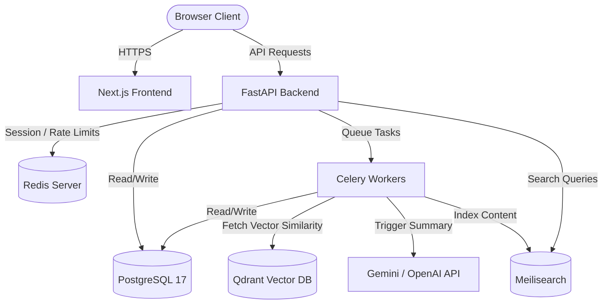

# System Architecture Overview

This document provides a high-level overview of the NewsIQ platform architecture, structural layers, component boundaries, and scaling characteristics.

---

## 1. Global Platform Topology

NewsIQ is organized as a decoupled multi-service application:
- **Frontend SPA**: Next.js App Router providing server-side rendering (SSR), client-side interactivity, and cookie-based consent validation.
- **Backend API**: Stateless FastAPI REST service managing data transactions, sessions, subscriptions, and AI pipeline orchestration.
- **Cache & Message Broker**: Redis caching access/refresh JWT tokens, storing rate-limit states, and queuing background jobs.
- **Vector Search Engine**: Qdrant database managing clustered article embeddings for story compilation.
- **Full-Text Search Engine**: Meilisearch index enabling fast user searches.
- **Background Workers**: Celery + Celery Beat scheduler executing ingestion, clustering, and AI timeline summarizations.
- **Primary Database**: PostgreSQL 17 storing users, bookmarks, preferences, consent Preferences, audit logs, and story clusters.

### High-Level Topology Map

---

## 2. Component Boundaries & Responsibilities

### A. Next.js Web App (`apps/web`)
- **Routing**: Static and dynamic App Router routes (e.g. `/home`, `/story/[id]`, `/legal`).
- **State Management**: Zustand stores caching auth tokens, themes, and UI states.
- **CMP Guard**: The `ConsentProvider` manages region-appropriate cookies and blocks third-party pixels (Google Analytics, PostHog, Meta, LinkedIn) prior to consent.

### B. FastAPI Service (`apps/api`)
- **API Endpoint Layer**: Routes divided into `/auth`, `/users`, `/stories`, `/sources`, and `/consent`.
- **Dependency Injection**: Resolves DB sessions, rate limit checks, and user roles (`deps.py`).
- **ORM Mapping**: SQLAlchemy models managing tables, indices, and constraints.

### C. Background Ingestion System
- **RSS Ingestion**: Parses feeds, extracts original publisher data, and scrapes full-text articles via `Newspaper4k`.
- **Clustering Engine**: Generates embeddings, inserts into Qdrant, and runs DBSCAN clustering to compile related articles into single stories.
- **LLM Pipeline**: Gemini/OpenAI API generates summaries, key bullet-point facts, timeline events, and diff indicators.

---

## 3. Scaling & Deployment Considerations

- **Stateless Services**: Both `web` and `api` containers are completely stateless and can scale horizontally behind a load balancer (such as AWS ALB or Nginx).
- **Session Caching**: Redis handles session state lookup (`token_hash`), avoiding expensive PostgreSQL queries on every API request.
- **Vector Bottleneck**: Qdrant clustering and embedding extraction run in Celery background queues rather than blocking API requests. Qdrant operates on dedicated memory-optimized instances.
