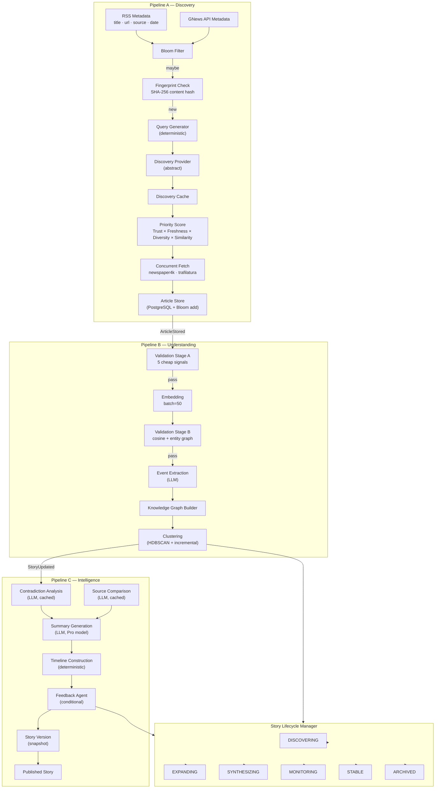
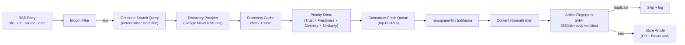
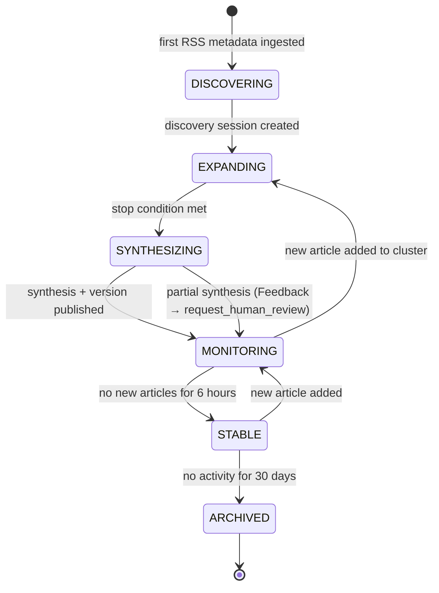

# NewsIQ AI Pipeline — Architecture Document v1.0

> **Status**: Approved for implementation. All open questions resolved.
> **Version**: 1.0 — this is the production blueprint.
> **Constraint**: Track A begins immediately after this document is approved.
>   Track B begins after Track A is stable in production.

---

## Table of Contents

1. [Three-Pipeline Architecture](#1-three-pipeline-architecture)
2. [Design Principles](#2-design-principles)
3. [Pipeline A — Discovery](#3-pipeline-a--discovery)
4. [Pipeline B — Understanding](#4-pipeline-b--understanding)
5. [Pipeline C — Intelligence](#5-pipeline-c--intelligence)
6. [Cross-Cutting Concerns](#6-cross-cutting-concerns)
   - 6.1 Story Lifecycle Manager
   - 6.2 Canonical Event ID (Two-Phase)
   - 6.3 Article Fingerprinting
   - 6.4 Bloom Filter URL Deduplication
   - 6.5 Discovery Provider Abstraction
   - 6.6 Adaptive Discovery Scheduling
   - 6.7 Source Priority Score (Trust × Freshness × Diversity × Similarity)
   - 6.8 Discovery Budget
   - 6.9 Provider-Agnostic Gateway
   - 6.10 Event Bus
   - 6.11 Pipeline Decision Log
   - 6.12 Story Versioning
7. [Data Model Additions](#7-data-model-additions)
8. [Pipeline Control Center](#8-pipeline-control-center)
9. [Quality Evaluation Framework](#9-quality-evaluation-framework)
10. [Bug Inventory](#10-bug-inventory)
11. [Implementation Roadmap](#11-implementation-roadmap)
12. [Resolved Decisions](#12-resolved-decisions)

---

## 1. Three-Pipeline Architecture

### 1.1 Design Rationale

The pipeline is organized as **three cooperating, independently scalable pipelines**.
Each has a single, clear responsibility. Dependencies flow in one direction only.

```
┌──────────────────────────────────────────────────────────────────┐
│  PIPELINE A — DISCOVERY                                          │
│  Finds and collects raw content. No AI reasoning.               │
│                                                                  │
│  RSS/GNews Metadata → Dedup → Query Gen → Source Discovery       │
│  → Priority Scoring → Concurrent Fetch → Fingerprint → Store     │
└────────────────────────────┬─────────────────────────────────────┘
                             │ ArticleStored events
┌────────────────────────────▼─────────────────────────────────────┐
│  PIPELINE B — UNDERSTANDING                                       │
│  Transforms raw text into structured knowledge. First LLM use.   │
│                                                                  │
│  Validation A → Embedding → Validation B → Event Extraction      │
│  → Knowledge Graph Builder → Clustering                          │
└────────────────────────────┬─────────────────────────────────────┘
                             │ StoryUpdated events
┌────────────────────────────▼─────────────────────────────────────┐
│  PIPELINE C — INTELLIGENCE                                        │
│  Synthesizes structured knowledge into human-readable output.    │
│                                                                  │
│  Contradiction Analysis → Source Comparison → Summary Generation │
│  → Timeline Construction → Feedback Agent → Versioned Story      │
└──────────────────────────────────────────────────────────────────┘
```

### 1.2 Why Three Pipelines

| Concern | Single Pipeline | Three Pipelines |
|---|---|---|
| Scaling | Scale everything together | Scale A, B, C independently by queue depth |
| Ownership | One team owns everything | Clear service ownership per pipeline |
| Failure isolation | Any failure stalls everything | A crash doesn't block Intelligence |
| Cost control | LLM calls mixed with IO work | LLM spend is entirely in B+C, gated by A |
| Future evolution | Adding a feature touches everything | Add a provider to A; C doesn't change |

### 1.3 End-to-End Data Flow



---

## 2. Design Principles

These principles apply to **every stage** in all three pipelines. They are not optional.

### P1 — Idempotency

Every stage must be safe to retry without changing the final result.

```
Embedding:       already embedded?        → skip (check embedding_status)
Summary:         content hash unchanged?  → skip (Incremental Updates Guard)
Discovery:       session already complete? → skip (check lifecycle_state)
Event Extract:   stage cache hit?          → return cached result
Fingerprint:     content_hash exists?      → mark duplicate, skip
```

No stage may assume it runs exactly once. Every stage must check pre-conditions and
exit early if the work is already done. This is not performance optimization — it is
a correctness requirement that enables safe retries, replay, and recovery.

### P2 — Decision Logging

Every non-trivial decision must be recorded in the Pipeline Decision Log (Section 6.11):

- Why was this article clustered into story X?
- Why was this article rejected at Validation Stage A?
- Why did the Feedback Agent trigger?
- Why was provider Gemini selected over OpenRouter?
- Why was the summary regenerated?
- Why was this discovery session terminated early?

### P3 — Budget First

Every stage that consumes external resources (search queries, HTTP fetches, embedding tokens,
LLM tokens) must check the appropriate budget bucket before proceeding. The budget gate is
not a circuit breaker — it is the first line of execution.

### P4 — Provider Independence

No pipeline code may reference a specific LLM provider, embedding service, or discovery
provider by name. All interactions go through abstract interfaces. Adding or replacing a
provider must require zero changes to pipeline code.

### P5 — Fail-Safe

Every external call (discovery provider, crawler, LLM, embedding, DB) must be wrapped
in a try/except that returns a safe default value on failure. Failures in optional stages
(Feedback Agent, source comparison) must never block story publication.

---

## 3. Pipeline A — Discovery

### 3.1 Metadata-First Ingestion

RSS and GNews already provide everything needed to start discovery:
**title, url, publisher, publish date**. We do **not** fetch the article body before
running source discovery. This means:

1. We never download an article that turns out to be a duplicate event
2. Discovery latency is minimized — we start searching while fetches are queued
3. For syndicated content (Reuters → Yahoo → MSN), deduplication catches them all
   before any network IO



### 3.2 Query Generation (Deterministic, Zero LLM)

```python
def generate_search_queries(title: str, entities: list[str]) -> list[str]:
    """
    Generate 2–4 search queries from RSS metadata.
    No LLM. Uses title keyword extraction + entity injection.

    'Apple unveils new AI chip' + ['Apple Inc', 'M4'] →
    [
        '"Apple" "AI chip" 2026',
        '"Apple" "M4" announcement',
        'Apple artificial intelligence processor launch',
    ]
    """
    # 1. Remove stop words, extract key noun phrases
    # 2. Inject top-2 entities as quoted terms
    # 3. Add year for recency
    # 4. Return deduplicated list, max 4 queries
```

### 3.3 Article Fingerprinting

New field: `Article.content_fingerprint: str | None`

```python
def compute_content_fingerprint(title: str, body: str, entities: list[str]) -> str:
    """
    SHA-256 fingerprint of normalized article content.
    Detects rewritten, updated, mirrored, or syndicated articles
    even when they arrive via different URLs.
    """
    normalized_title = title.lower().strip()
    normalized_body = " ".join(body.lower().split()[:500])  # first 500 words
    entity_str = "|".join(sorted(set(e.lower() for e in entities)))
    payload = f"{normalized_title}||{normalized_body}||{entity_str}"
    return hashlib.sha256(payload.encode("utf-8")).hexdigest()
```

**On duplicate fingerprint**:
- Article is stored with `is_duplicate=True` and `duplicate_of_url` pointing to the original
- Pipeline A stops — no embedding, no event extraction, no LLM calls
- The duplicate is logged in the Decision Log
- Discovery session still counts the domain as "seen"

**Detects**: publisher article updates (new URL, same content), content syndication
(Reuters → AP wire → Yahoo News), paywall bypass mirrors

---

## 4. Pipeline B — Understanding

### 4.1 Dual-Stage Event Validation

#### Stage A — Pre-Embedding (≤ 1ms, zero API calls)

Runs immediately after article is stored. Filters unrelated content before any embedding.

| Signal | Method | Pass Threshold | Cost |
|---|---|---|---|
| Title Jaccard | Token overlap with anchor title | ≥ 0.20 | O(n) string |
| Publication window | abs(pub_at − anchor_pub_at) | ≤ 48 hours | datetime diff |
| Location overlap | Country/city string match | Optional signal | O(n) string |
| Entity overlap | spaCy NER (tiny model, CPU only) | ≥ 1 shared token | ~5ms CPU |
| Domain trust | `Source.trust_tier` lookup | ≤ tier 5 (all pass initially) | O(1) dict lookup |

**Composite**: ≥ 2 of 5 signals must pass.
**Failure**: `event_validation_stage_a = "failed"`, logged to Decision Log, stop.

#### Stage B — Post-Embedding (Qdrant query only, zero LLM)

Runs after article is embedded and vectors are stored in Qdrant.

| Signal | Method | Pass Threshold | Cost |
|---|---|---|---|
| Cosine similarity | Qdrant nearest-neighbor vs story centroid | ≥ 0.65 | Vector query |
| Entity graph overlap | Shared `canonical_entity_id` count | ≥ 1 shared entity | DB count |

**Composite**: Cosine ≥ 0.65 **OR** entity graph ≥ 1.
**Failure**: `event_validation_stage_b = "failed"`, logged to Decision Log, stop.
**Savings**: Articles failing Stage A are never embedded. Articles failing Stage B are never event-extracted.

### 4.2 Knowledge Graph Builder (Explicit Stage)

The Knowledge Graph is currently assembled inside `generate_story_content()` as an
implicit in-memory dict. Elevating it to an **explicit named stage** makes it:
- Independently cacheable
- Independently testable
- Reusable by entity pages, recommendations, related stories, and future RAG
- A stable interface that Synthesis depends on (not on raw article text)

```python
class KnowledgeGraphBuilder:
    """
    Builds a structured story-level knowledge graph from extracted events.

    Input:  list[ArticleEvent] + list[ArticleEntity]
    Output: StoryKnowledgeGraph (cached in pipeline_cache + stored in DB as JSONB)

    The graph contains:
    - Event nodes (WHO did WHAT to WHOM)
    - Entity nodes (PERSON, ORG, GPE, etc.)
    - Timeline edges (event ordering)
    - Source attribution edges (which source reported which claim)
    - Contradiction edges (conflicting claims)
    - Confidence scores per node and edge
    """

    async def build(
        self,
        story_id: uuid.UUID,
        events: list[ArticleEvent],
        entities: list[ArticleEntity],
        source_map: dict[uuid.UUID, str],
        session: AsyncSession,
    ) -> StoryKnowledgeGraph:
        ...

    async def merge(
        self,
        existing_graph: StoryKnowledgeGraph,
        new_events: list[ArticleEvent],
    ) -> StoryKnowledgeGraph:
        """Incrementally update an existing graph with new events."""
        ...
```

**DB storage**:
```python
# Add to Story model:
knowledge_graph: Mapped[dict | None] = mapped_column(JSONB, nullable=True)
knowledge_graph_version: Mapped[int] = mapped_column(Integer, default=0)
```

**Cache key**: `kg:{story_id}:{article_set_hash}` in `pipeline_cache` (30-day TTL)

**Reuse**: Pipeline C reads the KG from cache. Entity pages query it for entity mentions.
Future RAG indexes it for question answering.

### 4.3 Clustering

Unchanged from current implementation (HDBSCAN batch + incremental cosine merge).
The clustering output now includes `canonical_event_id` assignment (Section 6.2).

---

## 5. Pipeline C — Intelligence

### 5.1 Stage Order

```
Knowledge Graph (from Pipeline B cache)
↓
Contradiction Analysis (LLM, cached by story_input_hash)
↓
Source Comparison (LLM, cached by story_input_hash)
↓
Summary Generation (LLM, Pro model)
↓
Timeline Construction (deterministic from ArticleEvents)
↓
Feedback Agent (conditional)
↓
Story Version Snapshot
↓
Publish (lifecycle → MONITORING)
```

### 5.2 Feedback Agent (Replaces Reflection Agent)

The Feedback Agent is a general **quality improvement stage** — not just a summary
checker. It evaluates the full synthesis output and flags specific weaknesses.

#### Evaluation Dimensions

| Dimension | Signal | Method |
|---|---|---|
| Summary hallucinations | Claims in summary not in KG | LLM cross-check vs graph |
| Missing entities | Key entities in KG absent from summary | Entity set diff |
| Weak clustering | Articles with cosine < 0.65 in cluster | Qdrant stats |
| Low source diversity | `HHI(source_weight) > 0.6` (one source dominates) | Diversity score |
| Inconsistent timeline | Event ordering contradicts source timestamps | Deterministic check |
| Ambiguous event matching | Multiple `canonical_event_id` candidates in cluster | ID conflict check |

#### Trigger Rules

The Feedback Agent triggers when **any** of:

| Trigger | Signal |
|---|---|
| High contradiction score | `story.contradiction_count >= 2` |
| Low synthesis confidence | `summary_confidence < 0.70` |
| High-stakes category | `story.category in ["politics", "finance", "health", "world"]` |
| Ambiguous event matching | Multiple `canonical_event_id` values in cluster |
| Low source diversity | `source_diversity_score < 0.40` |
| Admin-forced replay | `POST /admin/pipeline/replay/{story_id}?stage=feedback` |
| Breaking news flag | `story.is_breaking == True` |

#### Non-Triggers (Explicit)

The Feedback Agent **never** triggers because:
- Story has fewer than N articles
- Story is in an entertainment/lifestyle/travel/sports category (without other triggers)
- Time of day or queue position
- Story has already been reflected on in this version

#### Output Schema

```python
class FeedbackReport:
    has_hallucinations: bool
    hallucinated_claims: list[str]
    missing_entities: list[str]
    source_diversity_score: float      # 0.0 – 1.0
    clustering_quality_score: float    # 0.0 – 1.0
    timeline_consistency: bool
    ambiguous_event_match: bool
    overall_quality_score: float       # weighted composite
    recommended_action: Literal[
        "publish",                     # quality sufficient
        "regenerate_summary",          # summary has issues but KG is fine
        "expand_sources",              # diversity/coverage too low
        "request_human_review",        # quality too low to auto-publish
    ]
    explanation: str
```

### 5.3 Story Versioning

Every synthesis run creates a **versioned snapshot**. The latest version is what readers
see. Previous versions are retained for comparison and rollback.

```python
class StoryVersion(Base):
    __tablename__ = "story_versions"

    id: Mapped[uuid.UUID] = mapped_column(UUID(as_uuid=True), primary_key=True)
    story_id: Mapped[uuid.UUID] = mapped_column(ForeignKey("stories.id"))
    version_number: Mapped[int] = mapped_column()      # 1, 2, 3, …
    pipeline_version: Mapped[str] = mapped_column(String(20))  # e.g. "1.2.0"

    # Synthesis output snapshot
    headline: Mapped[str | None] = mapped_column(Text)
    one_line_summary: Mapped[str | None] = mapped_column(Text)
    short_summary: Mapped[str | None] = mapped_column(Text)
    detailed_summary: Mapped[str | None] = mapped_column(Text)
    key_facts: Mapped[list | None] = mapped_column(JSONB)
    knowledge_graph: Mapped[dict | None] = mapped_column(JSONB)
    contradictions: Mapped[list | None] = mapped_column(JSONB)
    source_list: Mapped[list | None] = mapped_column(JSONB)    # [{source_id, name, trust_tier}]
    timeline_events: Mapped[list | None] = mapped_column(JSONB)

    # Quality metadata
    article_count: Mapped[int] = mapped_column()
    source_diversity_score: Mapped[float | None] = mapped_column(Numeric(5, 4))
    feedback_quality_score: Mapped[float | None] = mapped_column(Numeric(5, 4))
    llm_cost_usd: Mapped[float | None] = mapped_column(Numeric(10, 6))

    trigger: Mapped[str] = mapped_column(String(50))   # "new_article" | "admin_replay" | "feedback"
    created_at: Mapped[datetime] = mapped_column(default=_now)

    __table_args__ = (
        UniqueConstraint("story_id", "version_number"),
        Index("idx_story_versions_story", "story_id", "version_number"),
    )
```

**Active version**: `Story.current_version_id` foreign key to `story_versions.id`.
**Rollback**: Set `Story.current_version_id` to a previous version's ID. No data loss.
**Comparison**: Admin UI can diff any two versions side-by-side.

---

## 6. Cross-Cutting Concerns

### 6.1 Story Lifecycle Manager



**State effects on pipeline behavior**:
- `DISCOVERING/EXPANDING`: Discovery provider searches active
- `SYNTHESIZING`: No new discovery searches (budget gate)
- `MONITORING`: Discovery searches paused; incremental article addition allowed
- `STABLE`: Discovery searches cancelled; read-only
- `ARCHIVED`: No pipeline activity; API returns from DB cache only

### 6.2 Canonical Event ID — Two-Phase

**Phase 1 — Temporary ID** (at discovery time, deterministic from title):
```python
temp_id = f"tmp_{year}_{slug_from_title}"
# e.g. tmp_2026_apple_unveils_ai_chip
```

**Phase 2 — Canonical ID** (after clustering stabilizes, entity+event_type+location+time):
```python
canonical_id = f"event_{year}_{event_type}_{primary_entity}_{location_slug}"
# e.g. event_2026_product_launch_apple_inc_cupertino
```

Canonical ID is generated by `KnowledgeGraphBuilder.assign_canonical_event_id()` using
the cluster's dominant entity, event type, and location extracted from `ArticleEvent` rows.

**ID Migration on clustering**: When articles with different temp IDs are merged into one
cluster, the Story becomes the canonical owner. All `ArticleEvent.canonical_event_id` and
`DiscoverySession.canonical_event_id` values are updated to the Story's canonical ID.
This is a single `UPDATE WHERE canonical_event_id IN (old_ids)` operation.

**Collision handling**: Append `_v{content_hash[:6]}` suffix if collision detected.

### 6.3 Article Fingerprinting

```python
# Article model addition:
content_fingerprint: Mapped[str | None] = mapped_column(String(64), nullable=True, index=True)
is_duplicate: Mapped[bool] = mapped_column(Boolean, default=False)
duplicate_of_url: Mapped[str | None] = mapped_column(Text, nullable=True)

# Unique constraint — prevents storage of identical content:
Index("idx_articles_fingerprint", "content_fingerprint",
      postgresql_where=text("content_fingerprint IS NOT NULL"))
```

**Fingerprint is computed** after full-text extraction (crawler_service output), before
DB insert. Computed on: `SHA-256(normalize(title) + normalize(body[:2000]) + sorted(entities))`.

**Detects**:
- Article URL updates (same content, new URL)
- Syndicated content (Reuters → Yahoo → MSN → local paper)
- Paywalled article mirrors
- Publisher A/B test variants (same body, different headline tested)

### 6.4 Bloom Filter URL Deduplication

```python
class URLBloomFilter:
    KEY = "newsiq:url_bloom"
    CAPACITY = 1_000_000   # 1M URLs
    ERROR_RATE = 0.001     # 0.1% false positive → 1 unnecessary DB check per 1000 new URLs

    async def maybe_exists(self, url: str) -> bool:
        """False = definitely new. True = check DB to confirm."""

    async def add(self, url: str) -> None:
        """Add URL after confirmed storage. Never add before DB insert."""
```

**Fallback** (if Redis Bloom/BF module unavailable): Standard Redis `SADD`/`SISMEMBER`
on a hash of the URL. Higher memory (~100 bytes/URL) but functionally equivalent.
Upstash Redis supports Bloom natively — prefer it.

### 6.5 Discovery Provider Abstraction

```python
class DiscoveryProvider(Protocol):
    name: str
    is_free: bool
    requests_per_minute: int

    async def search(self, query: str, max_results: int = 10) -> list[DiscoveredURL]: ...
    async def health(self) -> bool: ...
```

**Provider priority order** (resolved decision Q2):

1. `GoogleNewsRSSProvider` — free, no API key, no ToS issues, ≥100 req/hr
2. `GNewsSearchProvider` — wraps existing `gnews_client.search_articles()`, uses `GNEWS_API_KEY`
3. `NewsAPIProvider` — uses `NEWSAPI_KEY` when set
4. `BingNewsProvider` — uses `BING_API_KEY` when set (future)
5. `SerpAPIProvider` — paid, last resort (future)

### 6.6 Adaptive Discovery Scheduling

**Schedule** (exponential backoff):
```
Search 0 → Immediate (metadata received)
Search 1 → +15 minutes
Search 2 → +1 hour
Search 3 → +3 hours
Search 4 → +6 hours
Search 5 → +12 hours (final)
```

**Stop conditions** (any of):
- `story_confidence > 0.95` — sufficient trusted, consistent sources found ← NEW
- `known_domains >= 8` — enough publisher diversity
- `new_urls_last_search == 0` for 2 consecutive searches — story stabilized
- `search_count >= 6` — max search budget reached
- `story.lifecycle_state in ["STABLE", "ARCHIVED"]`
- `discovery_budget.search_requests >= STORY_SEARCH_BUDGET_MAX_REQUESTS`
- Manual admin override via `POST /admin/pipeline/discovery/{id}/complete`

**Story confidence** is the weighted average of article source trust scores in the cluster,
normalized by source count. Computed by `SourceDiscoveryManager` after each search:
```python
confidence = sum(source.quality_score for source in cluster_sources) / len(cluster_sources)
# Weighted: wire services (tier 1) contribute 1.0, unknown sources (tier 5) contribute 0.2
```

### 6.7 Source Priority Score

```
priority_score = (
    0.40 × trust_score(domain)           # trust
  + 0.25 × freshness_score(pub_at)       # freshness
  + 0.20 × diversity_bonus(domain)        # diversity ← NEW
  + 0.15 × similarity_score(title)        # similarity
)
```

#### Trust Score (from `Source.trust_tier`)

| Tier | Score | Examples |
|---|---|---|
| 1 | 1.00 | Reuters, AP, AFP, BBC World Service |
| 2 | 0.80 | NYT, Guardian, WSJ, Bloomberg |
| 3 | 0.60 | TechCrunch, Politico, Wired |
| 4 | 0.40 | Regional blogs, aggregators |
| 5 (unknown) | 0.20 | Auto-created sources |

#### Freshness Score

```python
def freshness_score(published_at: datetime) -> float:
    age_hours = (datetime.utcnow() - published_at).total_seconds() / 3600
    return math.exp(-0.115 * age_hours)  # half-life = 6h
```

#### Diversity Bonus ← NEW

Penalizes adding a URL from a domain already well-represented in the session.
Prevents 5 Reuters syndications from dominating the source set:

```python
def diversity_bonus(domain: str, known_domains: list[str]) -> float:
    """
    Returns 1.0 if domain is new to the session.
    Returns 0.0 if domain already appears 3+ times.
    Returns 0.5 if domain appears 1–2 times.
    """
    count = known_domains.count(domain)
    if count == 0:
        return 1.0
    elif count < 3:
        return 0.5
    else:
        return 0.0  # diminishing return — skip this URL
```

#### Similarity Score (Jaccard)

```python
def similarity_score(anchor_title: str, candidate_title: str) -> float:
    a = set(anchor_title.lower().split())
    b = set(candidate_title.lower().split())
    return len(a & b) / len(a | b) if (a | b) else 0.0
```

### 6.8 Discovery Budget

Extended to cover all resource consumption, not just LLM:

```python
class StoryBudget:
    canonical_event_id: str

    search_requests: int = 0          # Discovery provider calls
    search_cost_usd: float = 0.0      # Cost if using paid providers

    download_requests: int = 0        # Article HTTP fetches
    download_bytes: int = 0

    embedding_tokens: int = 0
    embedding_cost_usd: float = 0.0

    llm_input_tokens: int = 0
    llm_output_tokens: int = 0
    llm_cost_usd: float = 0.0

    feedback_agent_tokens: int = 0
    feedback_agent_cost_usd: float = 0.0

    cache_savings_usd: float = 0.0    # Estimated cost avoided through hits

    @property
    def total_cost_usd(self) -> float:
        return (self.search_cost_usd + self.embedding_cost_usd
                + self.llm_cost_usd + self.feedback_agent_cost_usd)
```

**Config additions** (`app/core/config.py`):
```python
STORY_SEARCH_BUDGET_MAX_REQUESTS: int = 30
STORY_DOWNLOAD_BUDGET_MAX_ARTICLES: int = 20
STORY_EMBEDDING_BUDGET_MAX_TOKENS: int = 500_000
STORY_LLM_BUDGET_DEFAULT_USD: float = 0.005
STORY_LLM_BUDGET_HIGH_STAKES_USD: float = 0.015
```

### 6.9 Provider-Agnostic Gateway

Gateway A (`app/ai/gateway.py`) is the **single, canonical gateway** for all LLM and
embedding calls. Gateway B (`app/llm_gateway/`) is deprecated for async paths.

`GatewayModel.ainvoke()` in [gateway_model.py](file:///c:/Users/zakau/NewsIQ/apps/api/app/agents/gateway_model.py#L45)
is migrated to call `ai_gateway.generate()`.

New providers added to Gateway A: Groq, Cerebras.

**Provider interface** (all implementations must satisfy):
```python
class AIProvider(Protocol):
    async def generate(self, req: GatewayRequest, key: APIKey) -> GatewayResponse: ...
    async def embeddings(self, text: str, key: APIKey) -> list[float]: ...
    async def health(self, key: APIKey) -> HealthStatus: ...
    def count_tokens(self, text: str) -> int: ...
```

**PRICING_TABLE alignment**: Startup validation warns on any model in `CAPABILITY_ROUTING`
missing from `PRICING_TABLE`. This prevents $0.00 cost calculations for unlisted models.

**Trusted publisher seeding** (resolved decision Q8): Loaded from
`app/config/trusted_publishers.yaml` on startup. No DB migration needed. YAML format:
```yaml
tier_1:
  - domain: reuters.com
    name: Reuters
    is_wire_service: true
tier_2:
  - domain: theguardian.com
    name: The Guardian
```

### 6.10 Event Bus

```python
class EventBus:
    """
    Redis Streams transport today. Kafka-compatible interface for future migration.
    Consumer groups ensure each event is processed exactly once per subscriber.
    """
    async def publish(self, event_type: str, payload: dict, partition_key: str = "") -> str:
        """partition_key maps to Kafka partition key in future migration."""

    async def consume(
        self, event_type: str, consumer_group: str, batch_size: int = 10
    ) -> list[dict]: ...
```

**Domain event table**:

| Event | Emitted By | Consumed By |
|---|---|---|
| `ArticleDiscovered` | RSS/GNews ingest | Bloom filter |
| `ArticleStored` | Pipeline A | Validation Stage A |
| `ArticleValidatedA` | Validation A | Source Discovery, Embedding |
| `DiscoveryComplete` | Discovery Manager | Embedding |
| `ArticleEmbedded` | Embedding | Validation Stage B |
| `ArticleValidatedB` | Validation B | Event Extraction |
| `EventsExtracted` | Event Extraction | KG Builder |
| `KnowledgeGraphBuilt` | KG Builder | Clustering |
| `StoryUpdated` | Clustering | Pipeline C |
| `SynthesisComplete` | Summary Generation | Feedback Agent |
| `StoryLifecycleChanged` | Lifecycle Manager | Discovery Scheduler, Admin UI |
| `FeedbackComplete` | Feedback Agent | Story Versioning, Lifecycle Manager |
| `StoryVersioned` | Story Versioning | Publication, Notification |

### 6.11 Pipeline Decision Log

A per-story structured audit trail of every significant pipeline decision.

```python
class PipelineDecision(Base):
    __tablename__ = "pipeline_decisions"

    id: Mapped[uuid.UUID] = mapped_column(UUID(as_uuid=True), primary_key=True)
    story_id: Mapped[uuid.UUID | None] = mapped_column(ForeignKey("stories.id"), nullable=True)
    article_id: Mapped[uuid.UUID | None] = mapped_column(ForeignKey("articles.id"), nullable=True)
    canonical_event_id: Mapped[str | None] = mapped_column(String(128), index=True)

    stage: Mapped[str] = mapped_column(String(50))           # e.g. "validation_a"
    decision: Mapped[str] = mapped_column(String(50))         # e.g. "rejected"
    reason: Mapped[str] = mapped_column(Text)                 # human-readable explanation
    signals: Mapped[dict | None] = mapped_column(JSONB)       # contributing signal scores
    provider: Mapped[str | None] = mapped_column(String(50))  # LLM provider selected
    model: Mapped[str | None] = mapped_column(String(100))    # model selected
    cache_hit: Mapped[bool | None] = mapped_column(Boolean)
    cost_usd: Mapped[float | None] = mapped_column(Numeric(10, 6))
    latency_ms: Mapped[int | None] = mapped_column()

    created_at: Mapped[datetime] = mapped_column(default=_now, index=True)

    __table_args__ = (
        Index("idx_pipeline_decisions_story", "story_id", "created_at"),
        Index("idx_pipeline_decisions_article", "article_id", "stage"),
        Index("idx_pipeline_decisions_event", "canonical_event_id", "stage"),
    )
```

**Decision categories and example reasons**:

| Stage | Decision | Example Reason |
|---|---|---|
| `bloom_filter` | `skipped` | "URL hash in Bloom filter — DB check skipped" |
| `url_dedup` | `duplicate` | "URL already in articles table" |
| `fingerprint` | `duplicate` | "content_fingerprint matches article {id} (Reuters syndication)" |
| `validation_a` | `rejected` | "title Jaccard 0.08 < 0.20, pub_time 72h > 48h (2/5 signals failed)" |
| `validation_b` | `rejected` | "cosine similarity 0.48 < 0.65, 0 shared entities" |
| `discovery` | `stopped` | "story_confidence 0.96 > 0.95 threshold after 3 searches" |
| `clustering` | `merged` | "cosine 0.82 with story {id}, event fingerprint overlap: 2/3 events" |
| `clustering` | `new_story` | "no existing story with cosine > 0.80 — created story {id}" |
| `provider_selection` | `selected` | "gemini-2.5-flash selected: budget_exceeded=False, stage=summary_generation" |
| `cache` | `hit` | "pipeline_cache HIT: stage=contradictions, hash=abc123" |
| `cache` | `miss` | "ai_cache MISS: prompt_hash=def456, temperature=0.1" |
| `feedback_agent` | `triggered` | "contradiction_count=3 ≥ 2, source_diversity=0.31 < 0.40" |
| `feedback_agent` | `skipped` | "sports category, no other triggers" |
| `synthesis` | `skipped` | "Incremental Updates Guard HIT — article set hash unchanged" |
| `summary` | `regenerated` | "version 1 had feedback: has_hallucinations=True — regenerating" |

---

## 7. Data Model Additions

All new columns require Alembic migrations. Grouped by pipeline.

### Pipeline A Additions

```python
# Article:
content_fingerprint: str | None         # SHA-256(normalized title+body+entities)
is_duplicate: bool                      # True if fingerprint matches existing
duplicate_of_url: str | None            # Original article URL
validation_stage_a_result: str | None   # "passed" | "failed" | "skipped"
validation_stage_b_result: str | None

# Source:
trust_tier: int                         # 1–5 (seeded from YAML)
is_wire_service: bool
is_primary_source: bool
domain_authority: float | None
quality_score: float | None             # composite, updated periodically
```

### Story & Event Additions

```python
# Story:
lifecycle_state: str                    # DISCOVERING | EXPANDING | … | ARCHIVED
lifecycle_updated_at: datetime | None
canonical_event_id: str | None          # event_{year}_{type}_{entity}_{location}
discovery_session_id: uuid.UUID | None  # FK → discovery_sessions.id
current_version_id: uuid.UUID | None    # FK → story_versions.id
knowledge_graph: dict | None            # JSONB
knowledge_graph_version: int
stable_since: datetime | None
archived_at: datetime | None

# ArticleEvent:
canonical_event_id: str | None

# New tables:
DiscoverySession                        # per-event discovery state
StoryVersion                            # per-synthesis snapshots
PipelineDecision                        # per-decision audit log
StoryReview                             # human quality review scores
StoryBudget                             # per-event cost envelope (Redis + optional DB)
```

---

## 8. Pipeline Control Center

### 8.1 Dashboard Tabs

#### Tab 1: Pipeline Health
Real-time stage throughput, queue depth, provider circuit state, cache hit rates.

#### Tab 2: Source Discovery
Active sessions, URL queue, provider hit rates, discovery budget utilization.

#### Tab 3: Provider Routing
Routing decisions, fallback events (last 24h), per-provider cost, rate limit status.

#### Tab 4: Story Timeline

Full end-to-end per-story trace, with timestamps and decision rationale:

```
RSS Metadata             2026-07-10 03:00:01  ─ url: reuters.com/article/...
Bloom Filter             2026-07-10 03:00:01  ✅ new URL
Query Generation         2026-07-10 03:00:02  → 3 queries generated
Source Discovery         2026-07-10 03:00:02  → 7 URLs found (Google News RSS)
                                                 3 skipped (diversity: Reuters x3)
                                                 4 queued for download
Concurrent Fetch         2026-07-10 03:00:05  ✅ 4 articles downloaded
Fingerprinting           2026-07-10 03:00:05  ✅ 4 unique (0 duplicates)
Validation Stage A       2026-07-10 03:00:06  ✅ 4 passed, 0 rejected
Embedding                2026-07-10 03:00:08  ✅ 5 articles embedded (12,450 tokens)
Validation Stage B       2026-07-10 03:00:09  ✅ cosine 0.81 (5 articles)
Event Extraction         2026-07-10 03:00:12  ✅ 3 events extracted (CACHE MISS)
KG Builder               2026-07-10 03:00:13  ✅ 12 nodes, 18 edges
Clustering               2026-07-10 03:00:14  ✅ merged into story abc-123
Discovery Stop           2026-07-10 03:00:14  ─ confidence 0.96 > 0.95 threshold
Contradiction Analysis   2026-07-10 03:00:22  ✅ 1 contradiction (CACHE HIT — $0 saved)
Source Comparison        2026-07-10 03:00:28  ✅ 5 sources compared
Summary Generation       2026-07-10 03:00:45  ✅ gemini-2.5-flash, 6,300 tokens
Timeline Construction    2026-07-10 03:00:45  ✅ 7 timeline events
Feedback Agent           2026-07-10 03:00:52  ✅ triggered (contradiction_count=1, world category)
                                                 result: publish (quality_score=0.89)
Story Versioned          2026-07-10 03:00:53  ✅ version 2 created
Published                2026-07-10 03:00:53  ─ lifecycle: MONITORING
Total Cost               $0.0026              ─ saved $0.0006 via cache
```

#### Tab 5: Cost Breakdown

```
event_2026_ukraine_ceasefire_talks

Discovery
  Searches:              4 requests    $0.000  (Google News RSS — free)
  Downloads:             6 articles    $0.000  (network only)

Embedding
  Tokens:                12,450        $0.0001

LLM
  Event Extraction:      8,200 tokens  $0.0008
  Contradictions:        3,100 tokens  $0.0003  (2× CACHE HIT saved $0.0006)
  Source Comparison:     4,800 tokens  $0.0005
  Summary Generation:    6,300 tokens  $0.0006
  Feedback Agent:        2,100 tokens  $0.0002
  ─────────────────────────────────────────────
  LLM Total:                           $0.0024

Cache Savings:                        −$0.0006

Total Cost:                            $0.0019
Budget Remaining:       $0.0031  (62% of $0.005 limit)
```

### 8.2 API Endpoints

```
GET  /api/v1/admin/pipeline/status
GET  /api/v1/admin/pipeline/discovery
GET  /api/v1/admin/pipeline/discovery/{session_id}
GET  /api/v1/admin/pipeline/providers
GET  /api/v1/admin/pipeline/budget/{canonical_event_id}
GET  /api/v1/admin/pipeline/cache
GET  /api/v1/admin/pipeline/queue
GET  /api/v1/admin/pipeline/story/{story_id}/timeline
GET  /api/v1/admin/pipeline/story/{story_id}/decisions
GET  /api/v1/admin/pipeline/story/{story_id}/versions
POST /api/v1/admin/pipeline/pause
POST /api/v1/admin/pipeline/resume
POST /api/v1/admin/pipeline/discovery/{session_id}/complete
POST /api/v1/admin/pipeline/replay/{story_id}
POST /api/v1/admin/pipeline/story/{story_id}/rollback/{version_number}
```

---

## 9. Quality Evaluation Framework

### 9.1 Automated Metrics

| Metric | Method | Gate |
|---|---|---|
| Headline keyword recall | Intersection / expected | ≥ 0.70 |
| Category accuracy | Exact match | 100% |
| Entity F1 | Precision/recall vs golden | ≥ 0.75 |
| Contradiction detection | P/R vs annotated | ≥ 0.60 |
| Summary ROUGE-L | vs reference summary | ≥ 0.50 |
| Source diversity score | HHI-based | ≥ 0.50 |
| LLM cost per story | Tracked USD | ≤ $0.020 |
| End-to-end latency | Ingestion → published | ≤ 120s |

### 9.2 Human Review Workflow

**Access**: Restricted to users with `is_reviewer=True` role (resolved Q6).

```python
class StoryReview(Base):
    __tablename__ = "story_reviews"
    story_id, story_version_id, reviewer_id, pipeline_version
    summary_quality: int         # 1–5
    hallucination_count: int     # number identified
    missing_facts_count: int
    contradiction_accuracy: int  # 1–5
    source_coverage_score: int   # 1–5
    source_diversity_score: int  # 1–5
    notes: str | None
    reviewed_at: datetime | None
```

**Use**: Compare average reviewer scores for `pipeline_version == "1.1.0"` vs
`"1.2.0"` across the same golden stories. Human scores form the regression gate before
promoting a new pipeline version to production.

### 9.3 CI Integration

```yaml
# .github/workflows/evaluate.yml
# Triggered on: PRs touching app/ai/, app/services/clustering_service.py,
#   app/services/event_service.py, app/agents/, app/services/knowledge_graph*.py
- name: Run pipeline evaluation suite
  run: pytest apps/api/tests/evaluation/ -v --tb=short -m "not slow"
```

---

## 10. Bug Inventory

### 🔴 P0 — Production Crashes (Fix immediately, Q1 resolved)

| ID | Bug | Location | Fix |
|---|---|---|---|
| B01 | `MultipleResultsFound` in GNews source resolution | [gnews_service.py:97,104,114](file:///c:/Users/zakau/NewsIQ/apps/api/app/services/gnews_service.py#L97) | `.scalars().first()` |
| B02 | Fire-and-forget cost tracking silently dropped | [gateway.py:293](file:///c:/Users/zakau/NewsIQ/apps/api/app/ai/gateway.py#L293) | `await` directly |

### 🟡 P1 — High Priority

| ID | Bug | Location | Fix |
|---|---|---|---|
| B03 | `asyncio.get_event_loop()` deprecated Python 3.12 | [request_manager.py:199,381](file:///c:/Users/zakau/NewsIQ/apps/api/app/llm_gateway/request_manager.py#L199) | `get_running_loop()` |
| B04 | N+1 commits in event extraction | [tasks.py:426,512,548](file:///c:/Users/zakau/NewsIQ/apps/api/app/workers/tasks.py#L426) | Batch commit |
| B05 | Source comparison sequential wait on cache hit | [clustering_service.py:469](file:///c:/Users/zakau/NewsIQ/apps/api/app/services/clustering_service.py#L469) | Check own cache first |
| B06 | N+1 Source queries in synthesis | [clustering_service.py:112](file:///c:/Users/zakau/NewsIQ/apps/api/app/services/clustering_service.py#L112) | Batch `WHERE id IN (...)` |
| B07 | In-process memory guard not multi-worker safe | [clustering_service.py:43](file:///c:/Users/zakau/NewsIQ/apps/api/app/services/clustering_service.py#L43) | Redis only |

### 🟢 P2 — Medium Priority

| ID | Bug | Location | Fix |
|---|---|---|---|
| B08 | Stuck articles in "processing" embedding status | [tasks.py:271](file:///c:/Users/zakau/NewsIQ/apps/api/app/workers/tasks.py#L271) | Recovery task |
| B09 | Two prompt registries that can drift | [ai/prompts/](file:///c:/Users/zakau/NewsIQ/apps/api/app/ai/prompts/), [services/prompt_registry.py](file:///c:/Users/zakau/NewsIQ/apps/api/app/services/prompt_registry.py) | Consolidate |
| B10 | No clustering distributed lock | `cluster_news_task` | Redis lock |
| B11 | PRICING_TABLE missing models | [ai/gateway.py](file:///c:/Users/zakau/NewsIQ/apps/api/app/ai/gateway.py) | Align + startup validation |
| B12 | Event extraction has no pipeline cache | [tasks.py](file:///c:/Users/zakau/NewsIQ/apps/api/app/workers/tasks.py) | Add stage cache |
| B13 | No token budget guard before Pro model | [ai_service.py](file:///c:/Users/zakau/NewsIQ/apps/api/app/services/ai_service.py) | `count_tokens()` + truncation |
| B14 | Direct `cache_service._redis` access | [clustering_service.py:306](file:///c:/Users/zakau/NewsIQ/apps/api/app/services/clustering_service.py#L306) | Public API |

---

## 11. Implementation Roadmap

### Track A — Production Hardening

> **Goal**: Fix correctness, reliability, caching, and cost accuracy.
> No new features. No new Alembic migrations (Track A is migration-free).
> **Prerequisite**: None.

#### A0: Emergency Fixes (1–2 days)

| Task | Fix | File | Effort |
|---|---|---|---|
| A0.1 | B01: `scalar_one_or_none()` → `.scalars().first()` | gnews_service.py:97,104,114 | 15 min |
| A0.2 | B02: `await` cost tracking (remove `create_task`) | gateway.py:293 | 30 min |
| A0.3 | B03: `get_event_loop()` → `get_running_loop()` | request_manager.py:199,381 | 30 min |
| A0.4 | B04: Batch DB commits in event extraction | tasks.py:426,512,548 | 2 hr |
| A0.5 | B05: Source comparison cache-before-await | clustering_service.py:469 | 1 hr |
| A0.6 | B06: Batch Source fetch in synthesis | clustering_service.py:112 | 1 hr |
| A0.7 | B10: Redis lock on `cluster_news_task` | tasks.py | 1 hr |

#### A1: Cache & Reliability (3–4 days)

| Task | Fix | Effort |
|---|---|---|
| A1.1 | B12: Add `pipeline_cache` to event extraction | 3 hr |
| A1.2 | B13: Token budget guard before Pro model | 2 hr |
| A1.3 | B14: Public guard API on `pipeline_cache` | 2 hr |
| A1.4 | B07: Remove in-process memory guard | 1 hr |
| A1.5 | B11: PRICING_TABLE align + startup validation | 2 hr |
| A1.6 | B09: Consolidate prompt registries | 3 hr |
| A1.7 | B08: "Processing" status recovery task | 2 hr |

#### A2: Gateway Unification (1 week)

| Task | Description | Effort |
|---|---|---|
| A2.1 | Add Groq + Cerebras to Gateway A | 1 day |
| A2.2 | Add agent capability routes to `CAPABILITY_ROUTING` | 2 hr |
| A2.3 | Migrate `GatewayModel.ainvoke()` → Gateway A | 3 hr |
| A2.4 | Deprecate Gateway B async path | 1 day |
| A2.5 | Merge duplicate Prometheus metrics | 3 hr |
| A2.6 | Load trusted publishers from YAML on startup | 2 hr |

#### A3: Quality Evaluation Baseline (3–4 days)

| Task | Description | Effort |
|---|---|---|
| A3.1 | Golden dataset (5–10 fixture stories) | 1 day |
| A3.2 | Automated evaluation test suite | 1 day |
| A3.3 | CI evaluation workflow | 3 hr |
| A3.4 | `StoryReview` model + migration (reviewer role) | 3 hr |
| A3.5 | Human review admin UI tab | 1 day |

---

### Track B — Feature Evolution

> **Prerequisite**: Track A Phase A0 in production.
> Phases B1–B4 can run in parallel if team capacity allows.

#### B1: Story Lifecycle Manager (1 week)

| Task | Description | Effort |
|---|---|---|
| B1.1 | `StoryLifecycleManager` + state machine | 1 day |
| B1.2 | `lifecycle_state`, `canonical_event_id` to Story + migration | 3 hr |
| B1.3 | Lifecycle-aware discovery scheduling | 2 hr |
| B1.4 | Stable + Archive candidate tasks | 2 hr |
| B1.5 | `StoryLifecycleChanged` domain events | 2 hr |
| B1.6 | Tests: all state transitions | 1 day |

#### B2: Article Fingerprinting + Bloom Filter (3–4 days)

| Task | Description | Effort |
|---|---|---|
| B2.1 | `compute_content_fingerprint()` utility | 2 hr |
| B2.2 | `content_fingerprint`, `is_duplicate` to Article + migration | 2 hr |
| B2.3 | Fingerprint check in crawl pipeline | 2 hr |
| B2.4 | `URLBloomFilter` class (Redis BF, fallback to SADD) | 3 hr |
| B2.5 | Integrate Bloom filter at ingestion entry point | 2 hr |
| B2.6 | Decision Log entries for fingerprint + Bloom | 1 hr |
| B2.7 | Tests | 3 hr |

#### B3: Canonical Event ID — Two-Phase (3–4 days)

| Task | Description | Effort |
|---|---|---|
| B3.1 | Temporary ID generator (`tmp_{year}_{slug}`) | 1 hr |
| B3.2 | Canonical ID generator (post-clustering, entity-based) | 3 hr |
| B3.3 | ID migration on cluster merge | 2 hr |
| B3.4 | `canonical_event_id` to Article, Story, ArticleEvent + migration | 2 hr |
| B3.5 | Collision detection + suffix | 1 hr |
| B3.6 | Tests | 3 hr |

#### B4: Dual-Stage Event Validation (1 week)

| Task | Description | Effort |
|---|---|---|
| B4.1 | `EventValidationService.validate_stage_a()` (5 signals) | 1 day |
| B4.2 | `EventValidationService.validate_stage_b()` (cosine + entity graph) | 1 day |
| B4.3 | DB fields + migrations | 2 hr |
| B4.4 | Pipeline integration (A before embed, B after embed) | 2 hr |
| B4.5 | Prometheus metrics + Decision Log entries | 2 hr |
| B4.6 | Tests: all 7 signals | 1 day |

#### B5: Metadata-First Ingestion + Source Discovery (2 weeks)

| Task | Description | Effort |
|---|---|---|
| B5.1 | `DiscoveryProvider` abstract interface | 3 hr |
| B5.2 | `GoogleNewsRSSProvider` (primary) | 1 day |
| B5.3 | `GNewsSearchProvider` (wraps existing client) | 3 hr |
| B5.4 | `DiscoveryProviderRegistry` with priority ordering | 3 hr |
| B5.5 | `SourceDiscoveryManager` service | 2 days |
| B5.6 | `DiscoverySession` model + migration | 2 hr |
| B5.7 | Discovery Cache (Redis CRUD + stop conditions) | 1 day |
| B5.8 | Confidence-based stop: `story_confidence > 0.95` | 2 hr |
| B5.9 | Adaptive scheduling Celery task | 1 day |
| B5.10 | Source Priority Score with Diversity Bonus | 1 day |
| B5.11 | Extended `StoryBudget` + budget gates | 3 hr |
| B5.12 | Metadata-first ingestion path (no fetch before discovery) | 1 day |
| B5.13 | Tests: discovery, cache, scheduler, budget, diversity | 2 days |

#### B6: Knowledge Graph Builder + Story Versioning (1 week)

| Task | Description | Effort |
|---|---|---|
| B6.1 | `KnowledgeGraphBuilder` service | 2 days |
| B6.2 | `StoryKnowledgeGraph` schema (Pydantic + JSONB) | 3 hr |
| B6.3 | KG cache in `pipeline_cache` | 2 hr |
| B6.4 | `StoryVersion` model + migration | 2 hr |
| B6.5 | Version snapshot on every synthesis | 3 hr |
| B6.6 | Rollback endpoint + admin UI action | 3 hr |
| B6.7 | KG storage in Story.knowledge_graph | 2 hr |
| B6.8 | Tests | 1 day |

#### B7: Feedback Agent + Pipeline Decision Log (1 week)

| Task | Description | Effort |
|---|---|---|
| B7.1 | `FeedbackAgent` (expanded from current `ReflectionAgent`) | 2 days |
| B7.2 | `FeedbackReport` schema with all 6 dimensions | 3 hr |
| B7.3 | Trigger rule engine | 3 hr |
| B7.4 | `PipelineDecision` model + migration | 2 hr |
| B7.5 | Decision logging in all pipeline stages | 2 days |
| B7.6 | Decision Log admin UI | 1 day |
| B7.7 | Tests: trigger rules, all feedback dimensions | 1 day |

#### B8: Event Bus + Pipeline Control Center (2 weeks)

| Task | Description | Effort |
|---|---|---|
| B8.1 | `EventBus` (Redis Streams, Kafka-compatible interface) | 1 day |
| B8.2 | Emit all 13 domain events from pipeline stages | 2 days |
| B8.3 | Refactor Celery tasks as event consumers | 2 days |
| B8.4 | All 12 admin API endpoints | 2 days |
| B8.5 | Admin UI: 5-tab dashboard | 3 days |

---

## 12. Resolved Decisions

All open questions from previous revisions are resolved. No further discussion needed.

| # | Question | Decision |
|---|---|---|
| Q1 | Authorize immediate P0 bug fixes? | **Yes. A0 begins immediately.** B01 (`MultipleResultsFound`) and B02 (fire-and-forget cost) are production crashes. Fix without waiting for Track B approval. |
| Q2 | Primary discovery provider? | **Google News RSS first** (free, no ToS issues). GNews API `/search` as first fallback (key already in config). NewsAPI third. |
| Q3 | Track A before Track B? | **Yes. Complete Track A (A0→A3) before beginning Track B feature work.** A stable foundation makes Track B validation reliable. A0 is the only exception — it runs immediately. |
| Q4 | Redis Bloom not available? | **Redis SADD/SISMEMBER as fallback.** Prefer Upstash (native Bloom support). If standard Redis, use hash-set. Document in deployment guide. |
| Q5 | Canonical Event ID ownership after clustering? | **Story is the canonical owner.** Story.canonical_event_id is assigned by KG Builder after clustering. ArticleEvent + DiscoverySession IDs are migrated to match via a single bulk UPDATE. |
| Q6 | Human review access? | **Reviewer role only.** `User.is_reviewer` flag. Not visible to all admins. Reviewers are designated editors or QA team members. |
| Q7 | Redis Streams vs Kafka? | **Redis Streams today.** `EventBus` interface is Kafka-compatible (explicit consumer groups, partition_key parameter). Migration to Kafka requires only a new transport implementation — zero pipeline changes. |
| Q8 | Trusted publisher seeding? | **YAML configuration file** (`app/config/trusted_publishers.yaml`). Loaded on startup by `CapabilityRouter.load_trusted_publishers()`. Update trust tiers without DB migrations. |

---

## Appendix: Existing Optimizations Preserved

All of the following are well-implemented and require no changes:

✅ **3-layer caching**: `ai_cache` (prompt-hash, 30d TTL) + `pipeline_cache` (stage-level) + `embedding_cache`
✅ **Incremental Updates Guard** — `story_synthesis_hash:{story_id}` Redis key skips re-synthesis
✅ **Pre-extracted entity reuse** — no redundant LLM call in synthesis when article entities exist
✅ **Cost budget gating** — `CostBudgetManager` with per-stage thresholds (`STAGE_BUDGET_THRESHOLDS`)
✅ **Batch embedding** — 50 articles/batch with cascade to event extraction
✅ **Pipeline pause on quota** — 1-hour Redis TTL when all providers rate-limited
✅ **Retry + backoff** — 3 attempts, 2× backoff per provider in Gateway A
✅ **Circuit breaker** — `ProviderHealthTracker`: trips at 3 failures, 5-min reset, half-open probe
✅ **Model routing** — `model_router.py` selects cheaper models when budget exceeded
✅ **GNews Redis lock** — 25-min TTL prevents duplicate category fetches

---

# Epic 2: Branding Migration

This Epic aims to centralize the NewsIQ branding system, ensuring consistency across all applications (`apps/web`, `apps/admin`, and `apps/api`) and removing all hardcoded branding strings, colors, SVGs, and metadata.

## User Review Required
> [!IMPORTANT]
> The overall migration plan is approved, but the introduction of a shared `packages/branding` module is postponed as per user feedback. The repository is not yet a proper workspace, so adding a local shared package introduces unnecessary complexity. The branding implementation will be kept within the existing project structure for now. Assets will be migrated first, and deprecated branding will only be removed after successful validation.

## Proposed Changes

### [Backend - apps/api]
Update the backend to remove hardcoded strings and colors, specifically from email templates.
- **[MODIFY]** `apps/api/app/services/email_service.py` - Replace hardcoded "#C41E3A", "⚡", and "NewsIQ" with configuration variables injected from `settings`.
- **[MODIFY]** `apps/api/app/core/config.py` - Add central branding configurations (Brand Name, Colors, URLs) to `Settings`.

### [Frontend Web - apps/web]
Migrate existing branding to use semantic color tokens and ensure centralized assets without external packages. Scope strictly to branding.
- **[MODIFY]** `apps/web/src/app/globals.css`, `landing.css`, `legal.css` - Replace raw hex values (`#C41E3A` and `#EF4444`) with semantic CSS variable tokens (e.g., `--brand-primary`).
- **[MODIFY]** `apps/web/src/app/landing-client.tsx`, `digest/setup/page.tsx` - Use semantic color tokens instead of raw hex values.
- **[MODIFY]** `apps/web/public/manifest.json` - Ensure `theme_color` is strictly matched to the semantic primary color.
- **[MODIFY]** `apps/web/src/app/icon.tsx`, `apple-icon.tsx`, `icon-[size]/route.tsx` - Preserve SVG files as the source of truth for assets. Ensure they are correctly exported and used.

### [Frontend Admin - apps/admin]
Migrate the admin app to use consistent branding matching the web app.
- **[MODIFY]** `apps/admin/src/app/globals.css` - Replace hardcoded `#EF4444` with semantic CSS variables (e.g., `--brand-primary`).
- **[MODIFY]** `apps/admin/src/app/page.tsx`, `apps/admin/src/app/admin/layout.tsx` - Preserve SVG files as the source of truth for assets and use them instead of inline SVGs where applicable, or standardise the inline SVGs with semantic color tokens. Remove hardcoded "NewsIQ" strings and use constants.
- **[MODIFY]** `apps/admin/src/app/admin/failure-analytics/page.tsx` - Remove any hardcoded colors or strings.

## Verification Plan

### Automated Tests
- Run backend tests `pytest` to ensure email service config changes don't break functionality.
- Run `npm run build` on both `apps/web` and `apps/admin` to verify successful builds.

### SEO/Metadata Verification Checklist
- [ ] Verify `title` tags on all major pages (`apps/web` and `apps/admin`).
- [ ] Verify `meta description` tags on `apps/web`.
- [ ] Verify Open Graph (`og:title`, `og:description`, `og:image`) metadata.
- [ ] Verify Twitter Card (`twitter:title`, `twitter:description`, `twitter:image`) metadata.
- [ ] Check `robots.txt` and `sitemap.xml` for correct branding URLs (if applicable).
- [ ] Verify `manifest.json` `theme_color` and `background_color` match branding semantic tokens.
- [ ] Verify favicon (`favicon.ico`, `icon.tsx`, `apple-icon.tsx`) rendering and resolution across devices.

### Manual Verification
- Verify the Email Verification and Password Reset HTML outputs in terminal/logs contain the correct branding.
- Load `apps/web` and `apps/admin` locally and ensure the logos, favicons, and primary colors render correctly.
- Ensure that old branding assets are only removed *after* successful validation of the new ones.
