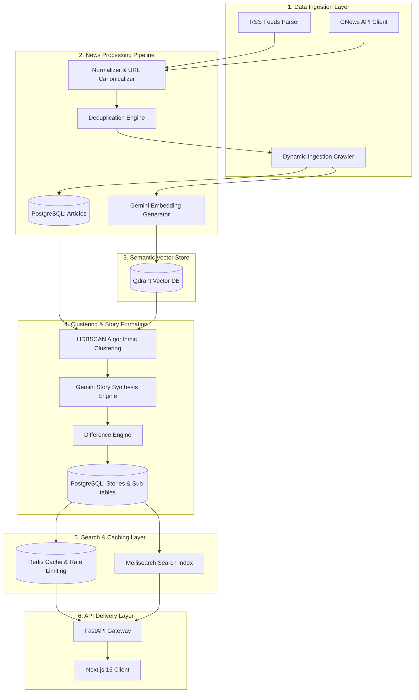
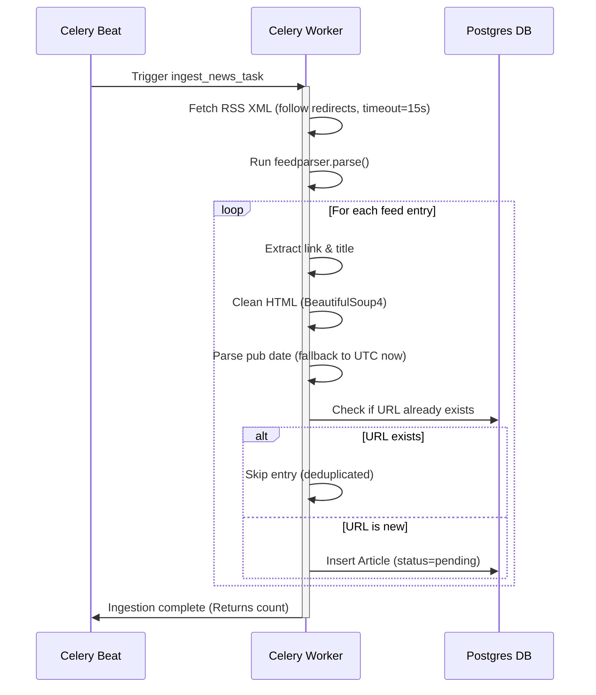
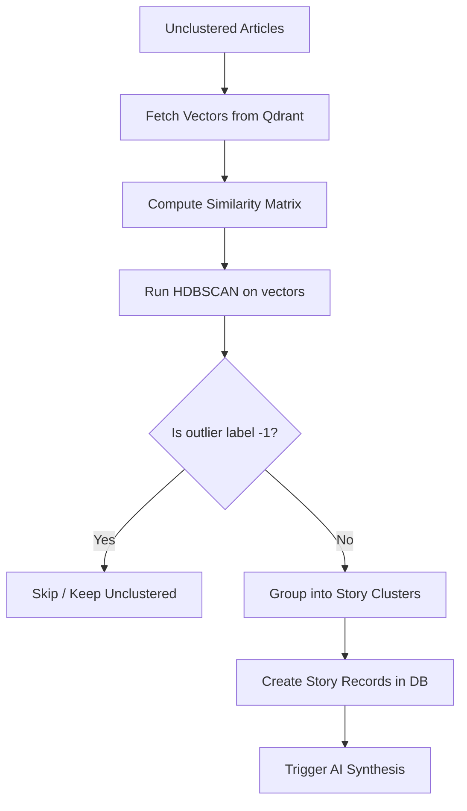
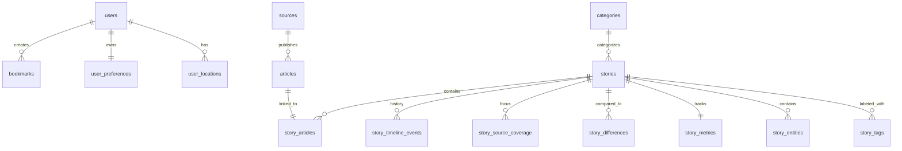

# NewsIQ — System Architecture & Production Specifications

This document defines the complete technical architecture, data structures, and operational pipelines of the **NewsIQ News Intelligence Engine**. It serves as the primary system specification for engineering, deployment, and future expansion.

---

## 🗺️ System Architecture Overview

The following diagram illustrates the end-to-end architecture of NewsIQ, from news ingestion to vector storage, AI synthesis, and API delivery:



---

## 📦 Deliverable 1 — Data Sources Architecture

### 1.1 GNews API Ingestion

The GNews API is our primary structured ingestion vector. It provides curated global news coverage with rich, normalized metadata.

#### 1.1.1 Fetching Mechanism
NewsIQ fetches top headlines concurrently using the `gnews_client` built on `httpx.AsyncClient`. Calls are parameterized by category, country, and language.

- **Endpoint:** `GET https://gnews.io/api/v4/top-headlines`
- **Authentication:** Injected via the `apikey` query parameter.
- **Parameters Used:**
  - `lang=en` (English only for MVP)
  - `country=us` or `country=in`
  - `category` (routed dynamically)
  - `max=10` (maximum items returned per call to optimize free-tier quota)

#### 1.1.2 Rate Limits & Throttling
- **Daily Quota:** 100 requests/day on the GNews Free Tier.
- **Schedule:** Fetches occur every 30 minutes, fetching 3 categories per run (`world`, `technology`, `business`), totaling 144 requests/day. A Redis rate-limit lock with a 25-minute TTL prevents duplicate fetches.
- **Fail-Open Policy:** If Redis is down, fetching continues directly. If GNews returns `429 Too Many Requests`, the scheduler logs the error and backs off until the next scheduled run.

#### 1.1.3 Metadata Mapping & Normalization
GNews responses are parsed and mapped to the standard internal database schema:
- `title` $\rightarrow$ `Article.title` (cleaned of publisher suffixes)
- `description` $\rightarrow$ `Article.description` (stripped of HTML tags)
- `content` $\rightarrow$ `Article.content` (concatenated with description if content is truncated)
- `url` $\rightarrow$ `Article.url` (canonicalized using SHA-256)
- `publishedAt` $\rightarrow$ `Article.published_at` (converted to naive UTC datetime)
- `source.name` $\rightarrow$ `Article.author` (used to map or auto-generate publisher sources)

#### GNews Response Example
```json
{
  "totalArticles": 1,
  "articles": [
    {
      "title": "Fed Signals Interest Rate Cuts in Late 2026",
      "description": "The Federal Reserve indicated it may cut interest rates sooner than expected...",
      "content": "WASHINGTON — Federal Reserve officials signaled Wednesday that they are prepared to lower interest rates... [1024 chars]",
      "url": "https://www.bloomberg.com/news/articles/2026-06-17/fed-signals-rate-cuts",
      "image": "https://assets.bwbx.io/images/users/iqjWHBFdfxzs/v1/-1x-1.jpg",
      "publishedAt": "2026-06-17T19:00:00Z",
      "source": {
        "name": "Bloomberg",
        "url": "https://www.bloomberg.com"
      }
    }
  ]
}
```

---

### 1.2 RSS Feeds Ingestion

RSS feeds provide a high-frequency, zero-cost, raw text ingestion channel. 

#### 1.2.1 Seeded RSS Sources
NewsIQ monitors active feeds for these major publishers:
1. **Reuters:** `http://rss.reuters.com/news/topnews` (US Coverage)
2. **BBC News:** `http://feeds.bbci.co.uk/news/rss.xml` (UK & World Coverage)
3. **NDTV:** `https://feeds.feedburner.com/ndtvnews-top-stories` (India Coverage)
4. **Times of India:** `https://timesofindia.indiatimes.com/rssfeedstopstories.cms` (India Coverage)
5. **The Indian Express:** `https://indianexpress.com/section/india/feed/` (India Coverage)

#### 1.2.2 RSS Parsing Flow


---

### 1.3 Dynamic Ingestion Crawler Architecture

To move beyond the character limitations of GNews contents (~1,000 characters) and RSS summaries, NewsIQ implements a multi-tier dynamic crawler architecture:

```text
Publisher URL ──► [Crawler Engine] ──► [Extraction Fallback Stack] ──► [BS4 Cleaner] ──► Database
```

#### Extraction Fallback Stack
The crawler processes URLs using an automated, CPU-friendly fallback stack:
1. **newspaper4k (Primary):** Extracted via the recommended `newspaper.article(url, input_html)` shortcut. Captures main body text, authors list, publish date, and top image URL.
2. **trafilatura (Secondary):** Fallback parser triggered if newspaper4k fails or returns content < 150 characters. Excellent at parsing main body text and metadata out of dense custom structures.
3. **readability-lxml (Tertiary):** Fallback parser using DOM density to isolate the article content. The resulting DOM summary is stripped of HTML tags via BeautifulSoup.
4. **BeautifulSoup Cleaner (Quaternary):** Custom scrub routine removing navigation blocks, footer, scripts, styles, forms, and ad containers (`ads`, `advertisement`, `ad-container`, etc.), leaving only text.

#### Execution Details & Concurrency
- **Asynchronous I/O**: The HTML is fetched asynchronously via `httpx.AsyncClient` with browser-like request headers and 10-second timeouts.
- **CPU Concurrency**: Since the extraction libraries are CPU-heavy and synchronous, their parsing blocks are executed in parallel worker threads using `asyncio.to_thread` to prevent blocking the event loop.
- **Rate-Limit Semaphore**: Crawl operations run concurrently during ingestion, throttled to a maximum of 5 simultaneous fetches using `asyncio.Semaphore(5)` to prevent overloading source domains or consuming excessive Celery memory.
- **Fail-Safe Fallback**: If crawling a publisher URL fails completely (403, 404, timeouts, paywalls), the ingestion pipeline falls back to the original GNews snippet or RSS summary, ensuring no articles are lost.

---

## ⚙️ Deliverable 2 — News Processing Pipeline

### Stage 1 — Article Collection
- **Scheduler:** Celery Beat schedules GNews fetches every 30 minutes and RSS parsing every 5 minutes.
- **Worker Concurrency:** Limited to 2 concurrency units in Docker to prevent overlapping requests and stay within Gemini free-tier rate limits.
- **Concurrent Ingestion & Crawling**: During ingestion, newly discovered URLs are crawled concurrently under an `asyncio.Semaphore(5)` limit. Synchronous HTML extraction is offloaded via `asyncio.to_thread`.
- **Error Handling:** `httpx` timeouts are set to 15 seconds for feeds/APIs, and 10 seconds for crawled pages. Crawler failures proceed with graceful fallback to standard feed descriptions or GNews snippets.

### Stage 2 — Article Normalization
All collected articles are mapped to a single unified schema prior to vector processing:

```python
class NormalizedArticle(BaseModel):
    title: str
    description: str | None
    content: str
    source_id: uuid.UUID
    url: str
    author: str | None
    image_url: str | None
    published_at: datetime
    crawled_at: datetime
    embedding_status: str  # "pending", "completed", "failed"
```
*Why Normalization is Needed:* Normalizing fields ensures that differing publisher formats (e.g., `<dc:date>` in RSS vs `publishedAt` in JSON) do not pollute the database, and that the vectorizer receives a clean, standardized string input.

### Stage 3 — Deduplication
To prevent duplicate article processing, NewsIQ employs a three-tier deduplication model:

1. **URL Canonicalization (Utility):** Standardizes URLs before database lookups (removes `utm_*`, lowercase schemes, drops fragments).
2. **Database Constraint:** `Article.url` has a unique index, preventing exact URL duplicates from inserting.
3. **Semantic Title Similarity:** During batch processing, articles from the same source with a cosine similarity $> 0.92$ over a $\pm 2$-hour window are marked as `duplicate` and excluded from clustering.

### Stage 4 — Embedding Generation
- **Why Embeddings are Needed:** Convert raw text into dense vector space where spatial proximity represents semantic similarity.
- **Vectorizer:** Gemini API `models/text-embedding-004` (runs on a single-worker thread pool to avoid FastAPI blocking).
- **Dimensions:** 3072 dimensions (`gemini-embedding-001`).
- **Vector Flow:**
```text
Article (Title + Description + Content[:2000]) ──► Gemini SDK ──► 3072 Vector ──► Qdrant (articles collection, COSINE)
```

---

### Stage 5 — Clustering Engine

Clustering is the algorithmic core of NewsIQ. Rather than assigning arbitrary keyword groups, it groups articles dynamically based on dense semantic vector neighborhoods.



#### Why HDBSCAN is Used
- **No K Requirement:** Unlike K-Means, HDBSCAN does not require pre-specifying the number of story clusters.
- **Handles Noise:** Automatically separates outlier articles (marked `-1`) into a noise category.
- **Parameter Specs:**
  - `min_cluster_size = 2` (a story must have at least 2 distinct articles)
  - `min_samples = 1` (aggressive neighborhood detection to pull in small events)
  - `cluster_selection_epsilon = 0.35` (maximum distance threshold for cluster merges)

#### Real-time Merges & Expiration
- **Incremental Join:** When a new article is embedded, Qdrant searches for similar articles. If a match is found with a cosine similarity $> 0.80$, the article is immediately merged into the existing story, and AI synthesis is re-triggered.
- **Archiving:** Stories with no new articles for over 7 days are set to `archived` status to keep the trending feed active and timely.

---

### Stage 6 — AI Story Synthesis

This stage leverages Gemini to synthesize raw clusters of articles into a single, cohesive story.

#### Prompt Constraints & Input Format
The prompt supplies up to 10 articles from the cluster:
```text
Analyze the following articles about a single news event:
--- ARTICLE 1 ---
Source: Times of India
Title: ...
Content: ...

Synthesize this into a single cohesive story.
```

#### Output Schema (Structured Outputs)
We enforce structured outputs by passing `response_schema=StoryAIResponse` directly to the Gemini generate config.

```python
class StoryAIResponse(BaseModel):
    headline: str            # Objective, non-clickbait headline (max 120 chars)
    one_line_summary: str    # Summary in under 20 words
    short_summary: str       # Executive summary paragraph (~50 words)
    detailed_summary: str    # In-depth multi-paragraph description (~150 words)
    key_facts: list[str]     # 3 to 6 objective facts
    category: str            # Slug (politics, technology, business, sports, etc.)
    timeline: list[Event]    # Timestamps & event descriptions
    differences: list[Diff]  # Publisher differences
```

#### Caching & Quota Recovery
- **Redis Cache:** Generated story JSON is cached for 15 minutes (`story:{id}`).
- **Model Fallback Chain:** To prevent daily quota exhaustions on the free tier, requests automatically route down the fallback chain:
  `gemini-2.5-flash` $\rightarrow$ `gemini-2.5-flash-lite` $\rightarrow$ `gemini-2.0-flash` $\rightarrow$ `gemini-2.0-flash-lite`.

---

### Stage 7 — Difference Engine

The Difference Engine identifies publisher bias, unique data points, omissions, and contradictions.

#### Analysis Prompts & Examples
Gemini performs comparative linguistics across the text corpus.

```text
Compare the reporting of the sources in the provided cluster:
- Identify if any publisher has unique information others omitted.
- Highlight conflicting factual claims (e.g. death tolls, event timelines).
- Note the primary angle or focus of each publisher.
```

#### Example Output:
- **NDTV Focus:** School closures and local transport safety.
- **Times of India Focus:** City-wide traffic routing and detours.
- **Indian Express Focus:** Local rainfall numbers (127mm in 24h).
- **HT Focus:** Government disaster management statements.

---

### Stage 8 — Source Coverage
- **Algorithm:** The `focus_area` text generated in the differences payload is parsed.
- **Processing:** The engine extracts the first sentence of the `unique_information` block, truncates it to 100 characters, and writes it to the `story_source_coverage` table as the source's primary focus.

---

### Stage 9 — Trending Engine

Trending scores are calculated using a multi-signal gravity decay algorithm:

$$\text{trend\_score} = (0.40 \times \text{source\_score}) + (0.35 \times \text{recency\_score}) + (0.25 \times \text{engagement\_score})$$

- **Source Score:** $\text{source\_count} / 5.0$, capped at $1.0$.
- **Recency Score (Decay):** $e^{-0.1155 \times \text{hours\_elapsed}}$ (half-life of 6 hours).
- **Engagement Score:** $\frac{\text{views} \times 1 + \text{bookmarks} \times 3 + \text{shares} \times 5}{500.0}$, capped at $1.0$.
- **Caching:** The trending feed list is cached per category in Redis for 5 minutes (`trending:global`, `trending:politics`).

---

## 🗄️ Deliverable 3 — Database Schema



### Table Definitions

#### 1. `articles`
Stores raw news articles.
- `id` (UUID, PK)
- `source_id` (UUID, FK $\rightarrow$ `sources.id`)
- `title` (TEXT)
- `description` (TEXT)
- `content` (TEXT)
- `url` (TEXT, UNIQUE, INDEX)
- `published_at` (TIMESTAMP, INDEX)
- `embedding_status` (VARCHAR(30))

#### 2. `stories`
Stores synthesized clusters.
- `id` (UUID, PK)
- `headline` (TEXT)
- `one_line_summary` (TEXT)
- `short_summary` (TEXT)
- `detailed_summary` (TEXT)
- `key_facts` (JSONB)
- `category_id` (UUID, FK $\rightarrow$ `categories.id`)
- `location_country` (VARCHAR(100))
- `trend_score` (NUMERIC(10,2), INDEX)
- `story_status` (VARCHAR(30))

#### 3. `story_timeline_events`
- `id` (UUID, PK)
- `story_id` (UUID, FK $\rightarrow$ `stories.id` ON DELETE CASCADE)
- `event_time` (TIMESTAMP)
- `event_time_raw` (TEXT)
- `description` (TEXT)

#### 4. `story_source_coverage`
- `id` (UUID, PK)
- `story_id` (UUID, FK $\rightarrow$ `stories.id` ON DELETE CASCADE)
- `source_id` (UUID, FK $\rightarrow$ `sources.id`)
- `focus_area` (TEXT)

#### 5. `story_differences`
- `id` (UUID, PK)
- `story_id` (UUID, FK $\rightarrow$ `stories.id` ON DELETE CASCADE)
- `source_id` (UUID, FK $\rightarrow$ `sources.id`)
- `unique_information` (TEXT)
- `missing_information` (TEXT)
- `contradictions` (TEXT)

#### 6. `story_metrics`
- `story_id` (UUID, PK, FK $\rightarrow$ `stories.id` ON DELETE CASCADE)
- `views` (BIGINT)
- `bookmarks` (BIGINT)
- `shares` (BIGINT)

---

## 🤖 Deliverable 4 — AI Service Design & Ops

### Models Used & Settings
1. **Gemini 2.5 Flash (`gemini-2.5-flash`):** Primary synthesis model.
   - **Temperature:** $0.1$ (ensures factual correctness and structural alignment).
   - **Safety Settings:** Standard default configurations.
   - **Retries:** 3 attempts via `tenacity` with exponential backoff and random jitter.
2. **Gemini Embeddings (`gemini-embedding-001`):** 3072-dimension semantic vectors.
   - **Task Type:** `RETRIEVAL_DOCUMENT` (optimizes vectors for search and similarity retrieval).

### Qdrant Configuration
- **Collection Name:** `articles`
- **Metric:** `Cosine`
- **Vector Dimensions:** 3072
- **Payload Indexing:** Indexes on `published_at` and `source_id` are created on collection initialization to allow filtering.

### Redis Cache & Scheduler
- **Redis Cache Keys:**
  - `story:{story_id}`: Story Detail JSON (TTL 15 min).
  - `trending:{category}`: Story List JSON (TTL 5 min).
  - `gnews:lock:{category}:{country}`: Fetch prevention lock (TTL 25 min).
- **Celery Broker:** Runs on Redis DB 1, Celery Results run on Redis DB 2.

---

## 🔌 Deliverable 5 — Production APIs

### 5.1 `GET /api/v1/stories`
- **Query Params:** `category: str`, `country: str`, `limit: int`, `offset: int`
- **Response:** `200 OK` with `list[StoryListResponse]`
- **Errors:** `422 Unprocessable Entity` (invalid parameters)

### 5.2 `GET /api/v1/stories/{id}`
- **Response:** `200 OK` with `StoryDetailResponse` (cached)
- **Errors:** `404 Not Found` (story does not exist)

### 5.3 `GET /api/v1/stories/{id}/comparison`
- **Response:** `200 OK` with `StoryComparisonResponse`
- **Errors:** `404 Not Found`

### 5.4 `GET /api/v1/trending`
- **Response:** `200 OK` with `list[StoryListResponse]` ordered by trend score.
- **Cache:** TTL 5 minutes.

### 5.5 `POST /internal/fetch-news` (Admin Only)
- **Auth:** Bearer Token (JWT), requires role `"admin"`
- **Body:** `{"gnews": bool, "rss": bool}`
- **Response:** `200 OK` with `{ "gnews_articles": int, "rss_articles": int, "total_articles": int, "embedding_triggered": bool }`
- **Errors:** `403 Forbidden` (non-admin), `401 Unauthorized`.

---

## 📊 Deliverable 6 — Observability

NewsIQ uses Sentry and structured JSON logs for backend monitoring:

- **Sentry Logging:** Hooked into the FastAPI exception handler and Celery `on_failure` listeners. Captures rate limits (429s), API key invalidations, and parsing failures.
- **Metrics Tracked:**
  - **Latency:** Timers wrapped around `generate_content` and `embed_content` calls.
  - **Failures:** Ratio of successful story generations vs fallbacks to OpenAI or Mock.
  - **Token Usage:** Logs inputs and outputs to estimate API costs.

---

## 💸 Deliverable 7 — Cost Optimization

To support 100,000 users at minimal cost, NewsIQ implements:

1. **Redis Caching:** Read requests do not trigger AI calls. 99% of user views hit Redis.
2. **Aggressive Deduplication:** Canonicalizing URLs prevents unnecessary vectorizing and database commits.
3. **Low-Cost Models:** The default model `gemini-2.5-flash` costs $\$0.075$ per million input tokens, bringing the cost of a single story synthesis to $\approx \$0.0008$.
4. **Conditional Synthesis:** Re-synthesis only triggers during batch runs or if a new article exhibits a semantic match $> 0.80$, avoiding redundant model invocations.

---

## 🧪 Deliverable 8 — Testing Strategy

Our automated test suite is built on **Pytest**:

- **Unit Tests:** Located in `tests/unit/`. Utilizes pytest mocks to intercept GNews and Gemini API HTTP requests and return static mock JSON payloads.
- **Integration Tests:** Located in `tests/integration/`. Tests database transaction commits, Qdrant search mock queries, and Celery task execution queues.
- **End-to-End Test:** Recreates the pipeline:
```text
Mock GNews Fetch ──► Insert Article ──► Generate Mock Vector ──► Run HDBSCAN ──► Verify Story Output
```

---

## 📁 Deliverable 9 — Folder Structure

The repository follows clean architecture, repository patterns, and service layer principles:

```text
newsiq/
├── apps/
│   ├── api/
│   │   ├── app/
│   │   │   ├── api/            # API Router and Endpoints
│   │   │   │   └── v1/
│   │   │   │       ├── stories.py
│   │   │   │       └── users.py
│   │   │   ├── core/           # Security, Utils, and DB Session Setup
│   │   │   │   ├── database.py
│   │   │   │   └── utils.py    # URL Canonicalization
│   │   │   ├── models/         # SQLAlchemy Models
│   │   │   │   └── models.py
│   │   │   ├── schemas/        # Pydantic Request/Response Schemas
│   │   │   │   └── story.py
│   │   │   ├── services/       # Core Business Logic Services
│   │   │   │   ├── ai_service.py
│   │   │   │   ├── clustering_service.py
│   │   │   │   ├── crawler_service.py
│   │   │   │   ├── embedding_service.py
│   │   │   │   ├── gnews_service.py
│   │   │   │   ├── ingestion_service.py
│   │   │   │   └── vector_service.py
│   │   │   └── workers/        # Celery App Configuration & Tasks
│   │   │       ├── celery_app.py
│   │   │       └── tasks.py
│   │   ├── pyproject.toml      # Dependency Config (google-genai, etc.)
│   │   ├── Dockerfile
│   │   └── tests/              # Automated Test Suite (Pytest)
│   │       ├── conftest.py
│   │       ├── test_crawler.py
│   │       └── test_ingestion.py
│   └── web/                    # Next.js 15 Frontend Application
│       └── src/
│           ├── app/
│           │   └── story/
│           │       └── [storyId]/
│           │           └── story-detail-client.tsx
│           └── types/
│               └── index.ts    # Frontend Type Safety Definitions
└── docker-compose.yml
```
