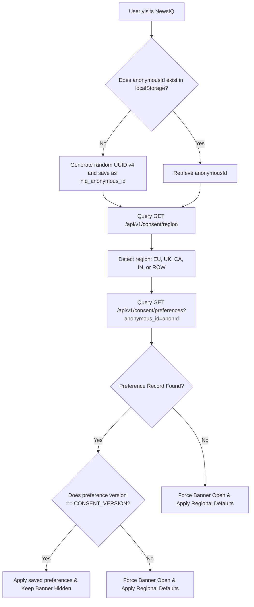

# Consent User Flows & State Transitions

This document maps out the user experience, interface states, and state-machine transitions of the NewsIQ Consent Management Platform (CMP).

---

## 1. The Cookie Banner Lifecycle

The Cookie Banner is a modern, glassmorphic banner placed at the bottom of the viewport. It will only display when there is no recorded consent for the active `CONSENT_VERSION`.

### Initial View Logic

---

## 2. Interactive States & Actions

Users are presented with three actions on the Cookie Banner:

1. **Accept All**:
   - Enables all functional, analytics, and marketing tracking.
   - Saves preferences to database.
   - Inject all tracking scripts.
   - Records `accept_all` in audit log.
2. **Reject Non-Essential**:
   - Disables functional, analytics, and marketing categories (essential remains true).
   - Saves preferences to database.
   - Does NOT inject any scripts.
   - Records `reject_all` in audit log.
3. **Customize (Preferences Modal)**:
   - Opens the detailed `CookiePreferencesModal`.

---

## 3. Cookie Preferences Modal Structure

The Cookie Preferences Modal is a details-rich layout that avoids dark patterns by presenting options clearly:

- **1. Essential Cookies**:
  - *Status*: **Locked / Active**.
  - *Toggles*: Disabled/non-interactive.
  - *Info*: Lists `access_token`, `refresh_token`, `niq_cookie_consent`.
- **2. Functional Cookies**:
  - *Status*: Optional (Opt-in for EU/UK/IN, Opt-out for CA/ROW).
  - *Toggles*: Interactive.
  - *Info*: Theme and layout choices.
- **3. Analytics Cookies**:
  - *Status*: Optional (Opt-in for EU/UK/IN, Opt-out for CA/ROW).
  - *Toggles*: Interactive.
  - *Info*: Google Analytics & PostHog session tracking.
- **4. Marketing Cookies**:
  - *Status*: Optional (Opt-in for EU/UK/IN/ROW, Opt-out for CA).
  - *Toggles*: Interactive.
  - *Info*: Meta Pixel & LinkedIn Insight pixels.

### Actions within the Modal:
- **Save Preferences**: Commits current toggle states to database, logs an `update_settings` transaction, and triggers script injections.
- **Accept All**: Enables all switches, commits, and logs `accept_all`.
- **Reject All**: Disables all non-essential switches, commits, and logs `reject_all`.
- **Reset Preferences**: Resets toggles to regional defaults.

---

## 4. Settings -> Privacy Center

Logged-in users have access to a dedicated **Privacy Tab** under Account Settings.

- **Current Preferences State**: Lists active categories with indicators showing whether they are currently allowed or blocked.
- **Consent Version**: Shows the policy version (e.g. `2026-06-v1`) that is active.
- **Change Settings**: Users can toggle consent states directly. Saving triggers immediate script changes.
- **Withdraw Consent**: Sets all non-essential consents to `False`, calls `/consent/withdraw`, and performs a `window.location.reload()` to purge script contexts.
- **Reset Consent**: Resets preferences back to the default states defined for their detected region.
- **Download Audit History**: Users can download a JSON file of all historical audit transactions linked to their account (compliant with **GDPR Art 15** - Right of Access).
