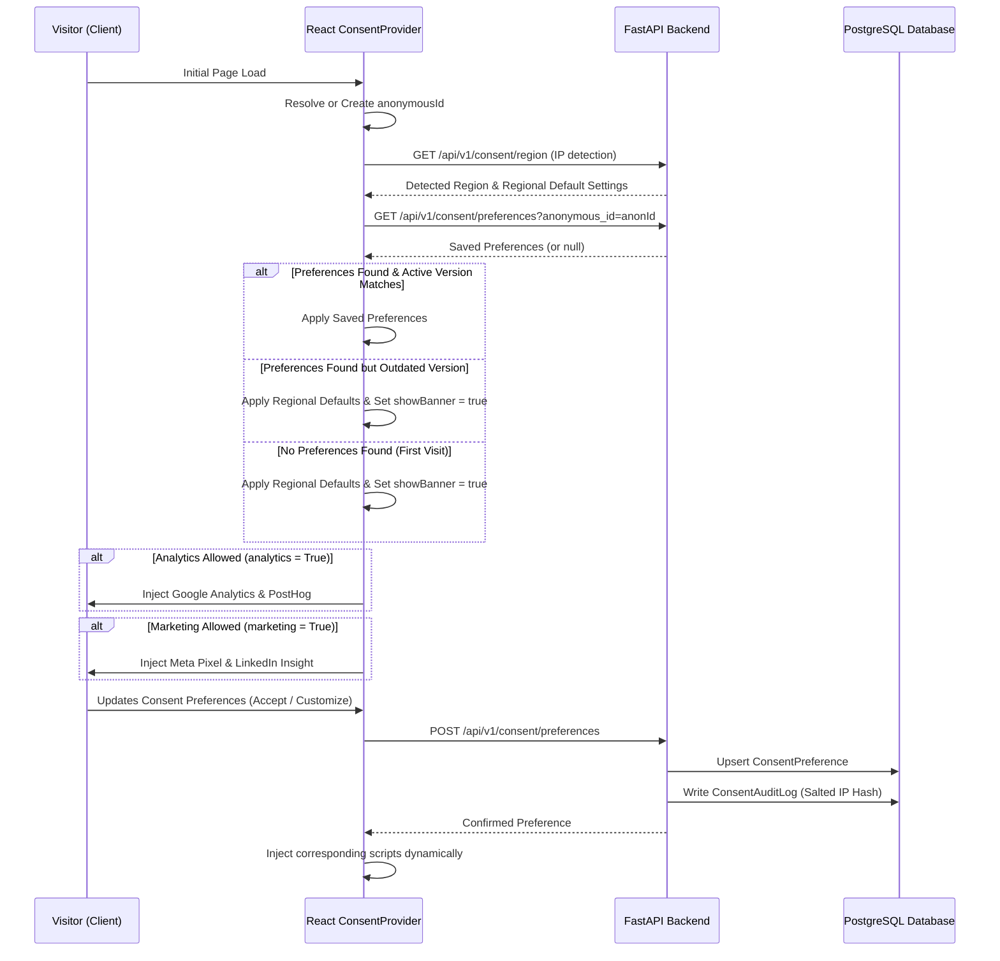

# Consent Management Platform (CMP) Architecture

This document describes the design, database schemas, API contracts, and frontend state synchronization mechanics of the production-grade Consent Management Platform (CMP) implemented for NewsIQ.

---

## 1. Architectural Overview

The Consent Management Platform is designed with a **privacy-first, default-deny** architecture. No non-essential tracking pixels or analytics tags are loaded into the browser until consent preferences have been resolved and explicitly authorized (where required by regional laws).

### System Data Flow

---

## 2. Backend Database Design

We utilize two primary PostgreSQL tables to track active states and historical audits, defined using SQLAlchemy models in [consent.py](file:///c:/Users/zakau/NewsIQ/apps/api/app/models/consent.py).

### A. `ConsentPreference` Table
Stores the current consent configuration for both authenticated users and anonymous visitors.

| Column | Type | Constraints | Description |
| :--- | :--- | :--- | :--- |
| `id` | UUID | Primary Key | Time-ordered UUID (UUID v7/v4). |
| `user_id` | UUID | Foreign Key (users.id, CASCADE), Unique | Links to authenticated user. Nullable for anonymous guests. |
| `anonymous_id` | String(255) | Unique, Index | Client-generated tracking visitor ID. |
| `essential` | Boolean | Default: True, Not Null | Strictly necessary cookies (Auth, CSRF). Locked to True. |
| `functional` | Boolean | Not Null | Preferences, theme settings. |
| `analytics` | Boolean | Not Null | Google Analytics, PostHog. |
| `marketing` | Boolean | Not Null | Meta Pixel, LinkedIn Insight. |
| `region` | String(50) | Not Null | Compliance region detected (EU, UK, CA, IN, ROW). |
| `consent_version` | String(50) | Not Null | Active frontend policy version at time of acceptance. |
| `accepted_at` | DateTime | Not Null | Initial consent timestamp. |
| `updated_at` | DateTime | Not Null | Last preferences update timestamp. |

### B. `ConsentAuditLog` Table
Maintains immutable, legally-compliant history of all consent changes under **GDPR Art 7(1)** (Proof of Consent).

| Column | Type | Constraints | Description |
| :--- | :--- | :--- | :--- |
| `id` | UUID | Primary Key | Time-ordered UUID. |
| `user_id` | UUID | Foreign Key (users.id, SET NULL), Nullable | Linked user. Unlinked (set null) on account deletion for PII scrubbing. |
| `anonymous_id` | String(255) | Index | Visitor ID associated with the log. |
| `action` | String(50) | Not Null | Action type: `accept_all`, `reject_all`, `update_settings`, `withdraw_consent`, `merge_anonymous_to_user`. |
| `old_value` | JSONB | Nullable | Previous consent state. |
| `new_value` | JSONB | Not Null | New consent state. |
| `ip_hash` | String(64) | Not Null | Salted SHA-256 hash of visitor's IP address. |
| `timestamp` | DateTime | Not Null | Log timestamp. |
| `consent_version` | String(50) | Not Null | Policy version active during transaction. |

---

## 3. Region Detection Heuristics

The `/api/v1/consent/region` endpoint determines the user's regulatory jurisdiction to apply localized cookie defaults.

1. **CDN / Edge Country Headers**:
   - Reads edge proxy headers: `CF-IPCountry`, `X-Vercel-IP-Country`, `X-AppEngine-Country`, `X-Country-Code`.
   - If country matches an EU member state $\rightarrow$ Region = `EU`.
   - If country matches `GB` / `UK` $\rightarrow$ Region = `UK`.
   - If country matches `IN` $\rightarrow$ Region = `IN`.
   - If country matches `US`, it checks state headers (`X-Vercel-IP-Country-Region`, `X-Region`) for `CA` (California). In the absence of state headers, it defaults to `CA` rules for safety.
2. **Local Overrides**:
   - The developer can bypass detection by sending `?region=EU` as a query param or the `X-Consent-Region-Override: EU` header.
3. **Defaults Fallback**:
   - If no edge country header is present and no override is supplied, it defaults to `ROW` (Rest of World).

---

## 4. Anonymous-to-Authenticated Preference Merging

To preserve user privacy configurations seamlessly across authenticated sessions:

1. **Prior to Authentication**: Preferences are saved against `anonymous_id` with `user_id = NULL`.
2. **Upon Authentication**:
   - During `GET /api/v1/consent/preferences`, if `current_user` is authenticated but has no associated `ConsentPreference` record, the API searches for an anonymous record matching the visitor's `anonymous_id`.
   - If found, it automatically links the record to the account by setting `user_id = current_user.id` and commits the change.
   - An audit log transaction `merge_anonymous_to_user` is recorded.
   - During `POST /api/v1/consent/preferences`, a similar check links and updates the anonymous record to the user.
3. **Data Erasure**: When a user requests account deletion (`DELETE /api/v1/users/account`), the system cascades the deletion to delete the `ConsentPreference` record, and anonymizes the `ConsentAuditLog` by setting `user_id = NULL` (GDPR compliance with preservation of transaction records).

---

## 5. Script Loading Architecture (CMP Guard)

Dynamic script loading is handled inside [consent-provider.tsx](file:///c:/Users/zakau/NewsIQ/apps/web/src/components/legal/consent-provider.tsx) using the React lifecycle.

- **Deny-by-Default**: Tracking scripts are not written into Next.js SSR markup or static templates.
- **Dynamic Script Injection**:
  - The `ConsentProvider` listens to `state.analytics` and `state.marketing`.
  - When `state.analytics === true` $\rightarrow$ It inserts script elements for Google Analytics and PostHog into `<head>`.
  - When `state.marketing === true` $\rightarrow$ It inserts script elements for Meta Pixel and LinkedIn Insight.
  - Script elements are assigned unique, descriptive IDs (`gtag-script`, `posthog-script`, `meta-pixel-script`, `linkedin-insight-script`) to avoid duplicate injection.
- **Immediate Propagation**: Changes in Settings $\rightarrow$ Privacy update state in real-time.
- **Clean Slate on Withdrawal**: When a user selects "Withdraw Consent", the platform sends a withdrawal request to the backend database, reverts client states, and triggers a full browser reload (`window.location.reload()`). This completely flushes all third-party tracking scripts, cookies, and in-memory variables from the running JavaScript execution environment.
