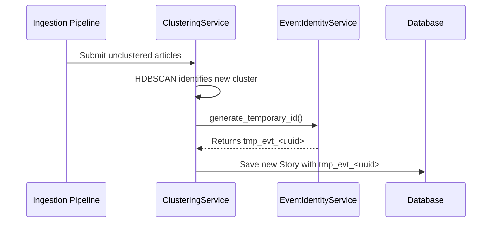
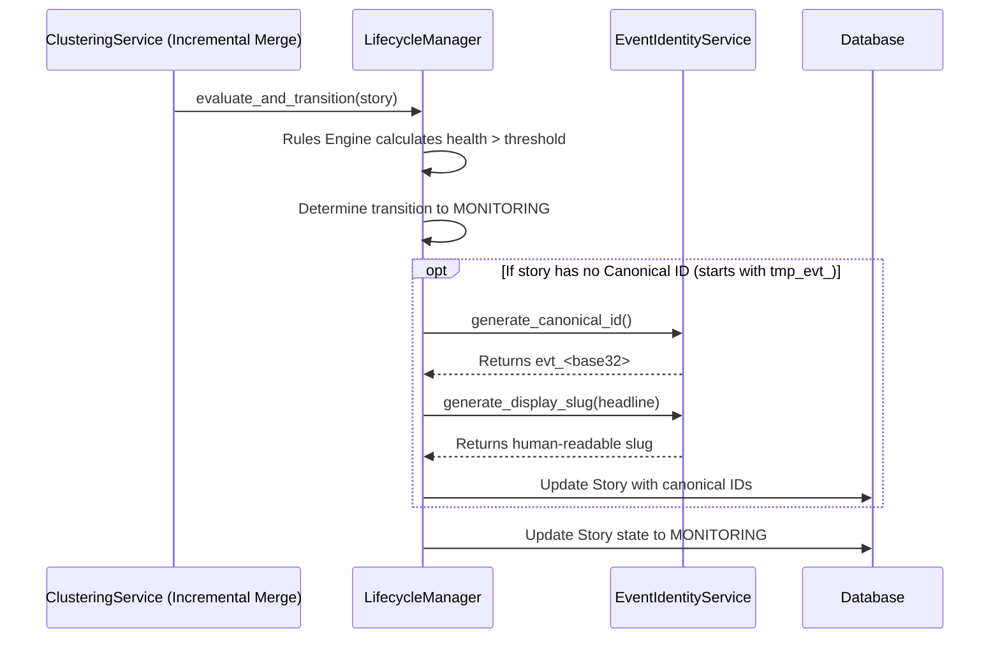
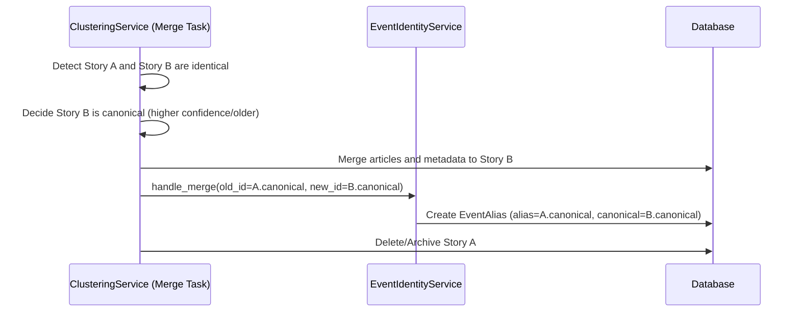
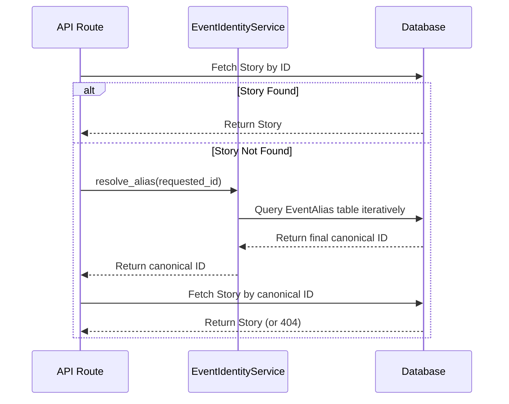
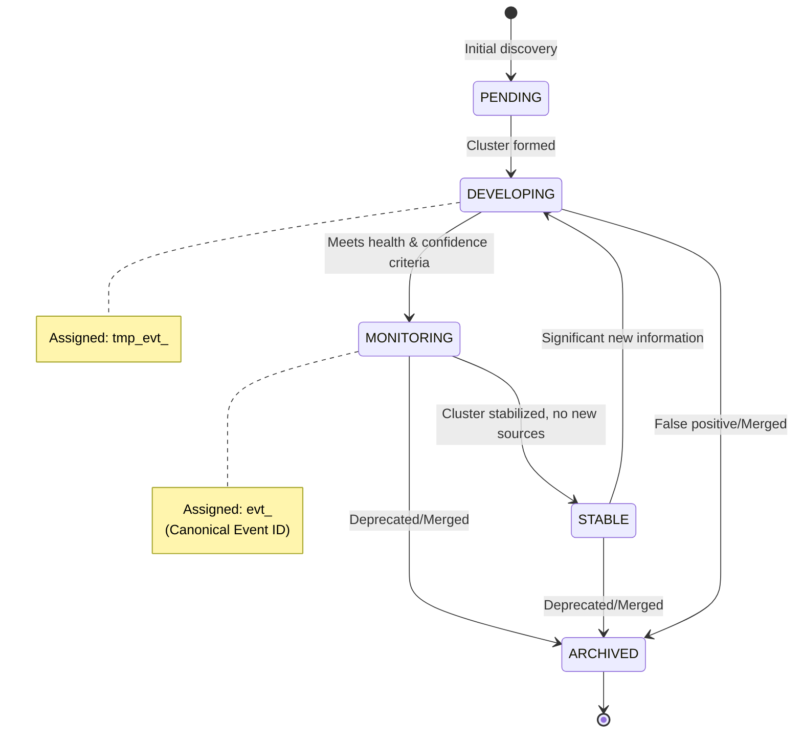
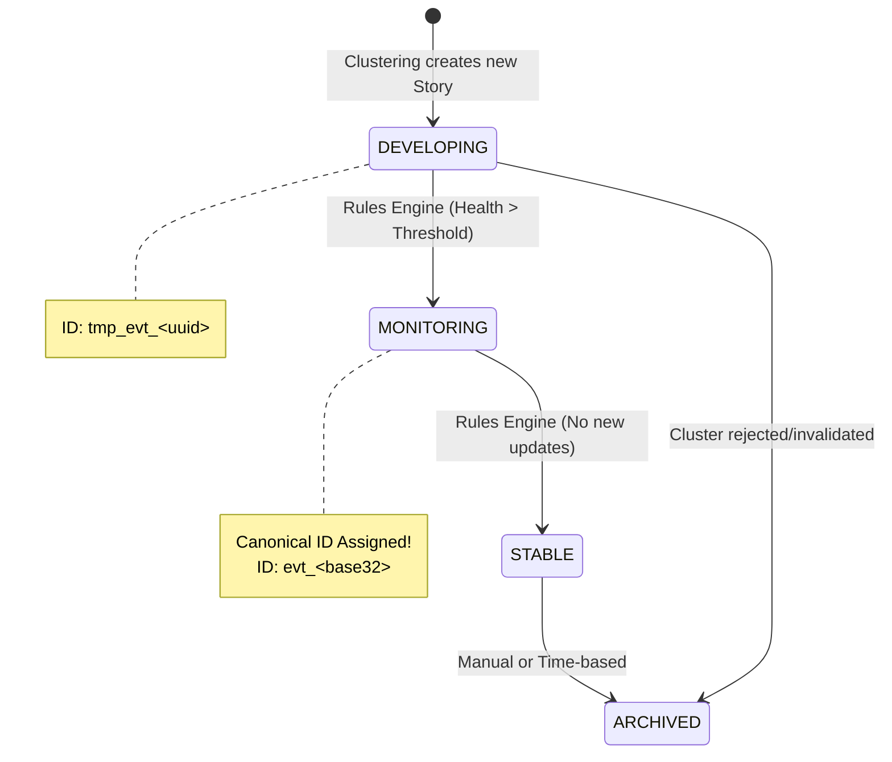

# Event Identity Architecture

This document describes the identity management lifecycle for NewsIQ stories, ensuring a stable, immutable identifier system capable of gracefully handling the messy, noisy reality of breaking news clustering.

## 1. Core Principles

- **Separation of Identity & Display**: The underlying `canonical_event_id` is an immutable, opaque identifier (`evt_<base32>`). The human-readable slug (`apple-ai-chip-launch-2026`) is treated purely as mutable display metadata.
- **Gradual Maturation**: Events start with temporary UUIDs (`tmp_evt_<uuid>`) during discovery and clustering. They only receive a Canonical ID when they mature (transition to `MONITORING` or `STABLE`).
- **History Preservation**: When two canonical events merge, the deprecated ID is preserved as an `EventAlias` pointing to the surviving ID, ensuring external links and historical references never break.

---

## 2. Sequence Diagrams

### 2.1. Initial Discovery & Temporary ID Assignment
When a new cluster forms, it receives a temporary ID.

### 2.2. Lifecycle Graduation & Canonical ID Assignment
As more articles join the cluster and its confidence grows, the LifecycleManager promotes it.

### 2.3. Story Merging & Alias Creation
When two mature stories are found to be identical and are merged.

### 2.4. Alias Resolution
When the API receives a request for an ID that might have been merged.

### 2.5. Lifecycle State Transitions
This state diagram illustrates the progression of a Story through its lifecycle states, and where the Canonical ID gets assigned.

---

## 3. Observability Metrics
The `EventIdentityService` maintains the following metrics to monitor the health of the canonicalization pipeline:
- `tmp_ids_created`: Volume of initial noisy clusters.
- `canonical_ids_created`: Volume of mature, verified stories.
- `aliases_created`: Tracks the frequency of late-stage story merges.
- `merges_handled`: Total merge operations processed.
