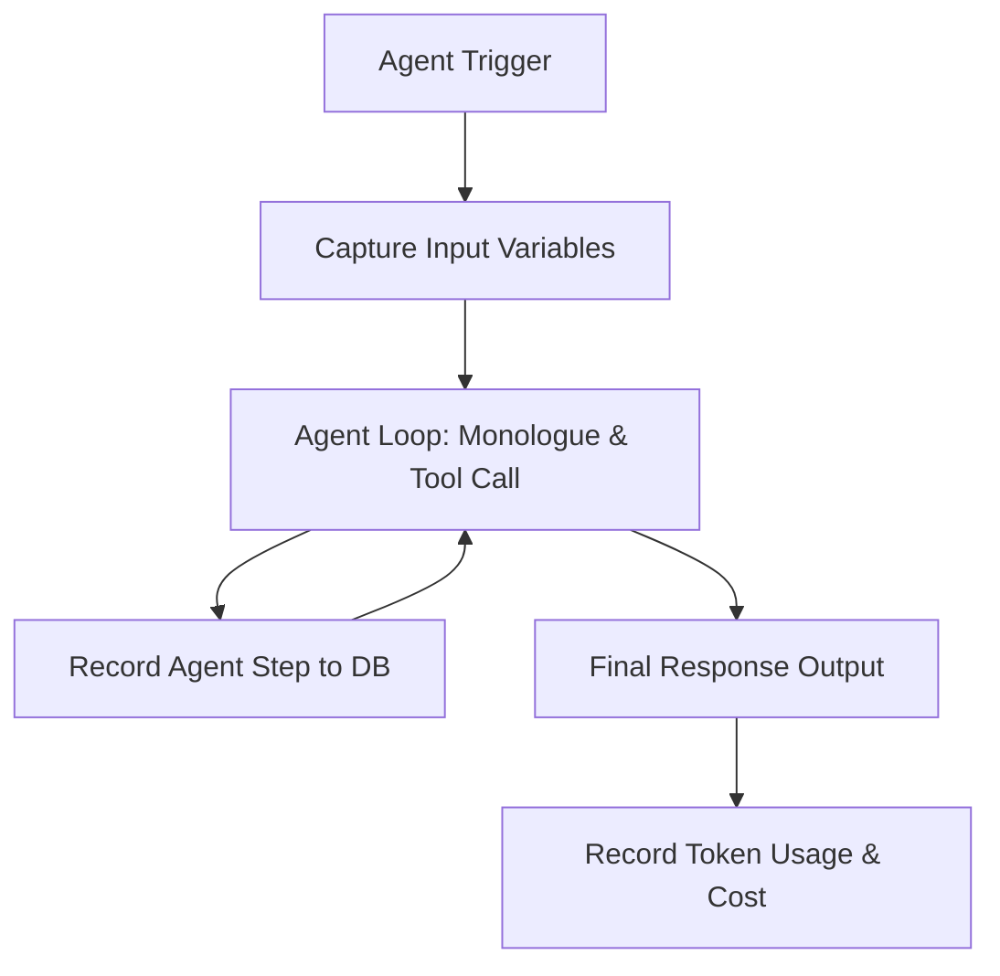

# Agno Agent Telemetry & Reasoning Spec

This document details the observability interface for **Agno Agents** (used for pipeline reflection, source credibility auditing, and summary refinement).

---

## 1. Trace Integration

Agno agents run multi-step reasoning cycles (loops). We wrap their lifecycle to stream and record:
1. The initial user request and agent instructions.
2. Individual reasoning thoughts (e.g. tools invoked, internal monologue, search queries).
3. The final response structure.
4. Total execution tokens, costs, and retry statistics.



---

## 2. Database Schema (`agent_runs` & `agent_steps`)

To support multi-step reasoning inspection, we track runs and their intermediate steps:

```sql
CREATE TABLE agent_runs (
    id UUID PRIMARY KEY DEFAULT uuid_generate_v7(),
    run_id UUID REFERENCES pipeline_runs(id) ON DELETE SET NULL,
    trace_id UUID NOT NULL,
    agent_name VARCHAR(100) NOT NULL, -- e.g., 'reflection_agent', 'fact_checker'
    status VARCHAR(30) NOT NULL,       -- success, failed
    input_payload JSONB,
    output_payload JSONB,
    confidence_score NUMERIC(5, 4),
    latency_ms FLOAT NOT NULL DEFAULT 0.0,
    total_tokens INTEGER NOT NULL DEFAULT 0,
    cost_usd NUMERIC(10, 6) NOT NULL DEFAULT 0.0,
    created_at TIMESTAMP WITHOUT TIME ZONE DEFAULT timezone('utc', now())
);

CREATE TABLE agent_steps (
    id UUID PRIMARY KEY DEFAULT uuid_generate_v7(),
    agent_run_id UUID REFERENCES agent_runs(id) ON DELETE CASCADE,
    step_number INTEGER NOT NULL,
    thought TEXT,                      -- The agent's internal reasoning/monologue
    tool_name VARCHAR(100),
    tool_arguments JSONB,
    tool_response TEXT,
    latency_ms FLOAT NOT NULL DEFAULT 0.0,
    created_at TIMESTAMP WITHOUT TIME ZONE DEFAULT timezone('utc', now())
);
```

---

## 3. Visual Dashboard (/admin/agents)

The agent monitoring page lists active runs and allows developers to expand a run to see the step-by-step reasoning tree:

```
🔍 Agent: reflection_agent
├─ 📥 Input: { "summary": "The election is called for July 4th.", "source_count": 8 }
├─ 🧠 Reasoning History:
│   ├── [Step 1] (Latency: 280ms)
│   │   ├── Thought: "Verify that the election date matches across all primary sources."
│   │   └── Tool call: run_database_query(query="SELECT ...") -> "BBC: July 4th, Reuters: July 4th"
│   ├── [Step 2] (Latency: 340ms)
│   │   ├── Thought: "All sources confirm July 4th. No discrepancies found in timeline."
│   │   └── Tool call: None
├─ 📤 Output: { "status": "approved", "refinement": null, "confidence": 0.992 }
└─ 📊 Metrics: Tokens: 1,820 | Cost: $0.0054 | Duration: 620ms
```

---

## 4. Agno Instrumentation Hook

We hook into Agno's callback/session events to capture data automatically:

```python
from agno.agent import Agent
from agno.callbacks import AgentCallback
from app.core.trace import run_id_ctx, trace_id_ctx

class NewsIQAgentCallback(AgentCallback):
    def on_run_start(self, agent: Agent, input_data: dict):
        # Initialize agent_runs database record
        pass

    def on_step_start(self, agent: Agent, step: int):
        # Capture current thought/monologue and timestamp
        pass

    def on_step_complete(self, agent: Agent, step: int, tool_name: str, args: dict, response: str):
        # Update step details, tool args, responses, and durations
        pass

    def on_run_complete(self, agent: Agent, output_data: dict):
        # Compute final latency, token counts, and cost metrics
        pass
```
