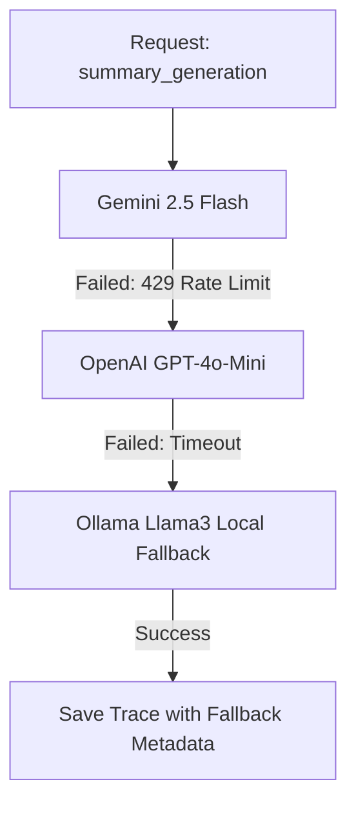

# Provider Health & Fallback Telemetry Spec

This document details the tracking, monitoring, and fallback intelligence metrics for LLM and Embedding API providers.

---

## 1. Provider Observability Metrics

The observability system tracks six core parameters for each provider/model combination:

*   **Availability Rate:** Percentage of HTTP 200 responses vs error codes (excluding 4xx client input validations).
*   **Latency Distribution:** Latency percentiles (P50, P90, P99) for completions and embeddings.
*   **Error Rate (429 vs 500):** Differentiates between rate limits (`429 Resource Exhausted`) and server failures (`500 Internal Error`).
*   **Timeout Count:** Occurrences where requests exceed the default HTTPX timeout limits.
*   **Fallback Transition Rate:** Frequency of routing requests to alternative fallback models.
*   **Cost Efficiency:** Real-time computation of token cost compared to set quotas.

---

## 2. Telemetry Schema (`llm_traces` & `provider_metrics`)

We capture fallback chain execution within `llm_traces` through linking attributes:

```sql
ALTER TABLE llm_traces 
ADD COLUMN fallback_from_model VARCHAR(100), -- Records the model that failed, triggering this fallback
ADD COLUMN fallback_reason VARCHAR(255);      -- rate_limit, timeout, server_error
```

For Grafana visualization and Prometheus scraping, we compute real-time metrics:

```
# HELP newsiq_llm_request_duration_seconds Latency of LLM calls per provider and model.
# TYPE newsiq_llm_request_duration_seconds histogram
newsiq_llm_request_duration_seconds_bucket{provider="gemini",model="gemini-2.5-flash-lite",status="success",le="0.5"} 142
newsiq_llm_request_duration_seconds_bucket{provider="gemini",model="gemini-2.5-flash-lite",status="success",le="1.0"} 523

# HELP newsiq_llm_errors_total Counter of LLM call failures by error type.
# TYPE newsiq_llm_errors_total counter
newsiq_llm_errors_total{provider="gemini",model="gemini-2.5-flash-lite",error_type="429_rate_limit"} 14
newsiq_llm_errors_total{provider="gemini",model="gemini-2.5-flash-lite",error_type="timeout"} 2
```

---

## 3. Fallback Chains Observability

When an LLM Gateway routing failure occurs, the trace records the fallback trajectory:



### Fallback Telemetry Log Sample
```json
{
  "trace_id": "89ab32c7-77ef-4100-88ad-0932bcdef778",
  "provider": "openai",
  "model": "gpt-4o-mini",
  "stage": "summary_generation",
  "status": "success",
  "fallback_from_model": "gemini-2.5-flash-lite",
  "fallback_reason": "429_rate_limit",
  "latency_ms": 782,
  "cost_usd": 0.00018
}
```

---

## 4. Visual Dashboard (/admin/providers)

The admin interface visualizes the real-time reliability and routing state of all API providers:

```
┌────────────────────────────────────────────────────────────────────────────────────────┐
│ 🌐 API PROVIDER HEALTH & ROUTING STATUS                                                 │
├────────────────────────────────────────────────────────────────────────────────────────┤
│ Gemini 2.5 Flash  │ Availability: 99.8%  │ P90 Latency: 420ms │ QPM: 140/300  │ [OK]   │
│ OpenAI GPT-4o-Mini│ Availability: 100.0% │ P90 Latency: 610ms │ QPM: 10/1000  │ [OK]   │
│ Groq Llama3 70B   │ Availability: 94.2%  │ P90 Latency: 190ms │ QPM: 82/100   │ [WARN] │
│ Ollama (Local)    │ Availability: 100.0% │ P90 Latency: 890ms │ QPM: 0/unlim  │ [STANDBY]
├────────────────────────────────────────────────────────────────────────────────────────┤
│ 🔗 ACTIVE FALLBACK PATHS                                                               │
│ • Ingestion Embeddings:  Gemini text-embedding-004 ──> OpenAI text-embedding-3-small   │
│ • Story Summarization:   Gemini 2.5 Flash ──> OpenAI GPT-4o-Mini ──> Ollama Llama3     │
└────────────────────────────────────────────────────────────────────────────────────────┘
```
