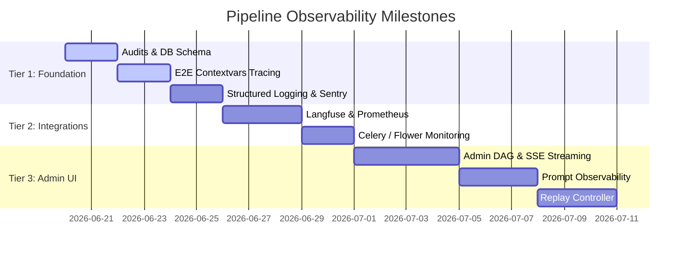

# NewsIQ Observability Platform — Roadmap

This document outlines the execution milestones for transforming NewsIQ's pipeline observability into a production-grade AI pipeline intelligence system.

---

## 1. System Vision

Build an observability platform comparable to Datadog, LangSmith, and Apache Airflow. SREs and developers should be able to audit and replay every stage of the ingestion, clustering, and summarization pipeline without looking at raw server terminal outputs.

---

## 2. Execution Tiers

### Tier 1: Foundations (Core Integration)
*   **Milestone 1:** E2E tracing using async-safe `contextvars`. Carry `trace_id` and `run_id` across Celery task boundaries.
*   **Milestone 2:** Implement `FunctionRunModel` schema for function-level call trace tracking.
*   **Milestone 3:** Standardize logging to stdout in JSON Pino format with Sentry exception hooks.

### Tier 2: Observability Backend
*   **Milestone 4:** Separate Processing Backend (Celery tasks, LLM routes) and User Backend (FastAPI, auth, recommendations) profiles.
*   **Milestone 5:** Connect Langfuse client spans and Prometheus collectors to capture token usages and latencies.
*   **Milestone 6:** Integrate Flower API endpoints to retrieve Celery queue lengths, active workers, and dead-letter tasks.

### Tier 3: Frontend Dashboard (/admin)
*   **Milestone 7:** Build `/admin/pipeline` with reactive DAG node cards rendering real-time SSE event updates.
*   **Milestone 8:** Implement `/admin/stories/[id]` Story Inspector visualizing similarity matrices and Wikidata resolutions.
*   **Milestone 9:** Create `/admin/prompts` version history, side-by-side diff viewers, and prompt playgrounds.
*   **Milestone 10:** Create `/admin/replay` console allowing localized stage overrides and comparisons.
