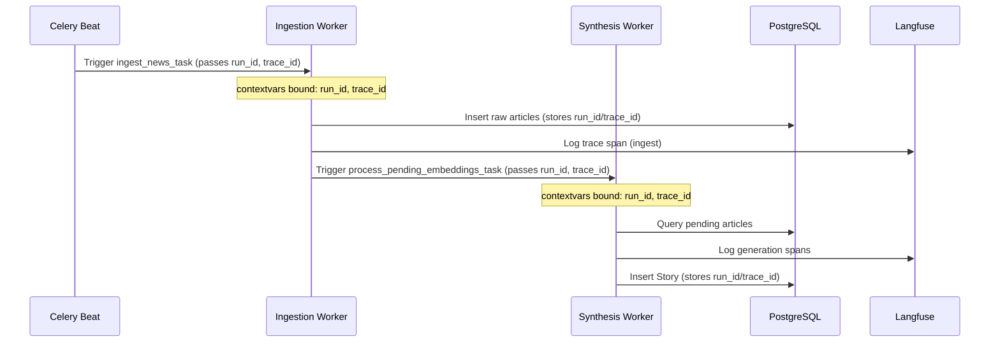

# E2E Trace Correlation & Context Propagation Spec

This document details the telemetry tracing context propagation system implemented inside the NewsIQ AI processing pipeline. It ensures that every event, LLM trace, database transaction, and log line is tied to a unique execution context.

---

## 1. Tracing Model Design

We correlate logs and traces across asynchronous processes using stack-safe Context Variables (`contextvars`). Since Python's Celery tasks run in separate workers, this context is serialized and passed across task boundaries.



---

## 2. Telemetry Context Interface (`trace.py`)

The context propagation relies on `app/core/trace.py`:

```python
import contextvars
import uuid
from typing import Generator
from contextlib import contextmanager

# Core Tracing Identifiers
run_id_ctx: contextvars.ContextVar[uuid.UUID] = contextvars.ContextVar("run_id")
trace_id_ctx: contextvars.ContextVar[uuid.UUID] = contextvars.ContextVar("trace_id")
span_id_ctx: contextvars.ContextVar[uuid.UUID] = contextvars.ContextVar("span_id")
stage_ctx: contextvars.ContextVar[str] = contextvars.ContextVar("stage")

# Domain Context Identifiers
story_id_ctx: contextvars.ContextVar[uuid.UUID | None] = contextvars.ContextVar("story_id", default=None)
article_id_ctx: contextvars.ContextVar[uuid.UUID | None] = contextvars.ContextVar("article_id", default=None)

@contextmanager
def bound_trace_context(
    run_id: uuid.UUID,
    trace_id: uuid.UUID,
    stage: str,
    span_id: uuid.UUID | None = None,
    story_id: uuid.UUID | None = None,
    article_id: uuid.UUID | None = None
) -> Generator[None, None, None]:
    """Binds pipeline trace variables to contextvars for the duration of the context block."""
    tokens = [
        run_id_ctx.set(run_id),
        trace_id_ctx.set(trace_id),
        stage_ctx.set(stage),
        span_id_ctx.set(span_id or uuid.uuid4()),
        story_id_ctx.set(story_id),
        article_id_ctx.set(article_id)
    ]
    try:
        yield
    finally:
        run_id_ctx.reset(tokens[0])
        trace_id_ctx.reset(tokens[1])
        stage_ctx.reset(tokens[2])
        span_id_ctx.reset(tokens[3])
        story_id_ctx.reset(tokens[4])
        article_id_ctx.reset(tokens[5])
```

---

## 3. Function Call Observability

To track every critical function execution throughout the processing backend, we define a decorator `@trace_function`:

```python
import time
import functools
import traceback
from app.models.observability_models import FunctionRunModel
from app.core.database import async_session_factory

def trace_function(caller_name: str | None = None):
    """Decorator to log function execution time, inputs, outputs, errors, and trace context."""
    def decorator(func):
        @functools.wraps(func)
        async def async_wrapper(*args, **kwargs):
            run_id = run_id_ctx.get(None)
            trace_id = trace_id_ctx.get(None)
            span_id = span_id_ctx.get(None)
            
            if not run_id:
                return await func(*args, **kwargs)
                
            start_time = time.perf_counter()
            error_msg = None
            status = "success"
            
            try:
                result = await func(*args, **kwargs)
                return result
            except Exception as e:
                status = "failed"
                error_msg = f"{type(e).__name__}: {str(e)}\n{traceback.format_exc()}"
                raise e
            finally:
                duration_ms = (time.perf_counter() - start_time) * 1000
                async with async_session_factory() as session:
                    function_run = FunctionRunModel(
                        function_name=func.__name__,
                        caller=caller_name or "system",
                        run_id=run_id,
                        trace_id=trace_id,
                        span_id=span_id,
                        execution_time_ms=duration_ms,
                        status=status,
                        error=error_msg,
                        arguments={"args": [str(a) for a in args[1:]], "kwargs": {k: str(v) for k, v in kwargs.items()}},
                        response={"result": str(result)} if status == "success" else None
                    )
                    session.add(function_run)
                    await session.commit()
                    
        return async_wrapper
    return decorator
```

---

## 4. Langfuse Span Integration

When executing an LLM interaction, the tracing context is forwarded to the Langfuse API client:

```python
from langfuse import Langfuse

langfuse = Langfuse()

def get_langfuse_trace():
    """Generates or updates a Langfuse trace with contextvars metadata."""
    run_id = run_id_ctx.get(None)
    trace_id = trace_id_ctx.get(None)
    stage = stage_ctx.get(None)
    
    if not trace_id:
        return None
        
    return langfuse.trace(
        id=str(trace_id),
        name=f"pipeline-{stage}",
        metadata={
            "run_id": str(run_id),
            "story_id": str(story_id_ctx.get(None) or ""),
            "article_id": str(article_id_ctx.get(None) or "")
        }
    )
```

---

## 5. History Retention Rules

*   **3-Day Detailed Telemetry (PostgreSQL / Redis):** Detailed function calls, argument payloads, full logs, and exact JSON responses.
*   **30-Day Summarized Metrics (PostgreSQL):** Aggregated token usage, latency averages, and error totals.
*   **Search Filters:**
    *   `runId`: Exact uuid matching.
    *   `traceId`: Correlation identifier matching.
    *   `storyId` / `articleId`: Entity lineage queries.
    *   `status` / `provider` / `stage`: Multi-dimensional metrics filtering.
