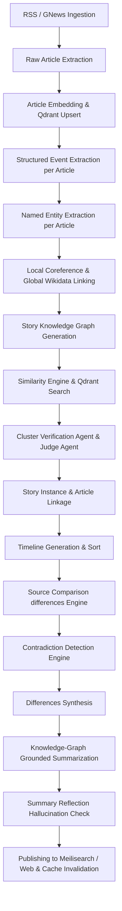

# Current Refactored State of NewsIQ

## Architecture Overview
Following the Event-Centric + Hybrid Agno AI migration, the NewsIQ processing pipeline has been fundamentally restructured. Rather than direct, un-gated text ingestion and batch summarization, the system relies on an event-driven, graph-grounded, multi-agent architecture.

### The Pipeline Flow

## Key Modules Implemented
1. **LLM Gateway** (`app/llm_gateway/`): Unified gateway for all content generation tasks. Manages key pools, rotation, cooldowns, failover chains, rate limits, pricing calculations, and Prometheus metrics.
2. **Agno Agent Registry** (`app/agents/`): Registers and manages Agno agents (`cluster_verification_agent`, `entity_disambiguation_agent`, `contradiction_agent`, `reflection_agent`, `judge_agent`) using a custom `GatewayModel` subclass.
3. **Observability Span Tracing** (`app/core/trace.py`): DB-backed distributed tracing for pipeline runs and individual stages.

## Identified Technical Debt
While the core pipeline has successfully migrated to this new state, legacy components (such as the old one-pass `analyze_story` pipeline, old spaCy `ner_service.py`, and scattered direct client initializations/calls in other services) remain in the codebase.
