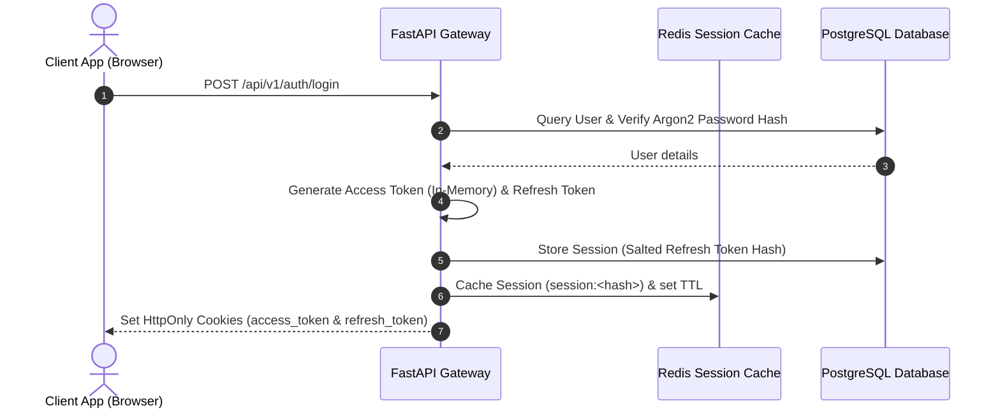

# Security & Access Control Architecture

This document outlines the authentication, cryptography, session storage, and rate-limiting controls implemented to secure NewsIQ.

---

## 1. Authentication & Session Management

NewsIQ implements a defensive, stateless-state hybrid session architecture. It combines JSON Web Tokens (JWT) for authentication with backend cache/database sessions for immediate revocation capabilities.

### A. JWT Configuration
- **Access Tokens**: Short-lived JWTs containing the user's ID (`sub`), email, role, and a lifetime payload. 
  - Token Lifetime: Configured via `ACCESS_TOKEN_EXPIRE_MINUTES`.
  - Storage: Transmitted in HTTP response cookies but kept strictly **in-memory** on the React client (stored in active Zustand JavaScript variables) to neutralize Cross-Site Scripting (XSS) extraction risks.
- **Refresh Tokens**: Long-lived JWTs used solely to request new access tokens via `/auth/refresh`.
  - Token Lifetime: Configured via `REFRESH_TOKEN_EXPIRE_DAYS`.
  - Storage: Saved in standard secure HTTP cookies.

### B. Session Caching & Database Registry
All refresh tokens are registered in the PostgreSQL `sessions` table and cached in Redis for high-speed verification:
- **Redis Namespace**: `session:<token_hash>` (where `<token_hash>` is `SHA256(refresh_token)`).
- **User Tracker Set**: `session_user:<user_id>` tracks all session hashes belonging to a specific user.
- **Immediate Revocation**: If a user logs out, resets their password, or updates their details, the system deletes the session key from Redis and the DB. Any subsequent requests using the old token will be immediately rejected.

### C. Token Rotation & Replay/Theft Protection
To prevent token theft and replay attacks, NewsIQ uses a strict refresh token rotation protocol:
1. Every call to the `/api/v1/auth/refresh` endpoint deletes the old refresh token session and generates a new token pair.
2. **Reuse Anomaly Detection**: If a client attempts to refresh using a token that has *already* been deleted/rotated (meaning a duplicate request is received), the system flags a theft incident.
3. **Response Action**: As a security safeguard, the system **revokes all active sessions** registered in the `session_user:<user_id>` set, forcing all devices for that user to re-authenticate immediately.

---

## 2. Cookie Security Parameters

All cookies issued by the NewsIQ API gateway are hardened with maximum security attributes:

| Attribute | Setting | Purpose |
| :--- | :--- | :--- |
| **HttpOnly** | `True` | Prevents client-side scripts from reading cookie values, neutralizing session token theft via XSS. |
| **Secure** | `True` *(Prod only)* | Restricts cookie transmission to encrypted (HTTPS) connections. Set to `False` in local development (`settings.DEBUG = True`). |
| **SameSite** | `Lax` | Protects against CSRF attacks while allowing top-level navigations to maintain logged-in states. |
| **Path** | `/` | Restricts cookie scope to the root path. |

---

## 3. Cryptography & Password Policies

NewsIQ follows modern security standards for data encryption and credentials validation:
- **Hashing Algorithm**: Password hashing is handled via **Argon2id** (the OWASP recommended hashing scheme) configured via `passlib.context.CryptContext`.
- **Timing Attack Mitigation**: When a user logs in with an email that does not exist in the database, the server runs a dummy verification pass against a static Argon2 hash to maintain consistent response times and prevent username enumeration.
- **Password Strength Rules**: Enforced via [validate_password](file:///c:/Users/zakau/NewsIQ/apps/api/app/core/security.py#L26-L42):
  - Minimum length: `8` characters.
  - Maximum length: `128` characters.
  - Cannot be empty.

---

## 4. Rate Limiting & Denial of Service (DoS)

To protect API endpoints from brute-force attacks, scraping, and service degradation, rate-limiting middleware is implemented:
- **Global Rate Limiting**: Managed by `RateLimitMiddleware` configured via a Redis sliding window.
  - Rate Limit: **100 requests per 60 seconds** per client IP.
- **Email Verification Cooldown**:
  - Restricts resending verification emails to **1 request per 60 seconds** per email address (Redis key: `rate_limit:resend:<email>`).
  - Restricts total verification dispatches to **5 requests per hour** per client IP (Redis key: `rate_limit:resend:ip:<ip>`) to prevent SMTP resource exhaustion.
- **FastAPI Input Validation**: Pydantic schemas validate all request shapes, preventing SQL injection and buffer overflow vectors at the gateway.

---

## 5. GDPR Compliance & Privacy-First Logs

Under GDPR Article 5(1)(c) (Data Minimization), raw IP addresses should not be stored in logs. To maintain full auditability of user consent changes without storing personally identifiable information (PII):
- **Salted IP Hashing**: Before storing consent transactions in the database `consent_audit_logs` table, the client's IP is hashed:
  $$\text{ip\_hash} = \text{SHA256}(\text{client\_ip} + \text{SECRET\_KEY})$$
- **Verification Capability**: The server's `SECRET_KEY` acts as a salt. If a regulator demands verification of consent for a specific IP, the system can compute the SHA-256 hash using the same salt to verify matching records without exposing other users' IPs.
- **Auditable Events**: Log entries detail the action, previous value JSON, new value JSON, consent version, and the salted IP hash.

---

## 6. Access Control Roles

NewsIQ enforces role-based access control (RBAC) at the API routing layer:
- **`guest`**: Unauthenticated client. Allowed to read landing pages, open public stories, and register.
- **`user` (Free Tier)**: Authenticated user. Limited daily AI timeline summaries, basic search capability.
- **`premium`**: Subscribed tier. Unlimited AI timelines, full access to difference engine comparisons, personalized feeds, bookmarks, and digest mailings.
- **`admin`**: Full platform control. Allowed to edit news sources, view dashboard metrics, trigger ingestion, and update global settings.
